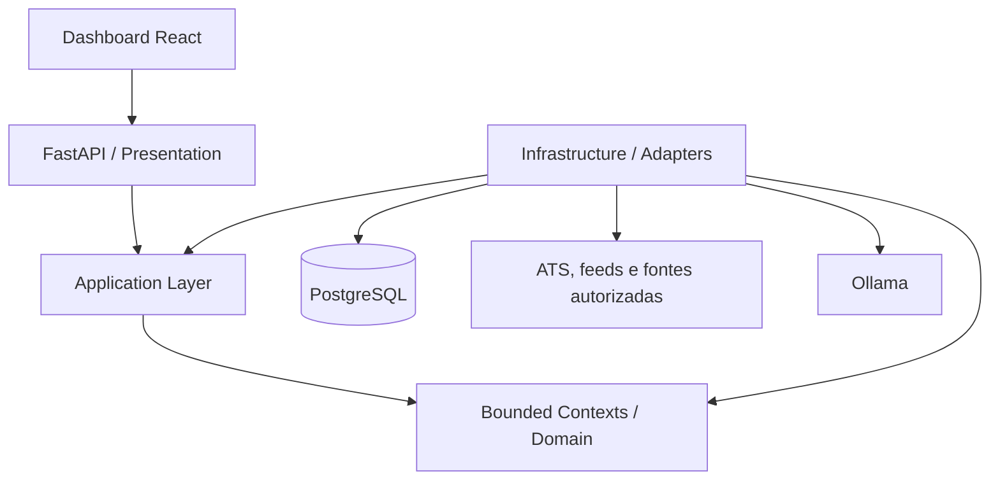
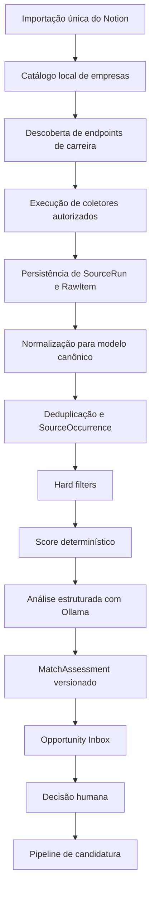
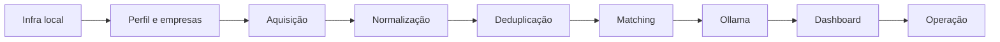

# Opportunity Radar

Sistema local-first para descoberta, consolidação, avaliação e gestão de oportunidades profissionais.

O Opportunity Radar transforma uma lista estática de empresas em um radar operacional contínuo. A base inicial de 186 empresas, hoje mantida no Notion, é importada uma única vez e passa a ser administrada pelo próprio sistema. A partir daí, fontes públicas e autorizadas são consultadas, vagas são preservadas em formato bruto, normalizadas para um modelo canônico, deduplicadas, filtradas por critérios objetivos, avaliadas contra o perfil profissional e apresentadas em uma dashboard local.

A inteligência artificial é executada localmente com Ollama. PostgreSQL concentra o estado transacional, a API é construída com FastAPI, o frontend usa React e a execução é padronizada por Docker Compose. O projeto começa como um monólito modular orientado a domínios e evolui de forma incremental, sem assumir microsserviços, Kubernetes ou infraestrutura distribuída antes de existir necessidade real.

> **Status da documentação:** arquitetura de referência em evolução. O MVP representa o primeiro recorte implementável; a arquitetura final define o estado-alvo e as fronteiras que devem ser preservadas durante a evolução.

---

## 1. Problema que o sistema resolve

Buscar vagas manualmente em múltiplas fontes produz quatro problemas principais:

1. **Cobertura fragmentada:** nenhuma fonte isolada contém todas as oportunidades relevantes.
2. **Baixa rastreabilidade:** quando uma vaga aparece em mais de um local, fica difícil identificar sua origem e saber qual versão é a mais recente.
3. **Ruído de decisão:** muitas vagas parecem interessantes superficialmente, mas falham em critérios básicos de localização, contrato, senioridade ou autorização de trabalho.
4. **Acompanhamento disperso:** candidaturas, contatos, follow-ups e entrevistas acabam distribuídos entre abas, planilhas, Notion, mensagens e memória pessoal.

O Opportunity Radar cria uma camada única para resolver esse ciclo de ponta a ponta:

```mermaid
flowchart LR
    A["Empresas de interesse"] --> B["Fontes consultáveis"]
    B --> C["Coleta"]
    C --> D["Dados brutos"]
    D --> E["Normalização"]
    E --> F["Deduplicação"]
    F --> G["Elegibilidade"]
    G --> H["Scoring"]
    H --> I["Análise local com IA"]
    I --> J["Dashboard"]
    J --> K["Pipeline de candidatura"]
```

---

## 2. Objetivos do produto

### 2.1 Objetivo principal

Reduzir o esforço manual necessário para descobrir e priorizar oportunidades profissionais sem abrir mão de rastreabilidade, controle humano e explicabilidade.

### 2.2 Objetivos funcionais

O sistema deve ser capaz de:

- manter um catálogo local de empresas e suas fontes de carreira;
- executar buscas recorrentes em ATSs, feeds e fontes autorizadas;
- aceitar inclusão manual de vagas por URL, texto ou arquivo;
- preservar o payload original de cada item coletado;
- transformar formatos externos diferentes em um modelo interno canônico;
- identificar quando duas ocorrências representam a mesma oportunidade;
- aplicar filtros determinísticos antes da análise por IA;
- calcular um score reproduzível e versionado;
- enriquecer oportunidades elegíveis com análise local via Ollama;
- mostrar evidências, inferências, lacunas e motivos de desqualificação;
- permitir ao usuário iniciar e acompanhar uma candidatura;
- registrar histórico de mudanças importantes;
- continuar útil mesmo quando uma fonte externa ou o Ollama estiver indisponível.

### 2.3 Objetivos não funcionais

O projeto privilegia:

- execução local reproduzível;
- baixo custo operacional;
- privacidade dos dados profissionais;
- idempotência;
- isolamento de falhas;
- observabilidade suficiente para diagnosticar problemas;
- migrações de banco controladas;
- testes automatizados de regras críticas;
- capacidade de evoluir sem reescrever o núcleo.

---

## 3. O que não é objetivo imediato

O sistema **não** nasce como:

- plataforma multiusuário;
- SaaS público;
- robô de candidatura automática em massa;
- scraper irrestrito de sites protegidos;
- substituto de LinkedIn, ATSs ou portais de vagas;
- motor de decisão totalmente delegado a LLM;
- arquitetura baseada em microsserviços desde o primeiro dia.

Esses limites existem para manter o projeto implementável, confiável e coerente com o uso pessoal/local-first.

---

## 4. Princípios arquiteturais

### 4.1 Local-first

Dados profissionais, configurações, modelos, histórico de matching e estado do pipeline permanecem localmente por padrão. Integrações externas são usadas apenas para obter dados necessários ou quando explicitamente configuradas.

### 4.2 Automação responsável

Coleta, normalização, deduplicação, scoring e preparação de conteúdo podem ser automáticos. Ações externas relevantes — especialmente candidatura, envio de mensagem e contato com recrutadores — permanecem sob confirmação humana.

### 4.3 Evidência antes de inferência

O sistema diferencia claramente:

- **evidência:** informação obtida diretamente da fonte;
- **inferência:** conclusão derivada por regra ou IA;
- **desconhecido:** dado ausente que não deve ser tratado automaticamente como falso.

Essa distinção precisa aparecer tanto no modelo de dados quanto na interface.

### 4.4 Determinismo antes de IA

Regras objetivas devem ser aplicadas antes da LLM. Exemplo: uma vaga explicitamente presencial em um país incompatível não precisa consumir inferência semântica para concluir que não atende ao perfil.

### 4.5 DDD pragmático

Os domínios são modelados e separados, porém permanecem dentro de um monólito modular enquanto isso for operacionalmente vantajoso. O foco é obter fronteiras claras no código, no banco e nos contratos, não multiplicar deploys.

### 4.6 Evolução incremental

O MVP reduz componentes físicos, mas mantém contratos alinhados com o desenho final. Assim, um worker único pode existir inicialmente sem misturar responsabilidades de domínio, permitindo posterior separação em workers especializados.

### 4.7 Idempotência como requisito de base

Toda operação recorrente deve assumir que pode ser repetida. Coletas, imports, normalizações, consumo de eventos e jobs não podem produzir duplicidade apenas porque foram executados novamente.

### 4.8 Falhas degradam funcionalidades, não o sistema inteiro

Uma fonte fora do ar não impede outras fontes de rodar. Ollama indisponível não impede coleta ou scoring determinístico. Uma projeção de leitura quebrada não deve corromper agregados transacionais.

---

## 5. Visão arquitetural em camadas

A regra de dependência é sempre voltada para dentro:

- o domínio não conhece FastAPI;
- o domínio não conhece SQLAlchemy;
- o domínio não conhece Celery, Redis ou APScheduler;
- o domínio não conhece Ollama;
- coletores externos implementam portas internas;
- persistence adapters convertem entre ORM e objetos de domínio.

---

## 6. Fluxo essencial do sistema

### 6.1 Regras importantes desse fluxo

- `RawItem` é preservado mesmo que a normalização falhe.
- uma `Opportunity` pode possuir múltiplas `SourceOccurrence`;
- o score não substitui os hard filters;
- uma resposta inválida do Ollama deve ser rejeitada e reprocessável;
- a ausência de IA não bloqueia o restante do fluxo;
- alterações de pipeline geram histórico.

---

## 7. MVP

### 7.1 Objetivo do MVP

Validar o ciclo completo com poucas fontes e poucos componentes físicos:

**importar → coletar → normalizar → deduplicar → filtrar → pontuar → analisar → visualizar → acompanhar.**

### 7.2 Serviços do MVP

- `frontend` — dashboard React;
- `api` — FastAPI;
- `worker` — agenda, coleta, processamento e manutenção inicial;
- `postgres` — persistência;
- `ollama` — inferência local.

### 7.3 Fontes mínimas

- Greenhouse;
- Lever;
- Ashby;
- uma fonte remota baseada em API/RSS;
- inclusão manual por URL;
- geração assistida de consultas Google Boolean.

### 7.4 Resultado esperado

O MVP está pronto quando uma máquina limpa consegue subir o ambiente, importar a base inicial, coletar vagas de pelo menos três ATSs, evitar duplicidade, produzir avaliações explicáveis e manter o pipeline após reiniciar os containers.

Detalhes: [Arquitetura do MVP](docs/02-arquitetura-mvp.md) e [Roadmap do MVP](docs/29-roadmap-mvp.md).

---

## 8. Arquitetura final

A versão final mantém o monólito modular, mas separa responsabilidades operacionais que passam a ter perfis de carga diferentes.

### 8.1 Evoluções principais

- scheduler separado;
- Redis como broker/coordenação;
- Celery para filas e retries;
- worker de coleta;
- worker de análise;
- worker de manutenção;
- transactional outbox;
- projeções de leitura especializadas;
- observabilidade mais detalhada;
- CRM, outreach, propostas e entrevistas mais completos.

### 8.2 Princípio de evolução

A arquitetura final não deve ser implementada de uma vez. Cada componente adicional só entra quando resolve uma limitação observada no MVP.

Detalhes: [Arquitetura da versão final](docs/03-arquitetura-final.md).

---

## 9. Bounded contexts

| Contexto | Papel no sistema | Tipo de subdomínio |
| --- | --- | --- |
| Profile | perfil profissional, skills, experiências e preferências | Supporting |
| Company Radar | catálogo e identidade das empresas | Core |
| Acquisition | fontes, execuções e coleta | Core |
| Opportunities | vaga canônica, ocorrências e ciclo de vida | Core |
| Matching | elegibilidade, score e explicabilidade | Core |
| CRM | candidatura, contatos e follow-ups | Supporting |
| Outreach | rascunhos e histórico de comunicação | Supporting |
| Proposals | proposta, preço, escopo e versões | Supporting |
| Interviews | preparação, sessões e feedback | Supporting |
| Automation | jobs, locks, retries e DLQ | Generic |
| Platform | outbox, auditoria, configuração e idempotência | Generic |

O mapa detalhado de relações entre contextos está em [DDD estratégico](docs/08-ddd-estrategico.md).

---

## 10. Dados principais

O PostgreSQL é organizado por schemas alinhados aos bounded contexts. Alguns conceitos centrais:

| Conceito | Finalidade |
| --- | --- |
| `CareerProfile` | snapshot versionado do perfil usado no matching |
| `Company` | identidade canônica da empresa |
| `CompanySource` | endpoint ou fonte associada à empresa |
| `SourceDefinition` | configuração de um coletor |
| `SourceRun` | execução delimitada de uma fonte |
| `RawItem` | conteúdo bruto coletado |
| `Opportunity` | vaga canônica consolidada |
| `SourceOccurrence` | ocorrência da vaga em uma fonte |
| `MatchAssessment` | avaliação versionada de aderência |
| `ApplicationProcess` | acompanhamento de candidatura |

A modelagem completa está em [Visão geral da modelagem de dados](docs/11-modelagem-dados.md).

---

## 11. Política de IA

Ollama é um adaptador de infraestrutura, não uma autoridade de domínio.

A IA pode:

- interpretar descrição da vaga;
- identificar evidências de stack e experiência;
- resumir responsabilidades;
- apontar lacunas;
- sugerir preparação para candidatura ou entrevista.

A IA não pode:

- alterar regras de elegibilidade por conta própria;
- retornar texto livre para operações que exigem estado estruturado;
- apagar evidências conflitantes;
- transformar um dado ausente em fato;
- enviar mensagens ou candidaturas automaticamente.

Toda saída usada pelo sistema deve ser validada contra JSON Schema e vinculada à versão de prompt, modelo e configuração utilizada.

---

## 12. Estratégia de fontes

O radar combina diferentes classes de origem porque nenhuma cobre o mercado inteiro.

Prioridade operacional:

1. ATSs com endpoint público e formato previsível;
2. APIs e feeds oficiais;
3. remote boards com acesso permitido;
4. páginas públicas estáveis quando os termos permitem;
5. descoberta assistida por mecanismos de busca;
6. entrada manual para qualquer caso não automatizável.

LinkedIn, X e páginas protegidas não fazem parte da estratégia de scraping automatizado.

---

## 13. Segurança e privacidade

Como o sistema manipula currículo, preferências e histórico de candidatura, as seguintes regras são obrigatórias:

- secrets não entram no Git;
- `.env` local é ignorado;
- somente serviços necessários expõem portas ao host;
- banco e Ollama permanecem na rede Docker interna por padrão;
- logs evitam conteúdo sensível completo;
- backups devem ser protegidos como os dados originais;
- dados externos são armazenados apenas quando necessários ao fluxo;
- toda futura integração autenticada deve ter escopo mínimo.

---

## 14. Observabilidade mínima

Mesmo sendo local, o sistema precisa responder rapidamente a perguntas como:

- qual fonte falhou?
- quando foi a última execução bem-sucedida?
- quantos itens foram coletados?
- quantos foram novos, atualizados ou descartados?
- qual vaga falhou na normalização?
- por que uma vaga ficou sem análise?
- qual versão de regra gerou determinado score?

Para isso, execuções recebem identificadores de correlação, logs são estruturados e métricas operacionais são persistidas ou exportadas conforme a fase do projeto.

---

## 15. Estratégia de implementação

A ordem recomendada evita construir UI ou IA sobre fundações instáveis.

Cada fase precisa terminar com um slice testável antes da próxima expansão.

---

## 16. Mapa da documentação

### Produto e arquitetura

1. [Visão, objetivos e escopo](docs/01-visao-escopo.md)
2. [Arquitetura do MVP](docs/02-arquitetura-mvp.md)
3. [Arquitetura da versão final](docs/03-arquitetura-final.md)
4. [Decisões arquiteturais](docs/04-decisoes-arquiteturais.md)
5. [Tecnologias](docs/05-tecnologias.md)
6. [Estrutura do projeto MVP](docs/06-estrutura-projeto-mvp.md)
7. [Estrutura do projeto final](docs/07-estrutura-projeto-final.md)

### DDD e dados

8. [DDD estratégico e Context Map](docs/08-ddd-estrategico.md)
9. [DDD tático: agregados, entidades e objetos de valor](docs/09-ddd-tatico.md)
10. [Eventos, comandos, CQRS e Unit of Work](docs/10-eventos-comandos-cqrs.md)
11. [Visão geral da modelagem de dados](docs/11-modelagem-dados.md)
12. [Dados de perfil e empresas](docs/12-dados-perfil-empresas.md)
13. [Dados de aquisição e oportunidades](docs/13-dados-aquisicao-oportunidades.md)
14. [Dados de matching e CRM](docs/14-dados-matching-crm.md)
15. [Dados de outreach, propostas e entrevistas](docs/15-dados-outreach-propostas-entrevistas.md)
16. [Dados de automação e plataforma](docs/16-dados-automacao-plataforma.md)

### Busca, IA e execução

17. [Fontes e coletores](docs/17-fontes-coletores.md)
18. [Estratégia de busca e Google Boolean](docs/18-busca-google-boolean.md)
19. [Normalização, deduplicação e taxonomias](docs/19-normalizacao-deduplicacao.md)
20. [Matching, filtros e scoring](docs/20-matching-scoring.md)
21. [Ollama, prompts e resultados estruturados](docs/21-ollama-prompts.md)
22. [Workflows e máquinas de estado](docs/22-workflows-estados.md)
23. [API e contratos](docs/23-api-contratos.md)
24. [Processamento assíncrono e resiliência](docs/24-assincrono-resiliencia.md)

### Operação e entrega

25. [Docker e execução local](docs/25-docker-execucao-local.md)
26. [Segurança, privacidade e conformidade](docs/26-seguranca-privacidade.md)
27. [Observabilidade, backup e recuperação](docs/27-observabilidade-backup.md)
28. [Testes e qualidade](docs/28-testes-qualidade.md)
29. [Roadmap do MVP e critérios de aceite](docs/29-roadmap-mvp.md)
30. [Roadmap da versão final](docs/30-roadmap-final.md)
31. [Runbook operacional](docs/31-runbook.md)
32. [Rastreabilidade dos 46 pontos](docs/32-rastreabilidade-46-pontos.md)
33. [Glossário](docs/33-glossario.md)

---

## 17. Ordem recomendada de leitura

### Para entender o produto

`01 → 02 → 20 → 29`

### Para implementar o MVP

`05 → 06 → 11 → 13 → 17 → 19 → 20 → 23 → 25 → 29`

### Para revisar a arquitetura completa

`03 → 08 → 09 → 10 → 16 → 24`

### Para operar o sistema

`25 → 26 → 27 → 28 → 31`

---

## 18. Definição resumida de sucesso

O Opportunity Radar é bem-sucedido quando deixa de ser apenas um agregador de links e passa a funcionar como um sistema confiável de decisão: ele sabe **de onde a vaga veio, se já havia sido vista, por que é ou não elegível, quanto combina com o perfil, qual evidência sustenta essa conclusão e em que estágio da candidatura ela se encontra**.
