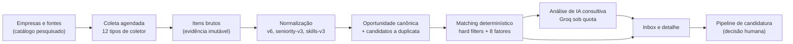

# Opportunity Radar

Sistema local-first para descoberta, consolidação, avaliação e gestão de oportunidades profissionais.

O Opportunity Radar transforma uma lista pesquisada de empresas em um radar operacional contínuo. Fontes públicas e autorizadas (ATS, feeds e páginas com dados estruturados) são consultadas em agenda; cada vaga é preservada em formato bruto, normalizada para um modelo canônico, deduplicada, avaliada por regras determinísticas contra o perfil profissional, enriquecida por uma análise de IA **consultiva** e apresentada em uma dashboard web local.

PostgreSQL concentra o estado, a API é FastAPI, o worker é APScheduler, o frontend é React e a execução é padronizada por Docker Compose. A IA roda na nuvem, **somente no Groq**, é opt-in e nunca decide elegibilidade, score ou veredito. O projeto é um monólito modular orientado a domínios, sem microsserviços, Redis, Celery ou Kubernetes.

## Status

- **Fase 20 (Groq e consolidação das fases 16 a 19) mesclada em `main` em 2026-09-29** (PR #25). O Ollama e os embeddings locais foram removidos; a busca é full-text.
- Na stack real de 2026-09-29: 144 fontes definidas, **137 habilitadas**, 686 oportunidades, 223 empresas. Números, limitações e melhorias priorizadas estão em [Arquitetura atual](docs/47-arquitetura-atual.md), que é a referência do estado do código.
- **Em planejamento:** [SPEC 46 — redesenho da interface web](docs/46-spec-redesign-ui.md) (apenas apresentação; nenhuma capacidade nova declarada).
- Pendências conhecidas da Fase 20 estão em [validacao-pendente.md](docs/44-roadmap-fase-20/validacao-pendente.md). A medição de produtividade e custo de IA foi **inconclusiva** (amostra de ~1,24 dia): ver [evidência do rebuild](docs/44-roadmap-fase-20/evidencias/rebuild-stack-real-2026-09-29.md).

## Stack

| Camada | Tecnologia |
| --- | --- |
| Backend | Python 3.12, FastAPI, SQLAlchemy 2, Alembic, APScheduler, httpx, pydantic-settings |
| Banco | PostgreSQL 17 (imagem própria com pgvector, resíduo sem uso em produção) |
| IA | Groq (`openai/gpt-oss-120b`, `openai/gpt-oss-20b`, `qwen/qwen3.8-27b`), com quota persistente, breaker e fallback |
| Busca web (opcional) | Tavily, sob orçamento de créditos por execução |
| Frontend | React 19, react-router-dom 7, TanStack Query 5, Tailwind 4, Vite, Vitest |
| Execução | Docker Compose (`postgres`, `migrate`, `api`, `worker`, `frontend`) |
| Qualidade | pytest, ruff, mypy, ESLint, Vitest, Playwright, GitHub Actions |

## Como rodar

Pré-requisito: Docker com Compose.

```bash
make bootstrap    # cria .env a partir de .env.example e valida o compose
make up           # constrói e sobe postgres, migrate, api, worker e frontend
make doctor       # diz o que está quebrado e o que fazer a respeito
```

| Endereço | O quê |
| --- | --- |
| `http://localhost:3000` | dashboard (nginx; encaminha `/api/*` para a API) |
| `http://localhost:8000/health` | estado do banco e da IA |
| `http://localhost:8000/docs` | contrato OpenAPI |

As portas 3000 e 8000 são publicadas apenas em `127.0.0.1`; o Postgres não é exposto ao host. A IA vem **desligada** (`AI_ENABLED=false`): para ligar, defina `AI_ENABLED=true` e `GROQ_API_KEY` no `.env` (nunca versionado). Sem chave a análise responde `AI_SKIPPED` e o restante do sistema segue funcionando. `TAVILY_API_KEY` também é opcional.

### Alvos `make`

| Alvo | Para quê |
| --- | --- |
| `up`, `down`, `restart`, `status`, `logs`, `dev` | ciclo de vida da stack |
| `migrate` | aplica migrações (`alembic upgrade head`) |
| `doctor` | diagnóstico do ambiente, jobs do worker, incidentes e uso da IA |
| `import-companies` | importa o catálogo pesquisado (`docs/pesquisas`) |
| `enable-sources` | probe e habilitação de fontes (exige `TERMS_REVIEWED=1` após revisar os termos) |
| `collect` | coleta sob demanda (`SOURCE_ID`, `SOURCE_TYPE`, `MODE`, `MAX_ITEMS`) |
| `discover-ats`, `discover-sites` | descoberta de ATS por site e por sitemap (manuais, desligadas por padrão) |
| `backup`, `restore-check` | dump com manifesto e restauração verificada em banco descartável |
| `soak`, `eval-analysis`, `eval-search`, `export-eval-cases` | portão de 72 h simulado e avaliações |
| `test`, `test-integration`, `check` | validação (rodar só quando solicitado) |

### Scripts principais (`scripts/`)

`doctor.py`, `collect.py`, `enable_sources.py`, `discover_ats.py`, `discover_sites.py`, `discover_startups.py`, `import_research_catalog.py`, `backup.py`, `restore_check.py`, `soak_gate.py`, `eval_analysis.py`, `benchmark_report.py`, `backfill_opportunity_company.py`, `backfill_startup_evidence.py`, `reclassify_role_families.py`. Cada um tem docstring com uso e limites.

### Testes e CI

- **Local:** `make test` (pytest no container), `make test-integration` (Postgres real, `RUN_DATABASE_INTEGRATION=1`), `make check` (ruff, mypy e `npm run check`). Para rodar contra a árvore de trabalho sem reconstruir imagens: `docker compose -f compose.yaml -f compose.dev.yaml run --rm api pytest -q`.
- **CI** (`.github/workflows/pipeline.yml`, ignora mudanças só de documentação): qualidade do backend, testes e ida-e-volta de migrações com o portão de 72 h simulado, frontend (auditoria, lint, tipos, testes, build, sintaxe do nginx), E2E em Compose com stubs de Groq e de job boards (inclui jornada Playwright com falhas injetadas) e publicação das imagens no GHCR em `main`/tags.

## O que o sistema faz


```mermaid
flowchart LR
    A["Empresas e fontes<br/>(catálogo pesquisado)"] --> B["Coleta agendada<br/>12 tipos de coletor"]
    B --> C["Itens brutos<br/>(evidência imutável)"]
    C --> D["Normalização<br/>v6, seniority-v3, skills-v3"]
    D --> E["Oportunidade canônica<br/>+ candidatos a duplicata"]
    E --> F["Matching determinístico<br/>hard filters + 8 fatores"]
    F --> G["Análise de IA consultiva<br/>Groq sob quota"]
    G --> H["Inbox e detalhe"]
    F --> H
    H --> I["Pipeline de candidatura<br/>(decisão humana)"]
```

Coletores: Ashby, Greenhouse, Lever, Workable, Teamtailor, Workday, Factorial, Remotive, Hacker News ("Who is hiring?"), páginas com JSON-LD `JobPosting`, busca web via Tavily e entrada manual. Detalhes, regras e limitações por módulo estão em [Arquitetura atual](docs/47-arquitetura-atual.md).

Telas: Visão geral (`/`), Inbox (`/inbox`), detalhe da vaga, candidaturas (`/applications`), empresas, fontes e fila de homologação, perfil e status.

## Problema e princípios

Buscar vagas manualmente produz cobertura fragmentada, baixa rastreabilidade, ruído de decisão e acompanhamento disperso. O radar cria uma camada única para todo o ciclo, guiada por princípios que continuam valendo:

- **Local-first e automação responsável:** dados e histórico ficam locais; ações externas (candidatar, escrever a recrutador) permanecem sob confirmação humana.
- **Evidência antes de inferência:** o sistema separa evidência (da fonte), inferência (regra ou IA) e desconhecido; ausência de dado nunca vira reprovação.
- **Determinismo antes de IA:** regras objetivas eliminam antes de qualquer inferência; a IA só acrescenta análise e nunca altera score, elegibilidade ou veredito.
- **Idempotência e degradação isolada:** coleta, normalização e jobs podem ser repetidos sem duplicar; fonte, Groq ou Tavily fora do ar degradam só a sua função.
- **Monólito modular:** fronteiras claras por contexto no código e no banco, sem multiplicar deploys.

Não são objetivos: plataforma multiusuário ou SaaS, candidatura automática em massa, scraping de sites protegidos ou que proíbam coleta, decisão delegada a LLM, microsserviços.

## Contextos e dados

Um schema PostgreSQL por contexto (detalhe de tabelas na [arquitetura atual](docs/47-arquitetura-atual.md#2-dados-schemas-e-tabelas)):

| Schema | Papel |
| --- | --- |
| `profile` | perfil profissional versionado (skills, experiências, preferências) |
| `company_radar` | catálogo e identidade das empresas, descoberta de ATS, evidência de startup |
| `acquisition` | fontes, execuções, itens brutos, checkpoints, orçamento por host |
| `opportunities` | vaga canônica, ocorrências, normalização, duplicatas, sugestões |
| `matching` | avaliações versionadas, fatores e análises de IA |
| `crm` | candidaturas e histórico de estágios (append-only) |
| `dashboard` | buscas salvas |
| `platform` | estado dos jobs, quota e telemetria da IA |

## Política de IA

O Groq é um adaptador de infraestrutura, não uma autoridade de domínio. A IA pode interpretar a descrição, apontar evidências e lacunas e resumir responsabilidades; não pode alterar elegibilidade, devolver texto livre onde há estado estruturado, apagar evidência conflitante, tratar dado ausente como fato nem enviar mensagens ou candidaturas. Toda saída é validada contra JSON Schema fechado, cita a evidência e fica vinculada à versão de prompt, modelo e configuração. Dados pessoais são sanitizados antes de qualquer chamada, e o consumo respeita quota persistente por modelo (com reserva para análises pedidas na tela), breaker e fallback entre modelos.

## Estratégia de fontes

Prioridade: ATS com endpoint público e formato previsível; APIs e feeds oficiais; páginas públicas estáveis com dados estruturados; descoberta assistida por busca; entrada manual. Toda fonte externa só coleta depois de evidência confirmada, termos revisados e coletor testado. **Não fazem parte da coleta** Gupy, Wellfound, Y Combinator/Work at a Startup, Careerflow, Landing.jobs, LinkedIn, X e páginas protegidas; o motivo de cada uma (termos de uso ou ausência de endpoint estruturado) está na [arquitetura atual](docs/47-arquitetura-atual.md#31-aquisição-acquisition).

## Segurança e privacidade

Segredos ficam só no `.env` local (ignorado pelo Git e pelo Docker); somente API e frontend publicam porta, e só em `127.0.0.1`; o backup rejeita chaves no manifesto; logs são JSON estruturados sem conteúdo sensível completo; não há autenticação nem multiusuário (uso pessoal).

## Mapa da documentação

**Comece por aqui**

- [Arquitetura atual](docs/47-arquitetura-atual.md): como o sistema funciona hoje, módulos, regras, medições, limitações e melhorias priorizadas.
- [Runbook](docs/30-runbook.md): operar, diagnosticar, backup e restauração.
- [SPEC 46 — redesenho da interface](docs/46-spec-redesign-ui.md) e [tokens de design](docs/35-design-tokens.md).

**Especificações e roadmaps vigentes**

- [SPEC 43 — Groq e consolidação](docs/43-spec-llm-cloud-e-consolidacao.md) e [Fase 20](docs/44-roadmap-fase-20/README.md) (cards, evidências, [validação pendente](docs/44-roadmap-fase-20/validacao-pendente.md)).
- [SPEC 45 — descoberta de startups](docs/45-spec-descoberta-startups.md).
- [SPEC 41 — Tavily](docs/41-spec-tavily.md) e [cards da fase 19](docs/42-roadmap-tavily/README.md).
- [SPEC 39 — varredura produtiva](docs/39-spec-varredura-produtiva.md) e [cards da fase 18](docs/40-roadmap-varredura-produtiva/README.md).
- [SPEC 37 — busca](docs/37-spec-busca.md), [roadmap de IA e busca](docs/38-roadmap-ia-e-busca.md) (fases 16 e 17).
- [Interface](docs/34-roadmap-interface.md) (fases 14 e 15), [pós-MVP](docs/33-roadmap-pos-mvp.md) (fases 10 a 13) e [MVP](docs/29-roadmap-mvp.md).

**Referências de projeto (partes históricas)**

- Arquitetura: [MVP](docs/02-arquitetura-mvp.md), [alvo](docs/03-arquitetura-final.md), [tecnologias](docs/05-tecnologias.md); estrutura: [MVP](docs/06-estrutura-projeto-mvp.md), [alvo](docs/07-estrutura-projeto-final.md).
- Domínio: [DDD estratégico](docs/08-ddd-estrategico.md), [DDD tático](docs/09-ddd-tatico.md), [modelagem de dados](docs/11-modelagem-dados.md), [coletores](docs/17-fontes-coletores.md), [matching](docs/20-matching-scoring.md), [Docker](docs/25-docker-execucao-local.md), [rastreabilidade](docs/32-rastreabilidade-46-pontos.md).
- **Atenção:** os documentos 02, 03, 05 a 09, 11, 20, 21, 25 e 36 ainda descrevem o Ollama local, que foi removido na Fase 20; em caso de divergência, vale o código e a [arquitetura atual](docs/47-arquitetura-atual.md#6-divergências-entre-documentação-e-código). Os documentos [21](docs/21-ollama-prompts.md) e [36](docs/36-spec-ollama.md) são históricos, substituídos pela [SPEC 43](docs/43-spec-llm-cloud-e-consolidacao.md).
- Catálogo pesquisado: [pesquisas](docs/pesquisas/README-pesquisa.md).

**Ordem recomendada de leitura:** este README → arquitetura atual → runbook → SPEC 43 e cards da Fase 20 → SPEC 46 para trabalho de interface.

## Definição de sucesso

O Opportunity Radar é bem-sucedido quando deixa de ser um agregador de links e passa a ser um sistema confiável de decisão: sabe de onde a vaga veio, se já havia sido vista, por que é ou não aderente ao perfil, o que ainda é desconhecido, e o que fazer a seguir, sem esconder incerteza nem automatizar sem consentimento.
