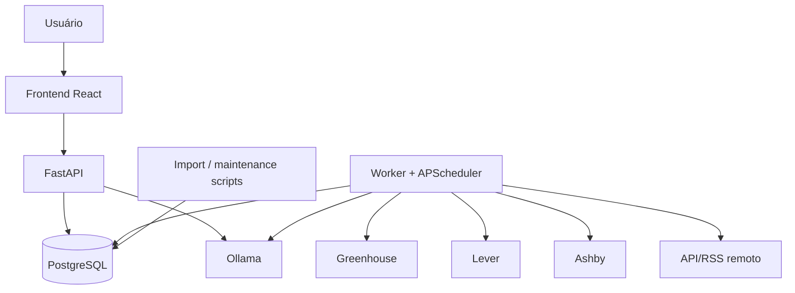
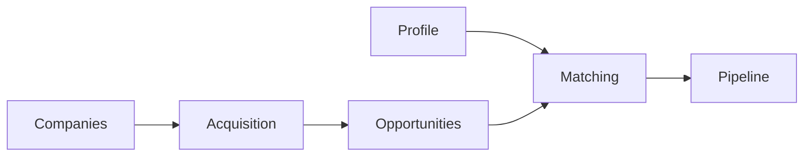
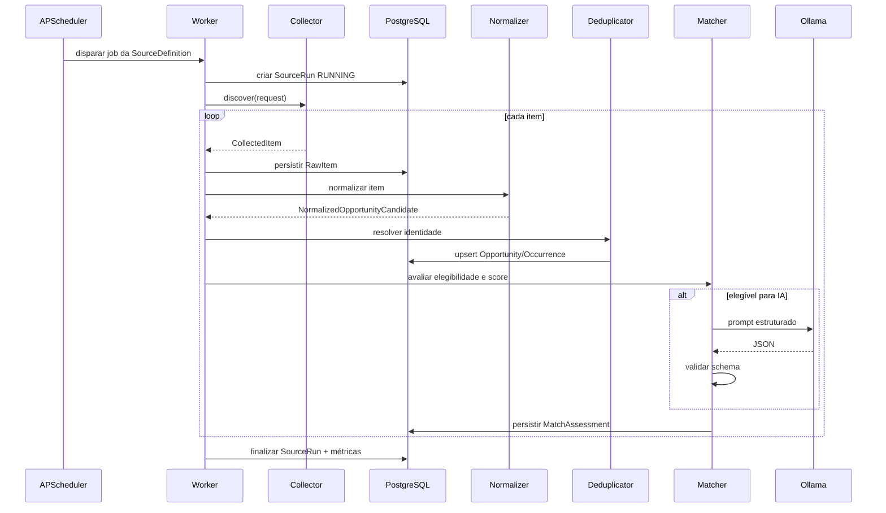
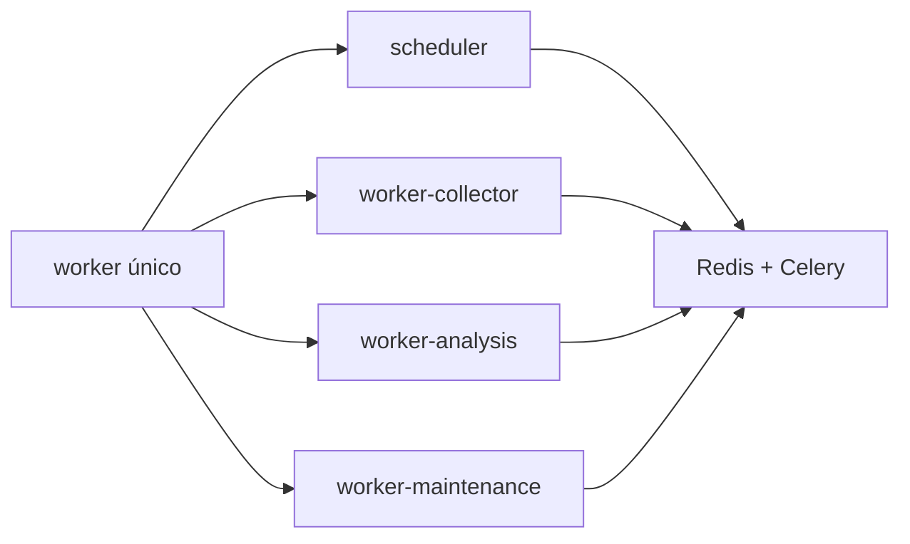

# Arquitetura do MVP

## 1. Propósito do MVP

O MVP existe para validar o fluxo completo do Opportunity Radar com o menor número possível de componentes operacionais, sem comprometer as fronteiras arquiteturais necessárias para a evolução futura.

O recorte precisa provar que é possível executar, localmente e de forma reproduzível, o ciclo:

```text
importar empresas
→ configurar fontes
→ coletar vagas
→ preservar payload bruto
→ normalizar
→ deduplicar
→ verificar elegibilidade
→ calcular score
→ enriquecer com Ollama
→ exibir na dashboard
→ iniciar e acompanhar candidatura
```

O MVP não busca cobertura máxima do mercado. O objetivo é validar **arquitetura, domínio, contratos, confiabilidade e utilidade real** antes de aumentar o número de fontes e automações.

---

## 2. Hipóteses que o MVP precisa validar

O MVP deve responder, com implementação funcionando, às seguintes perguntas:

1. A base inicial de empresas pode ser migrada do Notion sem depender dele depois?
2. É possível coletar oportunidades de fontes diferentes usando um contrato único de coletor?
3. O sistema consegue distinguir payload original, informação normalizada e inferência?
4. A deduplicação consegue consolidar múltiplas ocorrências sem perder procedência?
5. Hard filters reduzem ruído antes da IA?
6. O scoring determinístico produz uma ordenação útil e explicável?
7. O Ollama consegue enriquecer apenas as vagas relevantes e retornar estrutura validável?
8. A dashboard permite decidir rapidamente quais oportunidades merecem ação?
9. O fluxo permanece consistente após reinício do ambiente?
10. Uma falha parcial pode ser diagnosticada e reprocessada sem perda de dados?

Se essas hipóteses não forem validadas, adicionar mais fontes, filas ou automações apenas amplia a complexidade sem provar valor.

---

## 3. Escopo funcional do MVP

### 3.1 Incluído

- importação única da base de empresas;
- perfil profissional ativo;
- preferências de trabalho e critérios de elegibilidade;
- catálogo de skills inicial;
- cadastro e verificação básica de fontes por empresa;
- Greenhouse, Lever e Ashby;
- uma fonte remota adicional via API ou RSS;
- inclusão manual por URL;
- geração assistida de consultas Google Boolean;
- execução agendada de coleta;
- persistência de `SourceRun` e `RawItem`;
- normalização de vaga;
- deduplicação e merge;
- hard filters;
- scoring determinístico;
- análise estruturada via Ollama;
- Opportunity Inbox;
- detalhe da oportunidade;
- catálogo de empresas;
- saúde das fontes;
- pipeline básico de candidatura;
- logs estruturados;
- backup e restore check.

### 3.2 Fora do MVP

- Redis;
- Celery;
- Celery Beat;
- múltiplos workers independentes;
- envio automático de mensagem;
- candidatura automática;
- outreach completo;
- propostas comerciais completas;
- simulador avançado de entrevista;
- materialized projections orientadas a eventos;
- autenticação multiusuário;
- Kubernetes;
- dezenas de fontes;
- scraping autenticado de LinkedIn ou redes similares.

---

## 4. Visão de componentes



### 4.1 Princípio central

A simplicidade física do MVP **não** significa misturar regras. API e worker compartilham os mesmos casos de uso e domínio, mas cada responsabilidade continua isolada em módulos próprios.

---

## 5. Serviços do Docker Compose

| Serviço | Responsabilidade principal | Estado próprio | Porta no host |
| --- | --- | --- | --- |
| `frontend` | dashboard e interações | não | `3000` |
| `api` | comandos, queries e contratos HTTP | não | `8000` |
| `worker` | agenda, coleta, normalização e análise assíncrona inicial | não | nenhuma |
| `postgres` | persistência transacional | sim | nenhuma por padrão |
| `ollama` | inferência local | modelos em volume | nenhuma por padrão |

### 5.1 `frontend`

Responsável por:

- Opportunity Inbox;
- filtros;
- detalhe da vaga;
- empresas;
- fontes e execuções;
- perfil e preferências;
- pipeline básico.

Não contém regra de scoring, elegibilidade ou deduplicação.

### 5.2 `api`

Responsável por:

- expor contratos REST;
- validar entrada HTTP;
- autenticar/autorização futura quando necessário;
- iniciar casos de uso;
- controlar transação via Unit of Work;
- retornar DTOs de leitura;
- nunca executar scraping diretamente dentro da request.

### 5.3 `worker`

No MVP, concentra responsabilidades operacionais que futuramente serão separadas:

- scheduler;
- coleta;
- normalização;
- matching;
- chamada ao Ollama;
- manutenção leve.

A separação lógica precisa existir desde o início, mesmo compartilhando o mesmo processo.

### 5.4 `postgres`

Responsável por:

- dados do domínio;
- histórico;
- idempotência;
- status de processamento;
- payloads brutos;
- configuração das fontes;
- persistência do pipeline.

### 5.5 `ollama`

Responsável exclusivamente por inferência. Não armazena a verdade do domínio e não é dependência de readiness da API.

---

## 6. Domínios incluídos no MVP

### 6.1 Profile

Mantém:

- perfil ativo;
- skills;
- experiências;
- preferências geográficas;
- work mode;
- tipos de contrato aceitos;
- timezone;
- faixa de interesse;
- versão do perfil usada em avaliações.

### 6.2 Companies

Mantém:

- identidade canônica da empresa;
- domínio;
- aliases;
- prioridade;
- status no radar;
- fontes conhecidas;
- endpoint de carreira;
- resultado de verificação.

### 6.3 Acquisition

Mantém:

- `SourceDefinition`;
- `SourceRun`;
- `RawItem`;
- checkpoints;
- métricas da execução;
- erro categorizado;
- contrato de `Collector`.

### 6.4 Opportunities

Mantém:

- modelo canônico;
- lifecycle;
- fingerprint;
- ocorrências por fonte;
- descrição normalizada;
- localização;
- senioridade;
- modalidade;
- evidências principais.

### 6.5 Matching

Fisicamente pode começar junto de Opportunities, mas possui namespace e interfaces próprias.

Responsabilidades:

- hard filters;
- cálculo de fatores;
- score total;
- verdict;
- lacunas;
- explicabilidade;
- análise Ollama;
- versionamento da avaliação.

### 6.6 Pipeline

Recorte mínimo do CRM:

- iniciar candidatura;
- stage atual;
- histórico de stage;
- próxima ação;
- observação;
- data relevante.

### 6.7 Platform

No MVP contém infraestrutura transversal mínima:

- configurações;
- idempotency keys;
- auditoria essencial;
- job status;
- correlação de logs.

---

## 7. Fronteiras entre módulos



Regras:

- Acquisition não cria diretamente estruturas internas de Matching.
- Collector não persiste ORM diretamente.
- Opportunities não acessa tabelas internas de Companies por model SQLAlchemy.
- Matching recebe snapshots estáveis de Profile e Opportunity.
- Pipeline referencia a oportunidade, mas não altera seus dados editoriais.

---

## 8. Fontes iniciais

### 8.1 Greenhouse

Objetivo: validar um ATS com estrutura previsível e identidade externa estável.

O adapter deve:

- receber board/company identifier;
- listar vagas;
- extrair external ID;
- capturar URL canônica;
- preservar payload original;
- mapear campos disponíveis para `CollectedItem`;
- reportar erro sem interromper outras fontes.

### 8.2 Lever

Usa o mesmo contrato interno, ainda que os campos externos sejam diferentes. Nenhum nome de campo específico do Lever deve chegar ao domínio.

### 8.3 Ashby

Deve ser tratado como terceiro contract test importante para provar que a abstraction de Collector não foi moldada apenas para um fornecedor.

### 8.4 Fonte remota adicional

Escolher uma origem com API ou feed permitido, como Himalayas ou Remotive, para provar que o mecanismo não depende somente de ATS por empresa.

### 8.5 Entrada manual

A entrada manual é uma capability permanente e não apenas fallback de desenvolvimento.

Ela permite:

- inserir URL;
- registrar origem;
- importar texto quando necessário;
- colocar item na mesma pipeline de normalização e matching.

### 8.6 Google Boolean

No MVP, o sistema **gera consultas e organiza resultados assistidos**. Isso não equivale a scraping irrestrito do Google.

---

## 9. Contrato de coleta

Interface conceitual:

```python
class Collector(Protocol):
    source_type: str

    async def healthcheck(self) -> HealthResult:
        ...

    async def discover(
        self,
        request: CollectionRequest,
    ) -> AsyncIterator[CollectedItem]:
        ...
```

`CollectedItem` deve conter, quando disponível:

- `external_id`;
- `source_type`;
- `source_url`;
- `canonical_url`;
- `company_name_raw`;
- `title_raw`;
- `location_raw`;
- `description_raw`;
- `published_at`;
- `updated_at_external`;
- `employment_type_raw`;
- `metadata`;
- `raw_payload` ou referência para ele;
- cursor/checkpoint relacionado.

O contrato evita que cada collector implemente sua própria regra de Opportunity.

---

## 10. Fluxo completo de coleta



---

## 11. Estados de processamento

Mesmo sem uma fila distribuída, cada etapa precisa ter estado persistido ou inferível.

Exemplo:

```text
RawItem
COLLECTED
→ NORMALIZED
→ IDENTITY_RESOLVED
→ MATCHED
→ ANALYZED
```

Falhas podem gerar estados como:

- `NORMALIZATION_FAILED`;
- `IDENTITY_REVIEW_REQUIRED`;
- `MATCH_FAILED`;
- `ANALYSIS_PENDING`;
- `ANALYSIS_FAILED_RETRYABLE`;
- `ANALYSIS_FAILED_PERMANENT`.

O objetivo não é criar uma máquina de estados exagerada, mas permitir saber exatamente em qual etapa um item parou.

---

## 12. Persistência e transações

### 12.1 Transações curtas

Chamadas externas não devem permanecer dentro de transações abertas do PostgreSQL.

Exemplo correto:

1. coletar item;
2. validar estrutura mínima;
3. abrir transação;
4. salvar RawItem;
5. persistir mudanças locais;
6. commit;
7. continuar processamento.

### 12.2 Idempotência

Deve existir proteção no banco para:

- `source + external_id`;
- import batch repetido;
- occurrence repetida;
- avaliação repetida para mesma combinação de versões quando aplicável.

### 12.3 Optimistic locking

Agregados mutáveis relevantes usam `version` para detectar atualização concorrente ou stale write.

---

## 13. Normalização

O normalizador converte formatos externos para conceitos internos.

Exemplos:

- `Sr Software Engineer`, `Senior Software Engineer` → título canônico relacionado;
- `Remote - Brazil`, `Brazil (Remote)` → localização + work mode;
- `Full-time`, `Permanent` → contrato normalizado quando semanticamente equivalente;
- skills extraídas mantêm evidência textual de origem.

A normalização não deve apagar o valor bruto original.

---

## 14. Deduplicação

A identidade de uma vaga não depende apenas da URL.

A resolução considera, em camadas:

1. identidade forte da fonte (`source + external_id`);
2. URL canônica;
3. empresa canônica;
4. título normalizado;
5. localização/work mode;
6. janela temporal;
7. similaridade de descrição, se necessário.

Quando a confiança de merge não é suficiente, o sistema deve preferir marcar revisão em vez de fundir silenciosamente registros diferentes.

---

## 15. Matching no MVP

### 15.1 Etapa 1 — Hard filters

Regras objetivas eliminam incompatibilidades confirmadas.

### 15.2 Etapa 2 — Score determinístico

Fatores versionados calculam aderência em 0–100.

### 15.3 Etapa 3 — Ollama

Somente vagas elegíveis ou que precisam de interpretação passam para análise semântica.

A avaliação persistida precisa guardar:

- versão do perfil;
- versão das regras;
- score;
- fatores;
- verdict;
- evidências;
- prompt version;
- modelo;
- resultado validado;
- timestamps.

---

## 16. Integração com Ollama

### 16.1 Regra de disponibilidade

Ollama é uma dependência degradável.

Se indisponível:

- API continua pronta;
- coleta continua;
- normalização continua;
- deduplicação continua;
- hard filters continuam;
- score determinístico continua;
- análise recebe status pendente.

### 16.2 Validação da saída

Fluxo:

```text
prompt versionado
→ Ollama
→ JSON bruto
→ parser
→ validação por schema
→ retry controlado se recuperável
→ persistência
```

Texto não validado nunca deve atualizar estado de domínio diretamente.

---

## 17. Dashboard mínima

### 17.1 Overview

Exibe:

- oportunidades novas;
- recomendadas;
- pendentes de análise;
- fontes com erro;
- candidaturas abertas;
- ações próximas.

### 17.2 Opportunity Inbox

Filtros mínimos:

- verdict;
- score;
- empresa;
- recência;
- remoto/híbrido/presencial;
- status;
- candidatura iniciada ou não.

### 17.3 Opportunity Detail

Mostra:

- dados canônicos;
- ocorrências por fonte;
- links de origem;
- evidências;
- hard filters;
- fatores do score;
- análise Ollama;
- lacunas;
- histórico relevante;
- ação para iniciar candidatura.

### 17.4 Companies

Mostra catálogo, prioridade, fontes e último status de verificação.

### 17.5 Sources / Executions

Mostra:

- última execução;
- duração;
- itens coletados;
- novos;
- atualizados;
- erros;
- próximo agendamento.

### 17.6 Pipeline

Recorte inicial:

```text
SAVED → APPLIED → SCREENING → INTERVIEW → OFFER → CLOSED
```

A máquina final pode evoluir, mas o MVP já precisa manter histórico.

---

## 18. API do MVP

Grupos principais:

```text
/api/profile
/api/companies
/api/sources
/api/source-runs
/api/opportunities
/api/matches
/api/applications
/api/operations
```

Regras:

- endpoints de comando não retornam entidades ORM;
- respostas usam DTOs explícitos;
- paginação é obrigatória em coleções potencialmente grandes;
- filtros são validados;
- erros recebem código de máquina + mensagem humana;
- operações longas retornam referência de execução em vez de bloquear request.

---

## 19. Agenda no MVP

APScheduler roda dentro do processo de worker.

Tipos de job:

- coleta de fontes;
- verificação de company source;
- retry de análises pendentes;
- manutenção de itens expirados;
- backup agendado, se desejado.

Cada execução precisa possuir lock lógico para evitar disparo duplicado da mesma tarefa quando ainda estiver rodando.

---

## 20. Estratégia de erro

Categorias mínimas:

| Categoria | Exemplo | Ação |
| --- | --- | --- |
| validação | payload obrigatório ausente | registrar e descartar/isolado |
| temporário externo | timeout, 429, 503 | retry com backoff |
| permanente externo | endpoint removido | marcar source degradada |
| parser | schema externo mudou | armazenar amostra e alertar |
| domínio | transição inválida | rejeitar sem retry |
| concorrência | optimistic lock | reload + retry limitado |
| IA recuperável | timeout/JSON inválido | retry |
| IA permanente | prompt/schema incompatível | revisão operacional |

---

## 21. Healthchecks e readiness

### API pronta quando:

- processo iniciou;
- configuração foi validada;
- PostgreSQL responde;
- migrations esperadas estão aplicadas.

### Worker pronto quando:

- banco responde;
- scheduler iniciou;
- registry de collectors carregou.

### Ollama indisponível

Não torna API `unready`; apenas expõe estado degradado em `/health` ou endpoint operacional equivalente.

---

## 22. Logs mínimos

Todo processamento relevante deve carregar campos estruturados como:

```text
correlation_id
source_definition_id
source_run_id
raw_item_id
opportunity_id
job_name
stage
attempt
error_code
elapsed_ms
```

Isso permite reconstruir o caminho de um item sem depender de busca textual livre.

---

## 23. Testes obrigatórios do MVP

### Unitários

- hard filters;
- score;
- normalização;
- fingerprint;
- specifications;
- state transitions.

### Integração

- repositories com PostgreSQL;
- migrations;
- constraints de idempotência;
- collector adapters com fixtures;
- Ollama adapter mockado/contractual.

### E2E

Pelo menos um fluxo:

```text
importar empresas
→ executar source
→ gerar opportunity
→ calcular match
→ mostrar na inbox
→ iniciar candidatura
→ persistir após restart
```

---

## 24. Simplificações conscientes

### 24.1 Sem Redis/Celery

Aceitável porque há uma única máquina e baixo volume inicial.

### 24.2 Um worker físico

Reduz operação, mas módulos internos continuam separados por caso de uso.

### 24.3 Eventos síncronos locais

Eventos sem side effect externo podem ser tratados durante o fluxo local. O desenho deve facilitar migração posterior para outbox.

### 24.4 Queries diretas para read models

Views e queries SQL otimizadas bastam antes de existir necessidade de projeções assíncronas.

### 24.5 Sem autenticação local

Somente enquanto frontend/API estiverem restritos a localhost e não houver exposição de rede.

---

## 25. Limites arquiteturais que não podem ser violados

1. Domain não importa frameworks.
2. Collector não cria `Opportunity` diretamente.
3. Raw payload não é descartado após normalização.
4. Source failure não encerra execução das demais fontes.
5. IA não é requisito para persistir vaga.
6. Reprocessamento não cria duplicidade.
7. Match é versionado e reproduzível.
8. Dados ausentes não são tratados automaticamente como incompatibilidade.
9. Mensagem gerada não equivale a mensagem enviada.
10. Pipeline não altera identidade editorial da oportunidade.

---

## 26. Critérios de aceite arquiteturais

O MVP só deve ser considerado arquiteturalmente válido quando:

- `docker compose up` sobe todos os serviços necessários;
- banco inicia vazio e migrations são aplicadas corretamente;
- importação repetida não duplica empresas;
- pelo menos três adapters de ATS passam contract tests;
- uma falha de collector não derruba os demais;
- RawItem permite reprocessar sem nova requisição externa;
- dedupe preserva múltiplas ocorrências;
- score é determinístico para a mesma entrada e versão;
- Ollama offline gera degradação, não indisponibilidade geral;
- pipeline sobrevive a restart;
- backup pode ser restaurado em volume limpo;
- documentação permite executar o fluxo em outra máquina.

---

## 27. Caminho de evolução para a arquitetura final

O MVP deve facilitar as seguintes extrações sem reescrever domínio:



A decisão de migrar ocorre quando métricas mostrarem gargalos reais, como:

- análise bloqueando coleta;
- jobs concorrentes demais para processo único;
- necessidade de prioridades;
- retries persistentes;
- crescimento importante no número de fontes;
- necessidade de isolamento de carga de GPU/CPU.

---

## 28. Critério de saída do MVP

O MVP está concluído quando um ambiente novo consegue:

1. subir via Docker Compose;
2. aplicar migrations;
3. importar a base inicial de empresas;
4. executar fontes Greenhouse, Lever e Ashby;
5. persistir payload bruto;
6. normalizar e deduplicar;
7. executar hard filters e scoring;
8. realizar análise estruturada via Ollama quando disponível;
9. exibir recomendações e evidências na dashboard;
10. iniciar uma candidatura;
11. reiniciar sem perder estado;
12. executar backup e restore check.

Os critérios de implementação por fase estão detalhados em [29-roadmap-mvp.md](29-roadmap-mvp.md).
