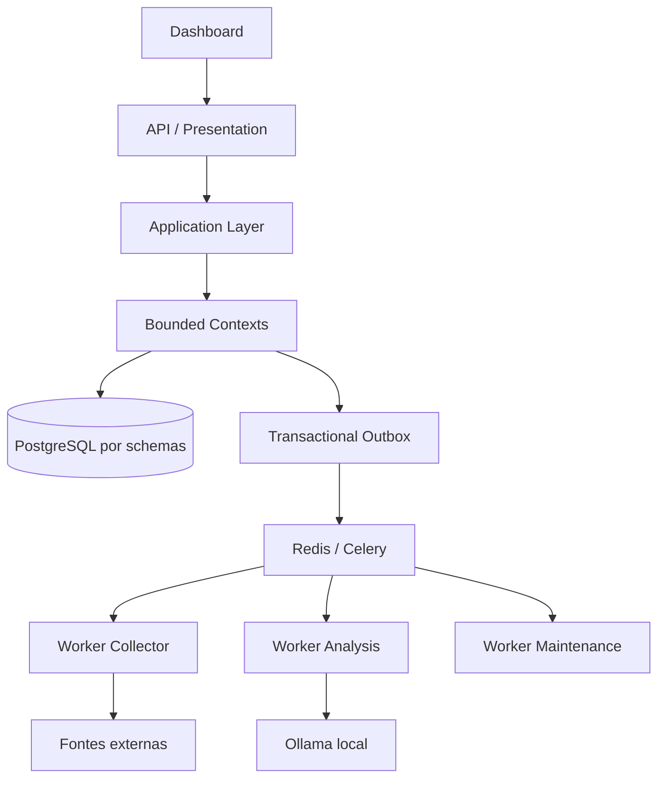
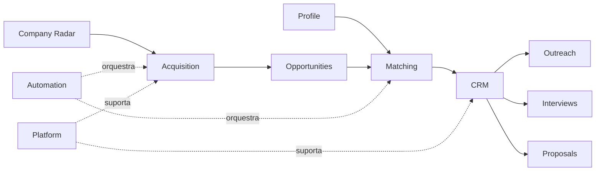
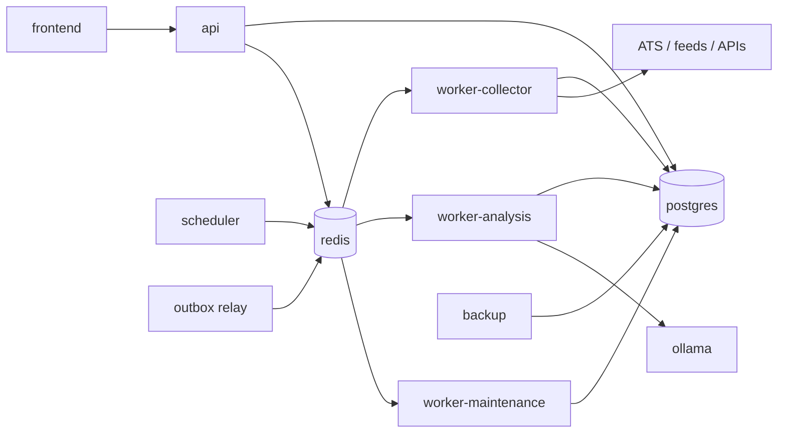
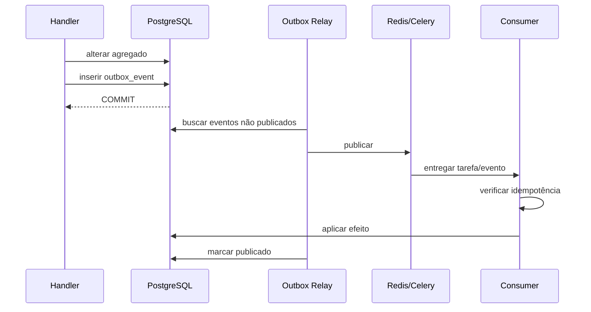
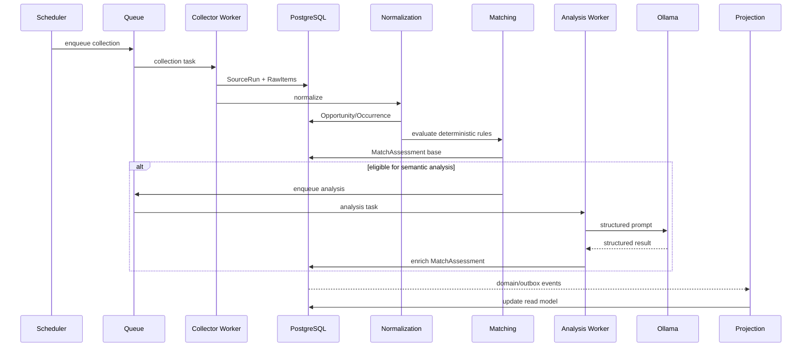

# Arquitetura da versão final

## 1. Objetivo da arquitetura final

A arquitetura final descreve o estado-alvo do Opportunity Radar depois que o MVP tiver validado o fluxo central. Ela não representa uma obrigação de implementar todos os componentes imediatamente; representa as fronteiras, responsabilidades e mecanismos necessários para o sistema crescer sem perder rastreabilidade e simplicidade operacional.

O desenho continua sendo um **monólito modular orientado a domínios**, executado localmente, porém com processamento assíncrono distribuído entre processos especializados.

A arquitetura precisa suportar:

- crescimento do número de empresas e fontes;
- execuções recorrentes e concorrentes;
- múltiplos tipos de análise;
- retries persistentes;
- priorização de workloads;
- histórico de decisões reproduzível;
- read models voltados à dashboard;
- CRM mais completo;
- outreach assistido;
- propostas;
- preparação de entrevistas;
- observabilidade e recuperação operacional.

---

## 2. Estilo arquitetural

O sistema combina:

- **DDD** para modelagem e fronteiras de negócio;
- **Clean/Hexagonal Architecture** para direção de dependências;
- **monólito modular** para simplicidade de deploy;
- **CQRS pragmático** para separar comandos de consultas complexas;
- **event-driven interno** onde desacoplamento e processamento assíncrono agregam valor;
- **transactional outbox** para publicar eventos após commits confiáveis;
- **workers especializados** para isolar perfis de carga.



---

## 3. Por que monólito modular continua sendo a escolha

Mesmo na versão final, o sistema é predominantemente single-user e local-first. Separar cada bounded context em microsserviço traria custos sem benefício proporcional:

- múltiplos deploys;
- contratos de rede internos;
- tracing distribuído;
- versionamento de APIs internas;
- consistência entre bancos;
- maior custo de desenvolvimento e operação.

O monólito modular permite:

- um único repositório;
- uma única base PostgreSQL;
- transações locais eficientes;
- refatoração mais fácil;
- testes integrados simples;
- fronteiras lógicas claras.

A separação física futura só é recomendada se existir uma necessidade mensurável de escala, disponibilidade, segurança ou ciclo de deploy independente.

---

## 4. Bounded contexts

| Contexto | Responsabilidade central | Não deve assumir |
| --- | --- | --- |
| Profile | perfil profissional, skills, experiências e preferências | lógica de vaga ou candidatura |
| Company Radar | identidade, aliases, prioridade e endpoints de carreira | coleta propriamente dita |
| Acquisition | fontes, runs, raw items, checkpoints | identidade final da vaga |
| Opportunities | oportunidade canônica, ocorrências e lifecycle | score ou candidatura |
| Matching | elegibilidade, fatores, score e explicabilidade | alterar conteúdo da oportunidade |
| CRM | candidatura, contatos, etapas e follow-ups | enviar comunicação externa por conta própria |
| Outreach | threads, rascunhos, revisão e histórico de envio | alterar estágio arbitrariamente |
| Proposals | escopo, preço, versões e milestones | decidir candidatura |
| Interviews | sessões, perguntas, respostas e feedback | alterar score histórico |
| Automation | jobs, locks, retries, DLQ | regra de negócio específica |
| Platform | outbox, auditoria, idempotência e config | comportamento de domínio |

---

## 5. Context Map resumido



O Context Map completo e os padrões de relacionamento são detalhados no documento de DDD estratégico.

---

## 6. Camadas internas de cada contexto

```text
context/
├── domain/
├── application/
├── infrastructure/
└── presentation/
```

### 6.1 Domain

Contém:

- aggregate roots;
- entities;
- value objects;
- domain services;
- specifications;
- policies;
- domain events;
- repository ports;
- erros de domínio.

Não importa:

- FastAPI;
- SQLAlchemy;
- Pydantic HTTP models;
- Celery;
- Redis;
- Ollama SDK/client;
- bibliotecas de scraping.

### 6.2 Application

Coordena casos de uso.

Contém:

- commands;
- queries;
- handlers;
- DTOs;
- Unit of Work;
- application services;
- event subscribers;
- ports de infraestrutura.

A camada conhece o domínio, mas não detalhes concretos de infraestrutura.

### 6.3 Infrastructure

Implementa portas:

- repositories SQLAlchemy;
- collector adapters;
- HTTP clients;
- Ollama adapter;
- Celery tasks;
- Redis locks;
- filesystem;
- métricas;
- tracing/logging adapters.

### 6.4 Presentation

Contém contratos externos:

- FastAPI routes;
- schemas de request/response;
- serialização;
- paginação;
- autenticação/autorização quando necessária;
- tradução de erros para HTTP.

---

## 7. Topologia de execução



### 7.1 `frontend`

Stateless, acessa somente API.

### 7.2 `api`

Stateless em termos de sessão de aplicação. Todo estado durável permanece no banco.

### 7.3 `scheduler`

Decide **quando** um job deve ser enfileirado. Não executa regra de negócio pesada.

### 7.4 `worker-collector`

Otimizado para I/O:

- APIs;
- RSS;
- ATS;
- parsing;
- persistência de raw item;
- trigger de normalização.

### 7.5 `worker-analysis`

Otimizado para recursos limitados de IA:

- prompt rendering;
- chamada Ollama;
- validação de schema;
- cache;
- retries;
- persistência do assessment.

### 7.6 `worker-maintenance`

Executa tarefas de baixa prioridade:

- expiração;
- reconciliação;
- rebuild de projeção;
- limpeza de dados conforme retenção;
- verificação de inconsistências;
- manutenção operacional.

---

## 8. Redis e Celery

Redis entra na versão final como componente de coordenação, não como fonte de verdade.

Usos:

- broker de tarefas;
- locks de curta duração;
- rate limit distribuído quando necessário;
- cache operacional efêmero;
- coordenação de workers.

PostgreSQL continua sendo a fonte de verdade para:

- estado de domínio;
- status durável de processamento;
- auditoria;
- histórico;
- idempotência de negócio.

Celery fornece:

- filas;
- retries;
- backoff;
- prioridades;
- routing por tipo de worker;
- observação de tarefas;
- execução assíncrona desacoplada da API.

---

## 9. Filas lógicas

```text
collection.high_priority
collection.standard
normalization
analysis.high_priority
analysis.standard
outreach
maintenance
rebuild_projection
dead_letter
```

### 9.1 Política de roteamento

- empresas prioritárias podem usar `collection.high_priority`;
- novas oportunidades com score determinístico alto podem usar `analysis.high_priority`;
- manutenção nunca compete em prioridade com coleta urgente;
- tarefas permanentemente falhas são movidas para DLQ após política de retry.

---

## 10. Transactional Outbox

O problema resolvido pelo outbox é evitar o estado:

> transação no banco foi confirmada, mas o evento não foi publicado.

Fluxo:



Requisitos:

- evento criado na mesma transação do agregado;
- relay reprocessável;
- consumidor idempotente;
- `event_id` único;
- retry sem duplicar efeito.

---

## 11. Consistência entre contextos

### 11.1 Dentro do agregado

Consistência forte.

### 11.2 Entre agregados do mesmo contexto

Preferencialmente coordenados por application service/Unit of Work quando necessário.

### 11.3 Entre bounded contexts

Consistência eventual quando o processo não precisa ser atômico.

### 11.4 Snapshots

Quando uma decisão precisa ser reproduzida no futuro, o sistema guarda snapshot ou referência de versão suficiente.

Exemplo de MatchAssessment:

```text
opportunity_version
profile_version
rule_set_version
prompt_version
model_name
model_config_hash
```

---

## 12. Estratégia de dados

Um PostgreSQL físico, múltiplos schemas lógicos.

```text
profile
company_radar
acquisition
opportunities
matching
crm
outreach
proposals
interviews
automation
platform
```

### 12.1 Regra de ownership

Cada contexto é o único escritor autorizado de suas tabelas.

### 12.2 Leitura entre contextos

Permitida por:

- query service publicado;
- DTO;
- view de leitura cuidadosamente definida;
- evento/snapshot;
- referência por ID.

Não se permite importar model ORM de outro contexto como atalho.

---

## 13. Read models e CQRS pragmático

O write model protege invariantes. A dashboard, por outro lado, precisa de leituras agregadas e rápidas.

Read models previstos:

### 13.1 Opportunity Inbox

Combina:

- dados da oportunidade;
- empresa;
- último assessment;
- status da candidatura;
- recência;
- flags de revisão.

### 13.2 Recommendation Detail

Combina:

- score;
- fatores;
- evidências;
- ocorrências;
- análise semântica;
- histórico de avaliações.

### 13.3 Company Coverage

Exibe:

- empresas ativas;
- fontes conhecidas;
- última coleta;
- vagas encontradas;
- saúde do endpoint.

### 13.4 Pipeline Board

Exibe candidatura por estágio e próxima ação.

### 13.5 Follow-up Agenda

Ordena ações por prazo, pessoa, empresa e canal.

### 13.6 Operations Health

Exibe status de fontes, filas, workers, Ollama, backups e erros recentes.

Esses read models podem começar como views SQL e evoluir para tabelas projetadas por eventos quando o custo das queries justificar.

---

## 14. Fluxo ponta a ponta final



---

## 15. Company Radar

A versão final trata o catálogo de empresas como ativo central.

Além da identidade básica, o contexto pode manter:

- prioridade;
- país/região;
- stack percebida;
- tamanho/faixa;
- tipo de contratação;
- histórico de endpoints;
- status da fonte;
- qualidade da cobertura;
- última oportunidade encontrada;
- sinais manuais;
- observações.

A descoberta de endpoint é separada da coleta. Uma empresa pode ter múltiplos endpoints e cada endpoint pode mudar ao longo do tempo.

---

## 16. Acquisition

O contexto é responsável por transportar dados externos com máxima fidelidade e mínimo acoplamento.

Principais objetos:

- `SourceDefinition`;
- `CompanySource` reference;
- `SourceRun`;
- `RawItem`;
- `Checkpoint`;
- `CollectionMetric`;
- `SourceHealth`.

Ele não decide se duas vagas são a mesma. Essa autoridade pertence a Opportunities.

---

## 17. Opportunities

É a autoridade sobre identidade e lifecycle editorial da vaga.

Responsabilidades:

- criar oportunidade canônica;
- anexar ocorrência;
- merge controlado;
- identificar reabertura;
- marcar fechada/expirada;
- preservar histórico relevante;
- registrar origem das informações.

Uma `Opportunity` não deve perder source occurrences apenas porque uma fonte desapareceu.

---

## 18. Matching

É responsável por responder:

> considerando esta versão do perfil e esta versão da oportunidade, qual é a aderência e por quê?

Possui três níveis:

1. elegibilidade;
2. score determinístico;
3. análise semântica auxiliar.

Uma avaliação passada não é sobrescrita silenciosamente quando pesos, perfil ou prompt mudam. Nova versão gera novo assessment.

---

## 19. CRM

A versão final do CRM controla:

- candidatura;
- stage;
- contatos;
- origem do contato;
- follow-ups;
- próximas ações;
- eventos relevantes;
- entrevistas;
- resultado;
- encerramento.

O CRM não altera o score histórico para refletir resultado posterior. Resultado pode ser usado na calibração futura, mas permanece um dado distinto.

---

## 20. Outreach

O contexto gerencia comunicação assistida.

Fluxo recomendado:

```text
contexto
→ gerar draft
→ revisão humana
→ aprovar
→ enviar externamente/manual
→ registrar envio
→ registrar resposta
```

Estado `DRAFT` nunca equivale a `SENT`.

---

## 21. Proposals

Projetado para oportunidades freelance/PJ quando aplicável.

Mantém:

- versão;
- escopo;
- entregáveis;
- milestones;
- preço;
- moeda;
- validade;
- assumptions;
- status;
- histórico.

Versões emitidas tornam-se imutáveis; alterações criam nova versão.

---

## 22. Interviews

Mantém preparação e histórico sem contaminar o domínio de Matching.

Pode incluir:

- job snapshot;
- company snapshot;
- perguntas previstas;
- perguntas respondidas;
- notas;
- feedback;
- lacunas identificadas;
- plano de preparação.

---

## 23. Resiliência

### 23.1 Retry

Aplicado somente a erros classificados como transitórios.

### 23.2 Backoff

Preferência por exponencial com jitter.

### 23.3 Circuit breaker

Usado para fontes repetidamente indisponíveis.

### 23.4 DLQ

Recebe tarefas que esgotaram retry ou falharam por erro estrutural.

### 23.5 Idempotência

Todo consumidor precisa aceitar redelivery.

---

## 24. Rate limiting

Política por host/fonte evita sobrecarregar serviços externos.

Dados que podem compor a decisão:

- limite configurado do adapter;
- cabeçalhos HTTP;
- `Retry-After`;
- histórico de 429;
- prioridade da source;
- concorrência máxima por host.

---

## 25. Observabilidade

### Logs

Estruturados em JSON com correlation IDs.

### Métricas

Exemplos:

```text
source_runs_total
source_run_failures_total
collected_items_total
normalized_items_total
deduplicated_merges_total
analysis_latency_seconds
analysis_failures_total
queue_depth
job_retries_total
ollama_requests_total
```

### Saúde operacional

Dashboard deve mostrar:

- fontes degradadas;
- filas acumuladas;
- jobs presos;
- último backup;
- status do Ollama;
- erros recentes;
- projection lag quando houver.

---

## 26. Segurança

Mesmo local-first, a arquitetura assume defesa mínima:

- secrets separados de config comum;
- portas internas não expostas;
- validação de URL externa;
- timeouts;
- limites de payload;
- sanitização de conteúdo exibido;
- proteção contra SSRF nos recursos que aceitam URL;
- logs sem secrets;
- backups protegidos;
- princípio de menor privilégio para futuras integrações.

---

## 27. Backup e recuperação

O estado crítico está no PostgreSQL.

A estratégia deve incluir:

- backup periódico;
- retenção configurável;
- restore check automatizado;
- restauração em volume separado;
- documentação de recuperação;
- preservação de migrations e versão da aplicação.

Modelos Ollama podem ser baixados novamente; dados de domínio não.

---

## 28. Escalabilidade vertical

Primeira forma de escala recomendada:

- mais RAM;
- mais CPU;
- GPU melhor para análise;
- aumentar concorrência de collector workers;
- ajustar batch sizes;
- índices adequados;
- otimizar read models.

---

## 29. Escalabilidade horizontal

Possível para workers stateless:

```text
worker-collector x N
worker-analysis x N
worker-maintenance x N
```

Requisitos:

- idempotência;
- locks;
- tasks pequenas;
- banco como fonte de verdade;
- evitar estado local não compartilhado entre workers.

A API também pode ser replicada se um dia necessário, embora isso seja improvável no uso single-user local.

---

## 30. Critérios para extrair microsserviço

Um bounded context só deve virar serviço independente se pelo menos uma condição for real:

- precisa escalar de forma independente;
- exige SLA diferente;
- possui ciclo de deploy independente;
- precisa de isolamento de segurança;
- tornou-se grande demais para ownership dentro do monólito;
- comunicação assíncrona já domina a interação;
- custo operacional adicional é justificável.

“Porque é arquitetura moderna” não é critério válido.

---

## 31. Rebuild e reprocessamento

A arquitetura deve permitir:

### Reprocessar RawItem

Sem chamar fonte externa novamente.

### Recalcular matching

Quando mudar:

- perfil;
- regra;
- peso;
- taxonomia.

### Reexecutar IA

Quando mudar:

- prompt;
- modelo;
- schema de saída.

### Reconstruir projeção

A partir de dados transacionais e histórico suficiente.

---

## 32. Propriedades de qualidade exigidas

### Confiabilidade

Falhas externas ficam isoladas.

### Auditabilidade

Toda decisão relevante possui versão e evidência.

### Reprodutibilidade

Mesmas entradas + mesmas versões determinísticas produzem mesmo score.

### Observabilidade

Erros podem ser rastreados por execução e item.

### Manutenibilidade

Bounded contexts não acessam infrastructure uns dos outros.

### Privacidade

Dados permanecem locais por padrão.

### Degradação graciosa

Ollama ou fonte indisponível não inviabiliza o restante.

---

## 33. Invariantes arquiteturais

1. Cada contexto escreve apenas em suas tabelas.
2. Domain não depende de framework.
3. Collector retorna contrato canônico.
4. RawItem é preservado.
5. Event consumer é idempotente.
6. Outbox é persistido junto da transação de origem.
7. IA não decide regras objetivas sem validação.
8. Match histórico é versionado.
9. Projeção de leitura não atualiza agregado.
10. Falha em projeção não perde evento transacional.
11. Redis nunca é fonte de verdade de negócio.
12. API não executa workload pesado sincronamente quando puder ser job.
13. DLQ não é descarte silencioso; exige visibilidade operacional.
14. Nenhum microsserviço é criado sem necessidade mensurável.

---

## 34. Estado-alvo resumido

A versão final é uma plataforma pessoal contínua que:

- mantém um radar próprio de empresas;
- consulta múltiplas fontes de forma responsável;
- consolida ocorrências em oportunidades canônicas;
- preserva evidências;
- calcula matching reproduzível;
- usa IA local apenas como camada semântica controlada;
- organiza o funil de candidatura;
- auxilia comunicação, proposta e entrevista;
- registra histórico suficiente para explicar decisões;
- opera localmente por Docker Compose;
- consegue crescer por workers e filas sem quebrar seus domínios.
