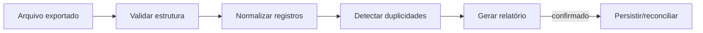
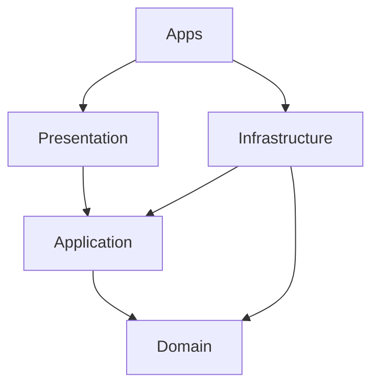
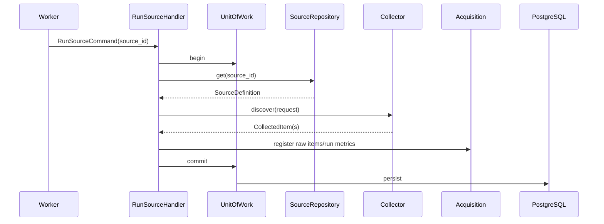

# Estrutura do projeto — MVP

## 1. Objetivo desta estrutura

A estrutura do MVP precisa atender a dois objetivos que parecem conflitantes, mas são complementares:

1. **ser simples o suficiente para uma primeira implementação local**;
2. **preservar limites arquiteturais que permitam evoluir para a versão final sem reescrever o domínio**.

Por isso, o MVP usa poucos processos físicos — API, worker, frontend, PostgreSQL e Ollama — mas mantém separação lógica entre domínio, aplicação, infraestrutura e apresentação.

A regra central é:

> simplificar deploy e operação, não simplificar as fronteiras do domínio.

O código deve permitir que componentes hoje executados juntos sejam separados no futuro por mudança de composição, não por reescrita das regras de negócio.

---

## 2. Princípios estruturais

### 2.1 Domínio independente de framework

Nenhum módulo de `domain/` pode depender de:

- FastAPI;
- Pydantic usado para HTTP;
- SQLAlchemy;
- Alembic;
- APScheduler;
- HTTPX;
- Ollama;
- bibliotecas de parsing;
- detalhes de Docker.

Isso permite testar regras como deduplicação, elegibilidade, score e transições sem banco, rede ou container.

### 2.2 Casos de uso são a unidade principal da aplicação

Rotas HTTP, jobs agendados e scripts não devem implementar regras diretamente. Eles acionam handlers ou application services.

Exemplos:

```text
POST /sources/{id}/run
        ↓
RunSourceCommand
        ↓
RunSourceHandler
        ↓
Collector port + repositories + Unit of Work
```

```text
APScheduler
    ↓
CollectDueSourcesCommand
    ↓
CollectDueSourcesHandler
```

### 2.3 Infraestrutura é substituível

O domínio conhece abstrações; infraestrutura fornece implementações.

Exemplos:

- domínio/application conhece `OpportunityRepository`;
- infraestrutura fornece `SqlAlchemyOpportunityRepository`;
- application conhece `LLMAnalyzer`;
- infraestrutura fornece `OllamaAnalyzer`;
- acquisition conhece `Collector`;
- `collectors/ats/greenhouse.py` implementa o contrato.

### 2.4 Sem imports cruzados de infraestrutura

Um módulo nunca deve consumir diretamente o ORM, client HTTP ou repository concreto de outro módulo.

Errado:

```python
from opportunity_radar.companies.infrastructure.models import CompanyModel
```

Correto:

```python
from opportunity_radar.companies.application.queries import CompanyLookup
```

ou um contrato publicado pelo módulo.

---

## 3. Árvore proposta do repositório

```text
opportunity-radar/
├── apps/
│   ├── api/
│   │   ├── main.py
│   │   ├── dependencies.py
│   │   ├── lifecycle.py
│   │   └── routes.py
│   ├── worker/
│   │   ├── main.py
│   │   ├── schedules.py
│   │   ├── jobs.py
│   │   └── lifecycle.py
│   └── web/
│       ├── src/
│       │   ├── app/
│       │   ├── features/
│       │   ├── components/
│       │   ├── hooks/
│       │   ├── lib/
│       │   ├── routes/
│       │   └── types/
│       ├── public/
│       ├── package.json
│       └── vite.config.ts
│
├── src/opportunity_radar/
│   ├── profile/
│   ├── companies/
│   ├── acquisition/
│   ├── opportunities/
│   ├── matching/
│   ├── pipeline/
│   ├── platform/
│   └── shared/
│
├── collectors/
│   ├── ats/
│   │   ├── greenhouse.py
│   │   ├── lever.py
│   │   └── ashby.py
│   ├── remote_boards/
│   └── manual/
│
├── prompts/
│   └── opportunity_analysis/
│       └── v1/
│           ├── system.md
│           ├── user.md.j2
│           ├── output.schema.json
│           ├── examples.json
│           └── metadata.yaml
│
├── migrations/
│   ├── env.py
│   └── versions/
│
├── tests/
│   ├── unit/
│   ├── integration/
│   ├── contract/
│   ├── e2e/
│   ├── fixtures/
│   └── factories/
│
├── scripts/
│   ├── import_notion_export.py
│   ├── bootstrap_ollama.py
│   ├── seed_dev.py
│   ├── backup.py
│   └── doctor.py
│
├── docker/
│   ├── api.Dockerfile
│   ├── worker.Dockerfile
│   ├── web.Dockerfile
│   └── entrypoints/
│
├── docs/
├── compose.yaml
├── pyproject.toml
├── package-lock.json
├── .env.example
├── .gitignore
├── Makefile
└── README.md
```

### 3.1 O que foi propositalmente mantido fora do MVP

A árvore não inclui ainda:

- `scheduler/` como processo próprio;
- `worker_collector/`, `worker_analysis/` e `worker_maintenance/` separados;
- `automation/` como bounded context completo;
- `projections/` independentes;
- `outreach/`, `proposals/` e `interviews/`;
- Redis e Celery.

Esses componentes aparecem na arquitetura final, mas não são necessários para provar o fluxo vertical do MVP.

---

## 4. Responsabilidade de cada diretório raiz

| Diretório | Responsabilidade | Não deve conter |
| --- | --- | --- |
| `apps/` | composition roots e processos executáveis | regra de negócio |
| `src/opportunity_radar/` | domínio, casos de uso e adapters do produto | configuração específica de container |
| `collectors/` | adapters de fontes externas | criação direta de Opportunity |
| `prompts/` | prompts e schemas versionados | prompt embutido em handler |
| `migrations/` | evolução do PostgreSQL | regra de domínio |
| `tests/` | testes automatizados e fixtures | scripts de operação |
| `scripts/` | comandos administrativos explícitos | lógica duplicada de application layer |
| `docker/` | imagens e entrypoints | secrets |
| `docs/` | arquitetura e operação | código executável essencial |

---

## 5. `apps/`: composition roots

`apps/` contém pontos de entrada. Esses arquivos montam dependências e inicializam processos, mas não sabem implementar regras.

### 5.1 `apps/api`

Responsabilidades:

- criar a instância FastAPI;
- registrar routers;
- instalar exception handlers;
- configurar lifecycle;
- construir Unit of Work/repositories;
- injetar serviços de aplicação;
- inicializar logging;
- expor health/readiness endpoints.

Exemplo conceitual:

```python
def create_app(settings: Settings) -> FastAPI:
    container = build_container(settings)
    app = FastAPI()
    app.include_router(build_router(container))
    return app
```

O arquivo `main.py` deve ser pequeno. Se ele começa a conhecer query SQL, regras de score ou detalhes de Greenhouse, a fronteira foi quebrada.

### 5.2 `apps/worker`

No MVP, o worker concentra três responsabilidades operacionais:

1. scheduler;
2. executor de coleta;
3. executor de análise/manutenção.

Essas responsabilidades permanecem separadas em funções/casos de uso para permitir extração futura.

Estrutura:

```text
apps/worker/
├── main.py          # bootstrap do processo
├── schedules.py     # definição de agendas
├── jobs.py          # wrappers que chamam application handlers
└── lifecycle.py     # startup/shutdown e graceful stop
```

O scheduler não deve conter algo como:

```python
# evitar
@scheduler.scheduled_job(...)
def collect():
    response = requests.get(...)
    session.add(...)
```

Ele deve apenas disparar um caso de uso:

```python
@scheduler.scheduled_job(...)
async def collect_due_sources():
    await command_bus.execute(CollectDueSourcesCommand())
```

### 5.3 `apps/web`

O frontend segue organização por feature para evitar um diretório global de componentes impossível de manter.

```text
src/
├── app/                 # providers e bootstrap
├── routes/              # definição das páginas
├── features/
│   ├── opportunities/
│   ├── companies/
│   ├── sources/
│   ├── profile/
│   └── pipeline/
├── components/          # componentes verdadeiramente compartilhados
├── hooks/               # hooks genéricos
├── lib/                 # cliente HTTP, query client, utilitários
└── types/               # tipos transversais de UI
```

Cada feature pode possuir:

```text
features/opportunities/
├── api/
├── components/
├── hooks/
├── pages/
├── schemas/
└── types/
```

O frontend pode reproduzir validações de experiência do usuário, mas a decisão final permanece no backend.

---

## 6. Estrutura interna de um módulo de domínio

No MVP, cada módulo segue uma estrutura enxuta:

```text
opportunities/
├── domain/
│   ├── entities.py
│   ├── value_objects.py
│   ├── events.py
│   ├── policies.py
│   ├── services.py
│   ├── specifications.py
│   └── repositories.py
├── application/
│   ├── commands.py
│   ├── queries.py
│   ├── handlers.py
│   ├── services.py
│   ├── dto.py
│   └── ports.py
├── infrastructure/
│   ├── models.py
│   ├── repository.py
│   ├── mappers.py
│   └── query_service.py
└── presentation/
    ├── routes.py
    ├── schemas.py
    └── error_mapping.py
```

Nem todos os arquivos precisam existir desde o primeiro commit. A estrutura deve crescer quando houver código real, evitando pastas vazias apenas para parecer arquitetural.

---

## 7. Camada `domain`

A camada de domínio representa conceitos e regras que continuariam existindo mesmo se FastAPI, PostgreSQL e Ollama fossem substituídos.

### 7.1 `entities.py`

Contém aggregate roots e entidades com identidade.

Exemplo:

```python
class Opportunity:
    def add_occurrence(self, occurrence: SourceOccurrence) -> None:
        ...

    def close(self, reason: ClosingReason) -> None:
        ...
```

A entidade deve proteger suas invariantes; não deve ser apenas um dataclass com setters livres.

### 7.2 `value_objects.py`

Conceitos definidos por valor, preferencialmente imutáveis:

- `JobTitle`;
- `OpportunityFingerprint`;
- `WorkMode`;
- `Seniority`;
- `Location`;
- `MatchScore`.

O value object valida seu próprio estado no momento da criação.

### 7.3 `events.py`

Eventos representam fatos já ocorridos:

- `OpportunityCreated`;
- `OpportunityMerged`;
- `OpportunityClosed`;
- `AssessmentCompleted`.

No MVP, vários eventos podem ser processados sincronicamente, mas sua modelagem evita acoplamento direto de comportamentos.

### 7.4 `policies.py`

Políticas encapsulam uma decisão configurável ou dependente de contexto.

Exemplo:

```text
ShouldAnalyzeOpportunityPolicy
```

pode considerar:

- elegibilidade;
- score mínimo;
- avaliação anterior;
- versão do perfil;
- disponibilidade do modelo.

### 7.5 `specifications.py`

Specifications encapsulam predicados de negócio explicáveis e combináveis.

Exemplo:

```text
RemoteCompatible
AND CountryAllowed
AND SeniorityCompatible
```

### 7.6 `repositories.py`

Declara interfaces do domínio/application, nunca implementação SQLAlchemy.

Exemplo:

```python
class OpportunityRepository(Protocol):
    async def get(self, opportunity_id: UUID) -> Opportunity | None: ...
    async def save(self, opportunity: Opportunity) -> None: ...
```

---

## 8. Camada `application`

A camada application coordena o fluxo de um caso de uso.

### 8.1 Commands

Commands expressam intenção de mudança:

- `ImportCompaniesCommand`;
- `RunSourceCommand`;
- `NormalizeRawItemCommand`;
- `AssessOpportunityCommand`;
- `StartApplicationCommand`.

Um command deve carregar somente dados necessários para a operação.

### 8.2 Queries

Queries não modificam agregados:

- `ListOpportunityInboxQuery`;
- `GetOpportunityDetailQuery`;
- `ListCompaniesQuery`;
- `GetSourceHealthQuery`;
- `GetPipelineBoardQuery`.

Para telas complexas, uma query pode usar read model otimizado sem reconstruir agregados completos.

### 8.3 Handlers

Cada handler:

1. valida pré-condições externas ao agregado;
2. abre Unit of Work;
3. carrega agregados necessários;
4. chama comportamento de domínio;
5. persiste alterações;
6. registra eventos/efeitos;
7. commit;
8. retorna resultado de aplicação.

### 8.4 DTOs

DTOs são contratos entre application e presentation/adapters.

Eles não devem ser tratados como entidades de domínio.

---

## 9. Camada `infrastructure`

### 9.1 ORM models

`models.py` descreve persistência.

Regras:

- nomes coerentes com schemas;
- constraints explícitas;
- timestamps corretos;
- sem métodos de regra de negócio;
- ORM nunca sai da infraestrutura.

### 9.2 Mappers

Transformam:

```text
ORM row ⇄ Domain object
```

Isso evita que o domínio dependa do ciclo de vida da sessão SQLAlchemy.

### 9.3 Repositories concretos

Implementam portas do domínio/application.

Exemplo:

```text
OpportunityRepository
        ↑
SqlAlchemyOpportunityRepository
```

### 9.4 Query services

Leituras de dashboard podem usar SQLAlchemy Core/SQL otimizado diretamente para DTOs de leitura.

Isso é intencional: CQRS pragmático evita carregar agregados completos apenas para montar tabelas da interface.

---

## 10. Camada `presentation`

Responsabilidades:

- contrato HTTP;
- validação sintática;
- status HTTP;
- paginação;
- serialização;
- tradução de erros.

Fluxo esperado:

```text
HTTP Request
→ Pydantic request schema
→ Command/Query
→ Handler
→ Application DTO
→ HTTP response schema
```

Uma route não deve:

- acessar sessão SQL diretamente;
- importar ORM models;
- calcular score;
- executar parser;
- montar prompt;
- alterar agregado por atribuição direta.

---

## 11. Módulos do MVP

### 11.1 `profile`

Responsável por:

- perfil profissional;
- versões do perfil;
- skills;
- experiências;
- preferências;
- critérios de contrato, localização e timezone.

Casos de uso iniciais:

```text
GetActiveProfile
UpdatePreferences
ReplaceSkillSet
CreateProfileVersion
```

### 11.2 `companies`

Responsável por:

- empresa canônica;
- aliases;
- domínio;
- prioridade no radar;
- endpoint de carreira;
- importação/reconciliação das 186 empresas.

### 11.3 `acquisition`

Responsável por:

- definição de fontes;
- execuções;
- checkpoints;
- raw items;
- health da fonte;
- integração com collectors por porta.

Não decide identidade final da vaga.

### 11.4 `opportunities`

Responsável por:

- oportunidade canônica;
- ocorrências por fonte;
- normalização;
- fingerprint;
- merge/deduplicação;
- lifecycle editorial da oportunidade.

### 11.5 `matching`

Mesmo que fisicamente pequeno no MVP, deve possuir fronteira explícita.

Responsável por:

- hard filters;
- score;
- verdict;
- fatores;
- evidências;
- integração indireta com análise semântica.

### 11.6 `pipeline`

Recorte inicial do CRM:

- candidatura;
- estágio;
- histórico;
- próxima ação;
- observações básicas.

### 11.7 `platform`

Somente capacidades transversais técnicas:

- settings;
- clock;
- Unit of Work concreto;
- logging bootstrap;
- idempotency helper;
- audit mínimo;
- health/readiness.

Não deve virar um diretório de “coisas que não sabemos onde colocar”.

---

## 12. `collectors/`: plugins de aquisição

Os coletores ficam fora do domínio porque representam detalhes de integração.

```text
collectors/
├── base.py
├── registry.py
├── ats/
│   ├── greenhouse.py
│   ├── lever.py
│   └── ashby.py
├── remote_boards/
│   └── remotive.py
└── manual/
    └── url.py
```

### 12.1 Contrato mínimo

```python
class Collector(Protocol):
    source_type: str

    async def healthcheck(self) -> HealthResult:
        ...

    async def discover(
        self,
        request: CollectionRequest,
    ) -> AsyncIterator[CollectedItem]:
        ...
```

### 12.2 Regra fundamental

`Collector` retorna `CollectedItem`.

Ele **não**:

- cria `Opportunity`;
- calcula fingerprint definitivo;
- calcula score;
- grava diretamente no PostgreSQL;
- decide candidatura.

---

## 13. Registro de collectors

O `registry.py` resolve adapters por `source_type`.

Exemplo conceitual:

```python
registry.register("greenhouse", GreenhouseCollector)
registry.register("lever", LeverCollector)
registry.register("ashby", AshbyCollector)
```

Isso permite adicionar uma fonte sem alterar regras do domínio Acquisition.

O registry pode expor metadados:

- capabilities;
- requires_auth;
- supports_incremental_cursor;
- supports_company_jobs;
- default_rate_limit;
- parser version.

---

## 14. Prompts versionados

No MVP, somente `opportunity_analysis` é obrigatório.

```text
prompts/opportunity_analysis/v1/
├── system.md
├── user.md.j2
├── output.schema.json
├── examples.json
└── metadata.yaml
```

### 14.1 `metadata.yaml`

Pode registrar:

```yaml
version: 1
purpose: opportunity_analysis
schema_version: 1
recommended_model: configurable
created_at: 2026-09-10
```

### 14.2 Motivo do versionamento

Uma avaliação salva precisa conseguir responder:

- qual perfil foi usado;
- qual regra determinística foi usada;
- qual prompt foi usado;
- qual modelo foi usado;
- qual schema validou a resposta.

Sem isso, scores históricos deixam de ser reproduzíveis.

---

## 15. Migrações

### 15.1 Organização

Mesmo em um único diretório Alembic, cada revision deve indicar o contexto afetado.

Exemplo de nomes:

```text
20260910_001_profile_initial.py
20260910_002_companies_initial.py
20260910_003_acquisition_initial.py
20260910_004_opportunities_initial.py
```

### 15.2 Regras

- migration aplicada nunca é alterada;
- autogenerate precisa de revisão;
- mudança destrutiva exige procedimento explícito;
- índices e constraints fazem parte da migration;
- dados de referência pequenos podem ter seed separado;
- dado de usuário não entra em migration.

---

## 16. Testes

```text
tests/
├── unit/
├── integration/
├── contract/
├── e2e/
├── fixtures/
└── factories/
```

### 16.1 Unit

Sem banco/rede:

- value objects;
- aggregates;
- specifications;
- policies;
- score;
- deduplicação pura;
- transições.

### 16.2 Integration

Com PostgreSQL/Ollama fake/adapters:

- repositories;
- Unit of Work;
- constraints;
- migrations;
- queries.

### 16.3 Contract

Cada collector deve possuir fixtures representativas e testar o mesmo contrato.

Exemplo:

```text
Greenhouse fixture → CollectedItem válido
Lever fixture      → CollectedItem válido
Ashby fixture      → CollectedItem válido
```

### 16.4 E2E

Slice principal:

```text
importar empresas
→ executar coleta fixture
→ normalizar
→ deduplicar
→ avaliar
→ listar inbox
→ iniciar candidatura
```

---

## 17. Scripts operacionais

### 17.1 `import_notion_export.py`

Responsável pela migração única do catálogo atual.

Parâmetros previstos:

```text
--input
--format csv|json
--dry-run
--report
--resume
--batch-id
```

Fluxo:



Após a reconciliação das 186 empresas, o Notion deixa de ser dependência operacional do sistema.

### 17.2 `doctor.py`

Deve validar:

- conexão PostgreSQL;
- migration atual;
- acesso de escrita aos volumes;
- Ollama acessível;
- modelo configurado disponível;
- configuração obrigatória;
- espaço em disco básico.

---

## 18. Dependências permitidas



### 18.1 Regra por camada

| Origem | Pode importar | Não pode importar |
| --- | --- | --- |
| Domain | stdlib + domínio local | application, infrastructure, presentation |
| Application | domain + ports | FastAPI, ORM concreto, collectors concretos |
| Infrastructure | application + domain | presentation de outro módulo |
| Presentation | application + DTOs | ORM e collectors concretos |
| Apps | composition/configuração | regra de negócio |

### 18.2 Regra entre módulos

Um bounded context pode consumir de outro apenas:

- contratos publicados;
- IDs;
- DTOs estáveis;
- eventos;
- query/application ports.

Nunca:

- tabela;
- session;
- ORM model;
- repository concreto;
- entidade mutável de outro agregado.

---

## 19. Shared code no MVP

O diretório `shared/` deve ser mínimo.

Pode conter:

- `EntityId`;
- `UtcClock`;
- `Money` se realmente compartilhado;
- `Page`;
- base de `DomainEvent`;
- erros técnicos universais.

Não deve conter:

- `Skill`;
- `Seniority`;
- `ApplicationStage`;
- `OpportunityStatus`;
- modelos SQL;
- “utils” de negócio genéricos.

Se um conceito tem significado diferente por contexto, ele deve ser duplicado conscientemente em vez de compartilhado artificialmente.

---

## 20. Convenções de código

### 20.1 Nomeação

- módulos/arquivos: `snake_case`;
- classes: `PascalCase`;
- funções/variáveis: `snake_case`;
- commands: verbo + objeto, por exemplo `StartApplicationCommand`;
- events: fato no passado, por exemplo `ApplicationStarted`;
- repository ports: nome do agregado + `Repository`.

### 20.2 Tempo

- persistência em UTC;
- conversão para timezone do usuário apenas na borda;
- jobs também persistem timestamps UTC;
- timezone de agenda é configuração explícita.

### 20.3 IDs

- UUID para identidade pública;
- external IDs permanecem como dados de fonte;
- chaves naturais só recebem unique constraint quando semanticamente estáveis.

### 20.4 Erros

Camadas não devem lançar exceções genéricas quando existe categoria conhecida.

Exemplos:

```text
DomainError
ConflictError
NotFoundError
ValidationError
ExternalSourceError
RetryableError
```

### 20.5 Configuração

Configuração vem de environment/settings tipados.

Não usar:

- URL de banco hardcoded;
- modelo Ollama hardcoded em handler;
- tokens em source code;
- caminhos absolutos da máquina.

---

## 21. Composition root e injeção de dependências

O projeto não precisa de framework complexo de DI.

É suficiente construir dependências explicitamente no bootstrap:

```text
Settings
→ Engine/SessionFactory
→ Repository factories
→ UnitOfWork
→ CollectorRegistry
→ OllamaAdapter
→ ApplicationHandlers
→ FastAPI/Worker
```

Isso torna a dependência visível e facilita testes.

---

## 22. Fluxo de um caso de uso real

Exemplo: coletar uma fonte.



A normalização pode ser chamada no mesmo worker depois do commit, mas não deve ocorrer dentro do collector.

---

## 23. Como a estrutura evolui para a versão final

| MVP | Versão final |
| --- | --- |
| `apps/worker` | scheduler + workers especializados |
| `companies` | `company_radar` |
| `pipeline` | `crm` |
| matching pequeno | bounded context `matching` completo |
| eventos síncronos | outbox + consumers |
| queries SQL | projections/read models especializados |
| processo local | Redis + Celery |
| poucos collectors | registry expandido |

O objetivo é que essas mudanças alterem **composição e infraestrutura**, e não as invariantes centrais do domínio.

---

## 24. Anti-padrões que devem ser evitados

### 24.1 `services.py` gigante

Evitar um arquivo com dezenas de funções de domínios diferentes.

### 24.2 `utils.py` como depósito

Funções devem viver perto do conceito que representam.

### 24.3 Active Record como domínio

ORM model não é aggregate root.

### 24.4 Rotas inteligentes

Controller não deve conter lógica de negócio.

### 24.5 Cross-context SQL indiscriminado

Uma query de dashboard pode possuir read model próprio, mas comandos não devem atualizar tabelas de múltiplos contextos diretamente.

### 24.6 IA dentro da entidade

Aggregate não chama Ollama.

### 24.7 Collector persistindo sozinho

Adapter de fonte não decide transação nem estado de negócio.

---

## 25. Critérios de aceite da estrutura do MVP

A estrutura é considerada adequada quando:

- domínio pode ser testado sem subir containers;
- API e worker reutilizam os mesmos handlers;
- collectors são trocáveis via contrato;
- ORM models não vazam para application/presentation;
- nenhuma rota executa SQL de negócio diretamente;
- migrations estão separadas do startup normal;
- prompts estão versionados fora do código;
- importação das empresas é executável por script reproduzível;
- testes unit, integration, contract e E2E possuem locais definidos;
- a separação futura do worker não exige mover regras de domínio;
- testes arquiteturais conseguem detectar imports proibidos.

---

## 26. Checklist antes de iniciar implementação

- [ ] Criar `pyproject.toml` e lock de dependências.
- [ ] Criar composition root da API.
- [ ] Criar composition root do worker.
- [ ] Definir base de settings.
- [ ] Criar Unit of Work.
- [ ] Criar primeiro módulo vertical completo, preferencialmente `companies`.
- [ ] Criar migration inicial.
- [ ] Criar repository port + adapter SQLAlchemy.
- [ ] Criar primeiro command/query handler.
- [ ] Criar testes unitários e integration do módulo.
- [ ] Criar collector protocol e registry.
- [ ] Criar estrutura versionada de prompts.
- [ ] Criar Makefile com comandos operacionais.
- [ ] Criar teste arquitetural de imports.

---

## 27. Resultado esperado

Ao final do MVP, a árvore do repositório deve comunicar a arquitetura sozinha: deve ser evidente onde uma regra deve ser adicionada, onde uma integração externa deve ser implementada, onde uma consulta de dashboard deve viver e quais dependências são aceitáveis.

A estrutura não é apenas organização visual de arquivos; ela é um mecanismo para proteger o domínio contra acoplamento acidental durante a evolução do Opportunity Radar.
