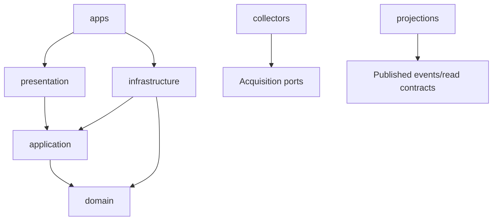
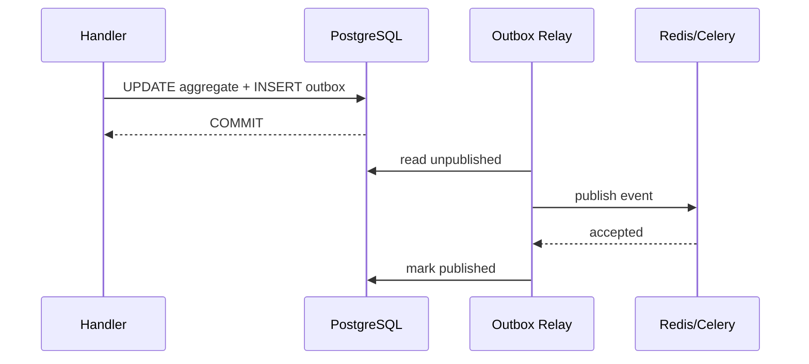
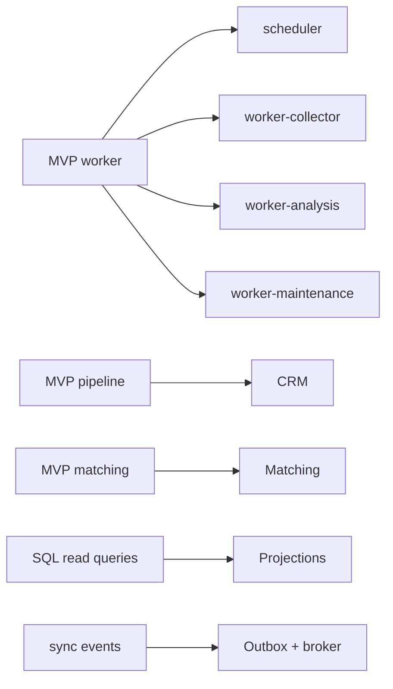

# Estrutura do projeto — versão final

## 1. Objetivo da organização final

A versão final preserva o monólito modular definido na arquitetura, mas passa a operar com processos especializados, processamento assíncrono, projeções de leitura, maior quantidade de adapters e domínios de suporte adicionais.

A estrutura precisa permitir:

- localizar rapidamente a responsabilidade de cada regra;
- impedir dependências indevidas entre bounded contexts;
- executar API, scheduler e workers com o mesmo núcleo de domínio;
- adicionar fontes sem alterar Acquisition;
- versionar prompts e schemas independentemente do código;
- reconstruir read models;
- evoluir processamento síncrono para assíncrono;
- testar cada camada de forma isolada;
- eventualmente separar um contexto em serviço sem remodelar todo o sistema.

O princípio central permanece:

> os limites de negócio são mais importantes que os limites de processo.

Scheduler, API e workers podem ser processos diferentes, mas não se tornam bounded contexts por causa disso.

---

## 2. Estrutura macro

```text
opportunity-radar/
├── apps/
│   ├── api/
│   ├── scheduler/
│   ├── outbox_relay/
│   ├── worker_collector/
│   ├── worker_analysis/
│   ├── worker_maintenance/
│   └── web/
│
├── src/opportunity_radar/
│   ├── profile/
│   ├── company_radar/
│   ├── acquisition/
│   ├── opportunities/
│   ├── matching/
│   ├── crm/
│   ├── outreach/
│   ├── proposals/
│   ├── interviews/
│   ├── automation/
│   ├── platform/
│   └── shared_kernel/
│
├── collectors/
│   ├── ats/
│   ├── aggregators/
│   ├── remote_boards/
│   ├── communities/
│   ├── rss/
│   └── manual/
│
├── prompts/
│   ├── opportunity_analysis/
│   ├── outreach/
│   ├── proposals/
│   └── interviews/
│
├── projections/
│   ├── opportunity_inbox/
│   ├── company_coverage/
│   ├── recommendation_detail/
│   ├── pipeline_board/
│   ├── followup_agenda/
│   └── operations_health/
│
├── migrations/
├── tests/
├── scripts/
├── docker/
├── monitoring/
├── docs/
├── compose.yaml
├── pyproject.toml
├── .env.example
└── Makefile
```

---

## 3. Visão das dependências



A seta representa conhecimento de código, não fluxo de execução.

A dependência arquitetural sempre aponta para dentro.

---

## 4. `apps/`: processos executáveis

A versão final possui mais processos físicos, cada um com composição própria.

### 4.1 `apps/api`

Responsável por:

- HTTP;
- commands síncronos rápidos;
- queries/read models;
- autenticação local/futura;
- publicação de intenção de trabalho assíncrono;
- health/readiness.

Não executa tarefas longas de coleta ou inferência na request.

### 4.2 `apps/scheduler`

Responsável por decidir **quando** tarefas recorrentes devem ser enfileiradas.

Exemplos:

- fontes vencidas para coleta;
- manutenção diária;
- verificação de fontes;
- follow-ups vencidos;
- backups;
- jobs de recalibração planejados.

Não implementa lógica específica de Greenhouse, score ou pipeline.

### 4.3 `apps/outbox_relay`

Processo responsável por:

1. buscar eventos/outbox ainda não publicados;
2. publicá-los no broker;
3. marcar publicação de forma idempotente;
4. aplicar retry/backoff;
5. registrar métricas de atraso.

Ele existe para desacoplar commit transacional da disponibilidade do Redis/Celery.

### 4.4 `apps/worker_collector`

Perfil I/O-bound.

Executa:

- coleta ATS/API/RSS;
- parsing;
- healthchecks externos;
- persistência de raw items por casos de uso;
- eventos para normalização.

### 4.5 `apps/worker_analysis`

Perfil limitado por CPU/GPU/RAM e throughput do modelo.

Executa:

- matching assíncrono;
- renderização de prompt;
- chamadas Ollama;
- validação estruturada;
- cache de análise;
- retries de inferência.

### 4.6 `apps/worker_maintenance`

Perfil de baixa prioridade.

Executa:

- expiração;
- limpeza de jobs antigos;
- retenção de raw items;
- rebuild de projeções;
- verificações de consistência;
- tarefas de backup auxiliares.

### 4.7 `apps/web`

SPA orientada a features, consumindo somente contratos HTTP/read models.

---

## 5. Estrutura padrão de bounded context

```text
context/
├── domain/
│   ├── model/
│   │   ├── aggregates.py
│   │   ├── entities.py
│   │   └── value_objects.py
│   ├── services/
│   ├── specifications/
│   ├── policies/
│   ├── events/
│   ├── ports/
│   └── errors.py
│
├── application/
│   ├── commands/
│   ├── queries/
│   ├── handlers/
│   ├── subscribers/
│   ├── dto/
│   ├── ports/
│   └── services/
│
├── infrastructure/
│   ├── persistence/
│   │   ├── models.py
│   │   ├── repositories.py
│   │   ├── mappers.py
│   │   └── query_services.py
│   ├── messaging/
│   ├── adapters/
│   └── config.py
│
└── presentation/
    └── http/
        ├── routes.py
        ├── schemas.py
        ├── dependencies.py
        └── error_mapping.py
```

A estrutura é uma referência, não uma obrigação de criar pastas vazias. Um contexto pequeno pode começar com menos arquivos e ser dividido quando crescer.

---

## 6. Regras de cada camada

### 6.1 Domain

Pode conhecer:

- stdlib;
- tipos do próprio domínio;
- elementos mínimos do shared kernel.

Não pode conhecer:

- framework web;
- ORM;
- broker;
- Redis;
- Celery;
- Ollama;
- filesystem concreto;
- parser de site.

### 6.2 Application

Pode conhecer:

- domain;
- application ports;
- DTOs publicados.

É responsável por:

- Unit of Work;
- orquestração;
- commands;
- queries;
- autorização de aplicação;
- idempotency semantics;
- chamadas a ports;
- integração entre contexts por contratos.

### 6.3 Infrastructure

Implementa detalhes concretos:

- SQLAlchemy;
- Redis;
- Celery;
- HTTPX;
- Ollama;
- arquivos;
- métricas;
- parsers;
- locks.

### 6.4 Presentation

É adaptador de entrada.

HTTP é apenas uma forma de chamar a application layer. Workers e subscribers também são adaptadores de entrada, mas ficam nos composition roots/messaging adapters adequados.

---

## 7. Estrutura por bounded context

### 7.1 Profile

```text
profile/
├── domain/
│   ├── model/
│   │   ├── career_profile.py
│   │   ├── skill.py
│   │   ├── experience.py
│   │   └── preferences.py
│   ├── events/
│   └── ports/
├── application/
│   ├── commands/
│   ├── queries/
│   └── handlers/
├── infrastructure/persistence/
└── presentation/http/
```

Autoridade:

- versões do perfil;
- skills declaradas;
- experiência;
- preferências.

Não é responsável por calcular score de vaga.

### 7.2 Company Radar

Responsável por identidade de empresas e seus endpoints de carreira.

Possíveis componentes:

```text
company_radar/domain/services/company_identity_resolver.py
company_radar/application/commands/register_company_source.py
company_radar/application/queries/list_company_coverage.py
```

### 7.3 Acquisition

Possui ports que abstraem coletores.

```text
acquisition/
├── domain/
│   ├── model/source_definition.py
│   ├── model/source_run.py
│   └── model/raw_item.py
├── application/
│   ├── commands/run_source.py
│   ├── handlers/run_source.py
│   └── ports/collector.py
└── infrastructure/
    └── persistence/
```

### 7.4 Opportunities

Responsável pela identidade canônica da vaga.

É onde vivem:

- merge;
- fingerprint;
- source occurrences;
- lifecycle de oportunidade;
- normalização canônica.

### 7.5 Matching

Separado fisicamente na versão final.

```text
matching/
├── domain/
│   ├── model/match_assessment.py
│   ├── model/match_factor.py
│   ├── specifications/
│   ├── policies/
│   └── services/match_score_calculator.py
├── application/
│   ├── commands/assess_opportunity.py
│   ├── handlers/assess_opportunity.py
│   └── ports/semantic_analyzer.py
└── infrastructure/
    └── adapters/ollama/
```

### 7.6 CRM

Responsável por:

- application process;
- contatos;
- estágio;
- histórico;
- follow-ups;
- entrevistas agendadas como compromisso do pipeline.

### 7.7 Outreach

Responsável por comunicação assistida.

Separação importante:

```text
DraftGenerated != MessageSent
```

Gerar texto, aprovar texto e registrar envio são fatos diferentes.

### 7.8 Proposals

Responsável por proposta comercial/contratual quando aplicável:

- escopo;
- preço;
- moeda;
- milestones;
- versões;
- status.

### 7.9 Interviews

Responsável por preparação e simulação:

- sessão;
- perguntas;
- respostas;
- rubrica;
- feedback;
- conclusão.

### 7.10 Automation

Responsável por semântica técnica de execução:

- job definition;
- job execution;
- retry;
- lease/lock;
- dead letter;
- schedule metadata.

Não conhece detalhes do que é uma “boa vaga”.

### 7.11 Platform

Responsabilidades técnicas transversais:

- outbox;
- inbox/idempotency;
- auditoria;
- configuração;
- clock;
- correlation IDs;
- health;
- logging bootstrap.

---

## 8. Shared kernel mínimo

O `shared_kernel` precisa permanecer pequeno para evitar acoplamento entre domínios.

### 8.1 Permitido

```text
EntityId
UtcClock
Money
CurrencyCode
Page
PageRequest
DomainEvent
CorrelationId
```

### 8.2 Evitar

```text
Skill
JobTitle
Seniority
ApplicationStage
CompanyStatus
OpportunityStatus
```

Mesmo que dois contextos usem a palavra `Seniority`, o significado pode divergir. Compartilhar automaticamente cria acoplamento semântico.

### 8.3 Critério para adicionar algo

Um tipo só entra no shared kernel quando:

1. tem o mesmo significado em todos os contextos;
2. é estável;
3. não pertence claramente a uma autoridade de dados específica;
4. duplicá-lo criaria risco maior que compartilhá-lo.

---

## 9. Contratos publicados entre contextos

Nenhum contexto deve depender da implementação interna de outro.

Contratos podem ser organizados como:

```text
context/application/contracts/
├── events.py
├── snapshots.py
└── queries.py
```

Exemplos:

```text
ProfileSnapshotV1
CompanySourceDTOv1
CollectedItemV1
OpportunitySnapshotV1
ApplicationStartedV1
InterviewScheduledV1
```

### 9.1 Versionamento

Mudança compatível pode manter versão.

Mudança quebradora cria novo contrato:

```text
OpportunitySnapshotV1
OpportunitySnapshotV2
```

A migração pode manter ambos temporariamente.

---

## 10. Collectors como plugins de infraestrutura

```text
collectors/
├── registry.py
├── contracts.py
├── ats/
│   ├── greenhouse/
│   │   ├── collector.py
│   │   ├── parser.py
│   │   ├── schemas.py
│   │   └── fixtures/
│   ├── lever/
│   └── ashby/
├── aggregators/
├── remote_boards/
├── communities/
├── rss/
└── manual/
```

### 10.1 Cada plugin declara

- `source_type`;
- versão do adapter;
- capabilities;
- autenticação;
- rate limit sugerido;
- retry classification;
- parser version;
- healthcheck;
- descoberta/coleta.

### 10.2 Contract tests

Todos os collectors precisam passar pela mesma suíte de contrato:

```text
retorna external identity quando disponível
preserva raw payload
normaliza URL
trata vazio explicitamente
classifica 429 como retryable
não persiste diretamente
não calcula Opportunity
```

---

## 11. Prompts como artefatos versionados

```text
prompts/
├── opportunity_analysis/
│   ├── v1/
│   ├── v2/
│   └── v3/
├── outreach/
│   ├── first_contact/v1/
│   └── follow_up/v1/
├── proposals/
│   └── draft/v1/
└── interviews/
    ├── question_generation/v1/
    └── feedback/v1/
```

Estrutura por versão:

```text
v3/
├── system.md
├── user.md.j2
├── output.schema.json
├── examples.json
├── metadata.yaml
└── tests/
```

### 11.1 Regras

- prompt nunca vive como string longa dentro de handler;
- output operacional sempre possui schema;
- metadata registra propósito e compatibilidade;
- mudar semântica cria versão;
- versões antigas permanecem disponíveis para reprodução histórica;
- exemplos fazem parte do artefato testável.

---

## 12. Projections e read models

Na versão final, consultas de dashboard podem ser independentes da modelagem transacional.

```text
projections/
├── base/
│   ├── checkpoint.py
│   └── projector.py
├── opportunity_inbox/
│   ├── projector.py
│   ├── model.py
│   └── query.py
├── company_coverage/
├── recommendation_detail/
├── pipeline_board/
├── followup_agenda/
└── operations_health/
```

### 12.1 Propriedades

Uma projeção:

- recebe fatos/eventos;
- atualiza apenas seu read model;
- pode ser reconstruída;
- possui checkpoint;
- deve ser idempotente;
- não chama comportamento de aggregate root.

### 12.2 Rebuild

```text
truncate read model
→ reset checkpoint
→ replay eventos/fatos necessários
→ validar contagens/checksum
→ marcar ready
```

Read model temporariamente indisponível não deve corromper o estado transacional.

---

## 13. Messaging

Estrutura sugerida:

```text
platform/infrastructure/messaging/
├── publisher.py
├── consumer.py
├── serialization.py
├── retry.py
└── headers.py
```

Headers mínimos:

```text
event_id
correlation_id
causation_id
event_type
event_version
occurred_at
producer
```

### 13.1 Consumers

Cada consumer deve ser:

- idempotente;
- pequeno;
- observável;
- capaz de classificar erro retryable/permanent;
- independente de ordem global quando possível.

---

## 14. Transactional outbox

A persistência de mudança de domínio e outbox ocorre na mesma transação.



A estrutura de código pode ficar em `platform`, mas os eventos continuam pertencendo ao contexto que os originou.

---

## 15. Migrations organizadas por contexto

Um único Alembic pode continuar sendo usado, porém os nomes e branches devem deixar a autoria clara.

Exemplo:

```text
migrations/versions/
├── profile/
├── company_radar/
├── acquisition/
├── opportunities/
├── matching/
├── crm/
└── platform/
```

Se a ferramenta/fluxo adotado não permitir subpastas de forma simples, usar prefixo de contexto no nome da revision.

### 15.1 Regra de ownership

Cada migration altera preferencialmente tabelas do próprio contexto.

Mudanças transversais exigem revisão arquitetural.

---

## 16. Organização dos testes finais

```text
tests/
├── unit/
│   ├── profile/
│   ├── company_radar/
│   ├── acquisition/
│   ├── opportunities/
│   ├── matching/
│   └── crm/
├── integration/
├── contract/
│   ├── collectors/
│   ├── events/
│   └── http/
├── architecture/
├── projection/
├── resilience/
└── e2e/
```

### 16.1 Architecture tests

Devem verificar automaticamente:

- `domain` não importa framework;
- presentation não importa persistence concreta;
- um contexto não importa `infrastructure` de outro;
- collectors não importam repositories concretos;
- workers não implementam regra de domínio;
- shared kernel não cresce sem controle;
- prompts não estão hardcoded.

### 16.2 Resilience tests

Cenários:

- Redis indisponível;
- Ollama indisponível;
- source 429;
- parser alterado;
- worker morto após commit;
- evento duplicado;
- retry excedido;
- lock expirado.

---

## 17. `monitoring/`

```text
monitoring/
├── prometheus/
│   └── prometheus.yml
├── dashboards/
├── alerts/
└── queries/
```

Mesmo em ambiente local, artefatos de observabilidade devem ser versionados.

Métricas prioritárias:

- source run success/failure;
- itens coletados;
- oportunidades novas;
- dedupe ratio;
- queue depth;
- outbox lag;
- analysis latency;
- Ollama failures;
- retries;
- DLQ size;
- projection lag.

---

## 18. `scripts/`

Scripts continuam sendo adapters de operação.

Exemplos:

```text
scripts/
├── doctor.py
├── backup.py
├── restore_check.py
├── rebuild_projection.py
├── replay_outbox.py
├── requeue_dead_letter.py
├── verify_collectors.py
└── export_audit.py
```

Regra:

> script chama application services ou portas operacionais; não replica regra de negócio.

---

## 19. Docker e arquivos de execução

```text
docker/
├── api.Dockerfile
├── scheduler.Dockerfile
├── worker.Dockerfile
├── web.Dockerfile
├── ollama/
│   └── init.sh
└── entrypoints/
```

O mesmo image build de backend pode ser reutilizado por API/scheduler/workers alterando o comando de entrada, desde que isso simplifique manutenção.

---

## 20. Regras de import entre bounded contexts

### 20.1 Permitido

```python
from opportunity_radar.profile.application.contracts import ProfileSnapshotV1
```

### 20.2 Não permitido

```python
from opportunity_radar.profile.infrastructure.models import ProfileModel
```

### 20.3 Também evitar

```python
from opportunity_radar.profile.domain.model import CareerProfile
```

quando outro contexto pretende manipular o agregado diretamente.

O consumidor deve receber snapshot/DTO/fato necessário, preservando ownership.

---

## 21. Regras de ownership de escrita

| Schema/contexto | Escritor autorizado |
| --- | --- |
| `profile` | Profile |
| `company_radar` | Company Radar |
| `acquisition` | Acquisition |
| `opportunities` | Opportunities |
| `matching` | Matching |
| `crm` | CRM |
| `outreach` | Outreach |
| `proposals` | Proposals |
| `interviews` | Interviews |
| `automation` | Automation |
| `platform` | Platform |

Uma projeção pode manter tabela/read schema próprio, mas não atualizar tabelas transacionais de outro contexto.

---

## 22. Evolução de pacote para serviço independente

A estrutura foi desenhada para permitir extração futura, mas isso não deve ocorrer por estética arquitetural.

Um bounded context só se torna candidato real a serviço quando houver evidência de:

- necessidade de escala independente;
- perfil de recursos muito diferente;
- disponibilidade independente;
- segurança/isolation boundary;
- ciclo de deploy autônomo;
- equipe proprietária independente.

### 22.1 Preparação necessária

Antes de extrair:

- contratos publicados estáveis;
- nenhum import de infraestrutura cruzado;
- ownership de dados claro;
- eventos versionados;
- testes de contrato;
- observabilidade própria.

---

## 23. Anti-patterns estruturais

### 23.1 Bounded context por tecnologia

`database/`, `api/`, `redis/` não são domínios.

### 23.2 Shared kernel gigante

Transforma separação de contextos em aparência apenas.

### 23.3 Event soup

Nem toda função precisa publicar evento. Eventos representam fatos relevantes para desacoplamento, histórico ou reação externa ao agregado.

### 23.4 Repository genérico universal

CRUD genérico elimina intenção de domínio.

### 23.5 Acoplamento via banco

“Está no mesmo PostgreSQL” não significa “qualquer módulo pode escrever em qualquer tabela”.

### 23.6 Workers como segunda aplicação

Workers executam casos de uso já existentes; não possuem regras paralelas.

### 23.7 Projections como fonte de verdade

Read models são reconstruíveis e nunca substituem dados transacionais oficiais.

---

## 24. Estrutura mínima de um novo bounded context

Ao criar um contexto novo, responder primeiro:

1. qual problema de negócio ele resolve?
2. qual linguagem própria possui?
3. qual dado ele controla?
4. quais invariantes protege?
5. quem consome seus contratos?
6. ele realmente precisa ser um bounded context?

Depois criar apenas o necessário:

```text
context/
├── domain/
├── application/
├── infrastructure/
└── presentation/  # somente se tiver entrada HTTP própria
```

---

## 25. Critérios de qualidade da estrutura final

A organização final é considerada saudável quando:

- cada regra possui um dono claro;
- cada tabela possui um contexto escritor claro;
- nenhuma infraestrutura externa invade o domínio;
- todos os processos executáveis reutilizam application handlers;
- adapters são testáveis por contrato;
- eventos possuem versão e ownership;
- projeções podem ser reconstruídas;
- shared kernel permanece pequeno;
- workers podem ser replicados sem alterar regra de domínio;
- prompts são versionados e reproduzíveis;
- uma eventual extração de serviço exige mudar infraestrutura, não semântica central.

---

## 26. Mapeamento MVP → versão final



A evolução deve ser incremental. Não há necessidade de migrar todas essas peças simultaneamente.

---

## 27. Resultado esperado

A estrutura final deve funcionar como um mapa operacional e de desenvolvimento. Um novo contributor — ou o próprio mantenedor meses depois — deve conseguir responder apenas olhando a árvore e os contratos:

- onde implementar uma regra;
- onde criar um adapter;
- onde adicionar um novo job;
- onde versionar um prompt;
- qual contexto possui um dado;
- que dependências são proibidas;
- como um processo reage a um evento;
- como reconstruir uma projeção;
- como crescer sem transformar o monólito em um “big ball of mud”.
