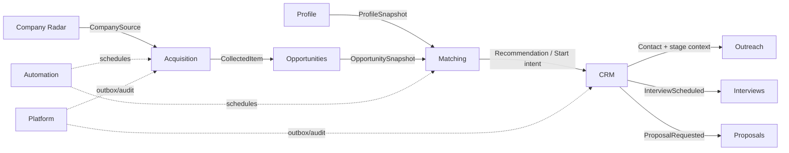
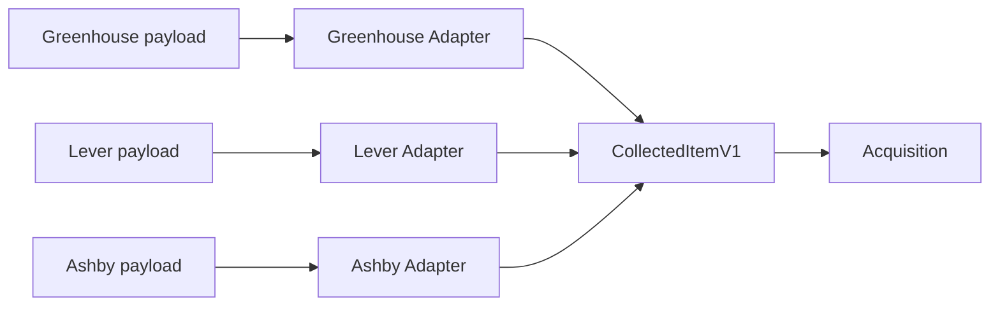
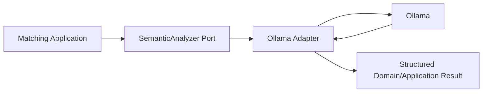
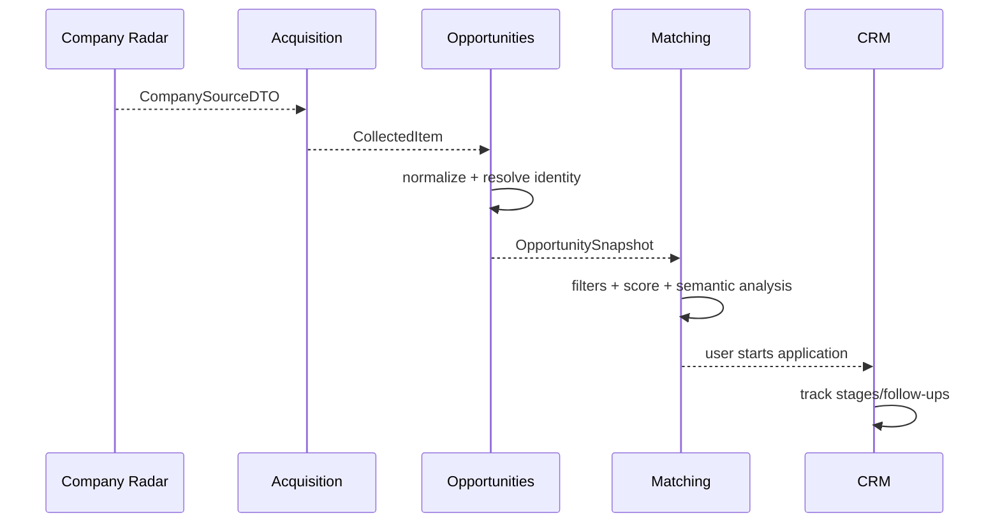
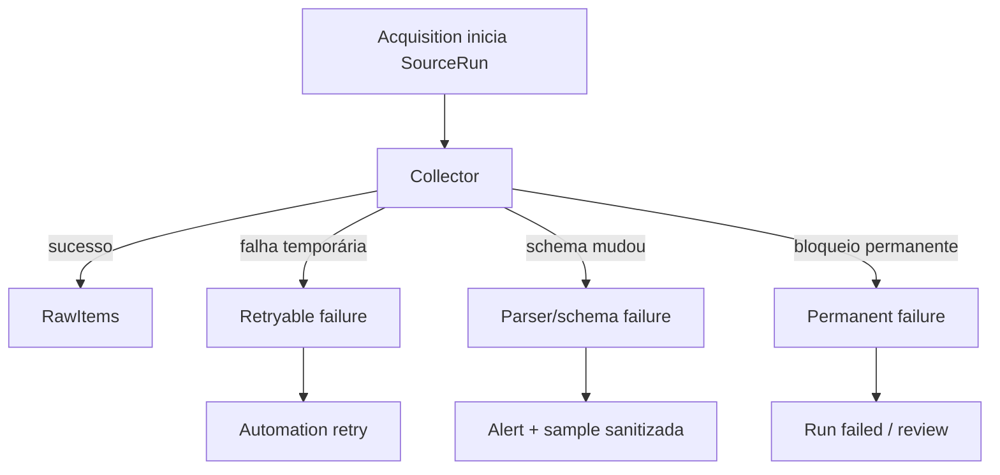
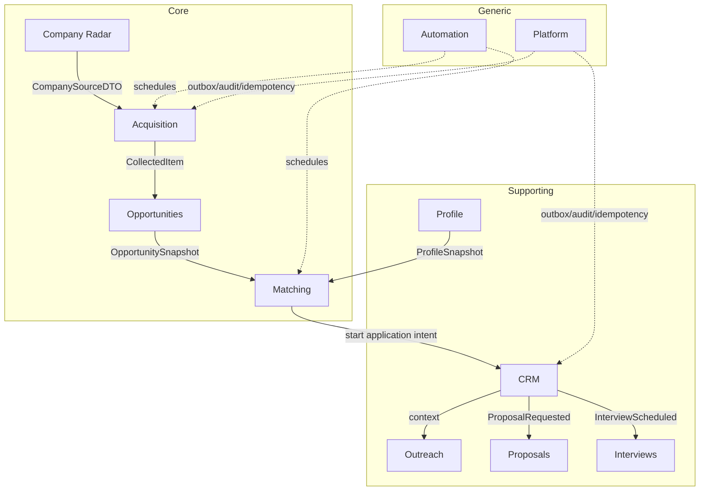

# DDD estratégico e Context Map

## 1. Objetivo do DDD estratégico

O DDD estratégico do Opportunity Radar define **onde ficam as fronteiras de negócio**, qual parte realmente diferencia o produto, quem é autoridade sobre cada conceito e de que forma os contextos se integram sem compartilhar modelos internos.

Este documento não descreve classes ou tabelas específicas. Ele responde primeiro às perguntas:

- quais problemas de negócio existem no sistema;
- quais deles formam o core do produto;
- quais conceitos precisam de linguagem própria;
- onde um mesmo termo muda de significado;
- qual contexto é upstream/downstream;
- quais dados pertencem a quem;
- como impedir que formatos de ATS, IA ou infraestrutura contaminem o domínio;
- quando usar consistência forte ou eventual.

A modelagem tática detalhada aparece no documento de DDD tático.

---

## 2. Domínio do produto

O Opportunity Radar não é apenas um agregador de vagas.

O problema que ele resolve é:

> transformar um conjunto intencional de empresas e fontes em um fluxo contínuo de oportunidades consolidadas, rastreáveis, avaliadas contra um perfil versionado e organizadas para ação humana.

Isso possui quatro desafios centrais:

1. descobrir oportunidades relevantes em origens heterogêneas;
2. transformar aparições diferentes na mesma vaga canônica;
3. decidir de forma explicável se a oportunidade faz sentido;
4. preservar contexto suficiente para agir e acompanhar o resultado.

A arquitetura deve proteger principalmente esses quatro pontos.

---

## 3. Classificação dos subdomínios

### 3.1 Core Domain

O core representa capacidades que justificam o produto e que merecem a maior atenção de modelagem.

#### Aquisição orientada a empresas

Não é apenas “baixar vagas”.

O sistema conhece um radar próprio de empresas, seus endpoints e prioridade, e decide como consultar cada origem respeitando capacidades e limites.

#### Normalização e identidade de oportunidades

Fontes diferentes descrevem a mesma vaga de maneiras distintas. O sistema precisa conservar procedência e, ao mesmo tempo, produzir identidade canônica utilizável.

#### Matching explicável

O sistema precisa separar:

- elegibilidade objetiva;
- score determinístico;
- análise semântica auxiliar;
- evidência;
- inferência;
- ausência de informação.

#### Priorização

O valor não está em acumular milhares de vagas, mas em reduzir o conjunto para itens que merecem atenção.

### 3.2 Supporting Subdomains

São importantes para completar a experiência, mas não constituem o principal diferencial algorítmico.

- Profile;
- CRM;
- Outreach;
- Proposals;
- Interviews.

Eles merecem boa modelagem porque mantêm estado e regras próprias, porém podem evoluir depois do slice central.

### 3.3 Generic Subdomains

São capacidades técnicas ou amplamente conhecidas:

- scheduling;
- filas;
- retries;
- dead-letter;
- auditoria;
- autenticação local/futura;
- logs;
- métricas;
- backup;
- healthchecks.

Essas capacidades devem ser reutilizadas ou implementadas de forma convencional. Não faz sentido investir nelas como se fossem o diferencial do produto.

---

## 4. Heurística para decidir se algo pertence ao Core

Uma capacidade tende a ser Core quando responde “sim” a várias perguntas:

- mudar essa regra altera diretamente a qualidade das recomendações?
- existe conhecimento específico acumulado nesse ponto?
- o comportamento precisa ser ajustado à estratégia pessoal de busca?
- uma implementação genérica perde valor importante?
- erros aqui geram decisões erradas, não apenas indisponibilidade técnica?

Exemplo:

```text
Redis retry policy → Generic
OpportunityIdentityResolver → Core
MatchScoreCalculator → Core
HTTP pagination helper → Generic
Company priority → Supporting/Core boundary depending on use
```

---

## 5. Bounded Contexts

A versão final possui os seguintes bounded contexts:

| Contexto | Tipo predominante | Missão |
| --- | --- | --- |
| Profile | Supporting | representar identidade profissional e preferências versionadas |
| Company Radar | Core/Supporting | manter radar canônico de empresas e endpoints conhecidos |
| Acquisition | Core | executar fontes e preservar fatos brutos de coleta |
| Opportunities | Core | construir e manter a oportunidade canônica |
| Matching | Core | avaliar elegibilidade, aderência e prioridade |
| CRM | Supporting | acompanhar candidaturas, contatos, estágios e follow-ups |
| Outreach | Supporting | produzir e registrar comunicações assistidas |
| Proposals | Supporting | estruturar propostas, escopo, preço e versões |
| Interviews | Supporting | organizar preparação, simulação e feedback |
| Automation | Generic | coordenar jobs, leases, retries e DLQ |
| Platform | Generic | capacidades técnicas transversais e auditoria |

A classificação não significa prioridade de código absoluta. Um contexto Supporting pode ser necessário cedo, mas não deve ditar o desenho do Core.

---

## 6. Profile Context

### 6.1 Responsabilidade

Profile representa o estado profissional usado pelo restante do sistema para avaliação.

Controla:

- perfil de carreira;
- skills declaradas;
- experiências;
- projetos;
- preferências de trabalho;
- preferências geográficas;
- tipos de contrato;
- disponibilidade/timezone;
- versões do perfil;
- versões de currículo quando necessário.

### 6.2 O que não controla

Profile não controla:

- requisitos de uma vaga;
- score;
- oportunidade;
- candidatura;
- fonte de coleta.

### 6.3 Fronteira semântica importante

`Skill` no Profile significa uma competência atribuída ao perfil.

No Matching, a mesma palavra pode aparecer como uma exigência interpretada da vaga. O consumidor não deve manipular diretamente a entidade Skill do Profile; ele recebe snapshot adequado.

---

## 7. Company Radar Context

### 7.1 Responsabilidade

Mantém a identidade canônica das empresas de interesse.

Controla:

- Company;
- aliases;
- domínio;
- prioridade;
- status no radar;
- endpoint de carreira conhecido;
- tecnologia provável do careers page;
- verificações do endpoint;
- origem da empresa no catálogo.

### 7.2 Relação com a antiga base Notion

A base do Notion é uma **origem de migração**, não uma autoridade permanente.

Após reconciliação das 186 empresas:

```text
Notion export
    ↓
Company Radar
    ↓
fonte oficial local
```

O domínio não deve depender de um `notion_page_id` para possuir identidade.

### 7.3 O que não controla

Company Radar conhece **onde procurar**, não executa coleta nem cria vagas.

---

## 8. Acquisition Context

### 8.1 Responsabilidade

Acquisition transforma uma SourceDefinition em fatos brutos observados.

Controla:

- SourceDefinition;
- SourceRun;
- RawItem;
- cursor/checkpoint;
- estado da execução;
- métricas da coleta;
- erros de fonte;
- capabilities declaradas.

### 8.2 Conceito-chave

Acquisition responde:

> “o que esta fonte devolveu nesta execução?”

Não responde:

> “qual é a identidade canônica desta vaga?”

Essa separação é crítica para permitir reprocessamento.

### 8.3 Benefício da fronteira

Se uma regra de normalização melhorar amanhã, RawItem pode ser reprocessado sem repetir a chamada ao ATS.

---

## 9. Opportunities Context

### 9.1 Responsabilidade

Opportunities transforma ocorrências em uma representação canônica.

Controla:

- Opportunity;
- SourceOccurrence;
- fingerprint;
- merge;
- status editorial/lifecycle;
- dados canônicos de título/localização/modalidade;
- evidências que sustentam esses dados.

### 9.2 Pergunta do contexto

> “que oportunidade única o sistema acredita estar representada por estas ocorrências?”

### 9.3 Não controla

- aderência ao usuário;
- estágio de candidatura;
- comunicação;
- execução da fonte.

Uma vaga pode ser excelente ou péssima para o usuário e ainda ser a mesma Opportunity.

---

## 10. Matching Context

### 10.1 Responsabilidade

Matching avalia uma Opportunity contra uma versão de Profile.

Controla:

- MatchAssessment;
- factors;
- disqualifiers;
- missing requirements;
- score;
- verdict;
- confidence;
- rule version;
- prompt/model version quando houver análise semântica.

### 10.2 Pergunta do contexto

> “considerando este perfil e estas regras, quanto esta oportunidade faz sentido e por quê?”

### 10.3 Imutabilidade histórica

Um assessment antigo não deve mudar silenciosamente quando:

- o perfil muda;
- um peso muda;
- o prompt muda;
- o modelo muda.

Uma nova avaliação é criada.

---

## 11. CRM Context

### 11.1 Responsabilidade

CRM passa a ser autoridade quando o usuário decide agir sobre uma oportunidade.

Controla:

- ApplicationProcess;
- Contact;
- StageHistory;
- FollowUp;
- próxima ação;
- notas relacionadas ao processo;
- compromissos do pipeline.

### 11.2 Separação essencial

```text
Opportunity.status != ApplicationProcess.stage
```

Uma Opportunity pode continuar aberta enquanto uma candidatura foi rejeitada.

Da mesma forma, uma Opportunity pode ser fechada no site enquanto o processo de candidatura ainda possui entrevista agendada.

---

## 12. Outreach Context

### 12.1 Responsabilidade

Controla o ciclo de comunicação assistida:

```text
intent
→ draft
→ review
→ approved
→ sent/registered
→ response
```

### 12.2 Regra de segurança

A geração de texto não equivale a envio.

O domínio precisa representar estados separados para impedir automação acidental.

---

## 13. Proposals Context

Responsável por propostas relacionadas a oportunidades que exigem negociação ou escopo.

Controla:

- Proposal;
- versões;
- moeda;
- itens/escopo;
- milestones;
- validade;
- status de emissão/aceite.

Uma proposta pertence ao contexto de negociação, não ao Matching.

---

## 14. Interviews Context

Responsável pela preparação estruturada para entrevistas.

Controla:

- SimulationSession;
- question set;
- answers;
- rubrica;
- feedback;
- áreas a revisar;
- conclusão da sessão.

Não altera assessments históricos para “melhorar” o score depois de uma entrevista.

---

## 15. Automation Context

Automation modela execução técnica persistente.

Controla:

- JobDefinition;
- JobExecution;
- schedule;
- lock/lease;
- retry state;
- DLQ;
- prioridade.

### 15.1 Fronteira

Automation sabe:

> “executar o job `collect_source` com payload X”.

Não precisa saber:

> “Greenhouse tem localização Y ou vaga Z”.

Esse detalhe pertence aos contexts/adapters acionados.

---

## 16. Platform Context

Platform reúne capacidades técnicas compartilhadas que precisam de estado próprio.

Exemplos:

- transactional outbox;
- idempotency records/inbox;
- audit log;
- feature/config flags locais;
- correlation metadata.

Ele não é um “contexto coringa”. Regra de negócio que não cabe em Platform deve voltar ao domínio correto.

---

## 17. Linguagem ubíqua

A linguagem abaixo deve ser usada de forma consistente em código, banco, UI e documentação.

### 17.1 Aquisição

| Termo | Definição |
| --- | --- |
| Source | configuração de uma origem consultável |
| Source Type | família técnica do adapter, como `greenhouse` ou `lever` |
| Company Source | endpoint de carreira associado a uma empresa |
| Source Run | tentativa delimitada de executar uma Source |
| Raw Item | conteúdo original coletado, preservado para auditoria/reprocessamento |
| Checkpoint | posição segura para continuar uma coleta incremental |
| Collector | adapter capaz de executar determinada fonte |
| Capability | operação que um Collector declara suportar |

### 17.2 Oportunidades

| Termo | Definição |
| --- | --- |
| Source Occurrence | aparição observada de uma oportunidade em determinada fonte |
| Opportunity | representação canônica consolidada |
| Fingerprint | sinal calculado usado para identidade/deduplicação |
| Merge | consolidação de ocorrências em uma Opportunity existente |
| Evidence | fato rastreável a origem específica |
| Inference | conclusão derivada por regra ou IA |
| Canonical Field | valor escolhido como representação principal entre evidências |

### 17.3 Matching

| Termo | Definição |
| --- | --- |
| Match Assessment | avaliação versionada entre Opportunity e Profile |
| Hard Filter | regra objetiva que pode impedir recomendação |
| Disqualifier | incompatibilidade confirmada |
| Match Factor | componente ponderado do score |
| Match Score | resultado determinístico normalizado |
| Verdict | classificação operacional resultante |
| Missing Requirement | requisito identificado como ausente no perfil |
| Unknown | informação insuficiente para concluir verdadeiro/falso |
| Confidence | confiança na evidência/interpretação, não no valor pessoal do candidato |

### 17.4 CRM

| Termo | Definição |
| --- | --- |
| Application Process | processo de candidatura associado a uma Opportunity |
| Application Stage | etapa atual do processo |
| Stage History | histórico imutável de transições |
| Follow-up | ação futura planejada |
| Contact | pessoa/canal vinculado ao processo |
| Next Action | próxima ação concreta esperada |

### 17.5 IA

| Termo | Definição |
| --- | --- |
| Semantic Analysis | interpretação estruturada executada por modelo |
| Prompt Version | versão imutável do artefato de instrução |
| Model Version | modelo/configuração usados na inferência |
| Structured Result | saída validada contra schema |

---

## 18. Termos que não devem ser misturados

### 18.1 Raw Item versus Opportunity

```text
Raw Item = fato bruto da fonte
Opportunity = interpretação canônica do domínio
```

### 18.2 Evidence versus Inference

```text
"Remote - Brazil" no payload = Evidence
"aceita candidato residente no Brasil" = pode ser Inference
```

A UI e persistência devem preservar essa diferença.

### 18.3 Opportunity versus Application Process

```text
Opportunity = vaga
Application Process = relação do usuário com a vaga
```

### 18.4 Score versus Verdict

Score é quantitativo; verdict é decisão operacional baseada em score + constraints.

### 18.5 Closed versus Rejected

`CLOSED` pode pertencer à Opportunity.

`REJECTED` pertence ao processo de candidatura.

---

## 19. Context Map



As ligações pontilhadas representam suporte técnico, não dependência de linguagem de negócio.

---

## 20. Relações entre contextos

| Upstream | Downstream | Padrão | Contrato principal | Motivo |
| --- | --- | --- | --- | --- |
| Profile | Matching | Customer/Supplier | `ProfileSnapshotV1` | Matching precisa de visão estável do perfil |
| Company Radar | Acquisition | Published Language | `CompanySourceDTOv1` | Acquisition precisa saber como localizar a fonte |
| Acquisition | Opportunities | Anticorruption Layer | `CollectedItemV1` | formatos externos não entram em Opportunities |
| Opportunities | Matching | Published Language | `OpportunitySnapshotV1` | assessment não manipula agregado Opportunity |
| Matching | CRM | Open Host Service | recommendation/start application | CRM começa após decisão de agir |
| CRM | Outreach | Customer/Supplier | contact/stage context | mensagem depende do contexto do processo |
| CRM | Interviews | Domain Event | `InterviewScheduledV1` | preparação reage a compromisso real |
| CRM | Proposals | Domain Event | `ProposalRequestedV1` | proposta nasce de necessidade no processo |

---

## 21. Explicação dos padrões usados

### 21.1 Customer/Supplier

O downstream possui necessidades claras e o upstream fornece contrato adequado sem entregar seu modelo interno.

Exemplo: Matching precisa de um snapshot do Profile preparado para avaliação.

### 21.2 Published Language

Existe um contrato explícito, estável e versionado.

Exemplo:

```text
OpportunitySnapshotV1
```

Esse contrato é a linguagem de integração, não a estrutura das tabelas.

### 21.3 Anticorruption Layer

Usado onde modelos externos são inconsistentes com o domínio interno.

ATSs podem representar localização como:

- string;
- lista;
- escritório;
- departamento;
- metadata arbitrária.

O adapter/ACL traduz para um contrato interno controlado.

### 21.4 Open Host Service

Um contexto oferece uma interface de aplicação estável para ações comuns de consumidores.

CRM pode expor um caso de uso para iniciar candidatura sem permitir que Matching altere suas tabelas.

### 21.5 Domain Event

O downstream reage a um fato que já ocorreu.

Exemplo:

```text
InterviewScheduled
```

Interviews pode criar/preparar uma sessão sem CRM chamá-lo por acoplamento direto.

---

## 22. Anticorruption Layer das fontes externas



### 22.1 O que a ACL deve esconder

- nomes específicos de campos;
- paginação particular;
- formas específicas de autenticação;
- inconsistências de null/empty;
- schemas de departamentos;
- códigos próprios de localização;
- identificadores internos que não tenham semântica fora da fonte.

### 22.2 O que deve preservar

- external ID;
- URL;
- payload bruto;
- timestamp observado;
- fonte;
- cursor/checkpoint;
- evidências úteis.

---

## 23. Anticorruption Layer do Ollama

Ollama também é externo ao domínio.



O domínio não conhece:

- endpoint `/api/chat`;
- parâmetros específicos do runtime;
- formato bruto do provider;
- texto livre do modelo.

O adapter precisa:

1. renderizar prompt versionado;
2. executar inferência;
3. validar schema;
4. traduzir resposta para tipos internos;
5. classificar falha.

---

## 24. Autoridade dos dados

### 24.1 Matriz de ownership

| Dado | Autoridade |
| --- | --- |
| perfil e preferências | Profile |
| identidade da empresa | Company Radar |
| endpoint conhecido da empresa | Company Radar |
| configuração de fonte | Acquisition |
| execução da fonte | Acquisition |
| payload bruto | Acquisition |
| identidade canônica da vaga | Opportunities |
| estado editorial da vaga | Opportunities |
| score/verdict | Matching |
| estágio da candidatura | CRM |
| rascunho/mensagem | Outreach |
| versão da proposta | Proposals |
| sessão de preparação | Interviews |
| retry/lease/DLQ | Automation |
| outbox/auditoria | Platform |

### 24.2 Regra

Se dois contextos precisam do mesmo dado, um continua sendo autoridade. O outro mantém:

- referência;
- snapshot;
- projeção;
- cache derivado.

Não surge uma segunda fonte de verdade.

---

## 25. Snapshots e reprodutibilidade

Algumas decisões precisam ser reproduzidas no futuro.

Exemplo: MatchAssessment.

Se ele dependesse sempre do Profile atual, alterar uma skill hoje mudaria implicitamente a interpretação de uma avaliação feita meses atrás.

Por isso, Matching registra referência/versionamento suficiente:

```text
assessment
├── opportunity_snapshot/version
├── profile_version
├── scoring_rule_version
├── prompt_version
└── model/config version
```

O snapshot existe por necessidade histórica, não para duplicar ownership.

---

## 26. Consistência dentro de um contexto

Operações que protegem invariantes do mesmo agregado são fortemente consistentes.

Exemplos:

- registrar ocorrência sem duplicá-la;
- alterar stage de candidatura;
- publicar nova versão de Proposal;
- concluir SimulationSession.

Commit acontece de forma atômica no Unit of Work correspondente.

---

## 27. Consistência entre contextos

Entre contexts, preferir integração explícita e consistência eventual quando o processo não exige atomicidade global.

Exemplo:

```text
Opportunity criada
→ commit
→ evento
→ Matching agenda avaliação
```

Não é necessário que criação e análise Ollama estejam na mesma transação.

Benefícios:

- IA pode falhar sem perder a vaga;
- worker pode ser reiniciado;
- retries são possíveis;
- responsabilidades permanecem separadas.

---

## 28. O que não deve ser uma transação distribuída

Evitar operação tentando garantir atomicamente:

```text
salvar Opportunity
+ calcular MatchAssessment
+ chamar Ollama
+ criar CRM
+ gerar mensagem
```

Esse fluxo possui dependências externas e etapas independentes. Ele deve ser uma saga/processo composto por estados duráveis e eventos.

---

## 29. Eventos de integração versus eventos internos

### 29.1 Domain Event interno

Pode carregar objetos/conceitos ricos usados apenas dentro do contexto.

### 29.2 Integration Event

É contrato publicado e precisa ser mais conservador.

Exemplo:

```json
{
  "event_type": "OpportunityCreated",
  "event_version": 1,
  "opportunity_id": "...",
  "occurred_at": "..."
}
```

O consumidor busca detalhes via snapshot/query quando necessário.

Isso reduz acoplamento à estrutura completa do agregado.

---

## 30. Fronteira Command versus Event

### Command

Expressa intenção:

```text
AssessOpportunity
StartApplication
ScheduleFollowUp
```

Pode ser rejeitado.

### Event

Expressa fato:

```text
OpportunityAssessed
ApplicationStarted
FollowUpScheduled
```

Não deve ser nomeado como algo que ainda precisa acontecer.

---

## 31. Fluxo estratégico principal



Cada seta cruza uma fronteira de contexto por contrato explícito.

---

## 32. Fluxo de falha: fonte externa



Nenhum desses estados altera diretamente a identidade de uma Opportunity existente.

---

## 33. Fluxo de falha: análise de IA

```text
Opportunity válida
→ hard filters passam
→ score determinístico salvo/calculável
→ Ollama falha
→ semantic analysis = pending/retryable
→ Opportunity continua visível
```

Essa decisão arquitetural mantém o sistema útil mesmo sem IA.

---

## 34. Política de integração síncrona versus assíncrona

### Preferir síncrono quando

- a operação é rápida;
- o usuário precisa da resposta imediatamente;
- não há dependência externa lenta;
- a consistência imediata é parte da regra.

### Preferir assíncrono quando

- existe chamada externa;
- operação pode ser repetida;
- falha temporária é esperada;
- throughput precisa ser controlado;
- usuário não precisa aguardar.

Exemplos:

| Operação | Modo esperado |
| --- | --- |
| alterar preferência | síncrono |
| iniciar candidatura | síncrono |
| coletar 186 empresas | assíncrono |
| analisar com Ollama | assíncrono preferencial |
| rebuild de projeção | assíncrono |
| listar inbox | síncrono/read model |

---

## 35. Context boundary versus processo físico

Um erro comum seria concluir:

```text
worker-analysis = Matching bounded context
```

Não necessariamente.

O worker é um **deployment/runtime boundary**.

Matching é um **semantic/domain boundary**.

O mesmo worker-analysis pode executar handlers de Matching e Interviews, desde que isso seja operacionalmente adequado, sem fundir os dois domínios.

---

## 36. Context boundary versus schema PostgreSQL

Schemas refletem os bounded contexts para facilitar ownership, mas não são o motivo da fronteira.

A fronteira existe mesmo se todos os dados estiverem no mesmo banco.

```text
bounded context → regra/linguagem/ownership
schema → mecanismo físico de organização
```

---

## 37. Context boundary versus página da UI

Uma tela pode consumir vários contextos.

Exemplo: Opportunity Detail pode mostrar:

- Opportunity;
- MatchAssessment;
- Company;
- ApplicationProcess.

Isso não significa juntar os domínios.

A read layer compõe dados para visualização sem transferir ownership.

---

## 38. Regras para novas integrações

Antes de conectar dois contextos, responder:

1. quem é a autoridade do dado?
2. o consumidor precisa de command, query, snapshot ou event?
3. a integração precisa ser síncrona?
4. qual dado mínimo cruza a fronteira?
5. esse contrato precisa ser versionado?
6. existe risco de contaminar linguagem?
7. como a operação reage a duplicidade?
8. como reage a atraso/falha?

---

## 39. Regras para criar um novo bounded context

Não criar contexto novo apenas porque surgiu uma nova pasta ou biblioteca.

Criar quando houver:

- linguagem própria;
- invariantes próprias;
- lifecycle próprio;
- autoridade de dados própria;
- necessidade de evolução independente.

Se a diferença for apenas técnica, provavelmente pertence a Infrastructure/Automation/Platform.

---

## 40. Evolução do MVP

No MVP:

- Matching pode compartilhar pacote físico próximo de Opportunities;
- Pipeline é um recorte reduzido de CRM;
- eventos internos podem ser síncronos;
- Automation é simples;
- queries podem acessar views SQL diretamente.

Mesmo assim, preservar:

- namespaces;
- tabelas/schemas coerentes;
- DTOs;
- ownership;
- linguagem.

Isso permite evoluir sem mudar semântica pública.

---

## 41. Mapeamento MVP → versão final

| MVP | Final | Evolução |
| --- | --- | --- |
| Companies | Company Radar | amplia verificação e sinais |
| Acquisition | Acquisition | mantém fronteira, ganha workers/retries |
| Opportunities + Matching próximo | contexts separados | extração física preservando contrato |
| Pipeline | CRM | adiciona contacts/follow-ups/histórico amplo |
| worker único | Automation + workers | orquestração especializada |
| eventos síncronos | outbox/eventos | consistência eventual controlada |

---

## 42. Anti-patterns estratégicos

### 42.1 Shared database integration

Um contexto não deve integrar com outro simplesmente lendo/escrevendo suas tabelas internas.

### 42.2 God Context

Evitar um contexto `jobs` ou `core` que conhece tudo.

### 42.3 Model leakage

Não deixar `GreenhouseJob`, `LeverPosting` ou resposta Ollama virarem conceitos do core.

### 42.4 CRUD-driven domain

A linguagem deve expressar ações reais:

```text
register occurrence
merge opportunity
assess opportunity
start application
advance stage
```

não somente:

```text
create row
update row
```

### 42.5 Event-driven por moda

Não publicar evento para toda mudança interna. Evento existe quando há valor de desacoplamento, histórico ou reação.

### 42.6 Duplicação de autoridade

Não permitir `application_stage` simultaneamente em Opportunities e CRM como duas fontes editáveis.

---

## 43. Decisões estratégicas consolidadas

1. O core é descoberta orientada ao radar + identidade + matching explicável.
2. Notion é origem de migração, não contexto permanente.
3. ATSs e Ollama são protegidos por ACL/adapters.
4. Opportunity e Application Process são conceitos diferentes.
5. Evidência e inferência permanecem distinguíveis.
6. Assessments são versionados e historicamente reproduzíveis.
7. Context ownership continua válido mesmo em banco único.
8. Integrações cross-context usam contratos publicados, não modelos internos.
9. Processos longos adotam consistência eventual.
10. Infraestrutura técnica não define bounded contexts.

---

## 44. Critérios de aceite do DDD estratégico

A modelagem estratégica está adequada quando é possível responder sem ambiguidade:

- quem controla cada dado principal;
- em que contexto uma nova regra deve entrar;
- qual linguagem deve ser usada em cada fronteira;
- qual diferença existe entre RawItem, SourceOccurrence e Opportunity;
- qual diferença existe entre Opportunity status e ApplicationStage;
- como Profile chega ao Matching sem compartilhar agregado;
- como um ATS é traduzido sem contaminar domínio;
- como Ollama é substituível;
- quando usar chamada síncrona e quando usar evento;
- como o MVP evolui para a versão final sem redefinir conceitos.

---

## 45. Context Map de referência final



Este mapa deve ser usado como referência para revisar novas dependências durante a implementação.
