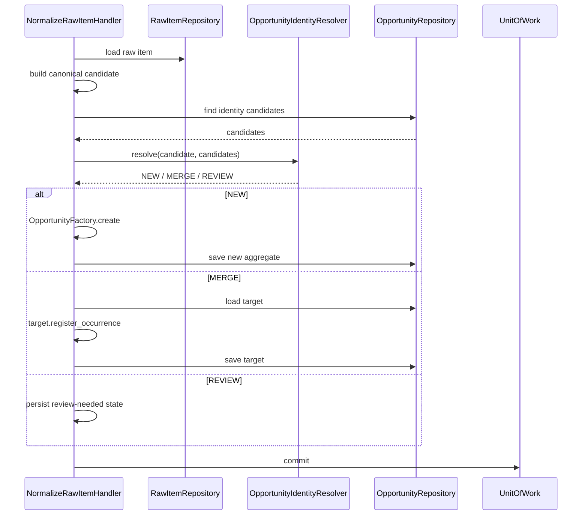
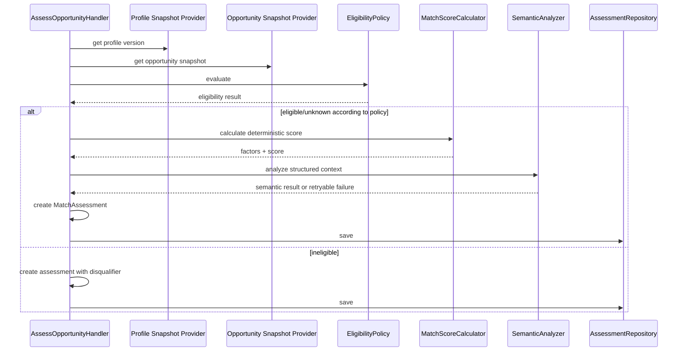
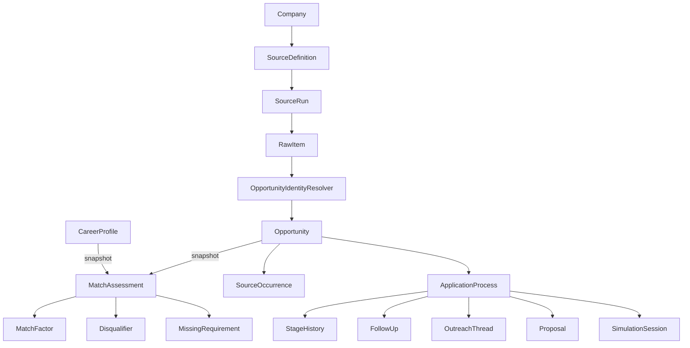

# DDD tático

## 1. Objetivo

O DDD tático traduz as fronteiras definidas pelo DDD estratégico em modelos que possam ser implementados e testados.

O foco é definir:

- aggregate roots;
- entidades;
- value objects;
- invariantes;
- domain services;
- policies;
- specifications;
- repository ports;
- factories;
- domain events relevantes;
- erros;
- regras de concorrência e persistência.

O objetivo não é produzir um modelo “purista”, mas impedir que regras centrais sejam espalhadas por routes, workers, parsers ou SQL.

---

## 2. Princípios táticos

### 2.1 Agregados protegem consistência

Um aggregate não é um grupo arbitrário de tabelas relacionadas. Ele define uma fronteira em que invariantes precisam ser mantidas atomicamente.

### 2.2 Agregados devem ser pequenos

Evitar carregar grafo inteiro de empresa → vagas → assessments → candidaturas.

Relacionamentos entre agregados usam IDs.

### 2.3 Value objects validam semântica

Um `MatchScore` inválido não deve existir esperando uma validação posterior.

### 2.4 Application orquestra; Domain decide

Handler decide sequência e transação.

Aggregate/domain service decide regra de negócio.

### 2.5 External systems não entram no domínio

O aggregate não chama:

- PostgreSQL;
- HTTP;
- Ollama;
- Redis;
- ATS.

---

## 3. Catálogo de aggregate roots

| Aggregate root | Contexto | Responsabilidade central |
| --- | --- | --- |
| `CareerProfile` | Profile | manter uma versão coerente do perfil profissional |
| `Company` | Company Radar | identidade e fontes conhecidas da empresa |
| `SourceDefinition` | Acquisition | configuração executável da origem |
| `SourceRun` | Acquisition | lifecycle de uma tentativa de coleta |
| `Opportunity` | Opportunities | identidade canônica e suas ocorrências |
| `MatchAssessment` | Matching | resultado versionado de avaliação |
| `ApplicationProcess` | CRM | lifecycle da candidatura |
| `OutreachThread` | Outreach | lifecycle de comunicação assistida |
| `Proposal` | Proposals | versões e estado de proposta |
| `SimulationSession` | Interviews | sessão de preparação/simulação |
| `JobExecution` | Automation | execução persistente e retry técnico |

Nem toda tabela precisa ser aggregate root. Muitas são entidades internas, histórico ou read model.

---

## 4. Aggregate `CareerProfile`

### 4.1 Identidade

```text
CareerProfileId
```

Uma versão de perfil pode possuir seu próprio `ProfileVersionId` quando o histórico for materializado separadamente.

### 4.2 Estado conceitual

```text
CareerProfile
├── id
├── version_number
├── status
├── skills[]
├── experiences[]
├── projects[]
├── preferences
└── resume_references[]
```

### 4.3 Invariantes

- uma versão publicada é imutável para fins históricos;
- somente uma versão pode ser considerada ativa;
- skills não se repetem pelo identificador canônico dentro da versão;
- intervalos de experiência precisam ser temporalmente válidos;
- preferência de timezone precisa formar janela válida;
- faixa de compensação mínima não pode ser maior que máxima quando ambas existirem;
- modalidade/contrato devem pertencer à taxonomia suportada.

### 4.4 Comportamentos

```text
add_skill
remove_skill
replace_preferences
add_experience
publish_version
archive
```

Atualizações relevantes podem produzir nova versão em vez de alterar histórico usado por assessments.

### 4.5 Eventos possíveis

```text
CareerProfileCreated
CareerProfileVersionPublished
CareerProfileActivated
CareerPreferencesChanged
```

Nem toda alteração interna precisa gerar integration event.

---

## 5. Entidades e value objects de Profile

### 5.1 `Skill`

Entidade quando possui identidade/taxonomia própria dentro do perfil.

Possíveis atributos:

```text
skill_id
canonical_name
level
last_used_at
experience_months
source
```

### 5.2 `SkillLevel`

Value object.

Pode encapsular uma taxonomia explícita, evitando strings livres incompatíveis.

### 5.3 `DateRange`

Invariantes:

- start obrigatório;
- end >= start;
- end ausente representa período aberto.

### 5.4 `EmploymentPreference`

Pode agrupar:

- work modes aceitos;
- contracts aceitos;
- regiões;
- países;
- compensation floor;
- relocation;
- visa/sponsorship constraints.

### 5.5 `TimezoneWindow`

Representa janela de trabalho aceitável e regras de sobreposição.

---

## 6. Aggregate `Company`

### 6.1 Responsabilidade

Representar identidade canônica de uma organização no radar, independentemente de quantos nomes ou endpoints externos possua.

### 6.2 Estrutura

```text
Company
├── id
├── canonical_name
├── domain
├── aliases[]
├── priority
├── radar_status
├── sources[]
└── verification_state
```

### 6.3 Invariantes

- canonical name não vazio;
- alias normalizado não pode se repetir dentro da empresa;
- alias igual ao canonical name normalizado é redundante;
- domínio, quando informado, precisa ser sintaticamente válido;
- mesma combinação de endpoint/source type não deve aparecer duplicada;
- source marcada ativa precisa possuir configuração mínima válida;
- prioridade pertence ao conjunto aceito.

### 6.4 Comportamentos

```text
rename
add_alias
remove_alias
register_source
verify_source
change_priority
archive_from_radar
reactivate
```

### 6.5 Identidade entre empresas

Decidir se dois registros representam a mesma empresa pode exigir `CompanyIdentityResolver`, porque a regra pode comparar domínio, aliases e evidências externas e não pertence inteiramente a uma instância isolada.

---

## 7. `CompanySource`

Entidade interna de Company quando o lifecycle é controlado pelo radar.

Pode conter:

```text
source_id
source_type
endpoint
external_key
status
confidence
last_verified_at
verification_method
```

Se a execução e scheduling crescerem, a configuração operacional correspondente pertence a Acquisition como `SourceDefinition` referenciada por ID, evitando transformar Company em dono de runs.

---

## 8. Aggregate `SourceDefinition`

### 8.1 Responsabilidade

Representa uma origem que pode ser executada por Acquisition.

### 8.2 Estado

```text
SourceDefinition
├── id
├── source_type
├── target/company_source_id
├── config
├── schedule
├── capabilities
├── rate_limit_policy
├── status
└── checkpoint_policy
```

### 8.3 Invariantes

- `source_type` precisa possuir adapter registrado/suportado;
- configuração obrigatória depende do tipo;
- schedule precisa ser válido;
- rate limit não pode ser negativo;
- uma fonte desativada não deve ser considerada due;
- capability solicitada precisa ser suportada pelo adapter;
- segredo não deve ser armazenado como config pública em claro quando houver autenticação futura.

### 8.4 Comportamentos

```text
activate
deactivate
update_schedule
record_health
mark_degraded
advance_checkpoint
```

O checkpoint só deve avançar após persistência segura dos itens correspondentes.

---

## 9. Aggregate `SourceRun`

`SourceRun` merece identidade própria porque possui lifecycle, métricas e erros independentes da definição da fonte.

### 9.1 Estados sugeridos

```text
PENDING
RUNNING
SUCCEEDED
PARTIAL
FAILED
CANCELLED
```

### 9.2 Invariantes

- run finalizada não volta para RUNNING;
- `started_at` precede `finished_at`;
- success exige ausência de erro fatal;
- contadores não podem ser negativos;
- erro mantém categoria estruturada;
- run pertence exatamente a uma SourceDefinition.

### 9.3 Métricas de domínio/aplicação

```text
items_seen
items_persisted
items_skipped
items_invalid
http_requests
retry_count
```

Nem toda métrica operacional precisa viver dentro do aggregate; métricas Prometheus permanecem infraestrutura.

---

## 10. `RawItem`

RawItem pode ser entidade append-only associada ao SourceRun em persistência, sem precisar fazer parte do aggregate carregado em memória.

Propriedades:

- imutável após persistência, exceto metadata técnica controlada;
- conserva payload original;
- possui hash;
- registra external identity quando conhecida;
- registra observed_at;
- referencia parser/adapter version.

O objetivo é reprocessabilidade.

---

## 11. Aggregate `Opportunity`

### 11.1 Responsabilidade

Controlar a identidade canônica de uma vaga e o conjunto de ocorrências que sustentam essa identidade.

### 11.2 Estrutura conceitual

```text
Opportunity
├── id
├── fingerprint
├── canonical_title
├── canonical_company_id
├── location
├── work_mode
├── seniority
├── contract_type
├── compensation
├── description
├── lifecycle_status
├── published_at
├── expires_at
└── occurrences[]
```

### 11.3 Invariantes

- fingerprint precisa obedecer à versão de algoritmo registrada;
- ocorrência não pode ser registrada duas vezes pela mesma identidade externa;
- toda Opportunity possui pelo menos uma evidência/origem quando não for entrada manual deliberada;
- canonical fields precisam manter referência/evidência quando derivados de fonte;
- fechamento não apaga ocorrências;
- merge não destrói procedência;
- estado deve seguir transições válidas;
- published/expires dates precisam ser temporalmente coerentes quando ambas existem.

### 11.4 Comportamentos

```text
register_occurrence
update_canonical_fields
merge_evidence
mark_open
mark_closed
mark_expired
refresh_from_occurrences
```

---

## 12. `SourceOccurrence`

Entidade dentro do lifecycle de Opportunity.

Possui identidade que pode ser composta por:

```text
source_definition_id + external_id
```

ou fallback controlado quando external ID não existe.

Campos possíveis:

```text
source_occurrence_id
source_id
raw_item_id
external_id
url
observed_at
first_seen_at
last_seen_at
source_published_at
```

### 12.1 Regra

Atualizar `last_seen_at` da mesma occurrence não cria uma nova Opportunity.

---

## 13. Value objects de Opportunities

### 13.1 `JobTitle`

Pode armazenar:

- original;
- normalized;
- family;
- inferred seniority separadamente quando aplicável.

O value object não deve esconder se algo é inferido.

### 13.2 `Location`

Precisa representar mais do que uma string quando a informação existe:

```text
country
region/state
city
raw_label
remote_scope
```

### 13.3 `WorkMode`

Taxonomia possível:

```text
REMOTE
HYBRID
ONSITE
UNKNOWN
```

`UNKNOWN` não significa `ONSITE`.

### 13.4 `Seniority`

Precisa suportar desconhecido/ambíguo, evitando reprovação automática por falta de dado.

### 13.5 `ContractType`

Taxonomia controlada com capacidade de preservar raw evidence.

### 13.6 `Compensation`

Value object com:

- min;
- max;
- currency;
- period;
- gross/net quando conhecido;
- evidence source.

Não usar float para dinheiro.

### 13.7 `OpportunityFingerprint`

Não é apenas uma string hash.

Semanticamente deve carregar:

- valor;
- algorithm_version.

Assim, mudanças no algoritmo de dedupe são rastreáveis.

---

## 14. `OpportunityIdentityResolver`

Domain service usado porque resolver identidade compara uma nova ocorrência com oportunidades candidatas.

Entrada conceitual:

```text
CanonicalCandidate
KnownOpportunities
IdentityPolicyVersion
```

Saída:

```text
NEW
MERGE(opportunity_id, confidence, reasons)
REVIEW(candidates, reasons)
```

### 14.1 Sinais possíveis

- external ID dentro da mesma fonte;
- canonical company;
- URL normalizada;
- título normalizado;
- localização;
- descrição/hash;
- published date;
- similarity lexical.

### 14.2 Regra de segurança

Baixa confiança não deve forçar merge destrutivo. Deve gerar revisão ou oportunidade separada conforme política.

---

## 15. Aggregate `MatchAssessment`

### 15.1 Responsabilidade

Representar uma avaliação imutável/reproduzível entre Opportunity e Profile.

### 15.2 Estrutura

```text
MatchAssessment
├── id
├── opportunity_id
├── profile_version_id
├── rule_version
├── score
├── verdict
├── factors[]
├── disqualifiers[]
├── missing_requirements[]
├── semantic_analysis
├── prompt_version
├── model_version
└── assessed_at
```

### 15.3 Invariantes

- score entre 0 e 100;
- fatores precisam usar versão conhecida de pesos;
- contribuição total deve ser matematicamente coerente;
- `INELIGIBLE` exige pelo menos um disqualifier confirmado;
- assessment publicado não é alterado retroativamente;
- semantic analysis ausente não invalida score determinístico;
- prompt/model metadata só é exigida quando IA foi usada;
- EvidenceReference precisa apontar para evidência conhecida ou snapshot válido.

---

## 16. `MatchFactor`

Entidade/parte imutável do assessment.

```text
code
weight
raw_score
weighted_score
confidence
explanation
evidence_refs[]
missing_state
```

### 16.1 Invariante matemática

```text
0 <= raw_score <= 1
0 <= weight <= 1
weighted_score = raw_score * weight
```

Política explícita define tratamento de fator sem dados.

---

## 17. `Disqualifier`

Representa incompatibilidade objetiva confirmada.

Exemplos:

```text
WORK_AUTHORIZATION_REQUIRED
ONSITE_INCOMPATIBLE
COUNTRY_NOT_ALLOWED
CONTRACT_NOT_ACCEPTED
```

Deve registrar:

- code;
- explanation;
- evidence;
- confidence/confirmation state.

Ausência de informação não é disqualifier.

---

## 18. `MissingRequirement`

Representa uma lacuna identificada sem necessariamente tornar a vaga inelegível.

Exemplo:

```text
required_skill = "Kubernetes"
profile_match = false
importance = required
source = evidence reference
```

Pode influenciar fator tecnológico, mas permanece distinto de hard disqualifier.

---

## 19. `EligibilityPolicy`

Domain service/policy que combina specifications.

```text
EligibilityPolicy
├── ActiveOpportunitySpec
├── RemoteCompatibilitySpec
├── CountryAllowedSpec
├── WorkAuthorizationSpec
├── TimezoneCompatibilitySpec
├── SeniorityCompatibilitySpec
└── ContractCompatibilitySpec
```

Saída não deve ser apenas boolean.

Exemplo:

```text
EligibilityResult
├── state: ELIGIBLE | INELIGIBLE | UNKNOWN
├── disqualifiers[]
├── unknowns[]
└── evidence[]
```

---

## 20. `MatchScoreCalculator`

Recebe fatores já avaliados ou calcula fatores por policies específicas.

Deve ser determinístico para mesma entrada + mesma rule version.

Exemplo conceitual:

```python
result = calculator.calculate(
    profile=profile_snapshot,
    opportunity=opportunity_snapshot,
    policy=scoring_policy_v3,
)
```

Saída:

```text
score
factor_results
verdict_candidate
```

A análise do Ollama pode complementar explicação/classificação sem substituir o cálculo determinístico principal.

---

## 21. Specifications

Specifications encapsulam regras booleanas/ternárias explicáveis.

### 21.1 Contrato conceitual

```python
class Specification(Protocol[T]):
    def evaluate(self, candidate: T) -> SpecificationResult: ...
```

### 21.2 Resultado

```text
SpecificationResult
├── state: TRUE | FALSE | UNKNOWN
├── reason_code
├── explanation
└── evidence_refs[]
```

### 21.3 Composição

```text
Eligible = Active
       AND RemoteCompatible
       AND CountryAllowed
       AND WorkAuthorizationCompatible
       AND SeniorityCompatible
       AND ContractCompatible
```

A composição deve preservar razões de cada filho em vez de retornar somente `False`.

---

## 22. Quando usar Specification, Policy ou Domain Service

### Specification

Use para uma condição avaliável e combinável.

```text
CountryAllowed
```

### Policy

Use para uma decisão que pode variar conforme configuração/versão.

```text
MissingFactorScoringPolicy
```

### Domain Service

Use quando uma operação de domínio envolve múltiplos objetos e não pertence naturalmente a uma entidade.

```text
OpportunityIdentityResolver
```

Evitar transformar qualquer função em “service” por conveniência.

---

## 23. Aggregate `ApplicationProcess`

### 23.1 Responsabilidade

Controlar a trajetória do usuário em relação a uma Opportunity.

### 23.2 Estrutura

```text
ApplicationProcess
├── id
├── opportunity_id
├── profile_version_id
├── stage
├── status
├── started_at
├── stage_history[]
├── contacts[]
├── followups[]
└── next_action
```

### 23.3 Invariantes

- apenas uma candidatura ativa por Opportunity/Profile quando essa for a política configurada;
- estágio só muda por transição permitida;
- toda mudança de estágio cria histórico;
- timestamp de histórico não retrocede;
- candidatura terminal não avança sem reabertura explícita;
- next action concluída não permanece como pendente;
- ContactHandle precisa ser válido para o Channel correspondente quando exigido.

---

## 24. `ApplicationStage`

Value object/enumeration de domínio evolutiva.

Exemplo inicial:

```text
SAVED
APPLIED
RECRUITER_CONTACT
SCREENING
TECHNICAL
MANAGER_INTERVIEW
FINAL_INTERVIEW
OFFER
HIRED
REJECTED
WITHDRAWN
```

A máquina de estados oficial deve ficar no documento de workflows; aqui a regra é que transições sejam protegidas pelo aggregate/policy.

---

## 25. `StageHistory`

Entidade append-only.

```text
from_stage
to_stage
changed_at
reason
actor
metadata
```

Não editar histórico para refletir “estado atual”. O estado atual está no root e o histórico documenta como chegou nele.

---

## 26. `FollowUp`

Entidade com lifecycle próprio dentro do processo ou aggregate separado se crescer significativamente.

Campos:

```text
due_at
channel
purpose
status
completed_at
snoozed_until
```

Invariantes:

- due date válida;
- concluído possui completed_at;
- cancelled não reaparece como due;
- snooze deve estar no futuro no momento da ação.

---

## 27. `ApplicationTransitionPolicy`

Centraliza regras de transição que não devem ficar espalhadas em controllers.

Exemplo:

```text
APPLIED → SCREENING        allowed
SCREENING → TECHNICAL      allowed
TECHNICAL → OFFER          allowed if policy permits skipped stages
HIRED → SCREENING          denied
REJECTED → APPLIED         requires explicit reopen/new process
```

A política pode retornar razão de rejeição.

---

## 28. `FollowUpPlanner`

Domain service que calcula sugestão de próxima ação usando:

- stage;
- último contato;
- canal;
- resposta recebida;
- política de follow-up.

Ele não envia mensagem.

Saída:

```text
SuggestedFollowUp
├── due_at
├── channel
├── purpose
└── rationale
```

---

## 29. Aggregate `OutreachThread`

### 29.1 Estrutura

```text
OutreachThread
├── id
├── application_process_id
├── contact_ref
├── channel
├── messages[]
└── thread_status
```

### 29.2 Invariantes

- thread possui contato/canal definidos;
- draft não é sent;
- mensagem precisa ser aprovada quando a política exigir;
- timestamp de envio só existe para item enviado/registrado;
- resposta externa referencia thread válida.

### 29.3 Estados de mensagem

```text
DRAFT
READY_FOR_REVIEW
APPROVED
SENT
FAILED
RECEIVED
```

Automação humana-in-the-loop deve estar refletida no domínio, não apenas na UI.

---

## 30. Aggregate `Proposal`

### 30.1 Estrutura

```text
Proposal
├── id
├── application_process_id
├── versions[]
├── status
└── current_version
```

### 30.2 `ProposalVersion`

Pode conter:

- version number;
- scope;
- line items;
- total;
- currency;
- milestones;
- validity;
- created_at.

### 30.3 Invariantes

- versão emitida é imutável;
- total deve corresponder aos itens segundo política;
- moeda é consistente dentro da versão;
- número de versão aumenta monotonicamente;
- accepted/rejected referencia versão emitida.

---

## 31. Aggregate `SimulationSession`

### 31.1 Responsabilidade

Representar uma sessão coerente de preparação de entrevista.

### 31.2 Estrutura

```text
SimulationSession
├── id
├── application_process_id
├── opportunity_snapshot_id
├── session_type
├── questions[]
├── answers[]
├── feedback
└── status
```

### 31.3 Invariantes

- resposta pertence a pergunta da sessão;
- pergunta não pode ser respondida duas vezes sem revision semantics;
- sessão concluída exige feedback mínimo quando a política definir;
- prompt/model version usados em geração/feedback são registrados;
- conclusão não altera respostas históricas.

---

## 32. Aggregate `JobExecution`

Automation precisa modelar execução de forma persistente para retry seguro.

### 32.1 Estados

```text
PENDING
LEASED
RUNNING
RETRY_WAIT
SUCCEEDED
FAILED
DEAD_LETTER
CANCELLED
```

### 32.2 Invariantes

- lease possui expiration;
- worker só conclui execução que possui lease válido ou ownership reconhecido;
- retry count não excede policy sem ir a estado terminal/DLQ;
- execução concluída não retorna a RUNNING;
- idempotency key é estável para a mesma intenção quando aplicável.

---

## 33. Repositórios

Existe repository por aggregate root quando persistência é necessária.

### 33.1 Exemplos

```python
class OpportunityRepository(Protocol):
    async def get(self, opportunity_id: UUID) -> Opportunity | None: ...
    async def find_identity_candidates(self, candidate: IdentityCandidate) -> list[Opportunity]: ...
    async def save(self, opportunity: Opportunity) -> None: ...
```

```python
class ApplicationProcessRepository(Protocol):
    async def get(self, process_id: UUID) -> ApplicationProcess | None: ...
    async def find_active_for_opportunity(self, opportunity_id: UUID) -> ApplicationProcess | None: ...
    async def save(self, process: ApplicationProcess) -> None: ...
```

### 33.2 Métodos orientados ao domínio

Preferir:

```text
find_active_for_opportunity
find_identity_candidates
find_due_sources
```

em vez de repository genérico expor:

```text
filter(**kwargs)
delete_where(...)
raw_query(...)
```

### 33.3 Queries de tela

Paginação complexa e joins de dashboard pertencem a query services/read models, não aos repositories de aggregate.

---

## 34. Unit of Work

A aplicação usa Unit of Work para delimitar transação.

Contrato conceitual:

```python
class UnitOfWork(Protocol):
    opportunities: OpportunityRepository
    applications: ApplicationProcessRepository

    async def __aenter__(self): ...
    async def __aexit__(self, *args): ...
    async def commit(self): ...
    async def rollback(self): ...
```

### 34.1 Regra

Um handler não deve chamar `session.commit()` diretamente.

### 34.2 Escopo

Uma Unit of Work deve cobrir a operação que precisa ser atomicamente consistente, não um workflow externo inteiro.

---

## 35. Factories

Factories são úteis quando criar um aggregate exige mais do que chamar construtor simples.

Exemplo:

```text
OpportunityFactory.from_collected_item(...)
MatchAssessmentFactory.create(...)
```

Factory pode:

- gerar ID;
- validar dados obrigatórios;
- criar value objects;
- registrar evento inicial.

Não deve realizar HTTP ou query escondida.

---

## 36. Domain Events

Aggregate pode acumular eventos durante comportamento.

Exemplo:

```python
opportunity.register_occurrence(occurrence)
# aggregate records OpportunityOccurrenceRegistered
```

Após persistência, application layer coleta eventos e decide publicação/processamento.

Eventos relevantes:

```text
OpportunityCreated
OpportunityOccurrenceRegistered
OpportunityMerged
OpportunityClosed
MatchAssessmentCompleted
ApplicationStarted
ApplicationStageChanged
FollowUpScheduled
InterviewScheduled
ProposalRequested
```

Os contratos detalhados pertencem ao documento de eventos/CQRS.

---

## 37. Invariantes em domínio versus banco

Regras críticas são protegidas em duas camadas quando possível.

### 37.1 Domínio

Garante intenção e mensagem de erro adequada.

Exemplo:

```text
não permitir transição HIRED → SCREENING
```

### 37.2 PostgreSQL

Protege contra concorrência, bugs e scripts.

Exemplo:

- unique constraint por source + external ID;
- check score 0–100;
- unique active application quando modelável;
- foreign keys apropriadas;
- version para optimistic locking.

O banco não substitui o aggregate, e o aggregate não substitui constraints.

---

## 38. Optimistic locking

Agregados mutáveis importantes possuem `version` de persistência.

Fluxo:

```text
SELECT aggregate version=4
→ domínio altera
→ UPDATE ... SET version=5 WHERE id=? AND version=4
→ rows affected = 0 => ConflictError
```

Isso protege updates concorrentes sem lock pessimista permanente.

Candidatos:

- Company;
- SourceDefinition;
- Opportunity;
- ApplicationProcess;
- OutreachThread.

Objetos append-only normalmente não precisam do mesmo mecanismo.

---

## 39. Idempotência

Idempotência não deve depender apenas de “consultar antes e depois inserir”.

### 39.1 Exemplos

- `RawItem`: unique source/run/external identity ou hash adequado;
- `SourceOccurrence`: unique source + external ID;
- comandos externos: idempotency key;
- consumers: processed event/inbox key;
- assessment: chave natural versionada quando reprocessamento idêntico não deve duplicar.

### 39.2 Regra

Constraints são a última defesa contra corrida concorrente.

---

## 40. Erros de domínio e aplicação

### 40.1 `DomainError`

Violação de regra semântica.

Exemplo:

```text
InvalidApplicationTransition
InvalidCompensationRange
DuplicateAlias
```

### 40.2 `ConflictError`

Concorrência ou unicidade.

Exemplo:

```text
AggregateVersionConflict
ActiveApplicationAlreadyExists
```

### 40.3 `NotFoundError`

Referência esperada não existe.

### 40.4 `ExternalSourceError`

Erro de adapter traduzido para categoria interna.

Não deve carregar detalhes do provider até o domínio.

### 40.5 `RetryableError`

Indica explicitamente que repetir pode fazer sentido.

### 40.6 `PermanentExternalError`

Indica que retry automático não deve continuar sem mudança externa/configuração.

---

## 41. Result objects versus exceptions

Nem toda decisão negativa é exceção.

Exemplo:

```text
EligibilityResult(INELIGIBLE)
```

é resultado normal de negócio.

Por outro lado:

```text
MatchScore(140)
```

é estado impossível e deve falhar.

Heurística:

- resultado esperado do fluxo → Result/estado;
- violação de invariante/programming contract → exception de domínio;
- falha técnica externa → exception classificada na borda/application.

---

## 42. Null versus Unknown

O domínio precisa distinguir:

```text
não aplicável
não informado
não encontrado
inferido como desconhecido
```

Especialmente para matching.

Não usar `None` indiscriminadamente quando o estado possui impacto de negócio.

Exemplo:

```text
WorkAuthorizationRequirement.UNKNOWN
```

é semanticamente diferente de `NOT_REQUIRED`.

---

## 43. Evidência como referência

`EvidenceReference` deve apontar para origem rastreável, sem copiar payload inteiro em cada aggregate.

Pode conter:

```text
source_type
raw_item_id
field/path
excerpt_hash
observed_at
```

A implementação exata depende do modelo de dados, mas o domínio precisa conseguir explicar a origem de decisões relevantes.

---

## 44. Confidence

`Confidence` é um value object normalizado.

Exemplo:

```text
0.0 <= value <= 1.0
```

Deve ser usado apenas quando existe inferência/heurística com incerteza real.

Não transformar todo fato determinístico em “confidence 1.0” se isso não agrega valor.

---

## 45. Versionamento de regras

Decisões reproduzíveis usam value objects/identificadores de versão:

```text
RuleVersion("matching-v3")
FingerprintAlgorithmVersion("fp-v2")
PromptVersion("opportunity-analysis-v4")
TaxonomyVersion("skills-v1")
```

O código que produz o resultado pode evoluir, mas o registro histórico precisa identificar a semântica aplicada.

---

## 46. Exemplo completo: registrar item coletado



A decisão de identidade está no domínio; SQLAlchemy apenas a persiste.

---

## 47. Exemplo completo: avaliar oportunidade



Ollama não decide sozinho se o aggregate é válido.

---

## 48. Exemplo completo: avançar candidatura

```text
AdvanceApplicationStageCommand
→ load ApplicationProcess
→ ApplicationTransitionPolicy.evaluate(current, target)
→ aggregate.advance_to(target)
→ append StageHistory
→ recalculate/suggest NextAction
→ record ApplicationStageChanged
→ commit
```

A route não pode fazer `application.stage = payload.stage`.

---

## 49. Regras para aggregates cross-context

Um aggregate não contém aggregate de outro contexto.

Evitar:

```text
ApplicationProcess
└── opportunity: Opportunity object
```

Preferir:

```text
ApplicationProcess
└── opportunity_id
```

Se informações históricas forem necessárias, usar snapshot explícito com propósito definido.

---

## 50. Tamanho de aggregate

Sinais de aggregate grande demais:

- sempre carrega centenas/milhares de filhos;
- update de um filho bloqueia operações independentes;
- quase nenhum comportamento precisa da coleção completa;
- ORM exige eager loading complexo;
- concorrência gera conflitos frequentes.

Nesse caso, avaliar entidade independente/aggregate separado + regra eventual.

---

## 51. O que pode ser append-only

Candidatos:

- RawItem;
- StageHistory;
- MatchAssessment publicado;
- audit log;
- ProposalVersion emitida;
- execution attempt history.

Append-only aumenta rastreabilidade e reduz mutação histórica.

---

## 52. O que não deve virar entidade de domínio

Evitar modelar como entidade de domínio conceitos puramente técnicos sem lifecycle de negócio:

- HTTP response;
- SQL row;
- Redis message;
- Pydantic request;
- Docker service;
- Prometheus metric.

Esses conceitos pertencem a adapters/platform.

---

## 53. Regras de serialização

Entidades não precisam ser diretamente serializáveis para HTTP.

Fluxo:

```text
Domain Aggregate
→ Application DTO / snapshot
→ Presentation Response Schema
```

Isso evita acoplamento entre formato público e estado interno.

---

## 54. Testes por elemento tático

### Value object

Testar limites e igualdade por valor.

### Aggregate

Testar comportamento e eventos sem banco.

### Specification

Testar TRUE/FALSE/UNKNOWN e evidências.

### Policy

Testar versões e combinações de regra.

### Domain service

Testar decisão determinística sobre objetos em memória.

### Repository adapter

Testar separadamente em integração com PostgreSQL.

---

## 55. Testes de invariantes prioritárias

- não duplicar SourceOccurrence;
- não criar MatchScore fora de 0–100;
- INELIGIBLE exige disqualifier;
- UNKNOWN não vira disqualifier automaticamente;
- stage inválido é rejeitado;
- toda transição gera StageHistory;
- ProposalVersion emitida não muda;
- draft não é enviado automaticamente;
- assessment publicado não muda após alteração do Profile;
- merge conserva evidências de ambas as ocorrências.

---

## 56. Anti-patterns táticos

### 56.1 Anemic Domain Model

Entidades com getters/setters e regra toda em services.

### 56.2 God Service

`OpportunityService` com coleta, SQL, dedupe, score e CRM.

### 56.3 Repository genérico

`BaseRepository[T]` público como única abstração de domínio.

### 56.4 ORM = Entity

Decoradores/session behavior vazando para regra de negócio.

### 56.5 Primitive obsession

Usar strings para tudo:

```text
"remote"
"80"
"USD"
"2026-09-10"
```

quando existem invariantes próprias.

### 56.6 Aggregate graph

Carregar o sistema inteiro por relações ORM navegáveis.

### 56.7 Setter de estado

Permitir `status = X` em vez de comportamento explícito.

### 56.8 Exception para resultado normal

Lançar erro porque vaga é inelegível.

---

## 57. Checklist para implementar um novo aggregate

- [ ] Definir problema e contexto proprietário.
- [ ] Definir ID.
- [ ] Enumerar invariantes.
- [ ] Definir quais dados realmente precisam de consistência atômica.
- [ ] Separar value objects.
- [ ] Criar comportamentos explícitos.
- [ ] Evitar setters públicos irrestritos.
- [ ] Definir eventos relevantes.
- [ ] Definir repository port apenas com operações necessárias.
- [ ] Criar mapper de infraestrutura.
- [ ] Adicionar constraints equivalentes no banco quando possível.
- [ ] Criar testes unitários de invariantes.
- [ ] Avaliar optimistic locking.

---

## 58. Checklist para uma nova regra de matching

- [ ] É hard filter, factor, specification ou semantic inference?
- [ ] Qual evidência sustenta a regra?
- [ ] Como tratar ausência de informação?
- [ ] O resultado é determinístico?
- [ ] Precisa de versão?
- [ ] Pode produzir disqualifier?
- [ ] Como aparece na explicação da UI?
- [ ] Como será testada?
- [ ] Mudará assessments antigos ou apenas novos?

---

## 59. Critérios de aceite do DDD tático

A modelagem é considerada adequada quando:

- cada aggregate possui invariantes explícitas;
- regras centrais são testáveis sem infraestrutura;
- entities e value objects possuem responsabilidade clara;
- repositories trabalham com aggregate roots, não ORM rows;
- queries de dashboard não poluem repositories de domínio;
- cross-context references usam IDs/snapshots;
- estado histórico importante é imutável/append-only;
- concorrência possui estratégia clara;
- idempotência está apoiada por constraints;
- `UNKNOWN` é tratado como estado de negócio onde necessário;
- integração com IA ocorre por port/adapter;
- transições de pipeline não são setters;
- eventos representam fatos relevantes e não ações futuras.

---

## 60. Modelo tático resumido



As setas deste diagrama representam relação conceitual/referência. Elas não implicam que todos esses objetos estejam no mesmo aggregate ou transação.
