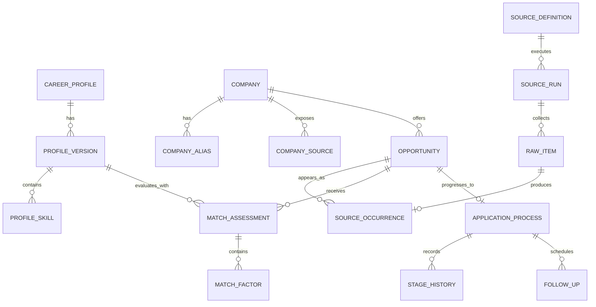

# Visão geral da modelagem de dados

## 1. Objetivo

A modelagem de dados do Opportunity Radar deve sustentar três necessidades simultâneas:

1. **preservar fatos coletados**, permitindo reprocessamento e auditoria;
2. **manter estado operacional consistente**, como oportunidades, avaliações e candidaturas;
3. **oferecer leitura eficiente para a dashboard**, sem transformar o modelo transacional em um conjunto de estruturas orientadas exclusivamente à UI.

A estratégia definida para o projeto é utilizar **um único PostgreSQL**, organizado por schemas alinhados aos bounded contexts. Essa opção preserva transações locais simples no MVP e, ao mesmo tempo, mantém fronteiras claras para evolução futura.

O banco não deve se tornar o lugar onde todas as regras de negócio são implementadas. Invariantes relevantes são defendidas pelo domínio e, quando possível, reforçadas por constraints do PostgreSQL.

---

## 2. Princípios de modelagem

### 2.1 Dados externos são preservados antes de serem interpretados

Uma vaga coletada não deve ser transformada diretamente em `Opportunity`.

O fluxo de persistência é:

```text
fonte externa
   ↓
SourceRun
   ↓
RawItem
   ↓
normalização
   ↓
SourceOccurrence
   ↓
Opportunity
   ↓
MatchAssessment
```

Isso permite:

- reprocessar parsers;
- comparar versões de normalização;
- investigar uma decisão de matching;
- corrigir bugs sem necessariamente consultar novamente a origem;
- distinguir claramente **evidência** de **inferência**.

### 2.2 Cada bounded context controla sua escrita

Um contexto pode utilizar identificadores de outro contexto, porém não deve atualizar diretamente suas tabelas.

Exemplo:

```text
Matching pode armazenar opportunity_id
Matching NÃO altera opportunities.opportunity
```

### 2.3 Histórico importante é append-only

Itens que representam decisões ou fatos históricos não devem ser sobrescritos como se nunca tivessem existido.

Exemplos:

- `SourceRun`;
- `RawItem`;
- `MatchAssessment`;
- `StageHistory`;
- eventos;
- audit log.

### 2.4 JSONB não substitui modelagem relacional

`JSONB` é apropriado para:

- payloads externos;
- configurações variáveis;
- explicações estruturadas;
- metadados não uniformes.

Ele não deve ser usado para esconder entidades, relacionamentos ou campos frequentemente filtrados.

### 2.5 Idempotência deve ser garantida pelo banco

Não confiar apenas no padrão:

```python
if not exists:
    insert()
```

Duas execuções concorrentes podem observar a mesma ausência.

Quando possível, a idempotência deve usar:

- unique constraint;
- `INSERT ... ON CONFLICT`;
- idempotency key;
- lock;
- optimistic locking.

---

## 3. Organização por schemas

A organização lógica proposta é:

```text
profile
company_radar
acquisition
opportunities
matching
crm
outreach
proposals
interviews
automation
platform
```

### 3.1 Responsabilidade dos schemas

| Schema | Responsabilidade |
| --- | --- |
| `profile` | perfil profissional, skills, experiências, preferências e versões |
| `company_radar` | identidade de empresas, aliases, prioridade, endpoints e verificações |
| `acquisition` | fontes, execuções, checkpoints e payloads brutos |
| `opportunities` | vagas canônicas, ocorrências, normalização e ciclo editorial |
| `matching` | avaliações, fatores, disqualifiers, evidências e versões de regras |
| `crm` | candidatura, estágios, contatos e follow-ups |
| `outreach` | threads, mensagens geradas, revisão e registro de envio |
| `proposals` | propostas, versões, valores e milestones |
| `interviews` | sessões de preparação, perguntas, respostas e feedback |
| `automation` | jobs, execuções técnicas, locks, retries e DLQ |
| `platform` | outbox, idempotência, audit log e configurações transversais |

No MVP, alguns módulos podem compartilhar o mesmo processo de aplicação, mas a separação de schema deve ser mantida quando ela já representar uma fronteira de domínio real.

---

## 4. Visão relacional de alto nível



O diagrama é propositalmente de alto nível. Os documentos específicos de dados podem expandir tabelas por contexto.

---

## 5. Convenções globais

### 5.1 Identificadores

Identificadores públicos e de aggregate roots:

```sql
id uuid primary key
```

O UUID pode ser criado pela aplicação ou PostgreSQL, desde que a estratégia seja consistente.

Chaves naturais permanecem como constraints quando realmente estáveis.

Exemplo:

```text
company.id          → identidade interna
company.domain      → possível chave natural auxiliar
```

Não transformar domínio, URL ou external ID em primary key.

### 5.2 Datas

Todas as datas operacionais usam:

```sql
timestamptz
```

O armazenamento lógico é UTC.

Conversão para `America/Sao_Paulo` ou outro timezone acontece somente na borda de apresentação/agendamento.

### 5.3 Valores monetários

Utilizar:

```sql
numeric(14,2)
```

ou precisão maior quando necessário.

Nunca `float` para valores monetários.

Moeda deve ser armazenada separadamente:

```text
amount
currency = BRL | USD | EUR | ...
```

A moeda deve seguir código ISO conhecido pela aplicação.

### 5.4 Texto case-insensitive

`citext` pode ser usado quando comparação case-insensitive faz parte da regra, por exemplo:

- e-mail;
- domínio;
- handles específicos.

Alternativamente, utilizar índice sobre `lower(column)` quando houver razão operacional.

### 5.5 Estados

Usar enum de PostgreSQL apenas quando o conjunto for realmente muito estável.

Para workflows que provavelmente evoluirão:

```sql
status varchar(...) not null
check (...)
```

A regra de transição continua pertencendo ao domínio.

### 5.6 Nomenclatura

Padrão recomendado:

```text
schemas       snake_case
tabelas       snake_case plural ou singular consistente
colunas       snake_case
constraints   uq_<table>_<fields>
índices       ix_<table>_<purpose>
foreign keys  fk_<table>_<target>
checks        ck_<table>_<rule>
```

A convenção escolhida deve ser aplicada pelo Alembic/SQLAlchemy para evitar nomes aleatórios de constraints.

---

## 6. Colunas transversais

Tabelas mutáveis normalmente possuem:

```sql
id          uuid        not null
created_at  timestamptz not null
updated_at  timestamptz not null
version     integer     not null default 1
```

Quando arquiváveis:

```sql
archived_at timestamptz null
```

### 6.1 `created_at`

Nunca muda após criação.

### 6.2 `updated_at`

Representa mudança semântica do registro, não simples leitura.

### 6.3 `version`

Utilizada para optimistic locking.

Exemplo conceitual:

```sql
update opportunities.opportunity
set
    status = :new_status,
    version = version + 1
where id = :id
  and version = :expected_version;
```

Se `rowcount = 0`, a aplicação trata como conflito de concorrência.

### 6.4 Soft delete

Não utilizar uma coluna `deleted` por padrão em toda tabela.

Para dados de negócio cujo histórico interessa, preferir:

```text
archived_at
disabled_at
closed_at
```

com semântica explícita.

---

## 7. Catálogo mínimo de tabelas

### 7.1 Profile

```text
profile.career_profile
profile.profile_version
profile.skill
profile.profile_skill
profile.experience
profile.project
profile.employment_preference
profile.resume_version
```

### 7.2 Company Radar

```text
company_radar.company
company_radar.company_alias
company_radar.company_source
company_radar.company_verification
```

### 7.3 Acquisition

```text
acquisition.source_definition
acquisition.source_run
acquisition.raw_item
acquisition.source_checkpoint
```

### 7.4 Opportunities

```text
opportunities.opportunity
opportunities.source_occurrence
opportunities.normalization_result
```

### 7.5 Matching

```text
matching.match_assessment
matching.match_factor
matching.disqualifier
matching.missing_requirement
matching.analysis_cache
```

### 7.6 CRM

```text
crm.application_process
crm.stage_history
crm.contact
crm.follow_up
crm.interview
```

### 7.7 Contextos posteriores

```text
outreach.outreach_thread
outreach.message_draft
outreach.message_delivery_record

proposals.proposal
proposals.proposal_version
proposals.proposal_milestone

interviews.simulation_session
interviews.simulation_question
interviews.simulation_answer
interviews.simulation_feedback
```

### 7.8 Automation / Platform

```text
automation.job_definition
automation.job_execution
automation.job_lock
automation.dead_letter

platform.outbox_event
platform.idempotency_key
platform.audit_log
platform.app_setting
```

---

## 8. Perfil e versionamento

O matching precisa ser reproduzível.

Por isso, um `MatchAssessment` não deve referenciar apenas o “perfil atual”. Ele precisa saber **qual versão do perfil estava ativa no momento da avaliação**.

Exemplo:

```text
career_profile
   ↓
profile_version 7
   ↓
match_assessment
```

Se o usuário posteriormente adicionar uma skill ou alterar preferência salarial, o assessment antigo continua representando a decisão histórica.

Uma reavaliação cria novo assessment.

---

## 9. Empresas e identidade

A empresa deve possuir identidade própria independentemente do nome encontrado na vaga.

Exemplo:

```text
canonical_name = "Example Technologies"
aliases = [
    "Example Tech",
    "Example Technologies Inc."
]
domain = "example.com"
```

Uma oportunidade pode ter sido coletada usando qualquer alias, mas internamente aponta para o mesmo `company_id`.

### 9.1 Constraints propostas

Exemplos conceituais:

```sql
unique(lower(domain))
```

quando `domain` não for nulo.

Para aliases:

```text
unique(company_id, normalized_alias)
```

Evitar unique global em alias porque empresas diferentes podem possuir termos coincidentes.

---

## 10. SourceDefinition, SourceRun e RawItem

Esses três conceitos têm papéis diferentes.

### 10.1 `SourceDefinition`

Configuração persistente de uma origem executável.

Exemplos de campos:

```text
id
source_type
name
enabled
schedule
rate_limit_policy
configuration_json
created_at
updated_at
version
```

Secrets não ficam dentro de `configuration_json` em texto aberto quando existir estratégia de secrets separada.

### 10.2 `SourceRun`

Representa **uma tentativa delimitada** de coleta.

Campos conceituais:

```text
id
source_definition_id
started_at
finished_at
status
items_seen
items_created
items_updated
items_rejected
http_requests
error_code
error_summary
checkpoint_before
checkpoint_after
```

Possíveis estados:

```text
PENDING
RUNNING
SUCCEEDED
PARTIAL
FAILED
CANCELLED
```

### 10.3 `RawItem`

É o registro imutável do conteúdo recebido.

Campos:

```text
id
source_run_id
source_definition_id
external_id
canonical_url
payload
payload_hash
content_type
fetched_at
parser_version
```

A aplicação pode adicionar metadados técnicos, mas não deve reescrever o payload histórico para fazê-lo parecer compatível com uma nova versão de parser.

---

## 11. Imutabilidade de `RawItem`

Depois de persistido:

```text
RawItem.payload
```

não deve ser alterado.

Se a mesma origem mudar:

- criar novo RawItem;
- associar à nova execução;
- recalcular hash;
- decidir se a ocorrência/oportunidade precisa de atualização.

Isso permite comparar:

```text
payload anterior × payload atual
```

e detectar fechamento, edição ou mudança de localização.

---

## 12. Identidade externa e idempotência

Cada fonte precisa declarar qual combinação identifica um item de forma estável.

Prioridade:

```text
1. source_definition_id + external_id
2. source_definition_id + canonical_url
3. fingerprint externo normalizado
```

Exemplo de constraint:

```sql
unique(source_definition_id, external_id)
```

quando `external_id` existe e é confiável.

Se o item puder aparecer mais de uma vez historicamente, separar:

```text
external item identity
```

de:

```text
raw fetch instance
```

Assim, preserva-se histórico sem perder idempotência operacional.

---

## 13. Opportunity × SourceOccurrence

Essa separação é central.

### `Opportunity`

Representa a vaga canônica.

### `SourceOccurrence`

Representa uma aparição específica da vaga em uma fonte.

Exemplo:

```text
Opportunity #A
├── occurrence Greenhouse
├── occurrence Remote Board
└── occurrence URL manual
```

Não criar três oportunidades apenas porque existem três URLs.

Campos possíveis da ocorrência:

```text
id
opportunity_id
raw_item_id
source_definition_id
external_id
source_url
first_seen_at
last_seen_at
closed_at
source_published_at
source_updated_at
```

---

## 14. Fingerprint de Opportunity

O fingerprint auxilia deduplicação, mas não deve ser tratado como prova absoluta de identidade.

Pode combinar valores normalizados:

```text
company_id
normalized_title
normalized_location
work_mode
external_description_signature
```

Exemplo conceitual:

```text
sha256(
  company_id
  + normalized_title
  + normalized_location
  + stable_description_signature
)
```

O algoritmo deve possuir versão:

```text
fingerprint_version
```

Uma mudança no algoritmo não pode tornar registros antigos inexplicáveis.

---

## 15. Estados da Opportunity

A oportunidade possui lifecycle próprio, separado da candidatura.

Possíveis estados editoriais:

```text
DISCOVERED
ACTIVE
STALE
CLOSED
ARCHIVED
REJECTED
```

`APPLIED` não deve ser estado da oportunidade.

`APPLIED` pertence ao `ApplicationProcess`.

Essa separação evita confundir:

```text
"a vaga continua aberta?"
```

com:

```text
"eu já me candidatei?"
```

---

## 16. MatchAssessment como snapshot de decisão

Um assessment deve armazenar referências suficientes para reproduzir a avaliação:

```text
opportunity_id
profile_version_id
rule_version
taxonomy_version
prompt_version
model_name
model_version/config
score
verdict
confidence
created_at
```

A saída semântica da IA é complementar.

A decisão determinística não deve ser substituída silenciosamente por texto livre.

---

## 17. Estrutura de MatchFactor

Cada fator deve ser persistível individualmente.

Exemplo:

```text
factor_code = TECHNOLOGY_FIT
weight = 0.25
raw_score = 0.82
weighted_contribution = 20.50
confidence = 0.91
explanation = ...
evidence_refs = [...]
```

Isso permite que a dashboard mostre:

```text
Score: 78

+20.5 tecnologia
+14.0 geografia/contrato
+12.0 empresa
+...
```

em vez de apenas um número opaco.

---

## 18. Evidência, inferência e ausência

Campos ou estruturas de explicação devem distinguir:

```text
KNOWN
INFERRED
UNKNOWN
NOT_APPLICABLE
```

Exemplo:

```text
Work authorization: UNKNOWN
```

é diferente de:

```text
Work authorization: NOT_REQUIRED
```

e diferente de:

```text
Work authorization: REQUIRED_AND_MISSING
```

Essa distinção é fundamental para hard filters e para a confiança do assessment.

---

## 19. CRM e histórico de estágios

`ApplicationProcess` representa a candidatura.

Campos conceituais:

```text
id
opportunity_id
profile_version_id
current_stage
started_at
closed_at
outcome
next_action_at
version
```

O histórico não deve ser derivado somente do estado atual.

`StageHistory` registra:

```text
from_stage
to_stage
occurred_at
reason
source
notes
```

Assim é possível responder:

- quando a candidatura começou;
- quanto tempo ficou em cada etapa;
- quantas entrevistas ocorreram;
- qual foi o último movimento.

---

## 20. Follow-ups

Follow-up deve ser uma entidade própria quando possui lifecycle.

Campos:

```text
id
application_process_id
contact_id
due_at
status
channel
reason
completed_at
cancelled_at
```

Estados possíveis:

```text
PENDING
DONE
CANCELLED
SKIPPED
```

O sistema deve impedir que um follow-up concluído volte implicitamente para `PENDING`.

---

## 21. Índices essenciais

Os índices devem refletir queries reais.

### 21.1 Opportunity Inbox

Filtro típico:

```text
status
verdict
score
published_at
company_id
work_mode
```

Índices iniciais possíveis:

```sql
create index ix_opportunity_active_published
on opportunities.opportunity (published_at desc)
where status = 'ACTIVE';
```

e:

```sql
create index ix_match_assessment_opportunity_profile
on matching.match_assessment
(opportunity_id, profile_version_id, created_at desc);
```

### 21.2 Deduplicação

```text
unique(source_definition_id, external_id)
btree(fingerprint)
```

O fingerprint pode ter índice não único porque colisão lógica precisa ser analisada.

### 21.3 Empresas

```text
unique(lower(domain))
```

quando aplicável.

Para busca por alias:

```text
pg_trgm
```

pode ser ativado quando houver caso real.

### 21.4 Scheduler/jobs

```sql
create index ix_job_pending_run_at
on automation.job_execution (run_at)
where status = 'PENDING';
```

### 21.5 Outbox

```sql
create index ix_outbox_pending
on platform.outbox_event (occurred_at)
where published_at is null;
```

### 21.6 Pipeline

```text
current_stage + next_action_at
```

é uma consulta frequente para agenda e board.

---

## 22. Índices que não devem ser criados preventivamente

Não criar índice para toda coluna.

Cada índice adiciona custo em:

- INSERT;
- UPDATE;
- VACUUM;
- armazenamento;
- migrations.

Antes de adicionar:

1. registrar query lenta;
2. usar `EXPLAIN (ANALYZE, BUFFERS)` em ambiente de desenvolvimento;
3. confirmar seletividade;
4. adicionar índice;
5. medir novamente.

---

## 23. Constraints essenciais

Exemplos de regras que merecem defesa no banco:

### Score

```sql
check (score >= 0 and score <= 100)
```

### Faixa salarial

```sql
check (
  min_amount is null
  or max_amount is null
  or min_amount <= max_amount
)
```

### Datas

```text
finished_at >= started_at
closed_at >= created_at
```

quando ambos existirem.

### Peso

```sql
check (weight >= 0 and weight <= 1)
```

### Contribuição

A aplicação calcula; testes e checks simples podem impedir valores impossíveis.

### Currency

A aplicação valida código suportado. Uma tabela de referência pode ser usada se isso trouxer benefício real.

---

## 24. Foreign keys entre contexts

Dentro do mesmo bounded context, FKs são padrão.

Entre contexts existem duas estratégias aceitáveis no monólito modular:

### Estratégia A — FK física

Exemplo:

```text
matching.match_assessment.opportunity_id
    → opportunities.opportunity.id
```

Vantagem:

- integridade forte.

Custo:

- acoplamento físico de migrations.

### Estratégia B — referência por ID sem FK

Vantagem:

- maior autonomia de schema/context.

Custo:

- integridade precisa ser garantida pela aplicação.

Para o MVP local, FKs cross-context podem ser utilizadas quando simplificarem a integridade e não criarem ciclo operacional de migrations.

A decisão precisa ser explícita por relacionamento; não deve haver mistura acidental.

---

## 25. Transaction boundaries

Transações devem acompanhar aggregate/use case, não uma requisição externa inteira.

### Exemplo: persistência da coleta

```text
1. iniciar SourceRun
2. commit

para cada lote:
3. inserir RawItems
4. normalizar
5. upsert occurrences/opportunities
6. commit

7. finalizar SourceRun
8. commit
```

Não manter uma transação PostgreSQL aberta enquanto aguarda dezenas de chamadas HTTP.

### Exemplo: iniciar candidatura

```text
BEGIN
  validar Opportunity
  criar ApplicationProcess
  inserir StageHistory inicial
  criar evento/outbox se aplicável
COMMIT
```

---

## 26. Optimistic locking

Agregados mutáveis usam `version`.

Fluxo:

```text
read version = 7
↓
user changes stage
↓
UPDATE ... WHERE id=? AND version=7
↓
version becomes 8
```

Se outro processo já atualizou:

```text
rowcount = 0
```

A aplicação retorna `ConflictError` e recarrega o estado.

É preferível a locks longos para a maioria dos fluxos interativos da aplicação.

---

## 27. Pessimistic locking

Reservado para casos realmente concorrentes, como:

- aquisição de job;
- processamento exclusivo de outbox;
- operação de manutenção não reentrante.

Exemplo conceitual:

```sql
select ...
for update skip locked
```

A utilização deve ser encapsulada em infraestrutura e não espalhada pelo domínio.

---

## 28. Idempotency keys

Operações potencialmente repetidas podem receber:

```text
idempotency_key
```

Exemplos:

- importar lote;
- executar comando externo;
- processar mensagem;
- publicar evento;
- registrar resultado de job.

Estrutura conceitual:

```text
key
operation
status
result_reference
created_at
expires_at
```

A idempotência deve possuir escopo.

```text
(import-companies, hash-do-arquivo)
```

é diferente de usar um UUID aleatório em cada tentativa.

---

## 29. Transactional Outbox

Na arquitetura final, mudança transacional + evento externo deve seguir:

```text
BEGIN
  mudar aggregate
  inserir outbox_event
COMMIT
```

Depois:

```text
outbox relay
   ↓
Redis/Celery/event consumer
```

Campos sugeridos:

```text
id
aggregate_type
aggregate_id
event_type
event_version
payload
occurred_at
published_at
attempts
last_error
```

### Constraint de idempotência do consumidor

Consumidores importantes mantêm chave de processamento ou constraint equivalente.

Assim, publicar duas vezes não duplica efeitos.

---

## 30. Read models

A dashboard não precisa navegar aggregates completos para toda consulta.

Consultas como:

```text
Opportunity Inbox
Company Coverage
Pipeline Board
Follow-up Agenda
Operations Health
```

podem utilizar:

1. joins/queries SQL no MVP;
2. views;
3. views materializadas;
4. tabelas de projeção atualizadas por eventos.

A evolução ocorre quando métricas indicarem necessidade.

---

## 31. Exemplo de read model de Inbox

Conceitualmente:

```text
opportunity_id
title
company_name
work_mode
published_at
latest_score
latest_verdict
latest_confidence
application_stage
source_count
last_seen_at
```

Esse read model não se torna aggregate.

É uma representação de consulta.

---

## 32. JSONB: usos permitidos

Bons usos:

```text
raw_item.payload
source_definition.configuration
match_assessment.semantic_analysis
audit_log.metadata
outbox_event.payload
```

Maus usos:

```text
opportunity.data = {
  "title": ...,
  "company": ...,
  "status": ...,
  "score": ...
}
```

quando esses valores são parte central de filtros, constraints e relacionamentos.

---

## 33. Evolução de schema

Alembic controla todas as alterações.

Nunca editar migration já aplicada.

### 33.1 Migration pequena

Pode seguir:

```text
upgrade
downgrade
```

tradicional.

### 33.2 Migration de alto impacto

Utilizar:

```text
EXPAND
↓
MIGRATE
↓
CONTRACT
```

#### Expand

Adicionar coluna/tabela nova compatível.

#### Migrate

Popular dados gradualmente.

#### Contract

Remover legado depois que todos os leitores/escritores usam o novo formato.

---

## 34. Exemplo de expand/migrate/contract

Mudança:

```text
location varchar
```

para:

```text
country_code
region
city
location_text
```

### Expand

Adicionar novas colunas opcionais.

### Migrate

Backfill em lotes.

### Application switch

Nova versão passa a escrever/ler estrutura nova.

### Contract

Após validação:

- tornar campos obrigatórios quando aplicável;
- remover dependência do campo legado;
- remover coluna antiga em migration separada.

---

## 35. Política de downgrade

Nem toda migration possui downgrade seguro.

Exemplo perigoso:

```text
juntar duas colunas
↓
descartar dados originais
```

Nesse caso:

- documentar que downgrade é destrutivo;
- exigir backup;
- preferir rollback da aplicação;
- restaurar banco em volume separado quando necessário.

---

## 36. Retenção

Política inicial proposta:

| Dado | Retenção |
| --- | --- |
| RawItem | 12 meses detalhados por padrão |
| SourceRun | histórico operacional longo, podendo agregar detalhes antigos |
| JobExecution | 90 dias detalhados + agregados |
| MatchAssessment | longa, pois explica decisões |
| StageHistory | longa |
| AuditLog | longa conforme utilidade |
| Application logs | curta, com rotação |
| Backups | política operacional definida no runbook |

A retenção é configuração, não número espalhado pelo código.

---

## 37. Limpeza de RawItem

Uma política de retenção pode:

1. localizar RawItems antigos;
2. preservar:
   - hash;
   - external identity;
   - occurrence;
   - datas relevantes;
3. remover payload pesado somente quando permitido pela política;
4. registrar a manutenção.

Não remover matéria-prima ainda necessária para investigar avaliações recentes.

---

## 38. Dados sensíveis

Mesmo local-first, minimizar armazenamento.

Evitar persistir desnecessariamente:

- cookies;
- tokens;
- sessões;
- headers de autenticação;
- conteúdo pessoal não utilizado.

Payload bruto precisa passar por política de sanitização quando uma fonte retornar material sensível não necessário.

Logs jamais devem imprimir secrets por padrão.

---

## 39. Backup e restauração

O modelo de dados deve ser compatível com backup transacional do PostgreSQL.

O critério de backup não é apenas “arquivo foi criado”.

Precisa existir:

```text
backup
↓
novo volume/banco
↓
restore
↓
migrations compatíveis
↓
smoke test
```

A rotina detalhada pertence ao runbook, mas a modelagem precisa evitar dependências não restauráveis fora do banco sem documentação.

---

## 40. Integridade do Ollama e cache

Resultado de IA nunca deve ser identificado somente por:

```text
opportunity_id
```

A chave lógica precisa considerar, no mínimo:

```text
opportunity_content_version
profile_version
prompt_version
model_identifier
analysis_schema_version
```

Se qualquer componente relevante mudar, a análise pode precisar ser refeita.

---

## 41. Reprocessamento

O sistema deve suportar:

```text
RawItem antigo
   ↓
parser v2
   ↓
normalization v3
   ↓
Opportunity atualizada/reconciliada
```

sem consultar novamente a fonte.

Isso é uma das razões para preservar:

- payload;
- parser version;
- normalization version;
- hashes;
- source identity.

---

## 42. Auditoria

Mudanças relevantes podem produzir audit log.

Exemplos:

```text
COMPANY_MERGED
OPPORTUNITY_MANUALLY_REJECTED
APPLICATION_STAGE_CHANGED
MATCH_RULE_ACTIVATED
SOURCE_DISABLED
```

Campos:

```text
actor
action
entity_type
entity_id
occurred_at
metadata
correlation_id
```

Em instalação single-user, `actor` pode inicialmente ser `local_user` ou `system`, mas a estrutura já permite evolução.

---

## 43. Correlation ID

Fluxos distribuídos entre API, worker e jobs devem carregar:

```text
correlation_id
```

Exemplo:

```text
SourceRun
  correlation_id = abc

RawItems
  correlation_id = abc

normalization logs
  correlation_id = abc
```

Isso reduz drasticamente o custo de investigação operacional.

---

## 44. Queries críticas a testar

Antes de considerar a modelagem pronta, criar casos reais para:

### Inbox

```text
últimas vagas recomendadas
remoto
score >= 65
não aplicadas
últimos 7 dias
```

### Empresa

```text
empresa
fontes conhecidas
última coleta
vagas ativas
quantidade recomendada
```

### Pipeline

```text
candidaturas ativas
ordenadas por próxima ação
```

### Operação

```text
fontes com falha
última execução
taxa de itens
erro atual
```

A modelagem está incompleta se essas consultas exigirem varreduras ou estruturas artificiais difíceis de manter.

---

## 45. Estratégia de testes do banco

### Unit tests

Não dependem do PostgreSQL.

### Integration tests

Usam PostgreSQL real, preferencialmente em container.

Validar:

- unique constraints;
- FKs;
- optimistic locking;
- transactions;
- migrations;
- indexes relevantes;
- JSONB;
- timezone;
- upserts.

### Migration tests

Executar:

```text
empty DB
→ upgrade head
```

e, para versões importantes:

```text
snapshot anterior
→ upgrade
→ smoke queries
```

---

## 46. MVP × versão final

### MVP

Priorizar:

- PostgreSQL único;
- schemas;
- tabelas transacionais;
- queries diretas/read services;
- constraints essenciais;
- optimistic locking;
- idempotência;
- Alembic.

### Versão final

Adicionar conforme necessidade:

- transactional outbox;
- projections;
- filas persistentes;
- job execution completo;
- métricas históricas;
- retenção automatizada;
- read models materializados;
- maior isolamento entre contexts.

O MVP não deve implementar toda a infraestrutura final antecipadamente, mas não deve criar um schema que impeça a evolução.

---

## 47. Anti-patterns

### Banco compartilhado sem ownership

```text
qualquer módulo atualiza qualquer tabela
```

**Evitar.**

### ORM como domínio

```python
class Opportunity(SQLAlchemyModel):
    # todas as regras aqui
```

**Evitar.**

Entidades de domínio e modelos de persistência podem ser separados quando isso proteger a arquitetura.

### JSONB universal

**Evitar.**

### `SELECT` antes de INSERT como única deduplicação

**Evitar.**

### Apagar histórico de assessment

**Evitar.**

### Colocar ApplicationStage dentro de Opportunity

**Evitar.**

### Foreign keys cíclicas em todos os contexts

**Evitar.**

---

## 48. Checklist de implementação

Antes de considerar a base de dados pronta para o MVP:

- [ ] schemas criados por migration;
- [ ] naming convention configurada;
- [ ] UUID padronizado;
- [ ] timestamps em UTC;
- [ ] `version` em aggregates mutáveis;
- [ ] identidade de Source/RawItem definida;
- [ ] `RawItem` imutável;
- [ ] Opportunity separada de SourceOccurrence;
- [ ] MatchAssessment versionado;
- [ ] score com constraints;
- [ ] ApplicationProcess separado da Opportunity;
- [ ] unique constraints de idempotência;
- [ ] índices das queries críticas;
- [ ] migration de banco vazio testada;
- [ ] restore de backup testado;
- [ ] secrets ausentes de payload/logs;
- [ ] queries de Inbox/Pipeline/Operations medidas;
- [ ] regras de retenção documentadas.

---

## 49. Critério de pronto

A modelagem está pronta quando é possível executar o fluxo:

```text
importar perfil/empresas
↓
executar uma fonte
↓
persistir SourceRun + RawItem
↓
normalizar
↓
criar/reconciliar Opportunity + SourceOccurrence
↓
criar MatchAssessment explicável
↓
iniciar ApplicationProcess
↓
consultar Inbox/Pipeline
↓
reiniciar os containers
↓
encontrar o mesmo estado íntegro
```

sem duplicação acidental, perda de procedência ou dependência de estado mantido apenas em memória.
