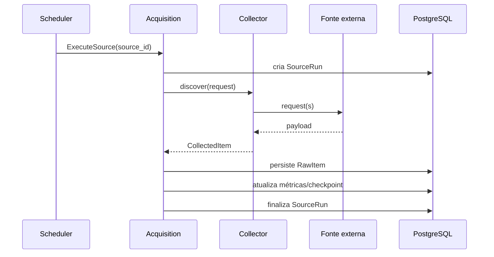

# Fontes e coletores

> Evolução planejada: [SPEC 37](37-spec-busca.md) cobre fontes e precisão;
> [SPEC 39](39-spec-varredura-produtiva.md) e seus
> [cards](40-roadmap-varredura-produtiva/README.md) acrescentam descoberta
> limitada, JobPosting público, delta e agenda por rendimento. Esses recursos
> não devem ser tratados como implementados apenas por estarem documentados.

## 1. Objetivo

O módulo de aquisição deve transformar origens heterogêneas de vagas em um fluxo previsível, auditável e substituível.

O sistema não assume que uma única plataforma cubra o mercado. A estratégia é combinar:

- ATSs;
- remote boards;
- feeds;
- comunidades;
- descoberta assistida;
- entrada manual.

A prioridade não é “raspar o maior número possível de sites”, mas obter **cobertura útil com fontes estáveis, permitidas e testáveis**.

---

## 2. Princípio de isolamento

Um coletor é um **adaptador de infraestrutura**.

Ele conhece o formato externo.

O domínio não conhece Greenhouse, Lever, Ashby, RSS, HTML ou Google.

Fluxo:

```text
Fonte externa
     ↓
Collector Adapter
     ↓
CollectedItem
     ↓
Acquisition
     ↓
RawItem
     ↓
normalização
     ↓
Opportunity
```

O coletor:

- consulta;
- pagina;
- respeita limites;
- extrai identidade e conteúdo bruto;
- produz contrato canônico mínimo.

O coletor **não**:

- cria `Opportunity`;
- calcula score;
- decide elegibilidade;
- inicia candidatura;
- envia mensagem;
- escreve diretamente em tabelas de outros contexts.

---

## 3. Estratégia de fontes

| Grupo | Exemplos previstos no plano | Grau de automação |
| --- | --- | --- |
| ATS | Greenhouse, Lever, Ashby, Workable | alto quando existe acesso público adequado |
| ATS adicionais | SmartRecruiters, Teamtailor, Recruitee, Personio, Workday | adaptador específico |
| Remote boards | Himalayas, Remotive, We Work Remotely, Remote OK | API/RSS/página conforme acesso permitido |
| Comunidades | Hacker News Who is Hiring, GitHub, YC Work at a Startup | API/feed/página permitida |
| Europa | EURES | integração conforme forma autorizada disponível |
| Descoberta | consultas Google Boolean e mecanismos alternativos | assistida ou API autorizada |
| Redes | LinkedIn, X | revisão manual; não automatizar login/scraping protegido |
| Entrada direta | URL, texto ou arquivo | sempre disponível |

Essa lista é uma direção arquitetural. Cada integração concreta precisa ser validada individualmente antes de ativação.

---

## 4. Hierarquia de preferência

Ao escolher onde investir implementação:

```text
1. endpoint/API/feed estável e autorizado
2. endpoint público de ATS por empresa
3. página pública previsível e permitida
4. descoberta assistida
5. entrada manual
```

Fontes que exigem:

- contornar autenticação;
- imitar sessão privada;
- quebrar captcha;
- ignorar bloqueios;
- ocultar identidade do cliente;

não fazem parte da estratégia.

---

## 5. Objetos principais de Acquisition

```text
SourceDefinition
SourceRun
RawItem
SourceCheckpoint
CollectedItem
CollectionRequest
HealthResult
```

Esses objetos possuem funções diferentes.

---

## 6. `SourceDefinition`

Representa uma origem configurada.

Exemplos conceituais:

```text
"Greenhouse - Empresa A"
"Lever - Empresa B"
"Remote Board X"
"Entrada Manual"
```

Campos sugeridos:

```text
id
name
source_type
enabled
schedule
priority
rate_limit_policy
configuration
last_health_status
created_at
updated_at
version
```

### 6.1 Configuration

Pode conter dados não secretos como:

```json
{
  "board_identifier": "...",
  "company_id": "...",
  "default_region": "...",
  "collection_mode": "company_jobs"
}
```

Credenciais, quando existirem, devem ser referenciadas por mecanismo de configuração/secret apropriado.

---

## 7. `CompanySource`

`CompanySource` pertence ao Company Radar e responde:

> “onde esta empresa publica vagas?”

Exemplo:

```text
company_id
source_type
career_url
external_board_id
verification_status
last_verified_at
confidence
```

`SourceDefinition` responde:

> “qual origem o scheduler pode executar?”

Uma mesma `CompanySource` pode originar ou parametrizar uma `SourceDefinition`.

Essa separação evita misturar catálogo empresarial com execução técnica.

---

## 8. `SourceRun`

Cada tentativa de coleta produz uma execução independente.

Exemplo:

```text
source = Greenhouse/Empresa A
started_at = 2026-...
finished_at = ...
status = SUCCEEDED
items_seen = 28
items_persisted = 28
new_occurrences = 3
updated_occurrences = 1
```

Estados:

```text
PENDING
RUNNING
SUCCEEDED
PARTIAL
FAILED
CANCELLED
```

Uma coleta com 100 itens em que um único item falhou em parsing pode resultar em:

```text
PARTIAL
```

em vez de apagar os 99 itens válidos.

---

## 9. Contrato base do coletor

Interface conceitual:

```python
class Collector(Protocol):
    source_type: str

    async def healthcheck(
        self,
        context: HealthcheckContext,
    ) -> HealthResult:
        ...

    async def discover(
        self,
        request: CollectionRequest,
    ) -> AsyncIterator[CollectedItem]:
        ...
```

O contrato do domínio/aplicação não importa classes específicas dos fornecedores.

---

## 10. `CollectionRequest`

Representa a intenção de coleta.

Campos possíveis:

```text
source_definition_id
mode
company_reference
keywords
locations
cursor
since
max_items
correlation_id
```

Nem todos os campos são suportados por todos os collectors.

Por isso existe declaração de capabilities.

---

## 11. `CollectedItem`

Contrato mínimo:

```text
source_type
external_id
url
title
company_name
location_text
description
published_at
updated_at
raw_payload
cursor
metadata
```

Campos podem ser ausentes.

O contrato precisa distinguir:

```text
missing
```

de um valor artificial inventado pelo parser.

### 11.1 Regra importante

O `CollectedItem` é **pré-normalização**.

Portanto:

```text
title = "Sr. Software Eng II - LATAM"
```

pode permanecer próximo ao texto da fonte.

A normalização para:

```text
Software Engineer
seniority = SENIOR
region = LATAM
```

acontece depois.

---

## 12. Capacidades declaradas

Cada collector expõe uma estrutura semelhante a:

```text
company_jobs
keyword_search
location_search
incremental_cursor
etag
last_modified
closed_detection
authentication
pagination
```

Exemplo conceitual:

```python
CollectorCapabilities(
    company_jobs=True,
    keyword_search=False,
    incremental_cursor=True,
    etag=True,
    closed_detection=True,
)
```

O scheduler nunca deve solicitar modo não suportado.

---

## 13. Registry de collectors

A aplicação mantém um registry.

Exemplo:

```text
"greenhouse" → GreenhouseCollector
"lever"      → LeverCollector
"ashby"      → AshbyCollector
"rss"        → RssCollector
"manual"     → ManualCollector
```

Construção:

```python
collector = registry.resolve(source_definition.source_type)
```

Isso impede:

```python
if source_type == "greenhouse":
    ...
elif source_type == "lever":
    ...
```

espalhado pelo código.

---

## 14. Lifecycle de coleta



Normalização pode acontecer:

- no mesmo worker, após persistência;
- por job posterior;
- por fila na arquitetura final.

O requisito é preservar o payload antes de depender da transformação.

---

## 15. Checkpoints e cursores

Uma fonte pode suportar coleta incremental.

Tipos de checkpoint:

```text
cursor opaque
updated_since
page token
last successful timestamp
etag
last-modified
```

O checkpoint só é promovido depois que o lote correspondente estiver persistido com sucesso.

### Erro perigoso

```text
salvar cursor novo
↓
falha antes de persistir itens
↓
próxima execução pula dados
```

### Ordem correta

```text
fetch
↓
persist items
↓
commit
↓
promote checkpoint
```

---

## 16. Paginação

Collectors devem encapsular paginação.

O application service não precisa saber se a fonte usa:

```text
page=2
cursor=abc
offset=100
next_url
```

O collector produz stream de `CollectedItem`.

Limites operacionais devem impedir loops infinitos quando uma origem retornar cursor inválido.

Campos técnicos úteis:

```text
pages_fetched
items_seen
last_cursor
request_count
```

---

## 17. Idempotência da coleta

Executar a mesma fonte duas vezes não deve criar duas vagas.

Camadas:

### 17.1 Raw identity

Usar combinação estável:

```text
source_definition_id + external_id
```

ou identidade equivalente.

### 17.2 Payload hash

Permite detectar conteúdo idêntico.

```text
hash(payload)
```

### 17.3 SourceOccurrence

Upsert da ocorrência externa.

### 17.4 Opportunity dedupe

Processo separado, baseado em identidade canônica/fingerprint.

Não misturar:

```text
"é o mesmo item da fonte?"
```

com:

```text
"é a mesma vaga entre fontes diferentes?"
```

---

## 18. Detecção de atualização

Quando o mesmo external item reaparece:

```text
external_id igual
payload_hash diferente
```

o sistema:

1. persiste nova evidência ou nova versão de fetch conforme modelagem;
2. registra `last_seen_at`;
3. reexecuta normalização relevante;
4. identifica alterações;
5. decide se assessment ficou stale.

Exemplos de mudança relevante:

- descrição;
- localização;
- modalidade;
- senioridade;
- requisitos;
- estado aberto/fechado.

---

## 19. Detecção de fechamento

Há diferentes níveis de confiança.

### Fonte informa fechamento

Melhor caso.

### Item desaparece

Ausência em uma execução não deve fechar imediatamente sem política.

Pode usar:

```text
missing_count
last_seen_at
grace_period
```

### URL retorna status claro

Registrar evidência.

O fechamento deve possuir:

```text
reason
evidence
detected_at
confidence
```

quando necessário.

---

## 20. Descoberta por empresa

O catálogo de empresas guarda endpoints conhecidos.

Fluxo:

```text
Company
↓
CompanySource
↓
verificador
↓
SourceDefinition executável
```

O verificador pode classificar:

```text
VERIFIED
LIKELY
UNKNOWN
INVALID
```

Descoberta de baixa confiança não deve entrar automaticamente em agenda de alta frequência.

---

## 21. Detecção de tecnologia de careers page

O verificador pode usar sinais como:

- domínio/hostname;
- links públicos;
- padrões de página;
- metadados;
- respostas conhecidas do adaptador.

Resultado:

```text
detected_source_type
confidence
evidence
checked_at
```

A decisão de implementação deve permanecer explicável.

Não armazenar apenas:

```text
source_type = greenhouse
```

sem saber como foi confirmado quando a descoberta for automática.

---

## 22. Entrada manual

Entrada manual é uma fonte de primeira classe.

Modos:

```text
URL
texto
arquivo
```

Ela deve produzir o mesmo pipeline:

```text
manual input
↓
RawItem
↓
normalização
↓
Opportunity
↓
matching
```

Não criar atalhos onde o formulário escreve diretamente em `opportunity`.

Isso mantém dedupe, procedência e matching consistentes.

---

## 23. Google Boolean assistido

A busca Boolean prevista no projeto é um mecanismo de **descoberta**, não o backbone automático.

O sistema pode:

1. gerar queries;
2. registrar query;
3. abrir/mostrar ao usuário;
4. aceitar URLs encontradas;
5. processá-las como entrada manual ou fonte autorizada.

Exemplo de registro:

```text
query
target_role
target_region
generated_at
status
results_added
```

A automação completa só deve existir por mecanismo oficialmente permitido.

---

## 24. LinkedIn e redes protegidas

O desenho atual mantém essas origens como assistidas.

O sistema pode armazenar:

- URL;
- empresa;
- contato;
- vaga adicionada manualmente;
- observação;
- data da descoberta.

Ele não precisa automatizar login ou scraping protegido para cumprir o objetivo principal.

Essa decisão reduz fragilidade operacional e mantém o core independente dessas plataformas.

---

## 25. HTTP client

Collectors HTTP devem usar um cliente compartilhado configurado.

Responsabilidades:

```text
timeouts
connection pool
headers permitidos
correlation id
retry controlado
telemetria
```

Evitar instanciar novo client para cada item.

---

## 26. Timeouts

Separar:

```text
connect timeout
read timeout
write timeout
pool timeout
```

O objetivo é impedir que uma fonte travada paralise o worker.

Timeout é classificado como erro temporário quando fizer sentido.

---

## 27. Retry

Retry não significa “tentar qualquer erro”.

### Tipicamente retryable

```text
timeout
connection reset
alguns 5xx
429 respeitando Retry-After
```

### Tipicamente não retryable

```text
400 por request inválida
401/403 por configuração/autorização
parser incompatível
URL definitivamente inválida
```

Política conceitual:

```text
attempt 1
↓
backoff
attempt 2
↓
backoff maior
attempt 3
↓
SourceRun PARTIAL/FAILED
```

Usar jitter para evitar sincronização de múltiplas fontes.

---

## 28. Rate limiting

Limites são aplicados por:

```text
host
source definition
collector
```

conforme necessidade.

Um source configurado não pode consumir toda a concorrência do worker.

Parâmetros:

```text
requests_per_second
burst
max_concurrency
minimum_interval
```

Não definir números universais no código; cada origem pode exigir configuração própria.

---

## 29. `Retry-After`

Quando uma resposta fornecer instrução explícita de espera, o collector deve respeitá-la dentro dos limites operacionais.

Registrar:

```text
rate_limited = true
retry_after
```

para observabilidade.

---

## 30. ETag e Last-Modified

Quando suportados pela origem, utilizar condicionais HTTP para reduzir transferência e processamento.

Persistir checkpoint técnico:

```text
etag
last_modified
```

Resposta sem modificação pode finalizar SourceRun como sucesso com:

```text
items_seen = 0
not_modified = true
```

Isso não deve ser confundido com parser quebrado retornando zero.

---

## 31. Circuit breaker

Uma fonte com falhas consecutivas não deve ser chamada indefinidamente na mesma frequência.

Estados conceituais:

```text
CLOSED
OPEN
HALF_OPEN
```

Exemplo:

```text
falhas consecutivas
↓
OPEN
↓
aguarda janela
↓
health probe
↓
HALF_OPEN
↓
sucesso → CLOSED
falha   → OPEN
```

O estado pode existir no componente de resiliência/automation, enquanto Acquisition recebe o resultado.

---

## 32. Parser versioning

Cada parser relevante possui versão.

Exemplo:

```text
greenhouse/v1
greenhouse/v2
```

`RawItem` registra:

```text
parser_version
```

ou o resultado de normalização registra a versão correspondente.

Quando parser mudar, fixtures antigas devem continuar testáveis.

---

## 33. Alteração de schema externo

Um parser que antes retornava 50 itens e passa silenciosamente a retornar zero é perigoso.

Detectar sinais como:

```text
campo obrigatório ausente
estrutura JSON inesperada
seletor não encontrado
queda abrupta de itens
content-type inesperado
```

Classificar:

```text
PARSER_SCHEMA_CHANGED
```

e salvar amostra sanitizada para diagnóstico.

Não mascarar como:

```text
SUCCEEDED: 0 jobs
```

quando o contrato conhecido foi violado.

---

## 34. Error taxonomy

Erros devem ter códigos estáveis.

Exemplos:

```text
SOURCE_TIMEOUT
SOURCE_RATE_LIMITED
SOURCE_UNAUTHORIZED
SOURCE_FORBIDDEN
SOURCE_NOT_FOUND
SOURCE_SERVER_ERROR
INVALID_CONFIGURATION
PARSER_SCHEMA_CHANGED
INVALID_ITEM
CHECKPOINT_ERROR
CIRCUIT_OPEN
UNKNOWN_EXTERNAL_ERROR
```

O usuário vê mensagem compreensível.

Logs mantêm detalhe técnico e stack trace quando necessário.

---

## 35. Falha por item × falha da execução

### Falha por item

Exemplo:

```text
49 itens válidos
1 item sem título
```

Resultado possível:

```text
SourceRun = PARTIAL
items_rejected = 1
```

### Falha estrutural

Exemplo:

```text
endpoint inteiro mudou
```

Resultado:

```text
SourceRun = FAILED
error_code = PARSER_SCHEMA_CHANGED
```

A fonte não deve derrubar as demais.

---

## 36. Concurrency

Coletores são majoritariamente I/O-bound, mas concorrência precisa ser limitada.

Níveis:

```text
worker concurrency
source concurrency
host concurrency
request concurrency
```

Evitar:

```python
await asyncio.gather(*milhares_de_requests)
```

sem semáforo.

---

## 37. Backpressure

Se normalização/análise estiver atrasada, aquisição não deve produzir carga ilimitada.

No MVP:

- limitar tamanho por execução;
- processar lotes;
- evitar executar mesma fonte novamente quando a anterior ainda está ativa.

Na arquitetura final:

- filas;
- prioridades;
- locks;
- métricas de backlog.

---

## 38. Scheduler

O scheduler decide **quando** executar.

O collector decide **como** consultar.

O scheduler não deve conter parsing.

Exemplo:

```text
08:00 → ExecuteSource(source_id=123)
```

Handler:

```text
load SourceDefinition
resolve Collector
create SourceRun
call discover
persist results
finish SourceRun
```

---

## 39. Locks de execução

Impedir duas execuções incompatíveis da mesma origem.

Chave:

```text
source:<source_definition_id>
```

Com:

```text
owner
acquired_at
expires_at
heartbeat
```

No MVP pode haver mecanismo simplificado no PostgreSQL/processo.

Na versão final, a estratégia pode usar infraestrutura de jobs/locks própria.

---

## 40. Healthcheck

`healthcheck()` não precisa baixar todas as vagas.

Ele verifica o mínimo necessário para classificar:

```text
HEALTHY
DEGRADED
UNHEALTHY
UNKNOWN
```

Pode validar:

- configuração;
- conectividade;
- formato esperado;
- autenticação, se houver.

O healthcheck deve ser barato.

---

## 41. Métricas por SourceRun

Registrar pelo menos:

```text
duration
items_seen
items_persisted
items_rejected
new_occurrences
updated_occurrences
requests
retries
rate_limit_events
bytes_received opcional
```

Métricas derivadas:

```text
success_rate
items_per_run
error_rate
freshness
coverage
```

---

## 42. Observabilidade útil

Dashboard Operations pode mostrar:

```text
Fonte             Última execução   Status     Itens   Erro
Empresa A / ATS   09:02             OK         18      -
Empresa B / ATS   09:05             FAILED     0       PARSER_SCHEMA_CHANGED
Remote board      09:10             DEGRADED   42      RATE_LIMITED
```

O objetivo é detectar rápido:

- fonte quebrada;
- fonte vazia;
- atraso;
- rate limiting;
- cobertura perdida.

---

## 43. Logs

Cada log de coleta deve carregar quando disponível:

```text
source_definition_id
source_run_id
source_type
company_id
correlation_id
attempt
host
```

Não incluir payload completo rotineiramente.

Payload permanece no armazenamento apropriado e logs usam apenas identificadores/resumos.

---

## 44. Fixtures

Cada collector deve possuir exemplos locais da resposta externa.

Estrutura possível:

```text
tests/fixtures/collectors/
├── greenhouse/
│   ├── jobs_page.json
│   ├── empty.json
│   └── malformed.json
├── lever/
└── ashby/
```

Fixtures permitem testar parser sem depender da internet.

---

## 45. Contract tests

Todo collector deve validar o mesmo conjunto básico.

Exemplos:

```text
retorna CollectedItem
preserva external_id quando disponível
preserva URL
não inventa published_at
mantém payload bruto
classifica erro de schema
suporta paginação declarada
não excede capabilities
```

Além dos testes específicos do fornecedor.

---

## 46. Testes de resiliência

Simular:

```text
timeout
429
500
resposta vazia
JSON inválido
campo removido
cursor repetido
página repetida
conexão encerrada
```

Validar que:

- retry ocorre apenas quando correto;
- execução termina;
- não há loop infinito;
- dados já persistidos não somem;
- outras fontes continuam.

---

## 47. Teste de idempotência

Cenário:

```text
fixture A
↓
run 1
↓
run 2 com a mesma fixture
```

Esperado:

```text
Raw fetch histórico conforme política
1 identidade externa
1 SourceOccurrence
1 Opportunity canônica
nenhuma duplicata funcional
```

Depois:

```text
fixture A modificada
↓
run 3
```

Esperado:

- ocorrência atualizada;
- histórico preservado;
- campos relevantes reprocessados.

---

## 48. Adição de nova fonte

Checklist obrigatório:

1. [ ] termos e forma de acesso são compatíveis com o uso;
2. [ ] existe ganho de cobertura;
3. [ ] source type definido;
4. [ ] capabilities definidas;
5. [ ] identidade externa compreendida;
6. [ ] paginação compreendida;
7. [ ] datas compreendidas;
8. [ ] política de fechamento definida;
9. [ ] rate limit configurável;
10. [ ] timeout configurado;
11. [ ] retry classificado;
12. [ ] parser versionado;
13. [ ] fixtures criadas;
14. [ ] contract tests passando;
15. [ ] erros mapeados;
16. [ ] métricas emitidas;
17. [ ] payload bruto preservado;
18. [ ] nenhuma regra de matching dentro do collector.

---

## 49. Ordem de implementação do MVP

### Etapa 1 — Framework de collectors

Implementar:

```text
Collector Protocol
CollectionRequest
CollectedItem
CollectorCapabilities
CollectorRegistry
SourceRun
RawItem persistence
```

### Etapa 2 — Entrada manual

É a fonte mais simples para validar pipeline sem depender da internet.

### Etapa 3 — Primeiro ATS

Implementar um adaptador completo e usar como referência.

### Etapa 4 — Segundo e terceiro ATS

Reutilizar contrato e testes.

### Etapa 5 — Uma fonte remota

Validar que o design também funciona para fonte não orientada por empresa.

### Etapa 6 — descoberta assistida

Gerador Boolean + ingestão manual de resultado.

---

## 50. MVP: definição mínima de sucesso

O módulo de aquisição do MVP está pronto quando:

```text
3 ATSs
+ 1 fonte remota
+ entrada manual
```

podem executar pelo mesmo contrato, com:

- `SourceRun`;
- `RawItem`;
- idempotência;
- métricas;
- erro isolado;
- retry controlado;
- fixtures;
- contract tests;
- procedência exibida na oportunidade.

---

## 51. Evolução para versão final

A arquitetura final adiciona:

```text
scheduler dedicado
worker-collector
Redis/Celery
prioridades
DLQ
circuit breaker persistente
mais fontes
detector de company source
monitoramento de cobertura
reprocessamento em lote
```

Sem mudar a interface conceitual de `Collector`.

Essa compatibilidade é uma das principais razões para manter o collector como porta/adaptador desde o MVP.

---

## 52. Anti-patterns

### Collector grava Opportunity

**Proibido.**

### Parser calcula MatchScore

**Proibido.**

### Um `scraper.py` gigante para todos os sites

**Evitar.**

### `except Exception: return []`

**Proibido.**

Transforma fonte quebrada em “nenhuma vaga encontrada”.

### Retry infinito

**Proibido.**

### Sem timeout

**Proibido.**

### Concorrência ilimitada

**Proibido.**

### Atualizar checkpoint antes do commit

**Proibido.**

### Misturar external ID e fingerprint canônico

**Evitar.**

### Automatizar origem protegida apenas porque tecnicamente é possível

**Fora do desenho do projeto.**

---

## 53. Critério de pronto

A implementação está correta quando uma fonte nova pode ser adicionada sem alterar:

- domínio de Opportunity;
- MatchScoreCalculator;
- API da dashboard;
- CRM;
- estrutura de outras fontes.

Idealmente o trabalho necessário é:

```text
novo adapter
+ configuration
+ registry
+ fixtures
+ contract tests
```

Se cada nova fonte exigir condicionais espalhadas por toda aplicação, a fronteira de Acquisition não está funcionando.
