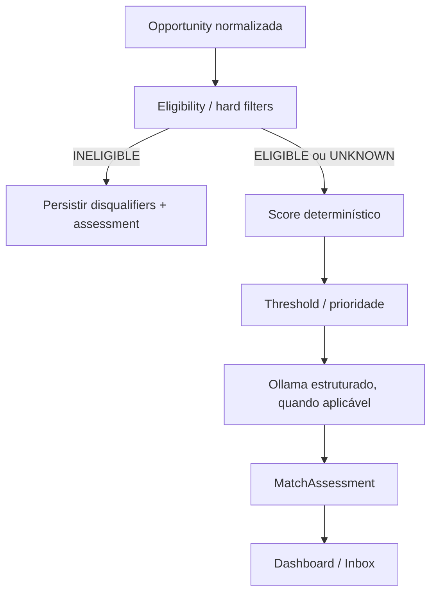

# Matching, filtros e scoring

## 1. Objetivo

O matching transforma uma `Opportunity` normalizada em uma recomendação **reproduzível, explicável e revisável**.

O sistema não deve responder apenas:

```text
score = 82
```

Ele precisa conseguir explicar:

```text
por que 82?
quais requisitos foram confirmados?
o que está ausente?
existe algum disqualifier?
qual versão das regras produziu esse resultado?
o que foi regra e o que foi inferência da IA?
```

A estratégia permanece dividida em três etapas:

1. **hard filters**;
2. **score determinístico**;
3. **análise semântica com Ollama** somente para oportunidades elegíveis ou que mereçam revisão.

---

## 2. Princípios

### 2.1 Determinismo antes de IA

Critérios objetivos são avaliados sem LLM.

### 2.2 Ausência de informação não é reprovação automática

`UNKNOWN` é um estado válido.

### 2.3 IA não pode inventar elegibilidade

Ollama auxilia interpretação de nuances e explicação, mas não transforma ausência de evidência em fato.

### 2.4 Score e verdict são conceitos diferentes

Uma vaga pode possuir score informativo alto e ainda ser:

```text
INELIGIBLE
```

por um hard disqualifier.

### 2.5 Toda decisão relevante é versionada

Assessment registra:

- versão do perfil;
- versão das regras;
- versão da taxonomia;
- versão do prompt;
- modelo/configuração relevante.

---

## 3. Fluxo



---

## 4. Entradas do matching

O algoritmo não deve consumir diretamente HTML ou payload externo cru.

Entrada principal:

```text
OpportunitySnapshot
ProfileSnapshot
CompanySnapshot mínimo
MatchingRuleSet
SkillTaxonomy
```

### 4.1 OpportunitySnapshot

Pode conter:

```text
opportunity_id
content_version
company_id
title
normalized_title
seniority
work_mode
locations
allowed_countries
contract_types
compensation
timezone_requirements
required_skills
preferred_skills
experience_requirements
language_requirements
authorization_requirements
description
published_at
evidence_refs
```

### 4.2 ProfileSnapshot

Pode conter:

```text
profile_version_id
skills
experience
domains
languages
countries
work_authorization
work_modes
contract_preferences
compensation_preferences
timezone_window
company_preferences
```

---

## 5. Estados de conhecimento

Cada regra que depende de evidência deve trabalhar com estados semelhantes a:

```text
TRUE
FALSE
UNKNOWN
NOT_APPLICABLE
```

Exemplo:

```text
vaga diz explicitamente "Brazil only"
profile.country = Brazil

→ TRUE
```

```text
vaga diz "US work authorization required"
perfil não possui autorização

→ FALSE
```

```text
vaga não informa restrição

→ UNKNOWN ou NOT_APPLICABLE
```

dependendo da semântica da regra.

Não converter `UNKNOWN` para `FALSE` apenas para simplificar código.

---

## 6. Resultado da elegibilidade

Estrutura conceitual:

```text
EligibilityResult
├── status
├── disqualifiers[]
├── warnings[]
├── unknowns[]
└── evidence[]
```

Estados principais:

```text
ELIGIBLE
INELIGIBLE
UNKNOWN
```

### `ELIGIBLE`

Nenhum hard constraint confirmado como incompatível.

### `INELIGIBLE`

Existe pelo menos um hard disqualifier confirmado.

### `UNKNOWN`

Informação crítica insuficiente para afirmar elegibilidade.

---

## 7. Hard filters

Conjunto inicial definido:

- vaga fechada ou expirada;
- país de residência não aceito;
- presencial incompatível;
- autorização de trabalho obrigatória e inexistente;
- timezone sem interseção aceitável;
- senioridade explicitamente incompatível;
- tipo de contrato proibido pelas preferências.

Cada filtro precisa possuir:

```text
code
result
reason
evidence_refs
confidence
severity
```

---

## 8. Exemplo de disqualifier

```json
{
  "code": "WORK_AUTHORIZATION_REQUIRED",
  "result": "FALSE",
  "reason": "A oportunidade declara autorização local obrigatória.",
  "evidence_refs": ["occurrence:...#authorization"],
  "confidence": 1.0,
  "severity": "HARD"
}
```

A mensagem pode ser mais amigável na UI, mas o código permanece estável.

---

## 9. O que NÃO é hard filter automaticamente

Exemplos:

```text
não possuir 100% das skills
não possuir experiência exata no setor
salário ausente
empresa fora da lista prioritária
vaga publicada há algumas semanas
```

Esses pontos geralmente influenciam score ou revisão.

Hard filters devem ser poucos e semanticamente fortes.

---

## 10. Senioridade como hard filter

Senioridade só deve reprovar quando a incompatibilidade for explícita e a regra do usuário também for explícita.

Exemplo:

```text
perfil deseja Júnior/Pleno
vaga explicitamente Staff/Principal
```

pode produzir disqualifier.

Mas:

```text
título ambíguo
```

não deve ser automaticamente interpretado como incompatível.

Resultado:

```text
UNKNOWN
```

ou fator de score.

---

## 11. Work mode

Exemplo:

Perfil:

```text
REMOTE = preferred
HYBRID = accepted
ONSITE = not accepted
```

Vaga:

```text
ONSITE obrigatório
```

Resultado:

```text
INELIGIBLE
```

Vaga:

```text
"remote/hybrid depending on location"
```

Resultado:

```text
UNKNOWN / REVIEW
```

até normalização mais confiável.

---

## 12. Geografia e residência

Separar conceitos:

```text
job location
allowed residence
payroll countries
timezone region
work authorization
```

Uma vaga “Remote” pode ainda possuir limitação geográfica.

Portanto:

```text
work_mode = REMOTE
```

não implica:

```text
global eligibility = TRUE
```

---

## 13. Work authorization

Possíveis estados do perfil:

```text
AUTHORIZED
REQUIRES_SPONSORSHIP
UNKNOWN
NOT_APPLICABLE
```

E da vaga:

```text
REQUIRED_LOCAL_AUTHORIZATION
SPONSORSHIP_AVAILABLE
SPONSORSHIP_NOT_AVAILABLE
NOT_STATED
```

O disqualifier só é confirmado quando a combinação for conclusiva.

---

## 14. Timezone

Timezone não deve ser comparado apenas por sigla.

Representar janelas em termos normalizados.

Exemplo:

```text
perfil disponível: UTC-3 09:00–18:00
vaga requer overlap com UTC-5 09:00–17:00
```

Calcular quantidade de horas de interseção.

Regra de exemplo:

```text
required_overlap >= configured_minimum
```

O mínimo é preferência/versioned rule, não constante escondida no código.

---

## 15. Score determinístico

Pesos iniciais definidos:

| Fator | Peso |
| --- | ---: |
| elegibilidade geográfica/contratual | 20% |
| aderência tecnológica | 25% |
| empresa no radar/prioridade | 15% |
| experiência no domínio | 15% |
| senioridade e escopo | 10% |
| contrato e remuneração | 5% |
| timezone | 5% |
| recência | 5% |

Total:

```text
100%
```

Pesos pertencem a um `MatchingRuleSet` versionado.

---

## 16. Fórmula

Cada fator possui:

```text
weight_i ∈ [0,1]
raw_score_i ∈ [0,1]
```

Contribuição em pontos:

```text
contribution_i =
    100 × weight_i × raw_score_i
```

Score total quando todos os pesos estão ativos:

```text
score =
    Σ contribution_i
```

Exemplo:

```text
Technology Fit
weight = 0.25
raw_score = 0.80

contribution = 100 × 0.25 × 0.80
             = 20 pontos
```

---

## 17. Política para dados ausentes

Essa é uma decisão explícita de regra.

Não redistribuir peso silenciosamente.

Cada fator declara uma política:

```text
NEUTRAL
PENALIZE
EXCLUDE_AND_RENORMALIZE
REQUIRE_REVIEW
```

### 17.1 `NEUTRAL`

Exemplo:

```text
raw_score = 0.5
```

quando ausência não deve beneficiar nem punir fortemente.

### 17.2 `PENALIZE`

Usado quando ausência reduz confiança e a informação costuma ser importante.

### 17.3 `EXCLUDE_AND_RENORMALIZE`

O peso sai do denominador.

Deve ser usado com cuidado porque pode elevar artificialmente score.

### 17.4 `REQUIRE_REVIEW`

Assessment permanece com aviso, independentemente do score.

A política é versionada por fator.

---

## 18. Estrutura de `MatchFactor`

```text
factor_code
weight
raw_score
contribution
status
confidence
missing_policy
explanation
evidence_refs
```

Exemplo:

```json
{
  "factor_code": "TECHNOLOGY_FIT",
  "weight": 0.25,
  "raw_score": 0.84,
  "contribution": 21.0,
  "status": "KNOWN",
  "confidence": 0.93
}
```

---

## 19. Fator: elegibilidade geográfica/contratual

Esse fator não substitui hard filters.

Depois de passar hard filters, ele mede o quanto as condições são favoráveis.

Exemplos de sinais positivos:

```text
remote explicitamente aceito no Brasil
contrato compatível
sem necessidade de relocação
sponsorship compatível quando necessário
```

Exemplos de sinais incertos:

```text
região não declarada
contrato não declarado
```

Hard incompatibility continua produzindo `INELIGIBLE`, não score baixo.

---

## 20. Fator: aderência tecnológica

Esse é o maior peso inicial.

Dividir skills em:

```text
required
preferred
adjacent
```

### 20.1 Required skills

Possuem maior impacto.

### 20.2 Preferred skills

Geram bônus moderado.

### 20.3 Adjacent skills

Taxonomia pode reconhecer proximidade.

Exemplo:

```text
FastAPI
↔ Python web backend
```

não equivale a dizer que qualquer tecnologia é substituível.

A taxonomia precisa ser explícita e versionada.

---

## 21. Matching de skill

Cada requisito pode produzir:

```text
EXACT
EQUIVALENT
ADJACENT
MISSING
UNKNOWN
```

Exemplo:

```text
vaga: React
perfil: React
→ EXACT
```

```text
vaga: REST APIs
perfil: experiência backend documentada mas tecnologia específica ausente
→ evidência parcial conforme taxonomia/regra
```

O algoritmo não deve inventar experiência com tecnologia apenas porque outra tecnologia é semelhante.

---

## 22. Skills obrigatórias ausentes

Uma required skill ausente pode:

- reduzir Technology Fit;
- gerar `MissingRequirement`;
- opcionalmente tornar a vaga inelegível se uma regra explícita declarar aquela skill como hard requirement.

Por padrão, não transformar qualquer missing skill em disqualifier.

Isso mantém vagas com boa transferibilidade no radar.

---

## 23. Experiência e tempo

Evitar depender apenas de:

```text
anos totais = diferença entre primeira e última data
```

Experiências podem se sobrepor.

A engine pode calcular:

- duração por skill;
- duração por domínio;
- recência;
- evidência em projetos;
- nível declarado.

O cálculo exato deve ser documentado no RuleSet.

---

## 24. Fator: empresa no radar/prioridade

O Company Radar pode classificar:

```text
HIGH
NORMAL
LOW
BLOCKED
```

Exemplo de raw scores:

```text
HIGH   → 1.0
NORMAL → 0.7
LOW    → 0.4
```

Os valores são configuração, não regra universal.

`BLOCKED` pode ser:

- hard exclusion, se preferência explícita;
- score zero, se apenas baixa prioridade.

A semântica precisa ser definida.

---

## 25. Fator: experiência no domínio

Domínio significa contexto de negócio ou tipo de produto relevante.

Exemplos:

```text
fintech
healthcare
SaaS
marketplace
AI
developer tools
```

A avaliação pode considerar:

```text
experiência profissional
projetos
descrição da vaga
```

Sem inventar domínio quando a descrição não fornecer evidência suficiente.

---

## 26. Fator: senioridade e escopo

Além do título, considerar sinais estruturados:

```text
anos exigidos
ownership
liderança
mentoria
arquitetura
gestão
escopo de decisão
```

O score pode reconhecer:

```text
título "Software Engineer"
mas requisitos de Staff
```

sem depender apenas do nome do cargo.

Inferências de escopo feitas por Ollama precisam estar marcadas como inferência, não fato.

---

## 27. Fator: contrato e remuneração

Separar:

```text
contract_type
currency
min
max
period
gross/net unknown
employment jurisdiction
```

Comparação salarial só acontece quando unidades são compatíveis ou convertidas por regra explícita.

Se remuneração não estiver disponível:

```text
UNKNOWN
```

e aplicar missing policy do fator.

Não inferir salário pelo título sem uma fonte própria e explícita.

---

## 28. Fator: timezone

Pode utilizar função contínua.

Exemplo conceitual:

```text
overlap >= target_hours       → 1.0
overlap = target_hours - 1    → 0.8
overlap parcial               → 0.5
sem overlap                   → hard filter ou 0
```

A função real é parte da versão de regras.

---

## 29. Fator: recência

Recência evita priorizar vagas antigas sobre oportunidades equivalentes recentes.

Uma função simples e explicável pode utilizar faixas.

Exemplo configurável:

```text
0–3 dias   → 1.00
4–7 dias   → 0.90
8–14 dias  → 0.75
15–30 dias → 0.50
>30 dias   → 0.25
```

Esses valores são proposta de implementação e devem ficar no RuleSet, não hardcoded em handler.

Se `published_at` for desconhecido, usar missing policy.

---

## 30. Score final e precisão

Persistir score com precisão suficiente internamente.

Exemplo:

```text
78.4375
```

A UI pode exibir:

```text
78
```

ou:

```text
78.4
```

Não arredondar cada fator antes de somar, para evitar erro acumulado.

---

## 31. Veredictos

Faixas iniciais definidas:

```text
HIGH_PRIORITY ≥ 80
RECOMMENDED   ≥ 65
WATCHLIST     45–64
LOW_MATCH     < 45
INELIGIBLE    hard disqualifier confirmado
```

Uma condição adicional pode impedir `HIGH_PRIORITY` quando existe lacuna crítica.

Exemplo:

```text
score = 85
critical_unknown = true
```

Resultado:

```text
RECOMMENDED / REVIEW_REQUIRED
```

em vez de prioridade máxima.

---

## 32. Verdict não deve depender apenas do arredondamento

Calcular com valor interno.

Exemplo:

```text
64.95
```

A UI pode mostrar 65, mas a engine precisa ter política definida:

```text
threshold usa valor não arredondado
```

ou:

```text
threshold usa valor arredondado
```

Escolher uma estratégia e testá-la.

Recomendação: usar valor interno não arredondado para regra e arredondar apenas para apresentação.

---

## 33. Confiança

Score responde:

> “quão aderente parece?”

Confidence responde:

> “quão boa é a evidência para essa avaliação?”

Uma vaga pode ter:

```text
score = 82
confidence = 0.52
```

porque muitos requisitos foram inferidos.

Confidence pode considerar:

```text
campos conhecidos / relevantes
qualidade da evidência
quantidade de inferências
consistência entre ocorrências
```

---

## 34. MissingRequirement

Estrutura:

```text
code
requirement_text
category
importance
status
evidence
```

Categorias:

```text
SKILL
EXPERIENCE
LANGUAGE
AUTHORIZATION
LOCATION
CONTRACT
OTHER
```

Isso ajuda a dashboard a mostrar:

```text
Pontos de atenção
- Kafka não encontrado no perfil
- inglês C1 solicitado; perfil registrado como B2
```

sem transformar automaticamente tudo em reprovação.

---

## 35. EvidenceReference

Toda explicação importante deve apontar para origem.

Exemplos:

```text
opportunity:title
occurrence:<id>:description#paragraph-4
profile:<version>:skill:<id>
company:<id>:priority
```

O formato pode ser interno, mas precisa permitir reconstrução na UI/API.

---

## 36. Inferência

Inferência é registrada separadamente.

Exemplo:

```json
{
  "claim": "A vaga parece exigir forte ownership técnico",
  "type": "INFERENCE",
  "source": "ollama",
  "confidence": 0.74,
  "evidence_refs": ["..."]
}
```

Nunca armazenar essa conclusão como se a vaga tivesse declarado literalmente:

```text
requires_staff_level_ownership = true
```

sem marcar procedência.

---

## 37. Papel do Ollama

Ollama pode auxiliar:

- classificar nuance de senioridade;
- extrair requisitos de descrição não estruturada;
- resumir principais aderências;
- destacar riscos;
- gerar explicação amigável;
- identificar perguntas para revisão.

Ollama não deve:

- sobrescrever hard disqualifier confirmado;
- alterar score determinístico sem regra explícita;
- inventar salário;
- inventar autorização;
- iniciar candidatura;
- transformar inferência em evidência.

---

## 38. Contrato estruturado da IA

Resposta operacional usa JSON Schema.

Exemplo conceitual:

```json
{
  "summary": "...",
  "strengths": [],
  "risks": [],
  "inferences": [],
  "unknowns": [],
  "recommended_review": false
}
```

A aplicação:

1. chama modelo;
2. recebe JSON;
3. valida schema;
4. rejeita formato inválido;
5. faz retry conforme política;
6. persiste resultado validado.

Texto livre não entra diretamente no banco como decisão operacional.

---

## 39. Falha do Ollama

Estados possíveis do assessment:

```text
RULES_COMPLETED
AI_PENDING
AI_COMPLETED
AI_FAILED
```

Se Ollama estiver indisponível:

```text
hard filters continuam
score continua
vaga continua na dashboard
```

Apenas a camada semântica fica pendente/degradada.

---

## 40. Cache de análise

Uma resposta de IA só pode ser reutilizada quando a entrada relevante for equivalente.

Chave conceitual:

```text
hash(
  opportunity_content_version
  + profile_version
  + rule_version
  + prompt_version
  + model_id
  + output_schema_version
)
```

Mudou qualquer componente relevante:

```text
cache miss
```

---

## 41. `MatchAssessment` imutável

Uma avaliação concluída deve ser tratada como snapshot histórico.

Se as regras mudarem:

```text
assessment v1
```

permanece.

Cria-se:

```text
assessment v2
```

A UI pode mostrar apenas o mais recente como atual, mas histórico fica disponível.

---

## 42. RuleSet

Estrutura conceitual:

```text
MatchingRuleSet
├── version
├── active_from
├── weights
├── verdict_thresholds
├── missing_policies
├── hard_filter_policies
├── recency_function
├── timezone_policy
└── taxonomy_versions
```

Mudança comportamental cria nova versão.

Exemplo:

```text
v3 → technology weight 25%
v4 → technology weight 30%
```

Assessments antigos continuam vinculados à v3.

---

## 43. Taxonomia de skills

A taxonomia deve possuir identidade estável.

Exemplo:

```text
Skill
  id = python
  aliases = ["Python 3", "Python3"]

Skill
  id = fastapi
  parent/related = python-web
```

Não depender apenas de comparação `lower(string)`.

Taxonomia deve suportar:

- aliases;
- categorias;
- relações explícitas;
- skills depreciadas;
- versionamento quando mudança afetar score.

---

## 44. Normalização antes do matching

Entradas como:

```text
React.js
ReactJS
React
```

devem chegar ao matching, quando possível, como:

```text
react
```

O matching não deve repetir toda lógica de normalização.

Responsabilidades:

```text
Normalization → "o que esse texto representa?"
Matching      → "isso combina com o perfil?"
```

---

## 45. Exemplo completo de score

Suponha os raw scores:

| Fator | Peso | Raw | Contribuição |
| --- | ---: | ---: | ---: |
| Geo/contrato | 0.20 | 1.00 | 20.00 |
| Tecnologia | 0.25 | 0.80 | 20.00 |
| Empresa | 0.15 | 1.00 | 15.00 |
| Domínio | 0.15 | 0.70 | 10.50 |
| Senioridade | 0.10 | 0.90 | 9.00 |
| Contrato/remuneração | 0.05 | 0.50 | 2.50 |
| Timezone | 0.05 | 1.00 | 5.00 |
| Recência | 0.05 | 0.90 | 4.50 |

Total:

```text
86.50
```

Sem disqualifier e sem lacuna crítica:

```text
HIGH_PRIORITY
```

Se existir:

```text
WORK_AUTHORIZATION_REQUIRED = FALSE
```

o verdict passa a:

```text
INELIGIBLE
```

mesmo que o score informativo permaneça 86.50.

---

## 46. Exemplo com dados ausentes

Vaga não informa salário.

Fator:

```text
CONTRACT_COMPENSATION
weight = 0.05
missing_policy = NEUTRAL
raw_score = 0.50
contribution = 2.50
status = UNKNOWN
```

A explicação exibe:

```text
Remuneração não informada — fator tratado como neutro.
```

Não exibe:

```text
Remuneração compatível.
```

---

## 47. Explicação para UI

Exemplo:

```text
86 — Alta prioridade

Pontos fortes
+ Stack principal muito aderente
+ Empresa marcada como prioridade alta
+ Modalidade remota compatível
+ Boa sobreposição de timezone

Pontos de atenção
- Faixa salarial não publicada
- 1 skill preferencial não encontrada

Elegibilidade
✓ Residência compatível
✓ Contrato compatível
? Sponsorship não mencionado

IA
Resumo semântico disponível
Confiança geral: 82%
```

A UI precisa diferenciar visualmente:

```text
confirmado
inferido
desconhecido
incompatível
```

---

## 48. Explainability API

O endpoint de detalhe deve conseguir retornar algo semelhante a:

```json
{
  "score": 86.5,
  "verdict": "HIGH_PRIORITY",
  "confidence": 0.82,
  "eligibility": {...},
  "factors": [...],
  "missing_requirements": [...],
  "disqualifiers": [],
  "semantic_analysis": {...},
  "versions": {
    "profile": 7,
    "rules": "v3",
    "taxonomy": "v2",
    "prompt": "opportunity_analysis/v4"
  }
}
```

---

## 49. Reavaliação

Reavaliar quando mudar algo relevante.

Triggers possíveis:

```text
OpportunityContentChanged
ProfileVersionActivated
MatchingRuleSetActivated
SkillTaxonomyChanged
PromptVersionActivated
ModelChanged
```

Nem toda alteração exige reavaliar imediatamente todas as vagas.

Pode marcar:

```text
STALE
```

e processar apenas:

- oportunidades ativas;
- recentes;
- na inbox;
- candidaturas abertas.

---

## 50. Priorização de análise

Ollama é recurso mais caro que filtros simples.

Ordem recomendada:

```text
closed?
↓
hard filters
↓
score
↓
threshold
↓
LLM
```

Pode evitar LLM para:

```text
INELIGIBLE
LOW_MATCH muito baixo
oportunidade arquivada
conteúdo idêntico já analisado
```

A política é configurável.

---

## 51. Processamento assíncrono

No MVP:

```text
worker
↓
hard filters
↓
score
↓
Ollama
↓
persist
```

Na versão final:

```text
OpportunityReadyForMatching
↓
analysis queue
↓
worker-analysis
↓
MatchAssessment
```

O algoritmo de domínio permanece o mesmo.

---

## 52. Calibração

Depois de existir histórico suficiente, comparar score com ações reais.

Sinais:

```text
IGNORED
SAVED
APPLIED
INTERVIEW
OFFER
REJECTED
```

O objetivo não é treinar automaticamente o sistema sem controle.

Primeiro:

1. analisar distribuição;
2. identificar falsos positivos/negativos;
3. testar novos pesos offline;
4. comparar com histórico;
5. ativar nova RuleSet manualmente.

---

## 53. Métricas de calibração

Exemplos úteis:

```text
application_rate por faixa de score
interview_rate por faixa
offer_rate por faixa
quantidade de HIGH_PRIORITY ignoradas
quantidade de LOW_MATCH aplicadas manualmente
```

Não interpretar correlação como causalidade automaticamente.

O score é ferramenta pessoal de priorização.

---

## 54. Replay de regras

Antes de ativar `rules_v4`, executar contra dataset histórico.

Saída:

```text
opportunity
old_score
new_score
delta
old_verdict
new_verdict
```

Analisar maiores mudanças.

Isso evita alterar pesos “no escuro”.

---

## 55. Avaliação de precisão de extração

Campos extraídos por IA ou parser semântico podem possuir dataset rotulado.

Exemplo:

```text
100 vagas revisadas manualmente
```

Medir:

- precisão de work mode;
- precisão de senioridade;
- precisão de skill extraction;
- taxa de UNKNOWN;
- divergências.

Melhorar extração antes de ajustar score quando o problema estiver na entrada.

---

## 56. Feedback manual

A dashboard pode permitir:

```text
"score muito alto"
"score muito baixo"
"requisito interpretado errado"
"vaga não é elegível"
```

Feedback é salvo como observação.

Ele não altera o assessment histórico.

Pode alimentar análise posterior de RuleSet.

---

## 57. Prevenção de vieses

O score não utiliza atributos pessoais sensíveis como fatores de recomendação.

A engine avalia:

- requisitos profissionais;
- condições declaradas da oportunidade;
- preferências profissionais do usuário.

Exemplos de atributos que não entram como score:

```text
idade
gênero
raça
religião
orientação sexual
```

A IA é auxiliar e sua saída precisa ser revisável.

---

## 58. Informação potencialmente sensível na vaga

Uma descrição externa pode conter linguagem inadequada ou atributos irrelevantes.

O parser não deve automaticamente transformá-los em fatores.

A taxonomia de matching possui lista explícita de categorias aceitas.

---

## 59. Testes unitários

Testar cada specification isoladamente.

Exemplos:

```text
CountryAllowedSpec
RemoteCompatibleSpec
WorkAuthorizationSpec
TimezoneOverlapSpec
SeniorityCompatibleSpec
ContractCompatibleSpec
```

Para cada uma:

```text
TRUE
FALSE
UNKNOWN
boundary cases
```

---

## 60. Testes do score

Validar:

```text
pesos somam 1
raw score ∈ [0,1]
contribuições corretas
score ∈ [0,100]
ausência segue policy
thresholds corretos
arredondamento não muda regra
```

---

## 61. Property-based tests

Úteis para invariantes matemáticas.

Exemplos:

```text
score nunca < 0
score nunca > 100
aumentar raw_score de um fator positivo não reduz score
disqualifier sempre domina verdict
```

---

## 62. Golden tests

Criar conjunto fixo de oportunidades representativas.

Exemplo:

```text
golden/
├── perfect_match.json
├── missing_salary.json
├── incompatible_country.json
├── seniority_ambiguous.json
├── mixed_skills.json
└── old_job.json
```

Para cada RuleSet, resultado esperado é versionado.

Isso detecta regressão quando fórmula muda.

---

## 63. Testes do Ollama adapter

Não precisam executar modelo real em todos os unit tests.

Testar:

```text
JSON válido
JSON inválido
campo ausente
schema errado
timeout
modelo indisponível
retry
cache
```

Testes E2E locais podem usar Ollama real de forma separada.

---

## 64. Performance

Hard filters e score devem ser baratos.

Objetivo arquitetural:

```text
regra determinística ≪ chamada ao LLM
```

Evitar N+1 de banco.

Carregar snapshots necessários em consultas planejadas.

Para batch:

```text
opportunity IDs
↓
read model/snapshot query
↓
avaliação
↓
bulk persistence controlada
```

---

## 65. Observabilidade

Registrar por assessment:

```text
duration_rules_ms
duration_ai_ms
cache_hit
rule_version
prompt_version
model_id
factor_count
unknown_count
disqualifier_count
```

Não registrar descrição completa da vaga em logs.

---

## 66. Falhas

### Regra inválida

```text
CONFIGURATION_ERROR
```

Não produzir score silencioso com pesos quebrados.

### Snapshot ausente

```text
INPUT_INCOMPLETE
```

### Ollama indisponível

```text
AI_PENDING / AI_FAILED
```

### JSON inválido

Retry conforme política, depois estado degradado.

### Taxonomia desconhecida

Registrar unknown, não inventar equivalência.

---

## 67. Versionamento mínimo do assessment

Persistir:

```text
profile_version
opportunity_content_version
rules_version
taxonomy_version
normalization_version
prompt_version
model_id
output_schema_version
```

Nem todo campo precisa virar coluna independente se houver metadado estruturado, mas os itens usados para reproduzir decisão não podem desaparecer.

---

## 68. Anti-patterns

### “Perguntar ao LLM se a vaga é boa” e usar a nota retornada

**Evitar.**

### Score sem breakdown

**Evitar.**

### `UNKNOWN = FALSE`

**Proibido como comportamento implícito.**

### Redistribuir peso sem registrar

**Evitar.**

### Alterar assessment histórico

**Evitar.**

### Threshold escondido em frontend

**Proibido.**

### Skills comparadas apenas por substring

**Evitar.**

### Hard filter para toda skill ausente

**Evitar.**

### IA substituindo evidência externa

**Proibido.**

---

## 69. Checklist de implementação

- [ ] `EligibilityResult` definido;
- [ ] specifications ternárias implementadas;
- [ ] códigos de disqualifier estáveis;
- [ ] RuleSet versionado;
- [ ] pesos validados em startup/teste;
- [ ] policies de missing explícitas;
- [ ] MatchFactor persistido;
- [ ] MatchAssessment imutável;
- [ ] Opportunity/Profile snapshots versionados;
- [ ] EvidenceReference definido;
- [ ] SkillTaxonomy versionada;
- [ ] threshold centralizado no backend;
- [ ] Ollama usa JSON Schema;
- [ ] cache inclui todas as versões relevantes;
- [ ] falha de IA não perde score;
- [ ] golden tests criados;
- [ ] replay de RuleSet possível;
- [ ] UI distingue conhecido/inferido/desconhecido;
- [ ] nenhum atributo sensível entra no score.

---

## 70. Critério de pronto

O matching está pronto quando duas execuções com:

```text
mesma OpportunitySnapshot
mesmo ProfileSnapshot
mesmo RuleSet
mesma taxonomia
```

produzem o mesmo resultado determinístico, e quando a dashboard consegue explicar cada ponto ganho/perdido.

A camada Ollama pode enriquecer a análise, mas sua indisponibilidade não impede:

- classificar elegibilidade;
- calcular score;
- gerar verdict básico;
- persistir assessment;
- priorizar oportunidades.
