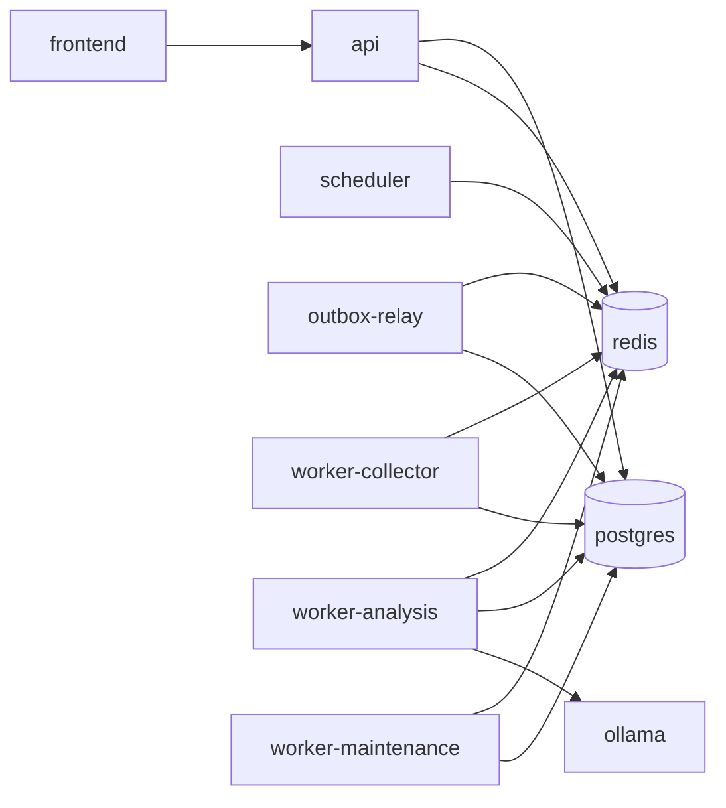
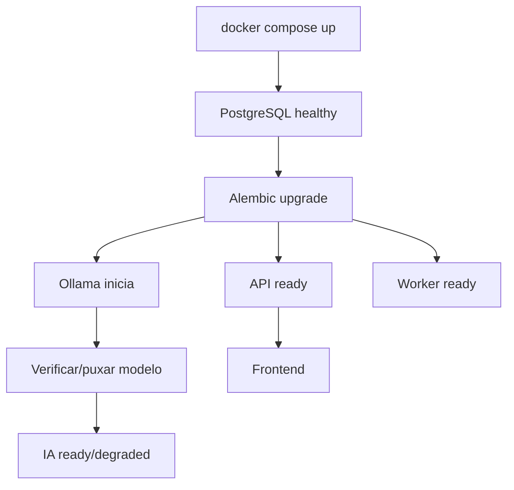

# Docker e execução local

## 1. Objetivo

Este documento define como o Opportunity Radar deve ser executado localmente de forma reproduzível, previsível e segura.

A meta operacional é permitir que uma máquina nova, contendo apenas:

```text
Docker
Docker Compose
Git
```

consiga subir o sistema sem instalação manual de PostgreSQL, Ollama, Redis ou runtimes específicos no host.

O ambiente local precisa suportar:

- desenvolvimento;
- execução diária;
- testes integrados;
- importação inicial;
- backup;
- restauração;
- diagnóstico;
- evolução do MVP para a arquitetura final.

---

## 2. Princípios

### 2.1 Local-first

Dados e processamento permanecem localmente por padrão.

### 2.2 Reprodutibilidade

O resultado de:

```bash
docker compose up
```

deve ser previsível em máquinas compatíveis.

### 2.3 Estado persistente explícito

Tudo que precisa sobreviver ao reinício fica em volume persistente.

### 2.4 Serviços stateless quando possível

API, frontend e workers não armazenam estado durável localmente em filesystem efêmero.

### 2.5 Dependências internas não são expostas sem necessidade

PostgreSQL, Redis e Ollama devem permanecer acessíveis apenas pela rede Docker por padrão.

### 2.6 Healthcheck não equivale a readiness

Um processo pode estar vivo, mas ainda não estar apto a receber trabalho.

---

## 3. Serviços do MVP

Topologia mínima:

```yaml
services:
  frontend: {}
  api: {}
  worker: {}
  postgres: {}
  ollama: {}
```

### 3.1 `frontend`

Responsável por:

- servir a dashboard;
- consumir API;
- apresentar estados de loading/erro/degradação;
- não armazenar estado de negócio durável.

Porta sugerida no host:

```text
3000
```

### 3.2 `api`

Responsável por:

- HTTP REST;
- validação de entrada;
- autenticação local futura, se necessária;
- composition root;
- queries;
- commands síncronos.

Porta sugerida:

```text
8000
```

### 3.3 `worker`

No MVP concentra:

- APScheduler;
- execução de fontes;
- normalização;
- deduplicação;
- matching;
- chamadas ao Ollama;
- tarefas de manutenção simples.

Não deve expor porta pública.

### 3.4 `postgres`

Responsável por:

- persistência transacional;
- migrations;
- estado da aplicação;
- histórico;
- configurações persistentes.

Não expor ao host por padrão.

### 3.5 `ollama`

Responsável por:

- inferência local;
- modelos configurados;
- análise estruturada.

Não expor ao host por padrão, salvo necessidade de desenvolvimento.

---

## 4. Serviços da versão final

Topologia prevista:

```text
frontend
api
scheduler
worker-collector
worker-analysis
worker-maintenance
postgres
redis
ollama
ollama-init
backup
outbox-relay
```

Fluxo:



---

## 5. Rede Docker

Utilizar uma rede interna dedicada:

```yaml
networks:
  app_net:
    driver: bridge
```

Serviços internos:

```text
postgres
redis
ollama
worker*
scheduler
outbox-relay
```

ficam em `app_net`.

Frontend e API podem estar na mesma rede.

---

## 6. Portas

Exposição mínima:

| Serviço | Container | Host | Obrigatória |
| --- | ---: | ---: | --- |
| frontend | 3000 | 3000 | sim |
| api | 8000 | 8000 | sim |
| postgres | 5432 | nenhuma | não |
| redis | 6379 | nenhuma | não |
| ollama | 11434 | nenhuma | não |
| workers | — | nenhuma | não |

Expor Postgres ou Ollama no host apenas por profile de desenvolvimento quando necessário.

---

## 7. Volumes

Volumes mínimos:

```text
postgres_data
ollama_models
local_exports
local_backups
```

### 7.1 `postgres_data`

Armazena banco persistente.

### 7.2 `ollama_models`

Evita baixar modelos novamente a cada recriação de container.

### 7.3 `local_exports`

Recebe:

- export do Notion;
- CSV/JSON importável;
- relatórios;
- arquivos temporários persistentes.

### 7.4 `local_backups`

Recebe dumps e arquivos de restore check.

---

## 8. Volumes nomeados × bind mounts

### Código-fonte em desenvolvimento

Bind mount pode ser usado:

```text
host source → container
```

para hot reload.

### Dados duráveis

Preferir volume nomeado.

Exemplo:

```yaml
volumes:
  postgres_data:
```

### Arquivos que o usuário precisa manipular

Bind mount explícito pode ser melhor:

```text
./data/exports:/app/exports
./data/backups:/app/backups
```

A escolha deve ser documentada no Compose.

---

## 9. Estrutura de arquivos Docker

Estrutura sugerida:

```text
docker/
├── api/
│   └── Dockerfile
├── frontend/
│   └── Dockerfile
├── worker/
│   └── Dockerfile
├── postgres/
│   └── init/
├── ollama/
│   └── init-models.sh
├── scripts/
│   ├── wait-for-db.sh
│   ├── healthcheck-api.sh
│   └── restore-check.sh
└── compose/
    ├── compose.base.yaml
    ├── compose.dev.yaml
    └── compose.final.yaml
```

No MVP, um único `compose.yaml` é suficiente.

Separar arquivos apenas quando reduzir complexidade real.

---

## 10. Dockerfile do backend

Requisitos:

- imagem base versionada;
- usuário não-root quando possível;
- dependências instaladas por lockfile;
- cache de build eficiente;
- runtime sem ferramentas de desenvolvimento desnecessárias;
- entrypoint simples;
- healthcheck externo quando possível.

Exemplo conceitual:

```dockerfile
FROM python:3.12-slim

WORKDIR /app

COPY pyproject.toml uv.lock ./
RUN ...

COPY src ./src
COPY apps ./apps

CMD ["python", "-m", "apps.api.main"]
```

O exemplo representa estrutura, não versão final obrigatória do Dockerfile.

---

## 11. Multi-stage build

Frontend deve utilizar multi-stage.

Conceitualmente:

```text
node builder
↓
npm/pnpm install
↓
build
↓
imagem final
```

Em desenvolvimento, Vite pode rodar diretamente.

Em execução final local, os assets podem ser servidos por container próprio ou servidor web leve.

---

## 12. `.dockerignore`

Evitar enviar contexto desnecessário:

```text
.git
node_modules
.venv
__pycache__
.pytest_cache
dist
coverage
local_backups
.env
```

Além de acelerar build, reduz risco de secrets entrarem na camada da imagem.

---

## 13. Imagens versionadas

Evitar:

```yaml
image: postgres:latest
```

Preferir versão explícita.

Exemplo conceitual:

```yaml
image: postgres:17.x
```

ou tag suportada definida no projeto.

Mesmo princípio para:

- Redis;
- Node;
- Python;
- Ollama.

---

## 14. Variáveis de ambiente

Conjunto inicial:

| Variável | Finalidade |
| --- | --- |
| `DATABASE_URL` | conexão PostgreSQL |
| `OLLAMA_BASE_URL` | endpoint interno do Ollama |
| `OLLAMA_MODEL_ANALYSIS` | modelo de análise |
| `REDIS_URL` | fila/cache na versão final |
| `APP_ENV` | ambiente |
| `LOG_LEVEL` | nível de log |
| `FRONTEND_ORIGIN` | CORS |
| `COLLECTION_TIMEZONE` | timezone do scheduler |
| `BACKUP_RETENTION_DAYS` | retenção de backup |
| `API_HOST` | bind da API |
| `API_PORT` | porta interna |
| `WORKER_CONCURRENCY` | concorrência configurável |
| `ANALYSIS_CONCURRENCY` | limite de análises simultâneas |

---

## 15. `.env.example`

Deve conter:

```text
nomes das variáveis
valores de exemplo não sensíveis
comentários úteis
```

Não deve conter:

```text
token real
senha real
cookie
API key real
```

O `.env` real não entra no Git.

---

## 16. Validação de configuração

A aplicação deve falhar cedo quando variável obrigatória estiver incorreta.

Exemplo:

```text
DATABASE_URL ausente
```

Resultado:

```text
startup failure claro
```

Não deixar API subir e falhar apenas na primeira requisição.

Configuração opcional degradável deve ser tratada diferentemente.

Exemplo:

```text
OLLAMA indisponível
```

A API pode subir e marcar IA como degradada.

---

## 17. Secrets

Mesmo local-first:

- não hardcode;
- não versionar;
- não imprimir em logs;
- não copiar para imagens;
- não armazenar em payload.

Se no futuro houver credenciais externas, utilizar mecanismo apropriado de secrets/configuração.

---

## 18. Dependências entre serviços

Conceito:

```text
frontend → api
api → postgres
worker → postgres
worker → ollama
```

Na versão final:

```text
scheduler → redis
workers → redis
outbox-relay → postgres + redis
```

Evitar dependência circular.

---

## 19. `depends_on`

`depends_on` controla ordem de criação, mas não substitui readiness.

Preferir:

```yaml
depends_on:
  postgres:
    condition: service_healthy
```

quando suportado e apropriado.

Mesmo assim, aplicação deve tolerar indisponibilidade temporária de dependência com retry de startup limitado.

---

## 20. Healthcheck do PostgreSQL

Conceitualmente:

```text
pg_isready
```

O healthcheck confirma conectividade.

A readiness da aplicação também exige migrations corretas.

---

## 21. Healthcheck da API

Endpoint:

```text
GET /health
```

pode responder apenas liveness.

Separar:

```text
GET /health/live
GET /health/ready
```

quando necessário.

### Live

Processo responde.

### Ready

Banco acessível e schema compatível.

Ollama não precisa bloquear readiness principal.

---

## 22. Healthcheck do Ollama

Verificar:

- endpoint responde;
- modelo esperado está disponível, quando necessário.

Estados úteis:

```text
READY
MODEL_MISSING
UNAVAILABLE
DEGRADED
```

---

## 23. Readiness degradada

Exemplo de resposta:

```json
{
  "status": "degraded",
  "database": "ready",
  "ollama": "unavailable"
}
```

A dashboard continua utilizável para:

- consultar vagas;
- editar empresas;
- acompanhar pipeline.

Apenas recursos de IA ficam pendentes.

---

## 24. Inicialização do ambiente

Fluxo esperado:



---

## 25. Migration runner

Migrations devem executar apenas uma vez.

Evitar que:

```text
api
worker
scheduler
```

tentem executar `alembic upgrade head` simultaneamente.

Estratégias:

### MVP

Um entrypoint explícito pode executar migration antes de iniciar API, com lock.

### Final

Serviço/task dedicado:

```text
migrate
```

executado antes dos serviços dependentes.

---

## 26. Lock de migration

Pode usar:

- advisory lock PostgreSQL;
- job exclusivo;
- container one-shot.

Objetivo:

```text
apenas um migrator ativo
```

Não depender apenas de timing.

---

## 27. `ollama-init`

Na versão final, um container one-shot pode:

1. aguardar Ollama;
2. verificar modelo;
3. baixar se permitido/configurado;
4. registrar sucesso;
5. encerrar.

Assim o container Ollama continua responsável apenas pelo runtime.

---

## 28. Modelo ausente

O comportamento deve ser explícito.

Opções configuráveis:

```text
auto-pull permitido
auto-pull desabilitado
```

Se desabilitado:

```text
AI = DEGRADED
```

A aplicação não deve reiniciar infinitamente.

---

## 29. Perfis de hardware

### 29.1 CPU-only

Configuração:

```text
modelo menor
analysis_concurrency = 1
context window reduzida
```

Objetivo:

- estabilidade;
- baixa pressão de memória.

### 29.2 GPU compatível

Permitir maior concorrência somente após medição.

Não assumir que GPU disponível significa paralelismo ilimitado.

### 29.3 Baixa memória

Reduzir:

```text
worker concurrency
batch size
Ollama context
frontend dev overhead
```

Swap pode evitar crash emergencial, mas não deve mascarar configuração estrutural ruim.

---

## 30. Resource limits

Quando útil:

```yaml
deploy:
  resources:
    limits:
      memory: ...
```

Em Compose local, limites podem variar por plataforma.

Mais importante que valores fixos é documentar:

- consumo observado;
- concorrência recomendada;
- modelo Ollama;
- batch size.

---

## 31. Profiles do Docker Compose

Profiles opcionais podem separar:

```text
dev
ai
monitoring
backup
final
```

Exemplo:

```bash
docker compose --profile monitoring up
```

Não criar profiles demais no MVP.

---

## 32. Desenvolvimento

Fluxo recomendado:

```bash
make dev
```

pode encapsular:

- build;
- compose up;
- hot reload;
- logs básicos.

Backend:

```text
uvicorn --reload
```

Frontend:

```text
vite dev server
```

desde que o comportamento de produção local continue testável separadamente.

---

## 33. Execução normal

Comandos esperados:

```bash
make up
make down
make restart
make status
make logs
```

Esses comandos devem encapsular Compose e reduzir necessidade de memorizar flags.

---

## 34. Makefile

Alvos mínimos:

```text
make up
make down
make logs
make status
make migrate
make test
make test-integration
make import-companies
make collect
make backup
make restore-check
make doctor
```

Alvos futuros:

```text
make worker-logs
make rebuild-projections
make reprocess
make clean-old-data
```

---

## 35. `make doctor`

Deve responder:

```text
Docker disponível?
Compose disponível?
.env existe?
volumes acessíveis?
Postgres healthy?
schema atualizado?
API ready?
worker ativo?
Ollama acessível?
modelo presente?
espaço em disco adequado?
backup directory gravável?
```

Saída amigável:

```text
[OK] PostgreSQL
[OK] API
[WARN] Ollama model not loaded
[OK] migrations
[FAIL] backup directory not writable
```

---

## 36. Logs

Comando:

```bash
make logs
```

deve seguir serviços principais.

Alvos específicos:

```bash
make logs-api
make logs-worker
make logs-ollama
```

Logs devem ser estruturados no backend.

---

## 37. Correlation ID

API e workers devem carregar `correlation_id`.

Exemplo:

```text
source_run_id
correlation_id
job_id
```

Isso permite navegar por logs de um fluxo.

---

## 38. Rotação de logs

Containers não devem crescer indefinidamente.

Configurar rotação pelo runtime/log driver quando necessário.

Exemplo conceitual:

```text
max-size
max-file
```

Log de aplicação não é substituto para histórico de domínio.

---

## 39. Importação inicial das empresas

Fluxo:

```bash
make import-companies FILE=...
```

Internamente:

```text
validar arquivo
↓
dry-run
↓
mostrar relatório
↓
importar
↓
reconciliar
↓
gerar resultado
```

O import não deve depender permanentemente do Notion após a migração.

---

## 40. Dry-run

Modo:

```bash
--dry-run
```

precisa:

- validar;
- normalizar;
- detectar duplicatas;
- detectar colisões;
- gerar relatório;
- não escrever dados de negócio.

É aceitável registrar execução técnica temporária apenas se isso estiver documentado.

---

## 41. Bootstrap

Um comando inicial pode agrupar:

```bash
make bootstrap
```

Fluxo:

```text
copiar .env.example se necessário
build
subir postgres
migrate
subir ollama
verificar modelo
subir api/worker/frontend
doctor
```

Não deve sobrescrever `.env` existente.

---

## 42. Backup

Comando:

```bash
make backup
```

Deve:

1. validar DB;
2. gerar dump com timestamp;
3. calcular checksum;
4. armazenar metadata;
5. respeitar retenção;
6. retornar caminho do arquivo.

Nome:

```text
opportunity-radar-YYYYMMDD-HHMMSS.dump
```

---

## 43. Backup metadata

Arquivo auxiliar ou registro pode conter:

```text
created_at
database_version
migration_revision
app_version
checksum
size
```

Isso facilita restauração.

---

## 44. Restore check

Comando:

```bash
make restore-check BACKUP=...
```

Nunca deve sobrescrever automaticamente o banco principal.

Fluxo:

```text
criar volume/banco temporário
↓
restore
↓
executar migrations compatíveis
↓
executar smoke queries
↓
report
↓
destruir ambiente temporário opcionalmente
```

---

## 45. Smoke queries após restore

Verificar:

```text
schemas existem
migration revision
quantidade de empresas
quantidade de oportunidades
últimos SourceRuns
MatchAssessments
ApplicationProcesses
```

Não precisa validar conteúdo manualmente item por item.

---

## 46. Retenção de backup

Configuração:

```text
BACKUP_RETENTION_DAYS
```

Pode coexistir com política por quantidade.

Exemplo:

```text
manter últimos N
+ manter diários por X dias
```

A política final pertence ao runbook.

---

## 47. Atualização de aplicação

Fluxo seguro:

```text
backup
↓
git pull / checkout release
↓
build
↓
test
↓
migration
↓
restart
↓
healthcheck
↓
smoke test
```

Não iniciar por:

```text
docker compose pull && up
```

sem considerar migration.

---

## 48. Rollback

### Aplicação sem migration incompatível

Voltar imagem/código anterior.

### Migration backward-compatible

Rollback pode ser possível se explicitamente testado.

### Migration destrutiva

Não executar downgrade no improviso.

Usar:

```text
backup anterior
↓
restore em volume separado
↓
validar
↓
troca controlada
```

---

## 49. Falha no startup

Classificar:

```text
CONFIG_ERROR
DATABASE_UNAVAILABLE
MIGRATION_FAILED
MODEL_MISSING
DEPENDENCY_UNAVAILABLE
PORT_CONFLICT
VOLUME_PERMISSION
```

`make doctor` deve ajudar a identificar.

---

## 50. Banco indisponível

API:

```text
not ready
```

Worker:

```text
não processa novos jobs
```

Frontend:

```text
mostra indisponibilidade
```

Evitar loops de log sem backoff.

---

## 51. Ollama indisponível

Sistema:

```text
API ready
worker collection ready
matching rules ready
AI degraded
```

Itens podem ser marcados:

```text
AI_PENDING
```

e reprocessados posteriormente.

---

## 52. Worker indisponível

API continua acessível para leitura e ações síncronas.

Dashboard Operations deve indicar:

```text
worker stale/offline
```

O scheduler não deve continuar gerando backlog ilimitado na arquitetura final se não houver consumidores por longo período.

---

## 53. PostgreSQL corruption / volume issue

Não tentar “corrigir automaticamente”.

Procedimento:

1. parar writers;
2. preservar volume;
3. coletar diagnóstico;
4. localizar último backup válido;
5. restaurar em volume separado;
6. validar;
7. decidir promoção.

---

## 54. Espaço em disco

Monitorar pelo menos:

```text
postgres volume
ollama models
backups
raw payload growth
Docker images/cache
```

`make doctor` pode emitir warning em threshold configurável.

---

## 55. Limpeza de Docker

Comandos destrutivos como:

```bash
docker system prune
```

não devem fazer parte de rotina automática do projeto.

Documentar separadamente e alertar sobre volumes.

---

## 56. Testes em Compose

Testes integrados devem usar ambiente isolado.

Pode utilizar:

```text
Testcontainers
```

ou:

```text
compose test profile
```

Não rodar integration tests destrutivos contra o banco de uso diário.

---

## 57. Teste de ambiente limpo

Critério obrigatório do MVP:

```text
clone
↓
.env configurado
↓
docker compose up
↓
migrate
↓
import
↓
collect
↓
dashboard
```

em máquina/ambiente sem volume anterior.

Isso detecta dependências invisíveis.

---

## 58. CI

Mesmo que o deploy final seja local, CI pode validar:

```text
lint
type check
unit tests
build backend image
build frontend
migration from empty DB
integration tests
```

Não é necessário publicar imagens publicamente.

---

## 59. Docker Compose de exemplo estrutural

```yaml
services:
  postgres:
    image: postgres:<version>
    env_file:
      - .env
    volumes:
      - postgres_data:/var/lib/postgresql/data
    networks:
      - app_net
    healthcheck:
      test: ["CMD-SHELL", "pg_isready ..."]

  ollama:
    image: ollama/ollama:<version>
    volumes:
      - ollama_models:/root/.ollama
    networks:
      - app_net

  api:
    build:
      context: .
      dockerfile: docker/api/Dockerfile
    env_file:
      - .env
    depends_on:
      postgres:
        condition: service_healthy
    ports:
      - "8000:8000"
    networks:
      - app_net

  worker:
    build:
      context: .
      dockerfile: docker/worker/Dockerfile
    env_file:
      - .env
    depends_on:
      postgres:
        condition: service_healthy
    networks:
      - app_net

  frontend:
    build:
      context: .
      dockerfile: docker/frontend/Dockerfile
    ports:
      - "3000:3000"
    networks:
      - app_net

volumes:
  postgres_data:
  ollama_models:

networks:
  app_net:
```

Esse trecho é uma referência estrutural. Valores definitivos pertencem ao repositório implementado.

---

## 60. Sequência de implementação Docker

### Etapa 1

Subir apenas PostgreSQL.

Critério:

```text
volume persiste
healthcheck passa
```

### Etapa 2

Adicionar API.

Critério:

```text
/health/ready
migrations
```

### Etapa 3

Adicionar frontend.

Critério:

```text
dashboard acessa API
```

### Etapa 4

Adicionar worker.

Critério:

```text
job manual executa
```

### Etapa 5

Adicionar Ollama.

Critério:

```text
modelo configurado responde
falha não derruba API
```

### Etapa 6

Adicionar backup/doctor.

---

## 61. Evolução para arquitetura final

Adicionar na seguinte ordem:

```text
Redis
↓
Celery workers
↓
Celery Beat/scheduler dedicado
↓
outbox relay
↓
backup service
↓
monitoring profile
```

Não migrar todos os componentes no mesmo commit.

---

## 62. Critérios de aceite — MVP

- [ ] `docker compose up` funciona em ambiente limpo;
- [ ] frontend responde;
- [ ] API responde;
- [ ] PostgreSQL persiste reinício;
- [ ] migrations executam uma única vez;
- [ ] worker executa job;
- [ ] Ollama é acessível internamente;
- [ ] falha do Ollama degrada sem derrubar sistema;
- [ ] `.env` não é versionado;
- [ ] Postgres não é exposto ao host por padrão;
- [ ] Ollama não é exposto ao host por padrão;
- [ ] backup é gerado;
- [ ] restore check usa banco/volume separado;
- [ ] `make doctor` detecta falhas essenciais;
- [ ] logs possuem contexto suficiente;
- [ ] import funciona dentro do ambiente;
- [ ] dados continuam presentes após restart.

---

## 63. Critérios de aceite — versão final

Além do MVP:

- [ ] Redis saudável;
- [ ] filas isoladas;
- [ ] workers especializados;
- [ ] scheduler separado;
- [ ] outbox relay;
- [ ] jobs idempotentes;
- [ ] DLQ operacional;
- [ ] circuit breaker;
- [ ] métricas Prometheus quando habilitadas;
- [ ] backup automatizável;
- [ ] restore regularmente verificável;
- [ ] projection rebuild disponível;
- [ ] cada worker pode ser reiniciado sem perda de dados;
- [ ] backlog observável;
- [ ] nenhuma dependência interna precisa ser aberta para internet.

---

## 64. Anti-patterns

### `latest`

Evitar em imagens de infraestrutura.

### Todos os serviços expostos ao host

Evitar.

### Secrets dentro do Compose versionado

Proibido.

### API depende da disponibilidade do Ollama para iniciar

Evitar.

### Worker executa migrations concorrentes

Proibido.

### Banco sem volume persistente

Proibido.

### Backup sem teste de restore

Insuficiente.

### Build depende de arquivos locais não versionados

Evitar.

### Processo roda como root sem necessidade

Evitar.

### Compose vira substituto de arquitetura

Evitar.

Docker organiza execução; regras continuam nos contexts da aplicação.

---

## 65. Critério final de pronto

A operação local está madura quando o fluxo abaixo é executável e documentado:

```text
clone
↓
bootstrap
↓
docker compose up
↓
migrations
↓
importação
↓
coleta
↓
matching
↓
dashboard
↓
backup
↓
restore check
↓
upgrade
↓
healthcheck
```

sem intervenção manual obscura, secrets versionados ou dependência de estado não documentado no host.
