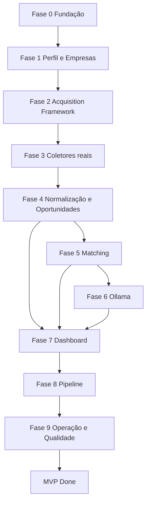

# Roadmap do MVP e critérios de aceite

## 1. Objetivo

Este roadmap transforma a arquitetura do Opportunity Radar em uma sequência prática de implementação.

O objetivo não é apenas listar funcionalidades, mas definir:

- ordem;
- dependências;
- entregáveis;
- critérios de aceite;
- testes;
- riscos;
- gates de conclusão;
- o que explicitamente fica fora do MVP.

O MVP só é considerado concluído quando valida o ciclo completo:

```text
importar empresas
↓
configurar fontes
↓
coletar
↓
preservar RawItem
↓
normalizar
↓
deduplicar
↓
avaliar
↓
analisar com Ollama
↓
exibir
↓
acompanhar candidatura
```

---

## 2. Princípios do roadmap

### 2.1 Vertical slices

Evitar construir todos os bancos, depois todas APIs e só no fim integrar.

Preferir:

```text
uma capacidade pequena
→ ponta a ponta
→ testada
→ demonstrável
```

### 2.2 Gate antes de ampliar escopo

Só iniciar grande ampliação de fontes quando:

- persistência está estável;
- idempotência funciona;
- erros são observáveis;
- um collector está bem testado.

### 2.3 Infraestrutura mínima

MVP não inclui Redis/Celery apenas porque a arquitetura final inclui.

### 2.4 Toda fase precisa ser demonstrável

Cada fase termina com uma evidência objetiva.

---

## 3. Macrodependências



---

# Fase 0 — Fundação

## 4. Objetivo

Criar um ambiente vazio, versionado e reproduzível.

---

## 5. Entregáveis

### Repositório

- estrutura base;
- README;
- `.gitignore`;
- `.dockerignore`;
- `.env.example`;
- convenções.

### Backend

- Python;
- FastAPI;
- Pydantic;
- SQLAlchemy;
- Alembic.

### Frontend

- React;
- TypeScript;
- Vite;
- Tailwind;
- Router;
- Query client.

### Infraestrutura

- PostgreSQL;
- Ollama;
- Compose;
- volumes;
- Makefile.

### Qualidade

- Pytest;
- frontend tests básicos;
- formatter/linter;
- type checks.

---

## 6. Tarefas

- [ ] criar estrutura de diretórios;
- [ ] configurar Python project;
- [ ] configurar Node project;
- [ ] criar container backend;
- [ ] criar container frontend;
- [ ] criar PostgreSQL;
- [ ] criar Ollama;
- [ ] criar `compose.yaml`;
- [ ] criar migrations iniciais;
- [ ] criar `/health/live`;
- [ ] criar `/health/ready`;
- [ ] criar `make up/down/logs/test`;
- [ ] validar persistência de volume.

---

## 7. Critério de aceite

Ambiente limpo:

```bash
docker compose up
```

precisa produzir:

```text
frontend disponível
API disponível
PostgreSQL healthy
worker/processo base disponível
Ollama ready ou degraded
```

Após reinício:

```text
dados de teste persistem
```

---

## 8. Gate

Não avançar se:

- migration só funciona manualmente no host;
- API depende de Postgres local instalado;
- `.env` contém secrets versionados;
- frontend usa endpoint hardcoded diferente por máquina.

---

# Fase 1 — Perfil e Empresas

## 9. Objetivo

Criar a base estável usada pelo matching e pela aquisição orientada a empresas.

---

## 10. Entregáveis de Profile

- `CareerProfile`;
- `ProfileVersion`;
- skills;
- experiências;
- projetos;
- preferências;
- endpoint de leitura;
- endpoint de atualização;
- ativação de versão.

---

## 11. Entregáveis de Company Radar

- `Company`;
- aliases;
- domínio;
- prioridade;
- `CompanySource`;
- status de verificação;
- listagem;
- busca.

---

## 12. Importação do catálogo pesquisado

Criar:

```text
scripts/import_research_catalog.py
```

Entradas:

```text
docs/pesquisas/auditoria-186-empresas.md
docs/pesquisas/empresas-adicionais.md
```

Flags:

```text
--input
--dry-run
--report
--resume
```

---

## 13. Regras do import

- normalizar nome;
- normalizar domínio;
- detectar aliases;
- detectar duplicatas;
- detectar colisão;
- registrar lote;
- permitir reexecução;
- não duplicar empresa;
- gerar relatório.

---

## 14. Cenários de teste

### Arquivo válido

```text
222 registros pesquisados
```

Resultado:

```text
220 identidades reconciliadas
```

### Arquivo repetido

Resultado:

```text
0 duplicatas funcionais
```

### Empresa duplicada com alias

Resultado:

```text
1 Company
2 aliases
```

### Ambiguidade real

Resultado:

```text
manual_review_required
```

---

## 15. Critério de aceite

- [ ] dry-run não altera catálogo;
- [ ] import final funciona;
- [ ] reimport é idempotente;
- [ ] ambiguidades são reportadas;
- [ ] empresas aparecem na dashboard/API;
- [ ] Notion não é dependência do fluxo de importação.

---

# Fase 2 — Framework de Acquisition

## 16. Objetivo

Construir a infraestrutura de coletores antes de implementar várias fontes.

---

## 17. Entregáveis

- `Collector` protocol;
- `CollectorRegistry`;
- `CollectorCapabilities`;
- `CollectionRequest`;
- `CollectedItem`;
- `SourceDefinition`;
- `SourceRun`;
- `RawItem`;
- checkpoints;
- error taxonomy.

---

## 18. Primeiro fluxo sem internet

Implementar `ManualCollector`.

Entrada:

```text
URL
texto
arquivo
```

Fluxo:

```text
manual
↓
CollectedItem
↓
RawItem
```

Isso valida arquitetura antes da dependência externa.

---

## 19. Persistência

Criar:

```text
acquisition.source_definition
acquisition.source_run
acquisition.raw_item
acquisition.source_checkpoint
```

Validar:

- timestamps;
- status;
- payload;
- hash;
- idempotência;
- correlation ID.

### 19.1 Gate de ativação orientado pela pesquisa

Uma `SourceDefinition` executável deve manter referência à empresa ou à
`CompanySource` quando aplicável e registrar:

- estado da evidência;
- data da revisão;
- termos revisados;
- collector homologado localmente.

Fontes importadas da pesquisa começam desabilitadas. Uma fonte só pode ser
habilitada depois da validação do endpoint, esquema, paginação e identidade
externa. ATS identificado não equivale a endpoint homologado.

---

## 20. Critério de aceite

- [ ] SourceRun possui lifecycle;
- [ ] RawItem é preservado;
- [ ] repetição não duplica identidade externa;
- [ ] parser não cria Opportunity;
- [ ] erros possuem código estável;
- [ ] execução manual é visível na API.

---

# Fase 3 — Coletores reais

## 21. Objetivo

Validar o framework com múltiplas fontes de comportamentos diferentes.

---

## 22. Ordem recomendada

```text
1. Ashby
2. Lever
3. Greenhouse
4. uma fonte remota
```

A pesquisa de fontes confirmou quatro endpoints Ashby (RevenueCat, Supabase,
Render e WorkOS), um Lever (Spotify) e identificou explicitamente o board
Greenhouse da AssemblyAI. Os três adaptadores estão implementados e suas
definições permanecem desabilitadas até revisão de termos e homologação contra
os portais reais. CI&T continua como próximo board Lever a validar pela
relevância para Brasil/home office.

---

## 23. Para cada collector

Implementar:

- capabilities;
- configuration;
- identity;
- paginação;
- timeout;
- retry;
- rate limit;
- parser;
- fixtures;
- contract tests;
- métricas;
- error mapping.

---

## 24. Greenhouse

Gate:

```text
fixture
↓
parser
↓
CollectedItem
↓
RawItem
```

Depois teste real controlado.

---

## 25. Lever

Não reutilizar parser do Greenhouse.

Reutilizar apenas:

- contratos;
- HTTP infrastructure;
- resiliência;
- testes genéricos.

---

## 26. Ashby

Mesmo princípio.

Validar que novo collector não exige modificar domínio.

---

## 27. Fonte remota

Fonte escolhida: Remotive, pela API pública e pela busca textual documentada.

Objetivo:

provar que o framework não funciona apenas para:

```text
jobs by company
```

mas também para:

```text
feed/query
```

Estado implementado:

- definição desabilitada e independente de empresa;
- busca por até dez palavras-chave;
- limite de itens aplicado na requisição e na emissão;
- atribuição da Remotive preservada no item bruto;
- intervalo persistente de seis horas entre execuções;
- bloqueio imediato de execução antecipada, sem espera longa;
- ativação bloqueada até revisão dos termos e homologação controlada.

---

## 28. Critério de aceite

Cada fonte:

- [ ] possui fixtures;
- [ ] contract tests;
- [ ] erros isolados;
- [ ] métricas;
- [ ] idempotência;
- [ ] timeout;
- [ ] retry;
- [ ] sem regra de matching;
- [ ] payload bruto salvo.

Globalmente:

```text
falha de uma fonte
≠
falha das outras
```

---

# Fase 4 — Normalização e Oportunidades

## 29. Objetivo

Transformar itens heterogêneos em oportunidades canônicas.

---

## 30. Entregáveis

- normalizador de título;
- normalizador de localização;
- work mode;
- seniority;
- contract type;
- compensation;
- skill extraction inicial;
- fingerprint;
- `Opportunity`;
- `SourceOccurrence`;
- merge;
- estados.

---

## 31. Pipeline

```text
RawItem
↓
parse result
↓
normalize fields
↓
external identity
↓
candidate fingerprint
↓
resolve identity
↓
Opportunity
↓
SourceOccurrence
```

---

## 32. Regras

Nunca perder:

```text
RawItem
SourceOccurrence
procedência
```

Mesmo quando duas ocorrências virarem uma única Opportunity.

---

## 33. Casos obrigatórios

### Mesmo external ID

```text
mesma source
mesmo external ID
```

→ mesma identidade externa.

### Mesma vaga em fontes diferentes

→ uma Opportunity, múltiplas occurrences quando resolver como equivalentes.

### Títulos semelhantes de empresas diferentes

→ oportunidades diferentes.

### Mesmo título, mesma empresa, datas distantes

→ não assumir automaticamente que é a mesma vaga.

---

## 34. Critério de aceite

- [ ] reprocessamento idempotente;
- [ ] duas fontes equivalentes podem gerar uma Opportunity;
- [ ] SourceOccurrences preservadas;
- [ ] fingerprint versionado;
- [ ] merge explicável;
- [ ] status funciona;
- [ ] procedência aparece na API.

Estado implementado da primeira fatia:

- snapshot `collected_item_v1` persistido junto ao `RawItem`;
- normalização determinística de título, URL, localização, work mode,
  seniority e contract type;
- fingerprint `v1` com empresa, título, localização, modalidade, contrato e
  data de publicação;
- `Opportunity`, `SourceOccurrence` e `NormalizationResult` persistidos;
- resolução idempotente por identidade externa, URL e fingerprint exato;
- ambiguidades separadas para revisão com razões estruturadas;
- API de listagem, detalhe, procedência, normalização e lifecycle;
- worker responsável pelo processamento periódico dos itens pendentes.
- compensação explícita por ocorrência, normalizada com `Decimal`, moeda,
  período, bruto/líquido e procedência, sem inferência pelo título;
- conflito de compensação entre ocorrências direcionado a revisão explicável;
- taxonomia inicial `skills-v1`, aliases canônicos e evidência textual por
  ocorrência;
- compensação e skills expostas na API e preservadas após reprocessamento.

Próximo incremento: iniciar Matching determinístico com snapshots versionados e
hard filters explícitos.

---

# Fase 5 — Matching determinístico

## 35. Objetivo

Criar recomendação útil antes de integrar IA.

---

## 36. Entregáveis

- `OpportunitySnapshot`;
- `ProfileSnapshot`;
- specifications;
- hard filters;
- `EligibilityResult`;
- `MatchingRuleSet`;
- pesos;
- missing policies;
- `MatchAssessment`;
- `MatchFactor`;
- verdicts;
- confidence;
- evidências.

---

## 37. Ordem de implementação

### Passo 1

Implementar Specifications:

```text
Active
RemoteCompatible
CountryAllowed
WorkAuthorizationCompatible
TimezoneCompatible
SeniorityCompatible
ContractCompatible
```

### Passo 2

Implementar score.

### Passo 3

Persistir fatores.

### Passo 4

Criar API explicável.

---

## 38. Testes

Criar golden dataset.

Casos:

```text
perfect_match
missing_salary
incompatible_country
ambiguous_seniority
partial_skills
old_job
```

---

## 39. Critério de aceite

Mesmas entradas + mesma versão de regras:

```text
mesmo score
mesmo verdict
mesmas explicações
```

Além disso:

- [ ] hard disqualifier domina verdict;
- [ ] score fica 0–100;
- [ ] fatores somam corretamente;
- [ ] UNKNOWN não vira FALSE implicitamente;
- [ ] nenhum atributo sensível entra no score.

Estado implementado da primeira fatia:

- snapshots imutáveis e autocontidos da oportunidade e do perfil usados no cálculo;
- ruleset `matching-v1` com os oito pesos documentados e missing policies explícitas;
- hard filters de lifecycle, modalidade, país, autorização, timezone, senioridade e
  contrato, sempre preservando `UNKNOWN` quando falta evidência;
- score em `Decimal`, confiança separada do score e verdicts calculados sobre o valor
  interno sem arredondamento intermediário;
- `MatchAssessment` e `MatchFactor` imutáveis no PostgreSQL, com versões, evidências,
  explicações e hash dos snapshots mais a data UTC usada para recência;
- API de avaliação, listagem e detalhe explicável;
- golden cases para match completo, salário ausente, país incompatível, senioridade
  ambígua, skills parciais e vaga antiga;
- smoke test no CI cobrindo perfil ativo, avaliação idempotente e persistência após
  reinício do PostgreSQL.

Esta base sustenta a Fase 6: a análise semântica lê o resultado determinístico e nunca
o reescreve.

---

# Fase 6 — Ollama

## 40. Objetivo

Adicionar análise semântica sem comprometer o determinismo.

---

## 41. Entregáveis

- Ollama adapter;
- model configuration;
- prompt versionado;
- JSON Schema;
- retry;
- timeout;
- cache;
- estados de degradação.

---

## 42. Prompt

Estrutura:

```text
prompts/
└── opportunity_analysis/
    └── v1/
        ├── system.md
        ├── user.md.j2
        ├── output.schema.json
        ├── examples.json
        └── metadata.yaml
```

---

## 43. Pipeline

```text
eligible/relevant opportunity
↓
build prompt
↓
Ollama
↓
validate JSON
↓
persist semantic analysis
```

---

## 44. Falha

Se Ollama estiver indisponível:

```text
MatchAssessment rules = concluído
AI = pending/failed
```

Nenhuma vaga é perdida.

---

## 45. Cache

A chave deve considerar:

```text
opportunity content version
profile version
rules version
prompt version
model
schema version
```

---

## 46. Critério de aceite

- [x] resposta válida segue schema;
- [x] JSON inválido é tratado;
- [x] timeout é tratado;
- [x] modelo indisponível não derruba fluxo;
- [x] cache evita repetição idêntica;
- [x] IA não sobrescreve disqualifier.

Estado implementado:

- contrato puro em `matching/analysis.py`: value object consultivo, schema fechado,
  estados de degradação e chave de cache;
- adapter `matching/ollama.py` sobre `/api/chat`, com `format`, `temperature: 0`,
  timeout, retry de falha retentável e classificação de erro;
- artefatos versionados em `prompts/opportunity_analysis/v1/`, carregados por
  `matching/prompts.py` com recusa explícita em caso de divergência;
- `output.schema.json` gerado de `OUTPUT_SCHEMA` por
  `scripts/export_prompt_schema.py`, com gate `--check` no CI;
- `matching.match_analysis` append-only, com trigger que bloqueia `UPDATE` e sem
  qualquer coluna de decisão — o modelo não tem onde gravar score ou disqualifier;
- reuso da análise concluída no banco antes de chamar o modelo, então o cache sobrevive
  a reinício; falha e skip ficam como histórico e não bloqueiam nova tentativa;
- `POST /api/matches/{id}/analysis` respondendo `200` inclusive degradado, e `analysis`
  exposta no detalhe e na listagem de assessments;
- `OLLAMA_ANALYSIS_ENABLED=false` troca o adapter pelo `NullAnalysisAdapter`;
- E2E no compose exercitando análise, reuso e persistência após reinício do PostgreSQL,
  com o stub respondendo `/api/chat` sem baixar modelo.

Detalhes do contrato em `docs/21-ollama-prompts.md`.

Próximo incremento: Fase 7, dashboard — começando por Overview e Opportunity Inbox
sobre os contratos já estáveis de Opportunity, Matching e análise semântica.

---

# Fase 7 — Dashboard

## 47. Objetivo

Tornar o sistema operacional sem depender de SQL ou scripts.

---

## 48. Telas mínimas

```text
Overview
Opportunity Inbox
Opportunity Detail
Companies
Sources / Executions
Profile / Preferences
Pipeline
```

---

## 49. Overview

Mostrar:

```text
novas oportunidades
high priority
recommended
sources failing
applications active
follow-ups próximos
```

---

## 50. Opportunity Inbox

Filtros:

- verdict;
- score;
- empresa;
- data;
- work mode;
- status;
- aplicada/não aplicada.

Ordenação:

```text
priority
recency
score
```

---

## 51. Opportunity Detail

Precisa mostrar:

- título;
- empresa;
- localização;
- modalidade;
- descrição;
- fontes;
- evidências;
- score;
- fatores;
- missing requirements;
- disqualifiers;
- semantic analysis;
- versões relevantes;
- ação de iniciar candidatura.

---

## 52. Companies

Mostrar:

- empresa;
- prioridade;
- aliases;
- domínio;
- sources;
- última verificação;
- últimas vagas.

---

## 53. Sources / Executions

Mostrar:

- fonte;
- enabled;
- último run;
- status;
- duração;
- itens;
- erro;
- executar manualmente.

---

## 54. Profile

Editar:

- skills;
- preferências;
- países;
- work mode;
- contratos;
- timezone;
- remuneração.

Alteração relevante cria nova versão.

---

## 55. Estados de UI

Toda tela crítica precisa considerar:

```text
loading
empty
error
partial/degraded
success
retry
```

---

## 56. Critério de aceite

Usuário consegue:

```text
abrir dashboard
↓
filtrar vagas
↓
abrir recomendação
↓
entender score
↓
ver evidência
↓
iniciar candidatura
↓
ver saúde das fontes
```

sem acessar terminal.

Esse percurso está coberto: abrir, filtrar, abrir a recomendação, entender o score, ver
a evidência e conferir a saúde das fontes já funcionam pela interface. Iniciar
candidatura é o único passo que continua dependendo da Fase 8.

Estado implementado (itens 27 a 32 da ordem prática):

- read models em `src/opportunity_radar/dashboard/`, conforme §9.4 do doc 06: as telas
  leem por query service com SQL otimizado, sem carregar agregados e sem poluir os
  repositories de cada contexto com joins de dashboard;
- `GET /api/overview`: novas oportunidades na janela de sete dias, contagem por verdict,
  análises degradadas, itens brutos pendentes e fontes cuja última execução falhou;
- `GET /api/inbox`: oportunidade com a avaliação mais recente, filtros de verdict, score
  mínimo, empresa, modalidade, status e data, busca por título ou empresa, ordenação por
  prioridade, recência ou score, e paginação;
- oportunidade ainda não avaliada continua na inbox — escondê-la faria a tela discordar
  do catálogo em silêncio;
- telas Visão geral (`/`) e Oportunidades (`/inbox`), com estados de loading, vazio,
  erro com retry e degradado; navegação compartilhada em `components/PageShell`;
- os cartões da Visão geral são links que já chegam na inbox filtrada;
- o estado da tela vive na URL, então um filtro é compartilhável e sobrevive ao reload;
- Opportunity Detail em `/opportunities/{id}`, montada sobre os contratos já existentes
  de oportunidade e matching, sem endpoint novo: título, empresa, localização,
  modalidade, descrição, remuneração com evidência textual, skills com taxonomia,
  ocorrências e fingerprint, score, verdict, confiança, filtros eliminatórios,
  fatores com peso e explicação, análise semântica e as versões de regras, taxonomia,
  perfil e conteúdo usadas na decisão;
- a análise pode ser disparada da própria tela, e falha do modelo aparece como estado
  degradado ao lado da decisão determinística, que continua completa;
- `GET /api/source-health` como `GetSourceHealthQuery`: cada fonte com o último run,
  status, duração, contadores e erro; fonte que nunca executou reporta ausência, não
  zero. A rota não é `/sources/health` porque esse caminho é um id de fonte;
- tela Fontes e execuções em `/sources`: estado de habilitação, evidência, termos e
  homologação, resultado do último run, histórico por fonte e execução manual. Fonte
  desabilitada não executa, e a tela diz o motivo em vez de esconder o botão;
- tela Perfil em `/profile`: skills, modalidades, contratos, países, janela de timezone,
  remuneração, relocação e patrocínio. Salvar encadeia criar, publicar e ativar,
  carregando o lock de cada passo, então edição concorrente falha com conflito em vez de
  vencer em silêncio; avaliações antigas continuam apontando para a versão que as gerou;
- Companies ganhou detalhe em `/companies/{id}`: aliases, domínio, fontes com método e
  data de verificação, última verificação consolidada e as últimas vagas da empresa,
  reusando a inbox filtrada em vez de uma query nova.

O que a fase ainda deve entregar:

- filtro de aplicada/não aplicada, a ação de iniciar candidatura no detalhe e os blocos
  de candidaturas e follow-up da Overview, que dependem do `ApplicationProcess` da Fase
  8. Até lá a API devolve `null` nesses campos, e não `0`: ausência de pipeline não é
  pipeline vazio, e o botão do detalhe fica desabilitado dizendo por quê.

---

# Fase 8 — Pipeline básico

## 57. Objetivo

Acompanhar candidaturas sem implementar ainda CRM avançado.

---

## 58. Entregáveis

- `ApplicationProcess`;
- `StageHistory`;
- estágios;
- next action;
- notas;
- follow-up básico.

---

## 59. Estágios iniciais

Exemplo:

```text
INTERESTED
APPLIED
SCREENING
INTERVIEW
TECHNICAL
FINAL
OFFER
REJECTED
WITHDRAWN
CLOSED
```

A lista exata deve alinhar-se ao documento de workflows.

---

## 60. Regras

- uma candidatura ativa por opportunity/profile;
- transições válidas;
- histórico imutável;
- current stage derivado/atualizado consistentemente;
- oportunidade e candidatura continuam conceitos distintos.

---

## 61. Critério de aceite

- [ ] iniciar candidatura;
- [ ] mudar estágio;
- [ ] histórico permanece;
- [ ] próxima ação pode ser definida;
- [ ] filtro da Inbox sabe se vaga já foi aplicada;
- [ ] restart preserva pipeline.

---

# Fase 9 — Operação e qualidade

## 62. Objetivo

Garantir que o MVP seja utilizável continuamente, não apenas demonstrável uma vez.

---

## 63. Entregáveis

- logs estruturados;
- doctor;
- backup;
- restore check;
- E2E;
- documentação;
- runbook;
- smoke test;
- testes de ambiente limpo.

---

## 64. Cenário E2E obrigatório

```text
empty environment
↓
docker compose up
↓
import 186 companies
↓
run collectors
↓
normalize
↓
dedupe
↓
match
↓
Ollama
↓
Inbox
↓
open opportunity
↓
start application
↓
restart
↓
state preserved
```

---

## 65. Backup gate

```text
make backup
↓
arquivo criado
↓
make restore-check
↓
novo DB
↓
smoke queries
```

Somente criar dump não atende o critério.

---

## 66. Critério de aceite

- [ ] logs identificam falhas;
- [ ] source error não derruba sistema;
- [ ] restore funciona;
- [ ] runbook funciona;
- [ ] E2E passa;
- [ ] máquina limpa consegue executar;
- [ ] documentação corresponde ao comportamento real.

---

# 67. Recorte explícito do MVP

Não entram obrigatoriamente:

```text
Redis
Celery
Celery Beat
outbox distribuído
outreach avançado
envio automático
propostas completas
simulador de entrevistas completo
projeções assíncronas materializadas
dezenas de fontes
Kubernetes
Kafka
Elasticsearch
vector DB dedicado
GraphQL
```

Esses itens podem existir como arquitetura futura, não como blocker do MVP.

---

# 68. O que NÃO cortar do MVP

Mesmo reduzido, não remover:

- RawItem;
- procedência;
- dedupe;
- hard filters;
- explicabilidade;
- versionamento básico;
- migrations;
- idempotência;
- healthchecks;
- backup;
- teste de restore;
- contratos dos collectors.

Cortar esses itens tornaria o MVP rápido de demonstrar, mas caro de evoluir.

---

# 69. Matriz de dependência resumida

| Item | Depende de |
| --- | --- |
| Import dos estudos | DB + Company model |
| Collector | Acquisition framework |
| Opportunity | RawItem/normalização |
| Matching | Opportunity + Profile |
| Ollama | Matching básico |
| Inbox | Opportunity + Matching |
| Pipeline | Opportunity |
| Operations | SourceRun/jobs |
| Backup | PostgreSQL/Compose |
| E2E | todas as fases |

---

# 70. Priorização MoSCoW

## Must

- importação;
- empresas;
- três ATSs;
- uma fonte remota;
- entrada manual;
- RawItem;
- Opportunity;
- dedupe;
- hard filters;
- score;
- Ollama;
- Inbox;
- detail;
- pipeline básico;
- Docker;
- backup;
- testes essenciais.

## Should

- CompanySource verification;
- scheduler configurável;
- retries;
- filtros avançados;
- follow-up básico;
- operations screen.

## Could

- generator Boolean integrado;
- mais remote boards;
- métricas avançadas;
- pg_trgm;
- materialized views.

## Won't — MVP

- envio automático;
- microsserviços;
- Kubernetes;
- dezenas de integrações.

---

# 71. Estratégia de branches/entregas

Cada incremento deve ser pequeno.

Exemplo:

```text
feature/profile-versioning
feature/company-import
feature/acquisition-core
feature/collector-greenhouse
feature/opportunity-dedup
feature/matching-rules
feature/ollama-adapter
feature/opportunity-inbox
```

Cada branch/PR deve possuir:

- objetivo;
- migrations;
- testes;
- screenshots quando UI;
- docs alteradas.

---

# 72. Definition of Done por item

Uma tarefa funcional só está pronta quando aplicável:

- [ ] código implementado;
- [ ] type checks;
- [ ] lint;
- [ ] unit tests;
- [ ] integration test;
- [ ] migration;
- [ ] error handling;
- [ ] logs;
- [ ] documentação;
- [ ] critério demonstrável;
- [ ] nenhuma regressão de idempotência.

---

# 73. Definition of Ready

Antes de iniciar item:

- comportamento conhecido;
- dependências concluídas;
- contrato de entrada/saída definido;
- casos de erro principais identificados;
- teste de aceite descrito.

Isso reduz retrabalho de implementar endpoint antes de definir modelo.

---

# 74. Riscos do roadmap

## Risco 1 — investir cedo demais em fontes

Mitigação:

```text
framework + 1 collector bem feito
antes de 10 collectors
```

## Risco 2 — IA virar núcleo do sistema

Mitigação:

```text
matching determinístico primeiro
```

## Risco 3 — dedupe tardio

Mitigação:

implementar antes de volume real.

## Risco 4 — modelagem muito genérica

Mitigação:

queries reais desde cedo.

## Risco 5 — UI construída antes de contratos estáveis

Mitigação:

começar Inbox após Opportunity/Matching estabilizar.

## Risco 6 — ambiente funciona apenas na máquina principal

Mitigação:

teste em ambiente limpo.

---

# 75. Ordem prática completa

Sequência recomendada:

```text
01. repository/bootstrap
02. postgres/migrations
03. backend skeleton
04. frontend skeleton
05. docker compose
06. Profile
07. Company
08. research catalog import dry-run
09. research catalog import final
10. Acquisition contracts
11. ManualCollector
12. SourceRun/RawItem
13. Ashby
14. Lever
15. Greenhouse
16. remote source
17. normalization
18. SourceOccurrence
19. Opportunity
20. fingerprint/dedupe
21. eligibility specifications
22. deterministic scoring
23. MatchAssessment
24. explainability API
25. Ollama adapter
26. prompt/schema/cache
27. Overview
28. Opportunity Inbox
29. Opportunity Detail
30. Companies
31. Sources/Executions
32. Profile/Preferences
33. ApplicationProcess
34. Pipeline
35. logging/doctor
36. backup
37. restore-check
38. E2E
39. clean-environment validation
40. documentation review
```

---

# 76. Milestones demonstráveis

## Milestone A — Base local

```text
Compose + API + Web + DB
```

## Milestone B — Catálogo

```text
222 registros importados em 220 identidades reconciliadas
```

## Milestone C — Primeira vaga

```text
collector → RawItem
```

## Milestone D — Opportunity canônica

```text
dedupe funcionando
```

## Milestone E — Recomendação

```text
score determinístico
```

## Milestone F — Análise semântica

```text
Ollama estruturado
```

## Milestone G — Produto utilizável

```text
Inbox + Details + Pipeline
```

## Milestone H — MVP operacional

```text
backup + restore + E2E + clean machine
```

---

# 77. Critérios globais de pronto

O MVP precisa possuir:

- [ ] migrations;
- [ ] rollback operacional documentado;
- [ ] testes do comportamento crítico;
- [ ] tratamento de erros;
- [ ] observabilidade mínima;
- [ ] nenhum secret versionado;
- [ ] loading/empty/error/retry na UI;
- [ ] documentação atualizada;
- [ ] demonstração ponta a ponta;
- [ ] restore validado;
- [ ] idempotência comprovada;
- [ ] procedência visível;
- [ ] decisões de matching reproduzíveis.

---

# 78. Demonstração final

A demo oficial deve começar de estado conhecido.

Roteiro:

```text
1. abrir dashboard vazia/controlada
2. mostrar catálogo
3. executar uma fonte
4. abrir SourceRun
5. mostrar RawItem
6. mostrar Opportunity consolidada
7. mostrar duas ocorrências quando houver dedupe
8. abrir score
9. explicar fatores
10. mostrar análise Ollama
11. iniciar candidatura
12. mudar estágio
13. reiniciar ambiente
14. provar persistência
15. executar backup
16. mostrar restore-check
```

---

# 79. Critério final de aceite

O MVP está concluído quando o sistema não é apenas “um crawler com uma tela”, mas um fluxo local coerente que:

```text
descobre
preserva
normaliza
consolida
explica
prioriza
organiza
recupera
```

o ciclo de oportunidades sem exigir intervenção técnica para cada execução normal.
