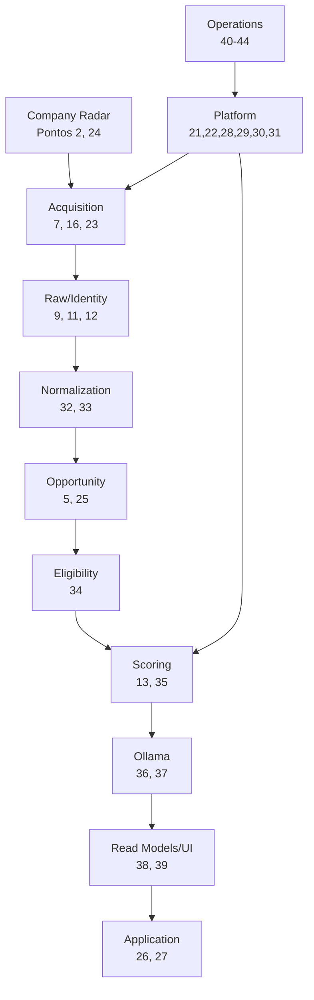
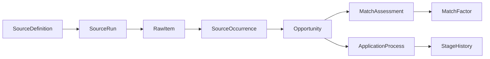

# Rastreabilidade dos 46 pontos

## 1. Objetivo

Esta matriz demonstra como os 46 pontos arquiteturais foram transformados em partes implementáveis e verificáveis do Opportunity Radar.

A rastreabilidade não serve apenas como índice de documentação.

Ela deve responder, para cada ponto:

```text
onde está documentado?
qual requisito existe?
qual componente implementa?
como será testado?
qual evidência prova que foi entregue?
```

---

## 2. Estados de rastreabilidade

Cada ponto pode assumir:

```text
DOCUMENTED
PLANNED
IMPLEMENTING
IMPLEMENTED
VERIFIED
BLOCKED
```

Durante a fase atual de arquitetura:

```text
status esperado = DOCUMENTED
```

À medida que o sistema for implementado, a matriz pode ser atualizada.

---

## 3. Matriz principal

| # | Ponto | Requisito verificável | Documento principal | Implementação esperada | Evidência/Teste |
| ---: | --- | --- | --- | --- | --- |
| 1 | visão geral do sistema | fluxo e objetivo do produto definidos | `01-visao-escopo.md` | README + arquitetura | revisão arquitetural |
| 2 | bounded contexts | contexts possuem responsabilidade própria | `08-ddd-estrategico.md` | packages/schemas | architecture tests |
| 3 | core/supporting/generic | subdomínios classificados | `08-ddd-estrategico.md` | decisão arquitetural | review |
| 4 | estrutura macro | árvore do projeto definida | `07-estrutura-projeto-final.md` | diretórios/apps | tree + tests |
| 5 | agregados/entidades/VOs | invariantes e ownership definidos | `09-ddd-tatico.md` | domain models | unit tests |
| 6 | eventos de domínio | eventos possuem significado e versão | `10-eventos-comandos-cqrs.md` | domain events | handler tests |
| 7 | fluxo ponta a ponta | coleta até pipeline executável | `02-arquitetura-mvp.md` | vertical slice | E2E |
| 8 | PostgreSQL por schemas | schemas seguem contexts | `11-modelagem-dados.md` | Alembic | migration test |
| 9 | modelo relacional geral | entidades e relações persistidas | `11-modelagem-dados.md` | SQLAlchemy/Alembic | integration |
| 10 | tabelas por domínio | cada domínio possui catálogo | `12–16` | migrations | schema inspection |
| 11 | índices/constraints | regras críticas defendidas | `11-modelagem-dados.md` | DB constraints | integration |
| 12 | deduplicação | repetição não gera Opportunity duplicada | `19-normalizacao-deduplicacao.md` | resolver/upserts | idempotency tests |
| 13 | matching híbrido | regras antes de IA | `20-matching-scoring.md` | Matching engine | golden tests |
| 14 | API REST | contratos versionáveis | `23-api-contratos.md` | FastAPI | API tests |
| 15 | serviços Docker | ambiente reproduzível | `25-docker-execucao-local.md` | Compose | clean env test |
| 16 | agenda de buscas | fontes executam por agenda | `24-assincrono-resiliencia.md` | scheduler | scheduler tests |
| 17 | segurança/privacidade | secrets e dados minimizados | `26-seguranca-privacidade.md` | config/logging | security checklist |
| 18 | testes | pirâmide e E2E definidos | `28-testes-qualidade.md` | test suites | CI |
| 19 | fases de implementação | ordem e gates claros | `29-roadmap-mvp.md` | backlog | milestone evidence |
| 20 | Context Map | relações upstream/downstream definidas | `08-ddd-estrategico.md` | published contracts | architecture review |
| 21 | CQRS pragmático | commands e queries separados quando útil | `10-eventos-comandos-cqrs.md` | handlers/query services | tests |
| 22 | Unit of Work | transações controladas por use case | `10-eventos-comandos-cqrs.md` | UoW | rollback tests |
| 23 | coletores plugáveis | nova fonte sem alterar domínio | `17-fontes-coletores.md` | Collector registry | contract tests |
| 24 | endpoints por empresa | CompanySource executável/verificável | `17-fontes-coletores.md` | verifier | integration |
| 25 | estados oportunidade | lifecycle separado de candidatura | `22-workflows-estados.md` | Opportunity | transition tests |
| 26 | estados candidatura | workflow validado | `22-workflows-estados.md` | ApplicationProcess | transition tests |
| 27 | estados mensagens | draft ≠ sent | `22-workflows-estados.md` | Outreach | state tests |
| 28 | orquestração assíncrona | jobs isolados e idempotentes | `24-assincrono-resiliencia.md` | worker/queue | retry tests |
| 29 | transactional outbox | mudança + evento atômicos | `16-dados-automacao-plataforma.md` | outbox relay | integration |
| 30 | retry | erros retryable classificados | `24-assincrono-resiliencia.md` | Tenacity/Celery | resilience tests |
| 31 | circuit breaker | fonte problemática isolada | `24-assincrono-resiliencia.md` | resilience layer | circuit tests |
| 32 | normalização títulos | títulos canônicos reproduzíveis | `19-normalizacao-deduplicacao.md` | normalizer | unit/golden |
| 33 | taxonomia skills | aliases e relações versionados | `19-normalizacao-deduplicacao.md` | taxonomy | tests |
| 34 | specifications | elegibilidade combinável | `09-ddd-tatico.md` | specifications | unit tests |
| 35 | evidência vs inferência | decisões apontam origem | `13` + `20` | EvidenceReference | API/UI test |
| 36 | prompts Ollama | prompts versionados | `21-ollama-prompts.md` | prompt artifacts | schema tests |
| 37 | cache análise | entrada versionada determina cache | `21` + `20` | analysis cache | cache tests |
| 38 | projeções leitura | UI usa read models | `03-arquitetura-final.md` | queries/views | performance tests |
| 39 | telas dashboard | telas mínimas entregues | `29-roadmap-mvp.md` | React | E2E |
| 40 | Docker Compose | operação local simples | `25-docker-execucao-local.md` | Compose/Makefile | clean env |
| 41 | variáveis ambiente | config validada e sem secrets | `25` + `26` | settings | startup tests |
| 42 | startup | dependências sobem na ordem correta | `25-docker-execucao-local.md` | health/readiness | startup test |
| 43 | backup/recovery | restore em ambiente separado | `27` + `31` | backup scripts | restore check |
| 44 | observabilidade | falhas localizáveis | `27` + `24` | logs/metrics | ops test |
| 45 | definição de pronto MVP | gate global objetivo | `29-roadmap-mvp.md` | release checklist | E2E |
| 46 | ordem prática construção | sequência executável | `29` + `30` | backlog | milestone review |

---

# 4. Detalhamento por ponto

## Ponto 1 — Visão geral do sistema

### Intenção

Definir o que o Opportunity Radar é e o que não é.

### Deve responder

```text
qual problema resolve?
quem usa?
quais são os limites?
qual é o fluxo essencial?
```

### Implementação relacionada

- README;
- docs de visão;
- arquitetura MVP;
- arquitetura final.

### Evidência

Uma pessoa nova no projeto consegue explicar o fluxo sem ler código.

---

## Ponto 2 — Bounded contexts

### Intenção

Evitar um domínio único e acoplado.

### Contexts principais

```text
Profile
Company Radar
Acquisition
Opportunities
Matching
CRM
Outreach
Proposals
Interviews
Automation
Platform
```

### Evidência

Testes arquiteturais e packages separados.

---

## Ponto 3 — Core / Supporting / Generic

### Core

```text
aquisição orientada a empresas
normalização
matching
priorização
```

### Supporting

```text
Profile
CRM
Outreach
Proposals
Interviews
```

### Generic

```text
jobs
logs
auth local
backup
infra
```

### Evidência

Decisões de arquitetura priorizam complexidade no core, não em infraestrutura genérica.

---

## Ponto 4 — Estrutura macro do projeto

### Requisito

Apps, contexts, collectors, prompts, migrations, tests e docs possuem localização explícita.

### Evidência

Árvore do repositório corresponde ao documento 06/07.

---

## Ponto 5 — Agregados, entidades e VOs

### Requisito

Objetos de domínio não são apenas modelos ORM.

### Evidência

Testes unitários de invariantes executam sem FastAPI/PostgreSQL.

---

## Ponto 6 — Eventos de domínio

### Requisito

Eventos representam fatos concluídos.

Exemplo:

```text
OpportunityNormalized
ApplicationStageChanged
ProfileVersionActivated
```

### Evidência

Handlers recebem eventos tipados/versionados.

---

## Ponto 7 — Fluxo principal ponta a ponta

### Requisito

Executar:

```text
import
→ collect
→ raw
→ normalize
→ dedupe
→ match
→ ollama
→ dashboard
→ pipeline
```

### Evidência

Teste E2E do MVP.

---

## Ponto 8 — Schemas PostgreSQL

### Requisito

Cada contexto controla schema próprio.

### Evidência

Migration inicial cria schemas explícitos.

---

## Ponto 9 — Modelo relacional

### Requisito

Relacionamentos essenciais existem sem depender de JSON universal.

### Evidência

Schema inspection + integration tests.

---

## Ponto 10 — Tabelas por domínio

### Requisito

Cada tabela possui owner.

### Evidência

Catálogo de tabelas nos docs 12–16.

---

## Ponto 11 — Índices e constraints

### Requisito

Integridade e performance crítica não dependem apenas da aplicação.

Exemplos:

```text
unique external identity
score 0–100
version
pending jobs index
outbox pending index
```

### Evidência

Testes que tentam inserir estado inválido.

---

## Ponto 12 — Deduplicação

### Requisito

Distinguir:

```text
mesmo item externo
```

de:

```text
mesma oportunidade em fontes diferentes
```

### Evidência

Golden/idempotency tests.

---

## Ponto 13 — Matching híbrido

### Requisito

Ordem:

```text
hard filters
score
LLM
```

### Evidência

Sistema produz score mesmo com Ollama desligado.

---

## Ponto 14 — API REST

### Requisito

Presentation acessa application layer.

### Evidência

Nenhuma route acessa SQLAlchemy diretamente.

---

## Ponto 15 — Serviços Docker

### Requisito

MVP sobe via Compose.

### Evidência

Teste em ambiente limpo.

---

## Ponto 16 — Agenda de buscas

### Requisito

Scheduler apenas agenda comandos.

Não contém parser.

### Evidência

SourceExecution pode ser invocada manualmente e pelo scheduler com mesmo handler.

---

## Ponto 17 — Segurança e privacidade

### Requisito

Minimização de dados e secrets externos ao código.

### Evidência

Secret scan + revisão de logs.

---

## Ponto 18 — Estratégia de testes

### Requisito

Separar:

```text
unit
integration
contract
E2E
architecture
resilience
```

### Evidência

Suites independentes no repositório.

---

## Ponto 19 — Fases de implementação

### Requisito

Roadmap possui gates e dependências.

### Evidência

Milestones fecham somente quando critérios passam.

---

## Ponto 20 — Context Map

### Requisito

Integrações entre contexts têm padrão.

Exemplos:

```text
Published Language
ACL
Customer/Supplier
Domain Event
```

### Evidência

DTO/evento publicado explicitamente.

---

## Ponto 21 — CQRS pragmático

### Requisito

Separar escrita complexa de leitura orientada à UI sem criar infraestrutura desnecessária.

### Evidência

`commands/` e query services/read models.

---

## Ponto 22 — Unit of Work

### Requisito

Use case controla commit/rollback.

### Evidência

Erro no meio da operação reverte estado atômico.

---

## Ponto 23 — Coletores plugáveis

### Requisito

Novo collector exige:

```text
adapter
registry
config
fixtures
tests
```

não mudança de domínio.

### Evidência

Adicionar collector fake em teste sem alterar Opportunity.

---

## Ponto 24 — Endpoints por empresa

### Requisito

Company Radar conhece endpoints descobertos/verificados.

### Evidência

Empresa mostra fonte e status de verificação.

---

## Ponto 25 — Estados de oportunidade

### Requisito

Lifecycle editorial.

Exemplos:

```text
DISCOVERED
ACTIVE
STALE
CLOSED
ARCHIVED
REJECTED
```

### Evidência

Transitions test.

---

## Ponto 26 — Estados de candidatura

### Requisito

Separados da oportunidade.

### Evidência

Opportunity pode estar `ACTIVE` e candidatura `INTERVIEW`.

---

## Ponto 27 — Estados de mensagens

### Requisito

Gerada/revisada/enviada são estados distintos.

### Evidência

Mensagem criada por IA nunca aparece como enviada sem ação correspondente.

---

## Ponto 28 — Orquestração assíncrona

### Requisito

Jobs são idempotentes e isoláveis.

### Evidência

Retry do mesmo job não duplica efeitos.

---

## Ponto 29 — Transactional outbox

### Requisito

Evento e mudança transacional são gravados juntos.

### Evidência

Teste de rollback.

---

## Ponto 30 — Política de retry

### Requisito

Retry somente para erro temporário.

### Evidência

400 não retry; timeout retry conforme policy.

---

## Ponto 31 — Circuit breaker

### Requisito

Fonte repetidamente falha sem consumir recursos indefinidamente.

### Evidência

Após threshold, chamadas são bloqueadas até half-open.

---

## Ponto 32 — Normalização de títulos

### Requisito

Variações externas convergem para representação controlada.

### Evidência

Golden dataset.

---

## Ponto 33 — Taxonomia de skills

### Requisito

Aliases e relações explícitas.

### Evidência

`React.js`, `ReactJS` e `React` convergem sem substring arbitrária.

---

## Ponto 34 — Specifications de elegibilidade

### Requisito

Resultado ternário/explicável.

### Evidência

Cada spec possui testes `TRUE/FALSE/UNKNOWN`.

---

## Ponto 35 — Evidência versus inferência

### Requisito

Sistema consegue mostrar origem de cada claim.

### Evidência

Opportunity Detail diferencia fato e IA.

---

## Ponto 36 — Prompts Ollama

### Requisito

Prompt é artefato versionado.

### Evidência

Assessment aponta `prompt_version`.

---

## Ponto 37 — Cache de análise

### Requisito

Cache inválido quando entrada relevante muda.

### Evidência

Trocar profile version gera cache miss.

---

## Ponto 38 — Projeções de leitura

### Requisito

Telas críticas não precisam reconstituir agregados inteiros.

### Evidência

Inbox query/read model dedicado.

---

## Ponto 39 — Telas da dashboard

### Requisito

Overview, Inbox, Detail, Companies, Sources, Profile e Pipeline.

### Evidência

E2E navegando pelas telas.

---

## Ponto 40 — Docker Compose

### Requisito

Operação local reproduzível.

### Evidência

`docker compose up` em ambiente limpo.

---

## Ponto 41 — Variáveis de ambiente

### Requisito

`.env.example` sem secrets e configuração validada.

### Evidência

startup falha com mensagem clara em variável obrigatória inválida.

---

## Ponto 42 — Sequência de startup

### Requisito

Banco → migration → apps; Ollama degradável.

### Evidência

subir ambiente do zero.

---

## Ponto 43 — Backup e recuperação

### Requisito

Backup só é considerado válido após restore verificável.

### Evidência

`make restore-check`.

---

## Ponto 44 — Observabilidade

### Requisito

Falha é localizável por source/job/correlation ID.

### Evidência

dashboard Operations + logs.

---

## Ponto 45 — Definição de pronto do MVP

### Requisito

Critérios objetivos, não opinião.

### Evidência

checklist do roadmap + E2E.

---

## Ponto 46 — Ordem prática de construção

### Requisito

Dependências técnicas respeitadas.

### Evidência

milestones implementados na ordem planejada ou desvio documentado.

---

# 5. Matriz por componente

## Profile

Cobre principalmente:

```text
2, 5, 8, 9, 10, 34, 35
```

## Company Radar

```text
2, 5, 8, 9, 10, 23, 24, 35
```

## Acquisition

```text
2, 6, 7, 8, 9, 10, 12, 16, 23, 24, 28, 30, 31
```

## Opportunities

```text
5, 6, 7, 9, 10, 12, 25, 32, 35
```

## Matching

```text
5, 6, 13, 20, 34, 35, 36, 37
```

## CRM

```text
5, 6, 26, 27, 39
```

## Platform/Automation

```text
6, 21, 22, 28, 29, 30, 31, 40, 41, 42, 43, 44
```

---

# 6. Matriz por tipo de teste

## Unit

Valida principalmente:

```text
5
12
13
25
26
27
32
33
34
```

## Integration

```text
8
9
10
11
14
16
22
29
37
```

## Contract

```text
14
20
23
24
36
```

## E2E

```text
7
39
40
42
45
```

## Resilience

```text
28
30
31
43
44
```

---

# 7. Matriz por fase do MVP

## Fundação

```text
1
4
8
14
15
17
18
40
41
42
```

## Perfil/empresas

```text
2
3
5
9
10
20
24
```

## Acquisition

```text
6
7
12
16
23
28
30
31
```

## Matching

```text
13
32
33
34
35
36
37
```

## Dashboard/pipeline

```text
25
26
27
38
39
```

## Operação

```text
21
22
29
43
44
45
46
```

---

# 8. Evidências de conclusão

Cada item implementado deve apontar para pelo menos uma evidência concreta.

Tipos aceitos:

```text
commit/PR
migration
test
screenshot
log
API response
fixture
benchmark
runbook execution
backup restore report
```

A matriz não deve usar:

```text
"feito"
```

como única prova.

---

# 9. Template de atualização futura

Ao implementar um ponto, acrescentar:

```text
Status:
Owner:
Implemented in:
Tests:
Evidence:
Known limitations:
```

Exemplo:

```text
Point: 23
Status: VERIFIED
Implemented in: collectors/registry.py
Tests: tests/contracts/test_collectors.py
Evidence: CI build #...
Known limitations: only Greenhouse/Lever/Ashby in MVP
```

---

# 10. Critério de `DOCUMENTED`

Um ponto está apenas `DOCUMENTED` quando:

- decisão existe;
- documentação explica;
- implementação ainda não foi verificada.

Isso evita confundir arquitetura planejada com software entregue.

---

# 11. Critério de `IMPLEMENTED`

Um ponto pode ser `IMPLEMENTED` quando:

- código existe;
- migration/config existe quando necessário;
- integração básica funciona.

Ainda pode faltar verificação independente.

---

# 12. Critério de `VERIFIED`

Somente quando existe:

```text
implementação
+
teste/evidência
+
critério de aceite cumprido
```

---

# 13. Regras de consistência da matriz

### Regra 1

Nenhum item `VERIFIED` sem teste/evidência.

### Regra 2

Mudança arquitetural atualiza documento principal e matriz.

### Regra 3

Se um ponto for removido do escopo, status:

```text
DEFERRED
```

com justificativa.

### Regra 4

Não marcar requisito da arquitetura final como obrigatório para MVP se o roadmap o adiou explicitamente.

---

# 14. MVP versus final

Alguns pontos possuem implementação mínima no MVP e completa na versão final.

Exemplo:

### Ponto 28 — Assíncrono

MVP:

```text
worker local + APScheduler
```

Final:

```text
Redis + Celery + workers especializados
```

### Ponto 38 — Read models

MVP:

```text
queries SQL dedicadas
```

Final:

```text
views/materialized projections/event consumers
```

### Ponto 29 — Outbox

Pode ser adiado no MVP se não houver efeito assíncrono que exija a garantia, permanecendo requisito da arquitetura final.

A matriz deve registrar o nível esperado por release.

---

# 15. Cobertura do MVP

Classificação sugerida:

## Obrigatório no MVP

```text
1
2
4
5
7
8
9
11
12
13
14
15
16
17
18
19
20
22
23
24
25
26
30
32
33
34
35
36
37
39
40
41
42
43
44
45
46
```

## Parcial no MVP / completo depois

```text
6
10
21
27
28
31
38
```

## Principalmente arquitetura final

```text
29
```

Essa classificação não remove documentação; apenas define gate de release.

---

# 16. Gate de rastreabilidade antes do MVP

Antes de declarar MVP concluído:

- [ ] nenhum item obrigatório permanece apenas `DOCUMENTED`;
- [ ] todos os itens obrigatórios estão `VERIFIED`;
- [ ] itens parciais possuem escopo MVP explicitado;
- [ ] itens finais diferidos possuem justificativa;
- [ ] documentação aponta para comportamento atual;
- [ ] nenhum teste de aceite está quebrado;
- [ ] matriz foi revisada após o último release candidate.

---

# 17. Rastreabilidade de requisitos críticos

## Idempotência

Relaciona:

```text
11
12
22
23
28
29
```

Teste-chave:

```text
reexecutar não duplica efeito
```

## Explicabilidade

Relaciona:

```text
13
34
35
36
37
```

Teste-chave:

```text
score pode ser explicado e reproduzido
```

## Resiliência

Relaciona:

```text
16
23
28
30
31
40
42
43
44
```

Teste-chave:

```text
falha parcial não derruba produto
```

## Evolução

Relaciona:

```text
2
4
20
21
23
28
38
46
```

Teste-chave:

```text
novo módulo/fonte não rompe boundaries
```

---

# 18. Rastreabilidade do fluxo principal



---

# 19. Rastreabilidade de dados



Relaciona principalmente:

```text
8
9
10
11
12
13
25
26
35
```

---

# 20. Rastreabilidade operacional

Fluxo:

```text
Compose
↓
startup
↓
migration
↓
health
↓
scheduler
↓
jobs
↓
logs
↓
backup
↓
restore
```

Relaciona:

```text
15
16
17
18
28
30
31
40
41
42
43
44
```

---

# 21. Riscos de rastreabilidade

## Documento divergente do código

Mitigação:

- docs no mesmo repositório;
- revisão em PR;
- checklist.

## Teste existe, mas não prova requisito

Mitigação:

usar nome/descrição ligados ao ponto.

## Item marcado como completo cedo demais

Mitigação:

usar estados distintos `IMPLEMENTED` e `VERIFIED`.

## Arquitetura final bloqueia MVP

Mitigação:

coluna de release/escopo.

---

# 22. Sugestão de automação futura

Uma vez iniciado o desenvolvimento, essa matriz pode ser complementada por arquivo estruturado:

```yaml
requirements:
  - id: 23
    title: pluggable collectors
    release: MVP
    status: VERIFIED
    tests:
      - tests/contracts/test_collectors.py
```

Um script pode validar:

- IDs duplicados;
- requisitos sem owner;
- requisitos obrigatórios sem teste;
- links quebrados.

Isso é opcional, não requisito inicial.

---

# 23. Definition of Done da documentação

A documentação dos 46 pontos está concluída quando:

1. cada ponto possui documento principal;
2. cada ponto possui requisito verificável;
3. cada ponto possui implementação esperada;
4. cada ponto possui estratégia de teste;
5. MVP × final está diferenciado;
6. não há contradição com roadmap;
7. links relativos funcionam;
8. terminologia segue o glossário/DDD.

---

# 24. Estado atual

No estágio atual do projeto, esta matriz representa:

```text
arquitetura documentada
+
plano verificável
```

e não afirma que o software já está implementado.

Ao iniciar o desenvolvimento, a recomendação é atualizar a tabela principal incrementalmente em cada milestone.

---

# 25. Conclusão

Os 46 pontos formam um sistema coerente quando agrupados em cinco propriedades:

```text
1. domínio bem delimitado
2. dados rastreáveis
3. aquisição resiliente
4. recomendação explicável
5. operação reproduzível
```

A matriz deve permanecer viva até o final do projeto.

O critério mais importante é:

```text
nenhuma decisão arquitetural crítica
deve existir somente "na cabeça" do desenvolvedor.
```

Ela precisa apontar para:

```text
documento
→ código
→ teste
→ evidência
```
