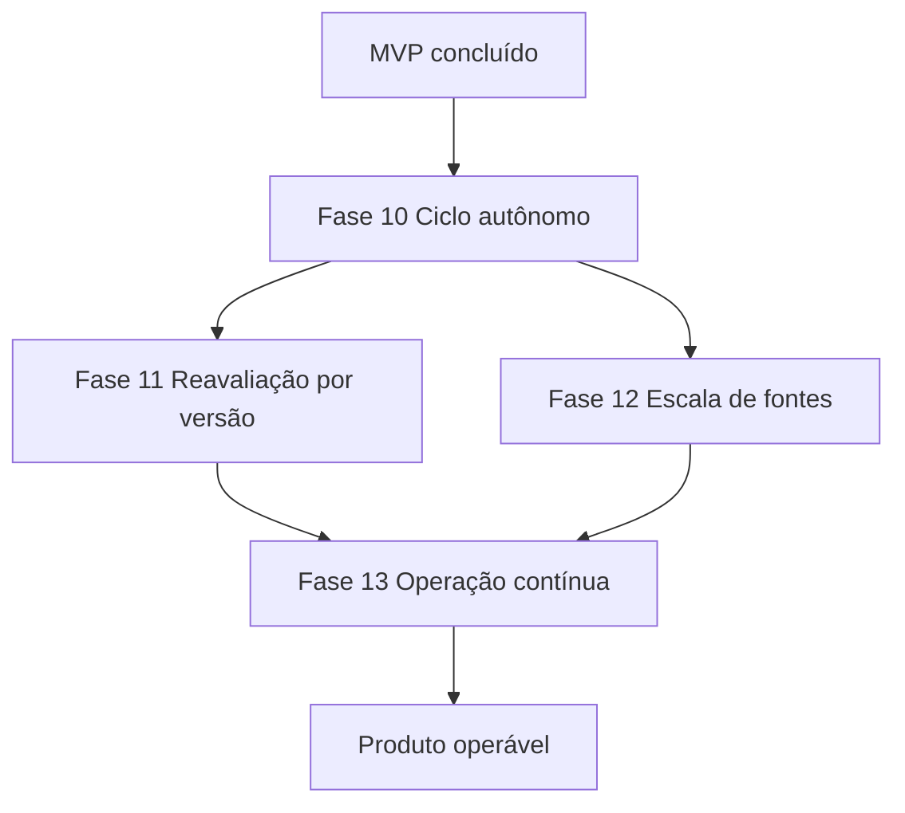

# Roadmap pós-MVP e critérios de aceite

## 1. Objetivo

O MVP está fechado. O ciclo completo do §1 do doc 29 funciona ponta a ponta, tem
migrations, testes, E2E no compose, backup com gate de restauração e documentação que
corresponde ao comportamento real.

Este roadmap trata do que o MVP deliberadamente não prometeu e que agora separa
"demonstrável" de "utilizável".

O recorte é estreito de propósito: nenhuma fase aqui existe para completar arquitetura.
Cada uma existe porque a ausência dela custa trabalho manual toda vez que o sistema roda.

Os itens de execução deste roadmap foram quebrados em cards atômicos, organizados por
fase no [índice de cards](33-roadmap-pos-mvp/README.md). O presente documento continua
sendo a fonte estratégica de contexto, decisões e gates; os cards são a fonte operacional
para implementação, acompanhamento e aceite.

---

## 2. Estado verificado na conclusão do MVP

Auditoria feita contra o código, não contra os checkboxes do doc 29.

| Fase | Evidência |
| --- | --- |
| F0 Fundação | `compose.yaml`, nove migrations, `/health/live`, `/health/ready`, Makefile |
| F1 Perfil e Empresas | `scripts/import_research_catalog.py`, `profile/`, `companies/` |
| F2 Framework | `acquisition/domain.py`, `acquisition/service.py`, SourceRun, RawItem, checkpoint |
| F3 Coletores | `ashby.py`, `lever.py`, `greenhouse.py`, `remotive.py`, mais o manual |
| F4 Normalização | `opportunities/domain.py`, fingerprint `v1`, SourceOccurrence, compensação, skills |
| F5 Matching | `matching/domain.py`, ruleset `matching-v1`, hard filters, MatchFactor |
| F6 Ollama | `matching/ollama.py`, `prompts/opportunity_analysis/v1/`, tabela append-only |
| F7 Dashboard | nove telas em `apps/web/src/routes/`, cobrindo as sete mínimas do §48 |
| F8 Pipeline | `pipeline/domain.py`, dez estágios, índice parcial único, `expected_version` |
| F9 Operação | `doctor.py`, `backup.py`, `restore_check.py`, logs JSON com correlation id, runbook |

O workflow `.github/workflows/pipeline.yml` executa o cenário do §64 inteiro no compose:
importar catálogo, aquisição, matching, análise semântica, read models do dashboard,
pipeline de candidatura, reinício do PostgreSQL, gate de backup e restauração, e o doctor.

Nenhum critério marcado como concluído no doc 29 foi encontrado sem implementação
correspondente.

---

## 3. Lacunas que motivam este roadmap

### 3.1 Nada roda sozinho, exceto normalização

`src/opportunity_radar/worker.py` agenda apenas `heartbeat` e `normalize_opportunities`.

```text
coleta      → make collect          (terminal)
matching    → POST /api/matches/evaluate  (sem gatilho automático)
análise     → botão no detalhe      (uma oportunidade por vez)
```

O §62 do doc 29 pede um MVP utilizável continuamente. Hoje cada ciclo normal exige
intervenção técnica, que é exatamente o que o §79 declara como critério final de aceite.

### 3.2 Não existe caminho de UI para gerar um score

`POST /api/matches/evaluate` existe e é testado. Nenhuma tela chama.
`OpportunityDetailPage.tsx` só oferece "Analisar com Ollama", que age sobre um
`MatchAssessment` que já existe.

Consequência: vaga coletada entra na Inbox sem avaliação, e os filtros de verdict e score
não a alcançam. O percurso do §56 só se completa para oportunidades avaliadas fora da
interface.

### 3.3 Catálogo de 220 empresas alimenta seis fontes

`scripts/enable_sources.py` habilita apenas `ashby`, `lever`, `greenhouse` e `remotive`,
e ainda restringe Greenhouse a `GREENHOUSE_CONFIRMED_BOARDS`.

O Company Radar está correto e populado, mas não alimenta a aquisição. A pesquisa virou
catálogo e parou ali.

### 3.4 Versão nova de perfil não reavalia nada

Ativar uma `ProfileVersion` não invalida nem reprocessa assessments existentes.

Manter o assessment antigo imutável está certo — ele registra a decisão tomada com a
versão que a gerou. O que falta é a reconciliação: o perfil muda e a Inbox continua
respondendo com o perfil anterior, sem dizer que está desatualizada.

### 3.5 O doc 29 contradiz o doc 29

O §77, critérios globais de pronto, está inteiramente marcado.
O §72, definition of done por item, está inteiramente desmarcado.

### 3.6 O catálogo não equivale a fontes executáveis

Os 220 registros representam empresas pesquisadas, não 220 integrações prontas. O import
atual cria seis `SourceDefinition` ligadas a empresas e uma fonte independente da
Remotive. `scripts/enable_sources.py` considera somente endpoints confirmados, o board
Greenhouse explicitamente homologado e a Remotive. Depois disso, habilita apenas as
fontes cujo probe ao vivo respondeu e foi interpretado com sucesso.

`scripts/collect.py` executa somente fontes habilitadas. Portanto, uma rodada pode cobrir
menos de sete fontes por três motivos distintos:

```text
fonte ainda não homologada ou desabilitada
probe de habilitação falhou
execução da fonte falhou ou foi limitada por filtro
```

Existe ainda um caso que mascara a cobertura: `--keywords` é enviado hoje a todas as
fontes selecionadas, mas apenas a Remotive declara `keyword_search=true`. Ashby, Lever e
Greenhouse rejeitam a requisição com `INVALID_CONFIGURATION`. Uma busca com palavras-chave
pode, assim, parecer uma busca em todas as fontes enquanto somente a Remotive executa.

### 3.7 A classificação conhecida fica enviesada para Senior

`infer_seniority` não usa `SENIOR` como padrão. Sem evidência, o resultado correto é
`UNKNOWN`. Porém, a regra lê apenas o título e metadados chamados `seniority`, `level`,
`experience_level` ou `experienceLevel`. Os coletores atuais não publicam esses campos no
contrato normalizado.

Na prática, a senioridade vem quase sempre do título:

```text
"Senior Backend Engineer" → SENIOR
"Backend Engineer"        → UNKNOWN
"Software Engineer II"    → UNKNOWN
```

Como empresas costumam escrever `Senior` no título e omitir o nível intermediário, a
distribuição das vagas classificadas fica concentrada em `SENIOR`; isso não prova que a
fonte retornou somente vagas sênior. Sem contagem por fonte de `UNKNOWN` versus níveis
conhecidos, o sistema mistura distribuição real do mercado com lacuna do classificador.

---

## 4. Macrodependências



A Fase 10 bloqueia as demais. Escalar fontes antes de automatizar o ciclo multiplica o
trabalho manual por fonte, que é o Risco 1 do §74 aparecendo de novo em outra camada.

---

# Fase 10 — Ciclo autônomo

Cards de execução: [Fase 10 — Ciclo autônomo](33-roadmap-pos-mvp/fase-10/README.md).

## 5. Objetivo

Fazer o ciclo `coletar → normalizar → avaliar → analisar` acontecer sem terminal.

---

## 6. Entregáveis

- job `evaluate_pending` no worker;
- job `analyze_pending` no worker;
- job `collect_enabled_sources` no worker;
- política explícita de seleção, retry e exclusão mútua por job;
- agendamento por `SourceDefinition`, usando os campos persistidos que já existem;
- origem `SCHEDULED` ou `ON_DEMAND` registrada em cada `SourceRun`;
- kill switch para cada job funcional do worker;
- observabilidade de cada job nos logs estruturados.

---

## 7. Passo 1 — Avaliação automática

Selecionar oportunidade `DISCOVERED` ou `ACTIVE` sem `MatchAssessment` atual para a
identidade completa da entrada e avaliar.

```text
Opportunity DISCOVERED ou ACTIVE
↓
sem assessment para a entrada atual
↓
MatchingService.evaluate
↓
MatchAssessment + MatchFactor
```

Uma avaliação está atual somente quando representa a mesma combinação de:

```text
opportunity id + opportunity version
profile version ativa
rules version atual
taxonomy version atual
data de referência UTC
```

A data de referência já participa do `input_hash`. Portanto, a política inicial permite
no máximo uma avaliação por oportunidade por dia UTC. Isso mantém o fator de recência
atualizado sem produzir mais de uma linha idêntica no mesmo dia. Uma mudança de versão
torna a oportunidade pendente imediatamente, sem esperar o dia seguinte.

Regras:

- lote limitado por passada, para que uma coleta grande não segure o worker;
- correlation id próprio por passada, como já faz `normalize_opportunities`;
- falha de uma oportunidade não aborta o lote;
- reexecução não cria assessment duplicado para a mesma identidade completa;
- oportunidade `CLOSED`, `ARCHIVED` ou `REJECTED` não entra no job;
- ausência de perfil ativo degrada a passada com log explícito, sem derrubar o worker.

O serviço já é idempotente e determinístico. Esta fase agenda o que existe, não muda a
regra de matching.

---

## 8. Passo 2 — Análise automática

Selecionar assessment atual com verdict elegível e sem análise concluída.

```text
MatchAssessment relevante
↓
cache já resolvido no banco?
↓ não
Ollama
↓
MatchAnalysis
```

Regras:

- a política inicial inclui `HIGH_PRIORITY`, `RECOMMENDED`, `WATCHLIST` e
  `REVIEW_REQUIRED`, e exclui `LOW_MATCH` e `INELIGIBLE`;
- a lista de verdicts elegíveis é configuração do worker, não condição espalhada pelo
  código;
- reusar o cache existente antes de chamar o modelo, como o §45 do doc 29 exige;
- limite de chamadas por passada, porque o modelo é local e disputa CPU com o resto;
- `AI_FAILED` e `AI_SKIPPED` continuam sendo histórico, mas só voltam à fila depois de
  cooldown configurável, com padrão de uma hora e limite padrão de três tentativas em
  24 horas por assessment;
- sucesso limpa o estado de retry; `AI_COMPLETED` só é refeito com `refresh` explícito;
- job e ação manual disputam a mesma claim persistente, para que duas chamadas
  concorrentes não gravem duas análises concluídas para o mesmo cache key;
- modelo fora do ar degrada o job, nunca a avaliação determinística.

---

## 9. Passo 3 — Coleta agendada

Generalizar o que a Remotive já faz. `SourceDefinition.schedule` e
`rate_limit_policy.minimum_run_interval_seconds` já existem. O trabalho desta fase é
fazer o worker respeitar os dois, não criar outra representação de intervalo.

```text
SourceDefinition enabled
↓
intervalo vencido?
↓ sim
CollectionRequest
↓
SourceRun + RawItem
```

Regras:

- fonte desabilitada nunca executa, e isso continua valendo quando o gatilho é o relógio;
- `schedule = null` significa que a fonte não tem execução agendada, ainda que esteja
  habilitada;
- o schedule define quando tentar e `minimum_run_interval_seconds` continua sendo o
  limite inferior entre acessos à fonte;
- após falhas consecutivas, o intervalo efetivo dobra até o teto configurável de 24
  horas; um sucesso restaura o intervalo normal;
- execução agendada e execução sob demanda gravam o mesmo `SourceRun`;
- `execution_trigger` distingue `SCHEDULED` de `ON_DEMAND` e não substitui o
  `CollectionMode` existente (`DISCOVERY`, `INCREMENTAL` ou `MANUAL`);
- adicionar `execution_trigger` exige migration, backfill, resposta da API e exibição no
  histórico de runs;
- o worker monta cada `CollectionRequest` conforme as capabilities do collector;
- palavras-chave vão somente para fontes com `keyword_search=true`; ausência dessa
  capability nunca impede a coleta completa de um board de empresa;
- filtros locais de título ou skill acontecem depois da persistência do `RawItem`, sem
  descartar a evidência recebida da fonte;
- `collection_timezone`, já usado pelo scheduler, continua governando expressões de
  calendário presentes em `schedule`.

---

## 10. Passo 4 — Kill switch

Cada job funcional precisa ser desligável sem editar código:

```text
WORKER_COLLECT_ENABLED
WORKER_NORMALIZE_ENABLED
WORKER_MATCH_ENABLED
WORKER_ANALYZE_ENABLED
```

Desligado significa job não agendado, não job agendado que retorna cedo. O log de
inicialização diz quais jobs subiram. `heartbeat` permanece obrigatório enquanto o
worker estiver ativo e não possui kill switch.

---

## 11. Passo 5 — Ação manual de avaliar

Mesmo com o job, o detalhe da oportunidade ganha "avaliar agora".

Automatizar o caminho normal não elimina a necessidade de forçar o caminho excepcional:
depurar uma regra, conferir um resultado, reavaliar depois de corrigir um dado.

---

## 12. Critério de aceite

Pré-condição do cenário:

```text
migrations aplicadas
uma ProfileVersion ativa
uma SourceDefinition homologada, habilitada e com schedule
```

O bootstrap inicial continua sendo uma operação explícita e documentada. Esta fase
automatiza a operação recorrente; ela não transforma importação de catálogo, aceite de
termos ou criação do perfil em efeitos colaterais do Compose.

Com um ambiente inicializado:

```bash
docker compose up -d
```

Depois disso, sem nenhum comando de terminal:

```text
fonte habilitada executa sozinha
RawItem aparece
Opportunity DISCOVERED é normalizada
MatchAssessment é gerado
análise semântica é anexada ou degrada explicitamente
Inbox mostra a vaga com score
```

Além disso:

- [ ] job desligado não aparece no scheduler;
- [ ] fonte habilitada sem `schedule` não executa automaticamente;
- [ ] falha de uma fonte não interrompe os outros jobs;
- [ ] uma rodada com palavras-chave consulta a Remotive com o filtro e executa Ashby,
      Lever e Greenhouse sem enviar um parâmetro que eles não suportam;
- [ ] o resumo da rodada lista toda fonte elegível como concluída, falha, pulada ou
      bloqueada, sem omitir fonte silenciosamente;
- [ ] reinício do worker não duplica assessment nem análise concluída;
- [ ] ação manual concorrente com o job não duplica análise concluída;
- [ ] `SourceRun` expõe `execution_trigger` sem confundi-lo com `CollectionMode`;
- [ ] cada passada é rastreável por correlation id;
- [ ] ausência de perfil ativo aparece como estado degradado e não encerra o worker;
- [ ] avaliação manual continua disponível no detalhe.

---

## 13. Gate

Não avançar se:

- o job de análise consegue sobrescrever um disqualifier;
- coleta agendada ignora o estado `enabled`;
- uma passada longa impede a próxima de rodar em vez de ser coalescida;
- falhas de Ollama causam retry sem cooldown ou sem limite;
- execução agendada e manual conseguem adquirir a mesma unidade de trabalho;
- o worker precisa de reinício manual depois de uma falha de fonte.

---

# Fase 11 — Reavaliação por mudança de versão

Cards de execução: [Fase 11 — Reavaliação por mudança de versão](33-roadmap-pos-mvp/fase-11/README.md).

## 14. Objetivo

Fazer a Inbox responder ao perfil atual sem reescrever o passado.

---

## 15. Entregáveis

- reavaliação disparada por ativação de `ProfileVersion`;
- reavaliação disparada por bump de ruleset;
- reavaliação disparada por nova versão do conteúdo da oportunidade ou da taxonomia;
- metadados de atualidade no contrato da Inbox;
- indicação de assessment desatualizado na interface.

---

## 16. Regras

- assessment antigo permanece imutável e continua apontando para a versão que o gerou;
- o resultado novo é outra linha, não uma correção da anterior;
- quando existe avaliação atual, a Inbox a exibe;
- enquanto a avaliação atual não existe, a Inbox usa a avaliação mais recente como
  fallback e a marca como desatualizada;
- quando nunca houve avaliação, a oportunidade continua na Inbox como não avaliada;
- o contrato expõe `assessment_profile_version_id`, `active_profile_version_id`,
  `assessment_opportunity_version`, `current_opportunity_version`, `rules_version` e
  `is_stale`;
- o worker detecta bump de ruleset comparando a versão persistida com a constante ativa,
  sem depender de um evento em memória;
- oportunidade ainda não reavaliada aparece marcada, não escondida — esconder faria a
  tela discordar do catálogo em silêncio, que é a mesma regra já adotada no §56.

---

## 17. Critério de aceite

- [ ] em uma fixture remota conhecida, trocar a modalidade aceita no `/profile` de
      `REMOTE` para `ONSITE` muda o verdict da Inbox sem intervenção;
- [ ] assessments anteriores continuam legíveis e versionados;
- [ ] antes e durante o backfill, o card mostra o assessment anterior com `is_stale`;
- [ ] depois do backfill, o card mostra o assessment atual sem `is_stale`;
- [ ] bump de ruleset produz o mesmo comportamento que bump de perfil;
- [ ] atualização do conteúdo da oportunidade produz nova avaliação para a nova versão;
- [ ] reavaliação em massa é retomável e não duplica.

---

# Fase 12 — Escala e qualidade de fontes

Cards de execução: [Fase 12 — Escala e qualidade de fontes](33-roadmap-pos-mvp/fase-12/README.md).

## 18. Objetivo

Fazer o catálogo pesquisado alimentar a aquisição em vez de decorá-la, sem confundir
quantidade de empresas, cobertura real de coleta e qualidade da normalização.

---

## 19. Entregáveis

- `scripts/discover_sources.py`;
- proposta de `SourceDefinition` com evidência;
- ação de detectar fonte na tela de empresa;
- homologação dos boards restantes;
- relatório de cobertura por estágio da fonte;
- distribuição de senioridade por fonte, incluindo `UNKNOWN`;
- mapeamento versionado de senioridade por collector.

---

## 20. Regra do gate preservada

O §19.1 do doc 29 continua valendo integralmente.

```text
ATS identificado
≠
endpoint homologado
```

Toda fonte proposta nasce desabilitada e registra a evidência que motivou a proposta.
Enquanto não houver homologação, `reviewed_at` permanece nulo, `terms_reviewed=false` e
`collector_local_tested=false`. O script propõe; revisão, teste e habilitação continuam
sendo decisões explícitas.

### 20.1 Cobertura observável

O produto precisa separar estas contagens:

```text
empresas no catálogo
fontes propostas
fontes homologadas
fontes habilitadas
fontes elegíveis na rodada
fontes executadas com sucesso, falha, bloqueio ou skip
fontes que produziram ao menos um RawItem
```

Uma fonte sem vagas no momento é diferente de uma fonte que não executou. O relatório de
cobertura registra ambas sem transformar zero itens em erro e sem omitir falhas.

### 20.2 Senioridade com procedência

A classificação segue esta precedência:

```text
campo estruturado homologado da fonte
↓ ausente
marcador explícito no título
↓ ausente ou conflitante
UNKNOWN
```

Cada collector documenta quais campos estruturados usa e como os valores externos são
mapeados para a taxonomia canônica. `Principal`, `Associate`, níveis numéricos e outros
termos sem equivalência aprovada permanecem `UNKNOWN`; não são convertidos para
`SENIOR` por aproximação. Texto livre da descrição não define senioridade sozinho.

O dashboard mostra a distribuição completa por fonte. Percentual alto de `SENIOR` é um
dado do mercado somente quando a taxa de `UNKNOWN` e a procedência da classificação
também estão visíveis.

---

## 21. Ordem recomendada

```text
1. medir a cobertura das sete definições atuais
2. medir SENIOR versus UNKNOWN por fonte
3. CI&T (Lever) — relevância para Brasil e home office
4. varredura das 220 empresas por ATS detectável
5. mapear campos de senioridade durante cada homologação
6. boards Greenhouse além dos confirmados
7. segunda fonte remota por feed/query
```

---

## 22. Critério de aceite

- [ ] script propõe fontes sem habilitar nenhuma;
- [ ] proposta registra a evidência que a sustenta;
- [ ] empresa sem ATS detectável é reportada, não silenciada;
- [ ] reexecução não duplica proposta;
- [ ] a ação de detectar fonte na tela da empresa mostra a evidência e cria somente uma
      proposta desabilitada;
- [ ] a ação de UI nunca marca termos como revisados nem collector como homologado;
- [ ] o relatório reconcilia catálogo, propostas, fontes habilitadas e resultado de cada
      fonte elegível na rodada;
- [ ] zero itens, falha, bloqueio por configuração e fonte não habilitada aparecem como
      estados distintos;
- [ ] `UNKNOWN` nunca é convertido implicitamente para `SENIOR`;
- [ ] fixtures cobrem `JUNIOR`, `MID`, `SENIOR`, `LEAD`, nível conflitante e `UNKNOWN`;
- [ ] dashboard mostra contagem e percentual de senioridade por fonte, com procedência;
- [ ] vinte ou mais fontes habilitadas após homologação;
- [ ] falha de uma fonte continua isolada das outras.

---

# Fase 13 — Operação contínua

Cards de execução: [Fase 13 — Operação contínua](33-roadmap-pos-mvp/fase-13/README.md).

## 23. Objetivo

Manter o sistema saudável quando ninguém está olhando.

---

## 24. Entregáveis

- alerta por webhook configurável para fonte falhando de forma persistente;
- estado operacional persistente dos jobs do worker;
- separação entre o envelope imutável de `RawItem` e seu payload sujeito a retenção;
- política configurável de retenção de payload;
- métricas agregadas por fonte na API e na Overview.

---

## 25. Regras

- a Overview já mostra fontes cuja última execução falhou; falta o caso em que ninguém
  abre a Overview;
- três falhas consecutivas abrem um incidente e enviam um webhook; novas falhas do mesmo
  incidente não repetem o alerta;
- o primeiro sucesso após o incidente envia a recuperação e libera um alerta futuro;
- quando o webhook não está configurado, a falha aparece em log estruturado e no
  `doctor`, mas o critério final desta fase exige um canal configurado;
- retenção não pode violar o §68: o envelope de `RawItem`, o hash, a identidade da fonte,
  o `SourceRun` e a `SourceOccurrence` permanecem imutáveis;
- uma migration move o conteúdo bruto para `RawItemPayload`, ou estrutura equivalente,
  e faz backfill dos registros existentes antes de habilitar a limpeza;
- a política padrão retém o payload por 12 meses e só remove payload de item com
  normalização terminal e sem reprocessamento pendente;
- cada remoção grava `raw_item_id`, data, versão da política e hash em histórico de
  retenção append-only;
- depois da expiração, a interface e a API informam que o reprocessamento daquele payload
  não está mais disponível;
- métricas por fonte incluem itens por run, taxa de dedupe, latência p95 e taxa de erro
  por código, cobertura de execução e distribuição de senioridade conhecida versus
  `UNKNOWN` nas janelas de 24 horas e sete dias;
- cada job persiste última tentativa, último sucesso, última falha, duração e próxima
  execução prevista, sem transformar o scheduler em fila distribuída.

---

## 26. Critério de aceite

- [x] três falhas consecutivas enviam um único alerta pelo webhook configurado;
- [x] o primeiro sucesso envia recuperação e uma nova sequência pode abrir outro alerta;
- [x] retenção nunca apaga o envelope de `RawItem` nem a procedência;
- [x] migration e backfill preservam todos os payloads antes de ativar a política;
- [x] expiração de payload é auditável e só ocorre depois de 12 meses por padrão;
- [x] API e UI distinguem payload retido de payload expirado;
- [x] métricas distinguem fonte saudável de fonte degradada nas duas janelas;
- [x] métricas permitem separar ausência real de vagas de fonte que não executou;
- [x] `doctor` reporta job ausente, atrasado, falho ou saudável a partir do estado
      persistido;
- [x] um soak test controlado de 72 horas, ou sua simulação acelerada com relógio
      controlado, não exige intervenção e cobre alerta e recuperação.

---

# 27. Higiene de documentação

Independente das fases:

- [ ] resolver a contradição entre §72 e §77 do doc 29;
- [ ] apontar deste doc a partir do doc 29;
- [ ] atualizar `docs/30-runbook.md` com a operação autônoma, incluindo como desligar cada
      job e como forçar uma passada.

---

# 28. Recorte explícito

Não entram:

```text
Redis
Celery
Celery Beat
outbox distribuído
envio automático de candidatura
crm.follow_up como entidade própria
contatos e entrevistas
microsserviços
Kubernetes
```

O follow-up continua sendo o básico do §61: uma próxima ação com data na própria
candidatura. Promovê-lo a entidade é um item de produto, não de operação, e não bloqueia
nada aqui.

---

# 29. Priorização

## Must

- avaliação automática;
- análise automática;
- coleta agendada;
- request de coleta compatível com as capabilities de cada fonte;
- política de retry e exclusão mútua da análise;
- origem da execução persistida em `SourceRun`;
- kill switch para cada job funcional;
- ação manual de avaliar.

## Should

- reavaliação por mudança de perfil, oportunidade, ruleset ou taxonomia;
- indicação de assessment desatualizado;
- descoberta de fontes com evidência;
- relatório de cobertura e qualidade de senioridade por fonte.

## Could

- alerta de fonte persistentemente falha;
- métricas agregadas;
- retenção de payload bruto.

## Won't — agora

- envio automático;
- CRM avançado;
- infraestrutura distribuída.

---

# 30. Ordem prática

```text
41. definir identidade atual e política diária de avaliação
42. job evaluate_pending para DISCOVERED e ACTIVE
43. definir verdicts, cooldown, limite e claim da análise
44. job analyze_pending
45. usar schedule e rate_limit_policy da SourceDefinition
46. adicionar execution_trigger ao SourceRun
47. job collect_enabled_sources
48. kill switch para collect, normalize, match e analyze
49. ação manual de avaliar no detalhe
50. reavaliação por perfil, oportunidade, ruleset e taxonomia
51. fallback e marcador is_stale na Inbox
52. relatório de cobertura das fontes atuais
53. distribuição SENIOR versus UNKNOWN por fonte
54. mapeamento versionado de senioridade por collector
55. discover_sources e ação equivalente na UI
56. homologação dos boards restantes
57. estado operacional persistente dos jobs
58. alerta e recuperação por webhook
59. separar envelope e payload de RawItem
60. retenção auditável de RawItemPayload
61. métricas por fonte
62. doctor cobrindo os jobs
63. revisão de documentação
```

---

# 31. Milestones

## Milestone I — Ciclo sem terminal

```text
ambiente inicializado + compose up → vaga com score na Inbox, sem comando manual
```

## Milestone J — Perfil vivo

```text
editar perfil → Inbox responde
```

## Milestone K — Catálogo produtivo

```text
vinte ou mais fontes homologadas, com cobertura e qualidade mensuradas
```

## Milestone L — Operação silenciosa

```text
sistema roda 72 horas sem intervenção e avisa quando não consegue
```

Atingido em 22 de setembro de 2026. O gate é `make soak` (`scripts/soak_gate.py`), que
replica as 72 horas contra relógio controlado, roteiriza a queda e a recuperação de uma
fonte e falha se algum job ficar silenciosamente falho, se o alerta duplicar ou se a
retenção perder envelope ou procedência. Ele roda no CI a cada alteração de código.

---

# 32. Riscos

## Risco 1 — worker virar gargalo

Mitigação: lote limitado por passada, `coalesce`, `max_instances=1`, jobs independentes.

## Risco 2 — análise automática saturar o modelo local

Mitigação: limite por passada, cache antes da chamada, cooldown, limite diário e kill
switch.

## Risco 3 — coleta agendada violar termos de uso

Mitigação: manter o gate do §19.1, intervalo conservador, backoff após falha.

## Risco 4 — reavaliação em massa apagar histórico

Mitigação: assessment imutável, resultado novo como linha nova.

## Risco 5 — retenção apagar procedência

Mitigação: separar o envelope imutável do payload, migrar e validar o backfill antes de
ativar a limpeza, e registrar cada expiração.

## Risco 6 — job e ação manual processarem a mesma unidade

Mitigação: claim persistente, exclusão mútua por unidade e constraints de idempotência no
banco.

## Risco 7 — scheduler parecer saudável sem executar

Mitigação: estado operacional persistido por job, limite de atraso derivado do schedule e
verificação independente pelo `doctor`.

## Risco 8 — cobertura parcial parecer busca completa

Mitigação: montar requests por capability e reconciliar cada fonte elegível com um estado
explícito na rodada.

## Risco 9 — senioridade conhecida ficar enviesada

Mitigação: preservar `UNKNOWN`, versionar o mapeamento por collector e sempre exibir a
distribuição junto da procedência e da taxa de desconhecidos.

---

# 33. Critério final de aceite

O produto está operável quando, depois do bootstrap explícito, roda por 72 horas sem que
ninguém abra um terminal. O que ele não consegue fazer aparece na interface, no
`doctor` ou no webhook configurado em vez de desaparecer em silêncio.

```text
coleta sozinho
avalia sozinho
analisa sozinho
responde ao perfil atual
explica quais fontes rodaram
não inventa senioridade ausente
e diz quando falha
```
