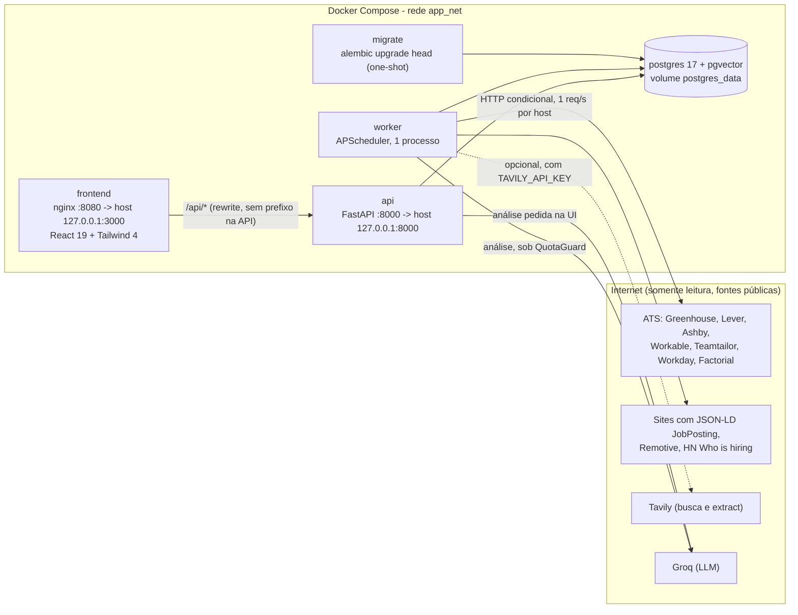
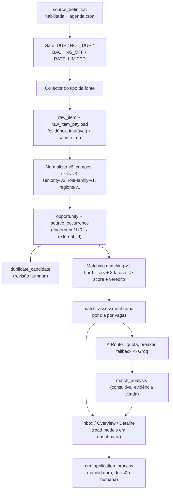

# Arquitetura atual (código de 2026-09-29, Fase 20 mesclada em `main`)

- **Status:** documento descritivo do sistema **como o código está hoje**; não declara
  entregue nada que o código não faça. Onde o código diverge de documentos antigos, o código
  vale e a divergência está na §6.
- **Data:** 2026-09-29
- **Base verificada:** branch `spec-46-redesign-ui` (contém a Fase 20 mesclada pelo PR #25).
  Leitura direta de `src/opportunity_radar/`, `migrations/`, `scripts/`, `apps/web/`,
  `compose*.yaml`, `docker/` e `.github/workflows/pipeline.yml`.
- **Convenções:** referências `caminho:linha` são relativas à raiz do repositório e valem
  para esta data; linha muda com edição, o nome do símbolo é a referência estável. Tudo que é
  **inferido** (não observado em código ou em medição) vem marcado como *(inferido)*.
- **Números medidos** vêm de
  [`44-roadmap-fase-20/evidencias/rebuild-stack-real-2026-09-29.md`](44-roadmap-fase-20/evidencias/rebuild-stack-real-2026-09-29.md)
  e são de uma amostra curta (~1,24 dia válido); não extrapolar.
- **Documentos relacionados:** [README](../README.md), [SPEC 43 — Groq e consolidação](43-spec-llm-cloud-e-consolidacao.md),
  [SPEC 45 — startups](45-spec-descoberta-startups.md), [SPEC 46 — redesenho da UI](46-spec-redesign-ui.md),
  [Fase 20](44-roadmap-fase-20/README.md), [runbook](30-runbook.md).

---

## 1. Visão geral

O Opportunity Radar é um **monólito modular** em Python (FastAPI + APScheduler) com
PostgreSQL e um frontend React. Um único banco, um `worker` que roda jobs periódicos e uma
API que serve a interface. Não há fila externa (Redis/Celery), não há Ollama e não há
microserviços: a IA é **cloud (Groq)**, opt-in, atrás de quota, breaker e fallback.

O ciclo de valor é: **fontes públicas → coleta → itens brutos → normalização → oportunidade
canônica → matching determinístico → análise semântica (IA, consultiva) → Inbox**. A IA nunca
decide elegibilidade, score ou veredito (a tabela `matching.match_analysis` não tem essas
colunas).

### 1.1 Containers e fluxo de dados

### 1.2 Processos

| Container | Comando | Papel | Referência |
| --- | --- | --- | --- |
| `postgres` | imagem própria `docker/postgres` (postgres 17.2-alpine + pgvector compilado) | estado transacional; porta **não** publicada no host | `compose.yaml:67`, `docker/postgres/Dockerfile` |
| `migrate` | `alembic upgrade head` | aplica migrações e termina (`restart: "no"`); api e worker esperam `service_completed_successfully` | `compose.yaml:88` |
| `api` | `uvicorn ...presentation.http.app:create_app --factory` | HTTP; build com `target: test` (inclui pytest, ruff e mypy na imagem) | `compose.yaml:100`, `docker/api/Dockerfile:39` |
| `worker` | `python -m opportunity_radar.worker` | scheduler com os jobs da §3.2; healthcheck por arquivo `/tmp/opportunity-radar-worker-ready` | `compose.yaml:121`, `src/opportunity_radar/worker.py:810` |
| `frontend` | nginx 1.27 servindo o build do Vite; proxy `/api/` -> `api:8000` com `rewrite` que remove o prefixo | UI; `resolver 127.0.0.11` força re-resolução DNS | `docker/frontend/nginx.conf` |

`compose.dev.yaml` é um overlay que monta `src/`, `tests/`, `migrations/`, `scripts/`,
`prompts/` em modo leitura para rodar checagens sem rebuild. `compose.ci.yaml` acrescenta
stubs (Groq falso, job board falso) para o E2E do CI.

### 1.3 Camadas e código

`src/opportunity_radar/` é organizado por contexto (DDD pragmático). Cada contexto tem
`domain` (regras puras), `models` (SQLAlchemy), `repository`/`service`; a API fica em
`presentation/http/`.

| Pacote | Contexto | Linhas (aprox.) |
| --- | --- | ---: |
| `acquisition/` | fontes, coletores, execuções, agenda | 9.900 |
| `companies/` | catálogo de empresas (`company_radar`) | 1.250 |
| `opportunities/` | normalização, ocorrências, duplicatas, sugestões | 5.000 |
| `matching/` | avaliação determinística e análise semântica | 5.000 |
| `platform/` | config, logging, banco, IA (`platform/ai/`) | 2.000 |
| `dashboard/` | read models (inbox, métricas, buscas salvas) | 2.300 |
| `pipeline/` | candidaturas (`crm`) | 650 |
| `profile/` | perfil versionado | 750 |
| `operations/` | retenção, soak gate, estado de jobs | 650 |
| `presentation/http/` | rotas FastAPI | 3.300 |
| `worker.py` | jobs periódicos | 830 |

---

## 2. Dados: schemas e tabelas

Um schema por contexto, criados em `migrations/versions/20260910_0001_create_context_schemas.py`.
Há 45 migrações lineares (`20260910_0001` até `20260929_0054`, cabeça única verificada em
2026-09-29); o CI faz `upgrade head` → `downgrade base` → `upgrade head`
(`.github/workflows/pipeline.yml`, job `backend-tests`).

| Schema | Tabelas | Modelos |
| --- | --- | --- |
| `profile` | `career_profile`, `profile_version`, `skill`, `profile_skill`, `experience`, `project`, `employment_preference` | `profile/models.py` |
| `company_radar` | `company`, `company_alias`, `company_source`, `company_source_revision`, `discovery_attempt`, `company_startup_evidence`, `company_import_batch`, `company_import_issue` | `companies/models.py` |
| `acquisition` | `source_definition`, `source_run`, `source_checkpoint`, `raw_item`, `raw_item_payload`, `payload_retention_event`, `source_alert_incident`, `source_probe`, `host_budget_state`, `tavily_extract_cache` | `acquisition/models.py` |
| `opportunities` | `opportunity`, `source_occurrence`, `source_occurrence_observation`, `normalization_result`, `opportunity_compensation`, `opportunity_skill`, `relevance_mark`, `duplicate_candidate`, `field_suggestion` | `opportunities/models.py`, `opportunities/suggestions.py:104` |
| `matching` | `match_assessment`, `match_factor`, `match_analysis`, `match_analysis_claim` | `matching/models.py` |
| `crm` | `application_process`, `stage_history` (append-only por trigger) | `pipeline/models.py` |
| `dashboard` | `saved_search` | `dashboard/models.py` |
| `platform` | `worker_job_state`, `ai_quota_usage`, `ai_call_record` (estas duas via `sa.Table`, sem ORM) | `operations/models.py`, `platform/ai/quota.py:27`, `platform/ai/telemetry.py:32` |

Observações que importam para operar:

- **Envelope × conteúdo:** `raw_item` guarda identidade e hash; `raw_item_payload` guarda o
  corpo e é o que a retenção expira (365 dias por padrão), com histórico append-only em
  `payload_retention_event` (`operations/retention.py`).
- **`normalization_result` é versionado por `normalizer_version`:** reprocessar cria linhas
  novas; a medição de 2026-09-29 mostra v3/v4/v5/v6 coexistindo.
- **`match_assessment` cresce por dia:** a identidade de avaliação inclui o dia de referência
  (`matching/currency.py`, `CURRENCY_COMPONENTS` exclui o dia de propósito, mas
  `pending_evaluation_ids` em `matching/service.py:157` só considera "avaliado" o que tem
  avaliação **do dia**). Efeito medido: 3.246 avaliações para 686 oportunidades no manifesto
  do backup.
- **Resíduo de embeddings:** `opportunity_embedding` e `opportunity_embedding_failure`
  (`opportunities/embedding_models.py`, migração `0024`) continuam no schema e a imagem do
  Postgres continua compilando pgvector, mas **nenhum código de produção lê ou escreve** essas
  tabelas (busca semântica removida no F20-05; teste `tests/backend/test_semantic_search_removed.py`).
  *(inferido pela ausência de uso; ver P3-3 na §7.)*
- **Segredos:** nenhum segredo entra em `source_definition.configuration`
  (`_reject_secret_configuration`, `acquisition/service.py:1701`) e o backup recusa a string
  `GROQ_API_KEY` no manifesto (`platform/backup.py:67`).

**Como melhorar (dados)**

1. **Reavaliar só quando algo mudou** (P1-4). Hoje cada oportunidade aberta gera uma linha em
   `match_assessment` + 8 em `match_factor` por dia, mesmo sem mudança de versão. Só a faixa de
   recência do fator `RECENCY` muda com o tempo (`matching/domain.py:722`). Trocar a condição
   "avaliada hoje" por "mudou versão/perfil/regra **ou** mudou a faixa de recência" corta o
   crescimento para uma fração *(estimativa: ~250 mil avaliações/ano com 686 vagas abertas se
   nada mudar; inferido)*.
2. **Descartar o resíduo de embeddings** (P3-3): migração `DROP TABLE` das duas tabelas e
   voltar a imagem do Postgres para a oficial, sem compilar pgvector. Risco: o backup
   (`extensões plpgsql, unaccent, vector`) e `tests/backend/fixtures/pre_f20_dump.sql` citam a
   extensão.
3. **Guardar bytes e frescor por execução** (P1-5): `acquisition.source_run` não tem bytes
   recebidos nem idade da vaga mais recente (colunas em `acquisition/models.py:81`); o card
   F20-38 pediu ambos e a medição registra a lacuna.

---

## 3. Módulos

### 3.1 Aquisição (`acquisition/`)

**Responsabilidade.** Manter a definição das fontes, decidir quando cada uma pode rodar,
executar o coletor do tipo certo e persistir a evidência (`raw_item`) antes de qualquer
interpretação.

**Arquivos-chave**

| Arquivo | O que faz |
| --- | --- |
| `acquisition/registry.py:22` | monta o registro de coletores (mesmo para API e worker) |
| `acquisition/service.py:902` | `AcquisitionService.execute`: valida, throttle, roda o coletor, persiste item a item, calcula `complete`, checkpoint e orçamento de host |
| `acquisition/service.py:218` / `:524` | `create_source` / `update_source_controls`: gate de habilitação |
| `acquisition/service.py:691` | `probe_source`: teste real do coletor contra o endpoint público |
| `acquisition/scheduling.py:237` | `evaluate_gate`: decisão pura (relógio injetado) |
| `acquisition/concurrency.py:19` | `HostSerializer` (lock por host + pacing) usado pelos scripts |
| `acquisition/http_conditional.py` | `If-None-Match`/`If-Modified-Since`, 304 |
| `acquisition/limited_discovery.py:499` | descoberta limitada (robots, sitemap, poucas páginas) |
| `acquisition/tavily.py` | cliente, orçamento por run (`:141`), cache de extract (`:735`), coletor de busca (`:580`) |
| `acquisition/startup_discovery.py` | descoberta de startups por Tavily em domínios de ATS |
| `acquisition/alerts.py` | incidente por fonte (3 falhas seguidas), webhook opcional |

**Coletores registrados** (`acquisition/registry.py`): `manual`, `ashby`, `lever`, `greenhouse`,
`remotive`, `workday`, `teamtailor`, `workable`, `factorial`, `jobposting` (JSON-LD),
`hacker_news`, `tavily_search`.

| Tipo | Como lê | Observações no código |
| --- | --- | --- |
| Ashby | `GET api.ashbyhq.com/posting-api/job-board/{board}` | pede componentes públicos de compensação |
| Greenhouse | `boards-api.greenhouse.io` (`GREENHOUSE_BASE_URL`) | `acquisition/greenhouse.py:35` |
| Lever | `api.lever.co/v0/postings/{site}?mode=json`, páginas de 100, regiões global/UE | `acquisition/lever.py:34` |
| Workable | `apply.workable.com/api/v1/widget/accounts/{account}` | `acquisition/workable.py:154` |
| Teamtailor | `https://<domínio>/jobs.json` (JSON Feed) | por tenant |
| Workday | `POST /wday/cxs/<tenant>/<site>/jobs`, páginas de 20; **não traz descrição** (`description=None`), tenant sem chave de API | `acquisition/workday.py:46`; termos em `docs/pesquisas/termos-workday.md` |
| Factorial | página de carreiras renderizada no servidor | `acquisition/factorial.py` |
| JobPosting | JSON-LD schema.org na página da própria empresa; página sem markup compatível é falha (`PARSER_SCHEMA_CHANGED`), nunca sucesso vazio | `acquisition/jobposting.py:295` |
| Remotive | API pública; palavras-chave do perfil em blocos rotativos de 10; intervalo mínimo de 6 h entre execuções vem da configuração gravada pelo importador (`scripts/import_research_catalog.py:202`), não do coletor | `acquisition/remotive.py:36` |
| Hacker News | thread mensal "Ask HN: Who is hiring?" por Algolia + Firebase; nunca o HTML | `acquisition/hacker_news.py:191` |
| Tavily search | descoberta web; bloqueada por configuração sem `TAVILY_API_KEY` | `acquisition/tavily.py:580` |

**Regras de negócio**

- **Habilitação (gate de quatro condições).** Uma fonte externa só é habilitada com
  `evidence_status == "confirmed"`, data de revisão, `terms_reviewed` e
  `collector_local_tested` (`acquisition/service.py:277-290` na criação; `:524-560` na edição).
  O gate está **na habilitação, não na execução**: `execute` só checa `enabled`
  (`acquisition/service.py:902-915`). Na prática, "termos revisados" é uma **atestação do
  operador** (`make enable-sources TERMS_REVIEWED=1`, `scripts/enable_sources.py:110` grava
  `"terms_review": "operator-confirmed via --accept-terms"`), e "coletor testado" é um probe
  que lê 1 item (`acquisition/service.py:176-177`: `PROBE_MAX_ITEMS = 1`, no máximo 1 probe por
  fonte a cada 60 s).
- **Homologação/reabertura.** `reopen_homologation` (`acquisition/service.py:620`) desliga a
  fonte, zera evidência/termos/teste/data e guarda o audit anterior em
  `reopened_homologations`. A fila de homologação está em `/sources/homologation-queue`.
- **Agenda e portões** (`acquisition/scheduling.py:237`, em ordem): sem `schedule` →
  `NOT_SCHEDULED` (o worker **pula**; só coleta sob demanda); cron ainda não venceu →
  `NOT_DUE`; falhas consecutivas → `BACKING_OFF` (dobra de 5 min até teto de 24 h,
  `scheduling.py:19-20`, `:224`); `minimum_run_interval_seconds` da fonte → `RATE_LIMITED`;
  orçamento do host esgotado ou em cooldown → `RATE_LIMITED`. Agenda padrão por prioridade da
  empresa quando a fonte nasce de um `company_source`: `high` `0 */6 * * *`, `normal`
  `0 0 * * *`, `low` `0 0 * * 0` (`scheduling.py:177`).
- **Rate limit e serialização por host.** (a) Por fonte: `rate_limit_policy` validada
  (`acquisition/service.py:1639`; `max_retries` 0–5, `minimum_interval_seconds` ≤ 60,
  `minimum_run_interval_seconds` ≤ 604800) e `Retry-After` interpretado
  (`acquisition/domain.py:72`). (b) Por provedor: orçamento compartilhado **persistido**
  (`acquisition.host_budget_state`): janela de 1 h, teto padrão **200 req/h**, 10% do teto
  reservado para fontes nunca executadas, cooldown vindo de `Retry-After` que sobrevive a
  reinício (`scheduling.py:29-35`, `:67`; `acquisition/service.py:1224-1240`). (c) Serialização
  por host com 1 req/s nos **scripts** (`acquisition/concurrency.py:19`,
  `scripts/enable_sources.py:214`); o **job do worker roda uma fonte por vez** (§3.2).
- **HTTP condicional.** O checkpoint guarda `etag`/`last_modified` e só os reusa se o
  checkpoint for do mesmo escopo (`checkpoint_type == "cursor"`,
  `acquisition/service.py:104`). Um 304 nunca prova que o board foi lido: só vira
  `run.complete` se o coletor declarou um manifesto e **todas** as representações revalidaram
  no mesmo run **e** algum run anterior já provou inventário completo
  (`acquisition/service.py:1170-1195`).
- **Completude e fechamento de vagas.** `evaluate_completeness` (`acquisition/domain.py:492`):
  só `SUCCEEDED` sem `max_items` pode ser completo; com total anunciado exige
  `items_seen >= items_announced`. Uma vaga só é fechada se **sumiu de dois runs completos
  seguidos** (`opportunities/service.py:418`); volta a `ACTIVE` se reaparece.
- **Descoberta de ATS.** `companies/discovery.py` faz uma requisição por empresa
  elegível e reconhece assinaturas (`ATS_SIGNATURES`: ashby, greenhouse, lever, gupy,
  teamtailor, workable, workday, factorial). **Trava de 30 dias:** empresa já verificada há
  menos de `DEFAULT_REVISIT_INTERVAL_DAYS = 30` não é verificada de novo; na descoberta
  limitada (`limited_discovery.py:44-47`) o sucesso adia 30 dias, parada por política
  (robots, destino privado) 7 dias, robots inacessível 1 h; tudo registrado em
  `company_radar.discovery_attempt`. Limites: profundidade 2, 20 páginas HTML, 5 sitemaps,
  2 MB por HTML, 5.000 URLs, 1 requisição concorrente por host (`limited_discovery.py:84-100`).
  Descoberta nunca cria `SourceRun` nem `RawItem` e nunca habilita fonte.
- **Plataformas fora de escopo e por quê** (todas fechadas por revisão de termos, sem código de
  coletor): **Gupy** (Termos proíbem agregar/copiar/duplicar vagas,
  [`pesquisas/termos-gupy.md`](pesquisas/termos-gupy.md), F20-32); **Wellfound** (Termos
  proíbem scraping/harvesting e há DataDome/Cloudflare, F20-51); **Y Combinator / Work at a
  Startup** (Termos proíbem data mining, robots, scraping, F20-52; ambos em
  [`pesquisas/wellfound-yc-jobs.md`](pesquisas/wellfound-yc-jobs.md)); **Careerflow** (Termos
  proíbem scraping/agregação e a página é um agregador de +50 boards, F20-57); **Landing.jobs**
  (API pública existe, mas os Termos proíbem scraping/redistribuição sem exceção de API,
  F20-59); **Braintrust** e **Crossover** (SPA sem endpoint estruturado, F20-56/F20-58; em
  ambos o motivo é técnico, não uma cláusula nomeada, conforme
  [`pesquisas/boards-braintrust-careerflow-crossover-landingjobs.md`](pesquisas/boards-braintrust-careerflow-crossover-landingjobs.md)).
  Também **LinkedIn, X e páginas protegidas** (estratégia do README) e as agências
  *talentpluto* e *Pearl Talent* (rejeitadas na revisão de 2026-09-29). **Como isso é
  imposto:** só a descoberta de startups tem lista de bloqueio em código
  (`FORBIDDEN_DOMAINS` = wellfound, ycombinator, workatastartup,
  `acquisition/startup_discovery.py:72`, e allowlist de domínios de ATS `:60-70`). Para o resto
  a imposição é **por processo** (revisão humana + ausência de coletor). O Gupy é até
  *reconhecido* como assinatura em `companies/discovery.py`, mas não tem coletor.
- **Orçamento Tavily.** Por run: `TAVILY_CREDIT_BUDGET_PER_RUN=100`
  (`acquisition/tavily.py:141`; estouro encerra o run como `PARTIAL` com
  `CREDIT_BUDGET_EXCEEDED`, não `FAILED`). Extração de descrição faltante para **qualquer**
  coletor (`acquisition/service.py:1292`) com cache de 30 dias por URL
  (`TAVILY_EXTRACT_CACHE_TTL_SECONDS=2592000`; tabela `tavily_extract_cache`) e só se houver
  `TAVILY_API_KEY` (`worker.py:539-565`). **Não existe teto diário/mensal em código**; o plano
  gratuito é de 1.000 créditos/mês compartilhados entre search e extract (comentário em
  `platform/config.py`). Medido em 2026-09-28/29: 1 crédito e 0 crédito.
- **Alertas.** Três falhas consecutivas abrem um incidente (um alerta só, `recovery` no
  primeiro sucesso); sem `SOURCE_ALERT_WEBHOOK_URL` o incidente fica só no banco e no
  `doctor` (`acquisition/alerts.py`).

**Fluxo lógico de um run agendado** (`worker.py:410`, `acquisition/service.py:902`)

1. `collect_enabled_sources` lista fontes, ignora `manual` e desabilitadas.
2. Para cada uma: `scheduling_state` → `evaluate_gate`; se não `DUE`, registra o motivo
   (`next_due_at`) e segue.
3. `execute`: cria `SourceRun` (índice único impede dois runs ativos da mesma fonte), respeita
   o intervalo mínimo, monta o pedido com cabeçalhos condicionais, itera `discover()`,
   persiste `raw_item` (+ payload) item a item, preenche descrição via Tavily se faltar,
   conta itens (vistos/persistidos/pulados/inválidos), calcula `complete`, promove checkpoint,
   grava uso do host e faz `commit`.
4. Se `run.complete`, o worker **normaliza o run** e só então reconcilia fechamentos.

**Como funciona hoje (medido, 2026-09-29)**

- 144 `source_definition` (24 antes + 120 importadas da `f20manual`), **137 habilitadas**
  (17 antes + 120 com probe aprovado); 1 manual sem agenda.
- Agendas nas 137 (após o adendo de 18:25Z): `0 */3 * * *` em 113, `0 6 * * *` em 11
  (Workday), `0 0 * * 0` em 11, `0 18 3 * *` em 1 (Hacker News).
- 59 das 120 importadas têm `company_source` + `company`; **61 não têm** (21 "Proposed ..." e
  fontes criadas só com `company_name` na configuração; `company_source_id` nulo).
- Janela útil ≈ 29,8 h: 93 execuções, todas `SUCCEEDED`/`SCHEDULED`, 0 eventos de rate limit,
  0 retries; +33 vagas úteis novas (≈ 26,6/dia, meta ≥ 1/dia); `collected_recently` caiu de 8
  para 3 por um **buraco de ~12 h sem execuções** (00Z–12Z de 09-29) e cadência de 6 blocos em
  ~30 h no lugar de ~10; causa **não investigada** na evidência.
- Orçamento por host na hora corrente: ashby 12, lever 4, greenhouse 1, remotive 1 requisições
  (tetos de 200/h).

**Limitações conhecidas**

- **Job de coleta limitado a 100 fontes** (verificado no código, ver P0-1).
- **Coleta sequencial** dentro de um único job com `max_instances=1` e `coalesce=True`
  (`worker.py:705-722`): um run longo (Workday pagina de 20 em 20; Accenture chegou a 2.000
  itens = ~100 requisições) atrasa toda a fila da rodada e os ticks perdidos são fundidos.
- Duas noções diferentes de "host": o orçamento persistido usa `source_type` para tipos fora de
  `_PROVIDER_HOST_BY_SOURCE_TYPE` (`acquisition/service.py:86-100`), então **os 15 tenants
  Workday dividem o mesmo teto de 200 req/h**, enquanto `source_host_key`
  (`acquisition/concurrency.py:68`) já separa por tenant nos scripts.
- `is_low_yield` é apenas "fonte nunca executada" (`acquisition/service.py:886-892`); não há
  agenda que se adapte ao rendimento medido, apesar do nome do card F20-38.
- Probe prova que o endpoint responde e que o coletor lê 1 item; **não prova que o board é da
  empresa** (registrado na evidência).
- Sem bytes e sem frescor por run; sem teto Tavily acumulado.

**Como melhorar (aquisição)**

1. **P0-1 — Paginar/filtrar a lista de fontes do job** (`worker.py:433`,
   `service.list_sources(offset=0, limit=100)` ordenado por nome). Trocar por consulta
   `enabled AND source_type <> 'manual'` sem limite (ou paginação até esgotar). Com 144
   definições, as últimas alfabeticamente ficam **fora do relógio** *(efeito na base real
   inferido; não consultei o banco)*. Teste: 101 fontes elegíveis, todas avaliadas.
2. **P1-1 — Persistir e alarmar buracos de coleta.** A causa do buraco de 12 h não foi
   encontrada. Hipóteses *(inferidas)*: stack parada no host, ou rodada única mais longa que o
   intervalo. Ações: registrar duração da passada em `worker_job_state`, criar checagem no
   `doctor`/`/source-health` "nenhum `source_run` agendado há > 2× a cadência" e cruzar com
   logs do container (`docker compose logs worker`).
3. **P1-2 — Concorrência limitada no worker** reutilizando `HostSerializer`
   (`acquisition/concurrency.py`): N fontes de hosts diferentes em paralelo, um lock por host.
   Reduz a duração da rodada de 113+ fontes e o efeito de um Workday lento.
4. **P1-3 — Unificar a chave de host** do orçamento persistido com `source_host_key` (tenant
   para Workday/Teamtailor/Factorial/JobPosting), ou elevar o teto dos tipos multi-tenant.
5. **P1-5 — Bytes e frescor por run.** Somar `len(response.content)` no `CollectionTelemetry`
   e gravar em `source_run` (migração) junto com a idade da vaga mais nova/antiga.
6. **P2-1 — Lista de bloqueio central** (`FORBIDDEN_PLATFORMS`) aplicada em `create_source`,
   propostas e importadores, com o motivo da §3.1, em vez de só na descoberta de startups. O
   `Braintrust jobs` (Ashby `braintrust`) só ficou de fora por decisão manual na importação;
   além disso o motivo registrado no card F20-56 é técnico (sem endpoint estruturado), não uma
   proibição de termos, então a classificação "proibida" da evidência de rebuild merece
   revisão. **Decidido em 2026-09-29:** Braintrust segue excluída (sem endpoint estruturado), a
   etiqueta "proibida" é corrigida e o `FORBIDDEN_PLATFORMS` registra o motivo técnico (F48-19).
7. **P2-2 — Conferir posse do board no probe:** comparar o nome/domínio declarado pelo board com
   a empresa e gravar aviso, já que hoje o vínculo é herdado da `f20manual`.
8. **P2-3 — Vincular as 61 fontes sem empresa** (criar `Company` + `CompanySource` a partir de
   `configuration.company_name`): habilita prioridade da empresa (fator `COMPANY_PRIORITY`),
   agenda por prioridade, evidência de startup e o funil de cobertura (o relatório mostrava
   "empresas cobertas 15 / com ATS 55", fixo antes da importação).
9. **P2-4 — Teto Tavily acumulado:** somar `source_run.credits_used` por dia/mês e bloquear
   acima do orçamento; hoje só existe o teto por run.
10. **P3-1 — Agenda adaptativa por rendimento** (taxa de 304, vagas novas por 100 requisições
    já medida em `/source-metrics`): rebaixar fontes de baixo rendimento para diário/semanal.

### 3.2 Worker e scheduler (`worker.py`)

**Responsabilidade.** Rodar, em um único processo com `BackgroundScheduler`, os jobs
periódicos; cada job é idempotente, coalescido, com uma instância por vez e uma primeira
passada imediata (`worker.py:683-806`). O estado de cada job é gravado em
`platform.worker_job_state` por `observe_job` (`operations/service.py`) e lido pelo `doctor`.

| Job (`id`) | Intervalo | O que faz | Interruptor (padrão) |
| --- | --- | --- | --- |
| `heartbeat` | 5 min | log de vida | — |
| `normalize-opportunities` | 60 s | `normalize_pending` de raw_items sem resultado do normalizer atual | `WORKER_NORMALIZE_ENABLED` (true) |
| `collect-enabled-sources` | 60 s | passada de coleta da §3.1 | `WORKER_COLLECT_ENABLED` (true) |
| `evaluate-pending` | 60 s | avalia até `WORKER_EVALUATE_BATCH_SIZE`=500 oportunidades sem avaliação **do dia** | `WORKER_MATCH_ENABLED` (true) |
| `analyze-pending` | 120 s | análise IA de até `WORKER_ANALYZE_BATCH_SIZE`=10 avaliações | `WORKER_ANALYZE_ENABLED` (true) |
| `suggest-fields-pending` | 300 s | sugestões de campo por IA | **`WORKER_SUGGEST_ENABLED` (false)** |
| `expire-raw-payloads` | 6 h | retenção de payload e poda de `ai_call_record` (30 dias) | `WORKER_RETENTION_ENABLED` (true) |

**Regras.**

- Fuso do scheduler: `COLLECTION_TIMEZONE` (compose usa `America/Sao_Paulo`).
- `WORKER_CONCURRENCY` e `ANALYSIS_CONCURRENCY` aparecem em `compose.yaml` e `.env.example`, mas **nenhum código os lê** (busca em `src/` e `scripts/` sem resultado; `Settings` não os define): são variáveis mortas. Na prática cada job roda uma instância (`max_instances=1`) e a análise processa uma avaliação por vez no laço (`worker.py:214`).
- Todos os interruptores só operam se chegarem ao container: o compose repassa apenas as
  variáveis listadas em `x-app-environment` (não há `env_file` e `.dockerignore` exclui
  `.env`). **Não são repassadas** `WORKER_SUGGEST_ENABLED`, `WORKER_SUGGEST_BATCH_SIZE`,
  `WORKER_ANALYZE_AGING_SAMPLE_RATIO`, `AI_INTERACTIVE_RESERVE_REQUESTS`,
  `AI_CALL_RECORD_RETENTION_DAYS` e `AI_REASONING_EFFORT_JOB_*` (verificado por busca em
  `compose.yaml`); valem os padrões do `Settings` e mudar exige editar o compose.
- O CI verifica que os interruptores chegam ao worker (`Verify the kill switches reach the
  worker`, `.github/workflows/pipeline.yml`), mas só para os que estão no compose.

**Fluxo.** Os quatro jobs principais formam um pipeline em fases que se auto-alimenta:
coleta → (normaliza o run se completo) → `normalize-opportunities` pega o resto →
`evaluate-pending` → `analyze-pending`.

**Como melhorar (worker)**

- **P2-5 — Repassar as variáveis faltantes no compose** (ou usar `env_file`), para ligar
  sugestões, ajustar aging e reserva interativa sem editar código.
- **P1-2** (paralelismo) e **P1-1** (alarme de buraco) da §3.1 são melhorias deste módulo.
- **P3-2 — Separar `collect` em processo próprio** se a duração da passada continuar a atrasar
  normalização/avaliação (hoje são jobs do mesmo pool de threads do APScheduler; *inferido* que
  uma passada lenta ocupa uma thread, não bloqueia os outros jobs).

### 3.3 Normalização e oportunidades (`opportunities/`)

**Responsabilidade.** Transformar cada `raw_item` em uma **oportunidade canônica** com
`source_occurrence`, preservando procedência, e manter o ciclo de vida.

**Arquivos-chave**

| Arquivo | O que faz |
| --- | --- |
| `opportunities/service.py:50` | `NORMALIZER_VERSION = "v6"` |
| `opportunities/service.py:95` | `normalize(raw_item_id)`: idempotente por versão; fluxo de identidade |
| `opportunities/domain.py:122` | `SKILL_TAXONOMY_VERSION = "skills-v3"` |
| `opportunities/domain.py:857` / `:927` | `infer_seniority` / `SENIORITY_MAPPING_VERSION = "seniority-v3"` |
| `opportunities/domain.py:1062` | `opportunity_fingerprint` |
| `opportunities/domain.py:1037` / `:1172` / `:1194` | exceção de programa, janela de 14 dias, `recency_decision` |
| `opportunities/role_family.py:32` | `role-family-v1`: área (departamento, título, descrição) |
| `opportunities/regions.py:14` | `regions-v1`: países permitidos a partir do texto de localização |
| `opportunities/duplicates.py:76` | candidatos a duplicata (`title_location_window`) |
| `opportunities/suggestions.py:266` | sugestão de campo por IA (`job_classification/v1`) |

**Regras de negócio**

- **Identidade (ordem de resolução, `opportunities/service.py:95-260`).** (1) mesma
  identidade da fonte (`external_id` ou URL normalizada) → `REFRESHED`; se o fingerprint mudou,
  `REVIEW_REQUIRED` com `EXTERNAL_ID_CANONICAL_IDENTITY_CHANGED`; (2) mesma URL normalizada
  → `MERGED`; (3) mesmo fingerprint versionado → `MERGED`; (4) mesma empresa + mesmo título com
  identidade diferente → nova oportunidade em `REVIEW_REQUIRED`; (5) senão `NEW`. Locks
  consultivos por identidade evitam corrida entre workers. Itens candidatos a proposta de
  fonte (`source_proposal_candidate`) **não** viram oportunidade.
- **Fingerprint** = sha256 de versão `v1` + empresa (id canônico ou nome normalizado) + título
  normalizado + localização + modalidade + contrato + **dia de publicação** (`domain.py:1062`).
  O dia impede fusão de republicações; o efeito colateral é a duplicata de mesma vaga em
  boards diferentes, tratada abaixo.
- **Duplicatas.** `find_title_location_window_candidates` (`duplicates.py:76`) cria linhas
  `PENDING` quando empresa, título e localização normalizados coincidem e as publicações
  distam ≤ 14 dias. Exige `published_at`, título, localização e empresa presentes. **Nunca
  funde sozinho:** `confirm_duplicate`/`reject_duplicate` são ações humanas
  (`POST /opportunities/duplicate-candidates/{id}/confirm|reject`); recusa some enquanto as
  versões das duas vagas não mudam; dois lados com candidatura ativa geram conflito;
  `duplicate_of` é permanente e sem ciclos.
- **Senioridade (`seniority-v3`).** Somente **título** (e um campo estruturado quando o
  coletor foi homologado para ele). Padrões: `INTERN` (intern, estágio/estagiário/estagiária,
  trainee, entry level, new grad, apprentice, aprendiz); `JUNIOR` (junior, jr, early career,
  `graduate` sozinho); `MID` (mid, pleno, pl); `SENIOR`; `STAFF` (staff, especialista,
  principal); `LEAD`; `MANAGER`; `DIRECTOR`. Conflito entre estruturado e título fica
  `UNKNOWN`. `HOMOLOGATED_SENIORITY_FIELDS` (`domain.py:937-943`) está **vazio** para ashby,
  greenhouse, lever e remotive (nenhum payload de fixture traz campo de nível) e não lista
  workday, workable, teamtailor, factorial, jobposting nem hacker_news. A razão de cada
  classificação (`SENIORITY_CLASSIFICATION` com fonte `title`/`structured`/`conflict`) é
  persistida em `normalization_result.reasons`. `UNKNOWN` é **mantido visível**, nunca
  convertido em nível.
- **Perfil padrão e JUNIOR/INTERN (F20-72).** O perfil (`profile/domain.py`) **não tem
  preferência de senioridade**, e o `ProfileSnapshot` de matching é montado sem
  `accepted_seniorities` (`matching/service.py:531-544`), que fica `()`. Com isso o filtro
  eliminatório `SENIORITY_COMPATIBLE` é **sempre `UNKNOWN`** (`matching/domain.py:423-431`):
  nenhuma vaga é eliminada por senioridade, e JUNIOR/INTERN não são escondidos. "O perfil
  padrão inclui JUNIOR/INTERN" é, portanto, "o perfil não restringe senioridade".
- **Recência (F20-61, ajustada no F48-16).** A Inbox mostra por padrão só vagas dos **últimos 30 dias** (14 dias na lente "Novas"; referência `published_at ?? source_updated_at ?? first_seen_at`, base persistida em `recency_basis`)
  (`DEFAULT_RECENCY_WINDOW_DAYS`, `domain.py:1172`), usando `published_at` ou, sem ele,
  `first_seen_at` marcado como estimado. Continua visível se (a) for programa com prazo
  (`recency_exempt_program`: internship, estágio/estagiário, trainee, residência/residency,
  early career, "início de carreira", `domain.py:1037`) ou (b) `valid_through` ainda no futuro.
  O filtro é **da leitura**: a rota `/inbox` usa `only_recent=true` por padrão
  (`presentation/http/dashboard.py:503`; a UI envia `only_recent=false` em "mostrar tudo",
  `apps/web/src/features/dashboard/api.ts:357`); `InboxQuery.only_recent` vale `False` no
  objeto para não estreitar chamadores internos (`dashboard/queries.py:169`); a condição SQL
  espelha `recency_decision` (`dashboard/queries.py:545`). **Não** entra em score, elegibilidade
  ou veredito; o fator `RECENCY` do matching é outro cálculo.
- **Compensação** só extraída quando **declarada** (`Decimal`, moeda, período, bruto/líquido,
  evidência textual); conflito entre ocorrências → `REVIEW_REQUIRED`.
- **Skills** por taxonomia versionada com evidência (REQUIRED/PREFERRED/UNKNOWN por contexto).
- **Ciclo de vida:** `DISCOVERED → ACTIVE ↔ STALE → CLOSED → ARCHIVED`, `REJECTED → ARCHIVED`
  (`opportunities/domain.py:79`); transições ilegais são erro; edição com `expected_version`.
- **Sugestões de campo por IA** (só se `WORKER_SUGGEST_ENABLED`, hoje off): rota
  `job_classification`, tabela separada `field_suggestion`, descarte quando a evidência citada
  não está no texto, aceitar/rejeitar por HTTP; **não altera** o campo canônico sozinha.

**Fluxo lógico.** `normalize` → cria/atualiza `opportunity` e `source_occurrence` → reconcilia
compensação/skills → grava `normalization_result` (versão, decisão, razões, razão da
senioridade) → só para `NEW` procura candidatos a duplicata → o worker reconcilia fechamentos
por run completo.

**Como funciona hoje (medido, 2026-09-29):** 1.383 `raw_item` → 686 oportunidades (687
ocorrências). Reprocessamento para v6 concluído: **FAILED 38** (as mesmas 38 do v5),
**REVIEW_REQUIRED 185**, SUCCEEDED 1.160 (no v5 eram 4 em revisão). Senioridade `UNKNOWN`:
**339/686 = 49,42 %**; JUNIOR+INTERN 5 (0,73 %); o reprocessamento `seniority-v3` **não moveu**
o número, porque nenhuma das 339 tem título com as palavras-chave novas.

**Limitações conhecidas.** Senioridade só por título; Workday chega sem descrição, o que
empobrece skills e senioridade *(inferido; o coletor documenta `description=None`)*; o filtro de
recência com `first_seen_at` estimado deixa passar vaga antiga recém-coletada; duplicatas
exigem `published_at` e localização.

**Como melhorar (normalização)**

1. **P0-2 — Reduzir `UNKNOWN` de senioridade (49,4 %), em três degraus.**
   (a) Padrões de **anos de experiência** na descrição ("3+ years", "5+ anos", "no experience")
   e de nível textual ("recent graduate", "entry-level position") com evidência citada, novo
   `seniority-v4` (card F20-76 já é o backlog); (b) campo estruturado por coletor onde o
   payload traz (conferir fixtures de Workable/Teamtailor/Factorial/JobPosting antes de
   listar em `HOMOLOGATED_SENIORITY_FIELDS` *(não verifiquei se trazem)*); (c) para o
   resíduo, as sugestões do F20-23 (precisão medida: seniority 73 %, geral 69 %) **com
   aceite humano**. Medir com `/source-metrics` (`seniority_unknown_rate`), que já expõe a
   taxa e a procedência.
2. **P1-6 — Explicar os 185 `REVIEW_REQUIRED` do v6 (eram 4 no v5) e os 38 `FAILED`
   recorrentes:** agrupar por `reasons[].code` e `error_summary`; corrigir os `FAILED` (mesmas
   38 em v5 e v6 indica causa determinística). *Incerteza aberta:* a evidência não diz por
   que a revisão saltou.
3. **P2-6 — Recência para fontes sem `published_at`:** usar `source_updated_at` quando existir
   e rebaixar/rotular o `first_seen_at`, para que importar 120 fontes não injete na Inbox
   vagas antigas como "recentes" *(risco inferido pelo desenho de `recency_decision`)*.
4. **P2-7 — Descrição do Workday:** avaliar o endpoint de detalhe da vaga (revisão de termos
   própria, `pesquisas/termos-workday.md`) ou extração por Tavily sob teto; sem descrição,
   skills e senioridade dependem só do título.
5. **P3-4 — Duplicatas sem `published_at`:** janela por `first_seen_at` como sinal secundário,
   ainda com confirmação humana; medir precisão com `scripts/sample_duplicates.py` antes.

### 3.4 Company Radar (`companies/`)

**Responsabilidade.** Catálogo de empresas (identidade, aliases, prioridade, status, fontes de
carreira) e descoberta de ATS e de evidência de startup.

**Arquivos-chave:** `companies/domain.py` (normalização de nome/domínio),
`companies/registration.py` (cadastro/edição com conflito de identidade e versão),
`companies/discovery.py` (uma requisição por empresa), `companies/startup.py`
(evidência), `scripts/import_research_catalog.py` (importa `docs/pesquisas/*.md`).

**Regras de negócio**

- Identidade por `normalized_name` único e `domain` único (`companies/models.py:28-60`);
  aliases resolvem duplicatas de nome (Neon/Databricks, receeve/InDebted).
- Vocabulário: prioridade `high|normal|low`; `radar_status` `active|paused`
  (`companies/registration.py:49-50`); `BLOCKED` existe no matching (`CompanyPriority`).
- `company_source` guarda endpoint, `external_key`, status de verificação, confiança (0–1),
  método e nota de evidência; mudanças pela UI geram `company_source_revision`.
- **Evidência de startup (F20-54, SPEC 45).** Tabela **append-only**
  `company_startup_evidence` (sinal `yc_batch|seed_stage|series_a|other`, força
  `strong|weak`, texto-fonte literal, URL, lote). `derive_startup_evidence`
  (`companies/startup.py:132`) só registra `yc_batch/strong` quando **o texto do resultado**
  cita Y Combinator/YC; o termo de busca sozinho grava `other/weak` (agências de recrutamento
  casam com a marca no piloto). O lote só é lido quando segue a marca ("YC S24"). A força da
  empresa é `strong` se alguma linha for forte. É **metadado de exibição e filtro**; matching,
  score e veredito nunca o leem. Na UI: selo "Startup" na Inbox e filtro `only_startups`.
- **Descoberta de startups** (`acquisition/startup_discovery.py`): Tavily restrito a domínios de
  ATS suportados, termos `forte` (marca YC) e `fraco` (estágio); board validado por
  `probe_direct_ats` e só então vira **proposta inerte** (`discovery_via=tavily_startup_search`);
  nada é habilitado.

**Como funciona hoje:** 223 empresas e 279 `company_source` (manifesto do backup de 2026-09-29).
`company_startup_evidence` está **vazia (0 linhas)** na base real: as 21 propostas de startup
não têm empresa (`backfill_startup_evidence`: 21 × `skipped: company not found`).

**Limitações.** Selo de startup inalcançável na base real hoje; 61 fontes sem empresa; funil de
cobertura de empresas parado.

**Como melhorar (empresas):** ver P2-3 (vincular as 61 fontes sem empresa, o que também destrava
o selo de startup); **P2-8 — criar a empresa ao aceitar uma proposta** (hoje a proposta nasce
sem `Company`, e o backfill de evidência não tem a quem ligar); **P3-5 — reconciliar
duplicatas de empresa** entre `company` importada e criada por proposta (`normalized_name` é a
única chave).

### 3.5 Matching e ranking (`matching/`)

**Responsabilidade.** Avaliação **determinística, versionada e reproduzível** de cada
oportunidade contra a versão ativa do perfil, mais uma camada consultiva de IA.

**Arquivos-chave:** `matching/domain.py` (regras puras), `matching/service.py`,
`matching/currency.py` (identidade de avaliação), `matching/repository.py:310` (fila de
análise), `matching/analysis.py` (contrato da IA), `matching/groq.py` (adaptador).

**Regras de negócio**

- **Hard filters** com estados `TRUE/FALSE/UNKNOWN` (`matching/domain.py:337`): ativa,
  modalidade, país, autorização de trabalho, fuso, senioridade, contrato. Qualquer `FALSE` →
  `INELIGIBLE`; algum `UNKNOWN` → `UNKNOWN`. **Ausência não vira reprovação.**
- **Oito fatores** (`matching/domain.py:283`), pesos que somam 1: `GEOGRAPHY_CONTRACT_FIT`
  0,20 (política `REQUIRE_REVIEW`), `TECHNOLOGY_FIT` 0,25, `COMPANY_PRIORITY` 0,15,
  `DOMAIN_EXPERIENCE` 0,15, `SENIORITY_SCOPE` 0,10, `CONTRACT_COMPENSATION` 0,05, `TIMEZONE`
  0,05, `RECENCY` 0,05. Fator desconhecido vale 0,5 (`NEUTRAL`/`REQUIRE_REVIEW`), 0
  (`PENALIZE`) ou é excluído e renormalizado. Prioridade da empresa: high 1,0 / normal 0,7 /
  low 0,4 / blocked 0. Recência: ≤3 dias 1,0; ≤7 0,9; ≤14 0,75; ≤30 0,5; senão 0,25;
  `RECENCY` é `UNKNOWN` sem `published_at`.
- **Veredito** (`matching/domain.py:804`): `INELIGIBLE` se algum filtro falhou; senão
  `REVIEW_REQUIRED` se houver conflito de compensação ou fator `REQUIRE_REVIEW` desconhecido;
  senão limiares **≥80 `HIGH_PRIORITY`, ≥65 `RECOMMENDED`, ≥45 `WATCHLIST`**, abaixo
  `LOW_MATCH`. Versão de regras `matching-v1` (`matching/service.py:68`).
- **Fatores estruturalmente `UNKNOWN` hoje.** `DOMAIN_EXPERIENCE` **não tem avaliador**
  (`matching/domain.py`, ramo "No normalized evidence is available for this factor") e
  `SENIORITY_SCOPE` depende de `accepted_seniorities`, sempre vazio (§3.3). Juntos são **25 % do
  peso** valendo o neutro 0,5 para todas as vagas *(inferido: comprime a dispersão dos scores)*.
- **Idempotência e histórico.** Cada `match_assessment` guarda snapshots exatos e um hash
  (versão da vaga + perfil + regras + taxonomia + dia UTC de referência); repetir no mesmo dia
  não cria linha; mudar conteúdo, versão ou dia cria uma nova, e a antiga é preservada.
- **Ranking na Inbox** (`dashboard/queries.py:663`): `priority` (padrão: prioridade da empresa,
  depois score, depois recência), `recency`, `score`; com termo de busca, relevância full-text
  e depois recência. A Inbox filtra por padrão pelas **áreas-alvo do perfil**
  (`target_role_families`, `presentation/http/dashboard.py:512`) a menos que `all_areas`.
- **Análise semântica (IA) é consultiva.** Só roda sobre avaliação concluída e para vereditos
  elegíveis (`WORKER_ANALYZE_VERDICTS` = HIGH_PRIORITY, RECOMMENDED, WATCHLIST,
  REVIEW_REQUIRED); `INELIGIBLE` e `LOW_MATCH` são pulados pela política
  (`matching/analysis.py:249`). Saída validada contra JSON Schema fechado **sem** score,
  elegibilidade, veredito ou desqualificador; cada afirmação cita evidência do texto da vaga
  ou do perfil (`CLAIM_SOURCES = ("posting","profile")`). Falha da IA vira estado
  (`AI_FAILED` + código), nunca erro HTTP nem alteração do veredito. Análise concluída é
  reusada por chave (`ANALYSIS_KEY_VERSION="analysis-key-v3"`, inclui versões da vaga, perfil,
  regras, taxonomia, modelo, prompt, schema e hash do payload).
- **Fila de análise** (`matching/repository.py:310`): valor primeiro (veredito, prioridade da
  empresa, score), depois vaga mais recente; **10 % do lote** (`WORKER_ANALYZE_AGING_SAMPLE_RATIO`)
  reservado a itens fora do topo, girando por `id`, para medir perdas do funil. Retentativa:
  espera 1 h, no máximo 3 tentativas por 24 h, claim com lease de 15 min.

**Como funciona hoje:** 3.246 avaliações e 2.451 análises no manifesto de backup; `json_valid_rate`
100 %; análises concluídas em 09-29: 108 (gpt-oss-120b) + 45 (qwen3.8-27b).

**Limitações.** Dois fatores fixos em 0,5; reavaliação diária cria linhas mesmo sem mudança
(§2); qualidade do prompt `v2` pior que `v1` na rodada real (`v1` segue como padrão, F20-18); a
baseline real do Groq foi só de `openai/gpt-oss-120b`; o benchmark F20-22 (120B × 20B × Qwen)
está incompleto por quota.

**Como melhorar (matching)**

1. **P1-7 — Dar entrada aos dois fatores mortos:** (a) adicionar `accepted_seniorities` e um
   `seniority_floor/ceiling` às preferências do perfil (padrão: incluir INTERN/JUNIOR, como
   o F20-72 assume) e povoar em `matching/service.py:531`; (b) implementar `DOMAIN_EXPERIENCE`
   a partir de `role_family` da vaga × experiências/projetos do perfil (dados já existem em
   `profile.experience`/`project` e em `opportunity.role_family`). Reponderar em
   `matching-v2` com teste de regressão sobre os 50 casos rotulados de
   `prompts/opportunity_analysis/eval/cases/`.
2. **P1-4 — Reavaliação orientada a mudança** (§2, item 1).
3. **P2-9 — Calibrar limiares 80/65/45** com a distribuição real de scores depois do item 1;
   hoje não há evidência medida de que os cortes separam bem *(inferido: nenhuma medição na
   evidência)*.
4. **P2-10 — Aceitar "estágio/júnior" como sinal de fit** no perfil-alvo (o filtro de recência
   já tem exceção; o matching não distingue).

### 3.6 Plataforma de IA (`platform/ai/`)

**Responsabilidade.** Chamar o **Groq** com segurança e previsibilidade: roteamento por tarefa,
retry, fallback entre modelos, breaker, quota persistente, sanitização de PII e telemetria.

**Arquivos-chave**

| Arquivo | O que faz |
| --- | --- |
| `platform/ai/tasks.py:62` | rotas por tarefa e orçamento de tokens |
| `platform/ai/router.py:123` | `AIRouter.run`: cadeia de modelos, retry, reparo de JSON, quota |
| `platform/ai/quota.py:197` | `QuotaGuard.reserve/settle/release` em Postgres |
| `platform/ai/breaker.py` | breaker por modelo, em memória |
| `platform/ai/sanitizer.py:67` | `sanitize_for_llm` |
| `platform/ai/providers/groq.py:78` | cliente HTTP (OpenAI-compatível, saída estruturada) |
| `platform/ai/telemetry.py` | `platform.ai_call_record` sem PII, retenção 30 dias |
| `matching/adapters.py` | monta provider + guard + breaker + router (uma vez por processo) |

**Regras de negócio**

- **Estados** (`platform/ai/config.py`): `disabled` (`AI_ENABLED=false`, padrão), `blocked_by_configuration`
  (habilitada sem chave) e `enabled`. Desligada ou bloqueada, o adaptador é `NullAnalysisAdapter`
  e a rota de análise responde 200 com `AI_SKIPPED`. `AI_PROVIDER` só aceita `groq`
  (`platform/config.py`).
- **Rotas** (`platform/ai/tasks.py:62`): `job_match` = `gpt-oss-120b` → fallback `qwen3.8-27b`
  (entrada máx. 5.000 tokens, saída 900); `job_classification` = `gpt-oss-20b` → `qwen`
  (1.500/300); `job_extraction` = `gpt-oss-20b` → `gpt-oss-120b` (3.000/600).
  `AI_REASONING_EFFORT=low` para todas, com override por tarefa (vazio = padrão).
- **Retry/fallback** (`platform/ai/router.py:123-235`): falha transitória → até
  `AI_MAX_RETRIES=2` com espera `2^(n-1)·(1+jitter/4)` e alimenta o breaker; `429`/sem saldo
  → bloqueia o modelo por `Retry-After` (ou 60 s) e **passa ao próximo da cadeia**; saída
  inválida → 1 reparo com o motivo anexado; erro de configuração/requisição sobe.
  `AI_FALLBACK_ENABLED=true`.
- **Breaker** (`platform/ai/breaker.py`): só falhas **transitórias** contam; 5 falhas abrem por
  120 s; meia-abertura deixa passar uma sonda. Estado reinicia com o processo, de propósito.
- **Quota** (`platform/ai/quota.py`): reserva **antes** da chamada e liquida depois, atômica em
  duas janelas (`minute` e `day`, ambas truncadas em **UTC**, `quota.py:63-71`) por modelo, em
  `platform.ai_quota_usage`; API e worker compartilham o contador e ele sobrevive a reinício.
  Tetos brandos: **850 req/dia, 170.000 tokens/dia, 25 req/min, 7.000 tokens/min por modelo**;
  os cabeçalhos do Groq reduzem o teto efetivo (`requests_ceiling`/`tokens_ceiling`). A **reserva
  interativa** de 100 req/dia impede o worker de gastar o que a análise pedida na UI precisa:
  o worker sonda com teto `850 − 100` (`worker.py:215-226`), a UI usa o teto cheio.
- **Token Guard** (`platform/ai/budget.py`): estimativa `⌈chars/3 · 1,15⌉` (superestima de
  propósito); prompt que não cabe no `max_input_tokens` da tarefa não é enviado
  (`CONTEXT_OVERFLOW`).
- **PII** (`platform/ai/sanitizer.py`): antes de montar o prompt **e** de calcular o hash,
  remove chaves de dados pessoais (`name`, `email`, `phone`, `cpf`, `linkedin_url`, ...) e mascara
  e-mail, CPF, telefone, URLs de LinkedIn/GitHub e segredos (Groq/OpenAI/Tavily/Bearer).
- **`worker_suggest_enabled` desligado** (`platform/config.py:26`): a precisão da sugestão de
  campos (69 % geral; seniority 73 %) ainda não justifica gravar sugestões; e a variável nem
  chega ao container (§3.2).

**Fluxo lógico de uma análise agendada** (`worker.py:162`): seleciona até 10 avaliações →
para cada uma, sonda quota (reserva 0 tokens com o teto do worker; sem saldo ⇒ pula sem
registrar tentativa) → `service.analyze` (claim com lease) → adaptador prepara o prompt
(recorta a descrição para caber), o router percorre a cadeia → valida e persiste
`match_analysis` + `match_analysis_claim` → registra telemetria.

**Como funciona hoje (medido em 09-29, `ai_call_record`):** 193 chamadas; **45 (23,3 %) caíram no
fallback e 43 (22,3 %) foram 429**, todas no `qwen`; o modelo primário parou em **105
requisições / 169.522 de 170.000 tokens** (teto de tokens, não de requisições: ~1.600 tokens por
chamada). Em 09-28 (após T0b) houve **885 análises `AI_FAILED` por `QUOTA_EXHAUSTED`** e 366 em
09-29. Metas de fallback (<5 %) e 429 (<2 %) **não batidas**; veredito da janela:
inconclusivo.

**Limitações**

- O teto que bate é o de **tokens/dia** do modelo primário (170 mil), enquanto o teto de 850
  requisições nunca é alcançado.
- A sonda do worker reserva **0 tokens** (`worker.py:216`): passa enquanto houver 1 token de
  saldo; a chamada real reserva `entrada estimada + 900` e falha por quota, o que **registra
  uma tentativa** `AI_FAILED` (e consome as 3 tentativas/24 h da avaliação) *(inferido pela
  leitura de `worker.py:215-226` e `router.py:_reserve`; explica o volume de
  `QUOTA_EXHAUSTED`; validar com os logs)*.
- Dia de quota truncado em UTC (00:00 UTC = 21:00 em São Paulo), enquanto o provedor pode usar
  outra janela *(não verificado; o guard reduz o teto pelos cabeçalhos reais)*.
- Breaker e `blocked_until` em memória: reiniciar o worker zera ambos.

**Como melhorar (IA)**

1. **P0-3 — Sonda de quota com tokens.** Reservar na sonda o mínimo realista
   (`estimated_total` do modelo primário) ou consultar `next_available_at` e pular o lote
   inteiro quando não houver saldo de tokens, sem gravar `AI_FAILED`. Elimina as ~1.250
   análises "falhas" por quota e preserva as tentativas.
2. **P1-8 — Gastar menos tokens por análise.** `job_match` está fixo em 120B + Qwen; o
   benchmark 20B (F20-22) tem 5 de 6 rodadas pendentes. Rodar o benchmark em dias de quota
   livre e avaliar `gpt-oss-20b` para triagem de `WATCHLIST/REVIEW_REQUIRED` e 120B só para
   `HIGH_PRIORITY/RECOMMENDED`; medir com `make eval-analysis` + `scripts/benchmark_report.py`.
3. **P1-9 — Restringir o que a fila gasta enquanto o orçamento é curto:** tirar `WATCHLIST` e
   `REVIEW_REQUIRED` de `WORKER_ANALYZE_VERDICTS` (ou dar a eles teto próprio) até a taxa de
   429 cair; exige repassar a variável ao container (já repassada: `WORKER_ANALYZE_VERDICTS`).
4. **P2-11 — Fallback com teto próprio:** o `qwen` bate 429 em 22 % das chamadas; pré-reservar
   ou baixar o lote quando o primário está em cooldown, em vez de gastar o secundário.
5. **P2-12 — Persistir o estado do breaker/`blocked_until`** (ou só logar) para diagnosticar
   reinícios; baixo valor, baixo custo.
6. **P3-6 — Alinhar a janela de quota** à do provedor após medir `x-ratelimit-reset-*`.

### 3.7 Perfil e candidaturas (`profile/`, `pipeline/`)

- **Perfil versionado** (`DRAFT → PUBLISHED → ACTIVE → ARCHIVED`): snapshot imutável
  (skills, experiências, projetos, preferências: modalidades, contratos, países, janela de fuso,
  remuneração, relocação, patrocínio, áreas e títulos-alvo). Salvar na UI encadeia criar →
  publicar → ativar carregando o lock de cada passo; edição concorrente falha com conflito.
  `derive_keywords` monta as palavras-chave do Remotive a partir de títulos-alvo e das skills de
  maior nível, em blocos de 10 rotativos (`profile/keywords.py`, `worker.py:600`).
- **Candidaturas** (`crm.application_process` + `crm.stage_history` append-only por trigger): a
  tabela de transições é pura em `pipeline/domain.py`; estágio terminal não tem saída (erro se
  corrige abrindo nova candidatura); um índice parcial garante **uma candidatura ativa por
  oportunidade e versão de perfil**; transição e próxima ação exigem `expected_version`.
- **Como melhorar:** o perfil não tem preferência de senioridade (P1-7); adicionar teste de
  ponta a ponta "perfil sem senioridade não elimina INTERN/JUNIOR" (hoje coberto por F20-72 sem
  mudança de produção).

### 3.8 API e read models (`presentation/http/`, `dashboard/`)

**Responsabilidade.** Expor o domínio e servir telas por consultas SQL otimizadas, sem carregar
agregados.

Rotas (`presentation/http/routes.py`; a API **não tem prefixo**, o `/api` é do nginx):

| Grupo | Rotas principais |
| --- | --- |
| Saúde | `GET /health`, `/health/live`, `/health/ready` |
| Fontes | `GET/POST /sources`, `GET/PATCH /sources/{id}`, `PATCH /sources/{id}/schedule`, `POST /sources/{id}/reopen-homologation`, `POST /sources/{id}/probe`, `POST /sources/{id}/runs`, `GET /source-runs[/{id}]` |
| Empresas | `GET/POST /companies`, `GET/PATCH /companies/{id}`, `POST /companies/{id}/sources`, `PATCH /companies/{id}/sources/{sid}`, `POST /companies/{id}/detect-source` |
| Oportunidades | `GET /opportunities[/{id}]`, `PATCH /opportunities/{id}/status`, `POST /opportunities/{id}/relevance`, `POST /opportunities/normalizations/pending`, `.../normalizations/runs/{run}`, `.../normalizations/{raw}`, `GET /opportunities/{id}/duplicate-candidates`, `POST .../duplicate-candidates/{id}/confirm|reject`, `GET .../field-suggestions`, `POST .../field-suggestions/{id}/accept|reject` |
| Matching | `POST /matches/evaluate`, `GET /matches[/{id}]`, `POST /matches/{id}/analysis` |
| Perfil | `GET /profile`, `GET /profile/versions`, `POST /profile/versions`, `.../{id}/publish`, `.../{id}/activate` |
| Candidaturas | `POST/GET /applications`, `GET /applications/{id}`, `POST .../transitions`, `PATCH .../next-action` |
| Dashboard | `GET /overview`, `/inbox`, `/source-health`, `/source-coverage`, `/source-metrics`, `/analysis-metrics`, `/search-metrics`, `/saved-searches[...]` |

Convenções: `X-Correlation-ID` aceito e devolvido, id em `contextvar` (`platform/logging.py`);
log JSON em stdout, uma linha por evento; CORS restrito a `FRONTEND_ORIGIN`; versão otimista
(`expected_version`) nas escritas.

**Busca.** Full-text com sinônimos em Postgres (`dashboard/search_*.py`); a busca por
significado foi removida (F20-05). Filtros da Inbox: veredito, score mínimo, empresa,
modalidade, status, data, área, senioridade, país permitido, faixa salarial, fonte,
candidatura, `only_recent`, `only_startups`.

**Como melhorar (API):** **P2-13 — paginar `GET /sources`** com filtro `enabled` no servidor
(o mesmo limite de 100 que quebra o worker existe como teto de consulta); **P3-7 —** expor
`/source-coverage` com o buraco de execuções.

### 3.9 Frontend (`apps/web`)

React 19, react-router-dom 7, TanStack Query 5, Tailwind 4 via `@tailwindcss/vite`, TypeScript,
Vite, Vitest + jsdom. Sem biblioteca de componentes de terceiros. Rotas
(`apps/web/src/app/App.tsx`): `/` Visão geral, `/inbox`, `/opportunities/:id`, `/applications`,
`/companies`, `/companies/:id`, `/sources`, `/sources/homologation-queue`, `/profile`,
`/status`. O estado dos filtros vive na URL; a base da API é `/api` (`VITE_API_BASE_URL`).
`npm run check` = lint (sem literal hexadecimal em `.ts/.tsx`) + typecheck + testes + build.

A [SPEC 46](46-spec-redesign-ui.md) (Planejada) descreve o redesenho visual (sidebar, painel
branco, tabela densa) sem mudar API nem rotas; o estado atual verificado na SPEC (paleta verde,
navegação horizontal) continua valendo até os cards F46 serem executados.

**Como melhorar (frontend):** executar a SPEC 46 (F46-01 cria o `DESIGN.md`); **P2-14 —**
mostrar na tela de fontes o motivo do gate (`next_due_at`/`reason` já são calculados em
`worker.py` para log) e a idade da última coleta; **P3-8 — teste de tela** para o estado
"buraco de coleta" quando o backend passar a expô-lo.

### 3.10 Operação, qualidade e CI

**Scripts** (`scripts/`, alvos `make`): `doctor` (checa ambiente, banco, tabelas, jobs do worker,
incidentes de fonte, prompts, IA, uso de IA; aviso não derruba o código de saída),
`backup`/`restore_check` (o dump só vale com manifesto e restauração num banco descartável;
divergência sai com código 1), `soak_gate` (72 h simuladas com relógio controlado, roda no CI),
`collect`, `enable_sources` (probe + habilitação; exige `TERMS_REVIEWED=1`),
`discover_ats`, `discover_sites`, `discover_startups`, `import_research_catalog`,
`backfill_*`, `reclassify_role_families`, `eval_*`, `export_*`. Descobertas ficam **desligadas
por padrão** (execução manual).

**Retenção:** payload bruto 365 dias (envelope fica), `ai_call_record` 30 dias.

**Testes:** `tests/backend/` (pytest; integração real de Postgres atrás de
`RUN_DATABASE_INTEGRATION=1`, marcador `integration`), `tests/e2e/` (fakes de Groq, job board,
Workday, Teamtailor, Workable, Factorial, JobPosting, site de descoberta), `tests/e2e/browser/`
(Playwright, jornada F20-47 com falhas injetadas), `apps/web/src/**/*.test.ts(x)` (Vitest).
Cartão registrado: suíte completa `1177 passed` (F20-75) *(número histórico, não reexecutado
aqui)*.

**CI** (`.github/workflows/pipeline.yml`; ignora `docs/**` e `**/*.md`): `backend-quality`
(ruff, mypy, verificação do schema do prompt), `backend-tests` (ida e volta de migrações, pytest,
soak gate), `frontend` (`npm audit --omit=dev`, `npm run check`, `nginx -t`), `e2e` (compose
completo com stubs: manual → matching → análise → dashboard → pipeline → persistência →
backup/restore → ciclo autônomo → interruptores → curadoria → jornada no navegador) e `publish`
(imagens api/worker/frontend no GHCR, só em `main`, tag `v*` ou `workflow_dispatch`).

**Como melhorar (operação):**

1. **P0-4 — Rodar `restore_check` na rotina.** O backup de 2026-09-29 só teve `pg_restore
   --list`; sem restauração comprovada o critério de backup da seção 65 do roadmap não está
   satisfeito para essa cópia. Agendar `make backup` + `make restore-check` e exibir o
   resultado no `doctor`.
2. **P1-1** (alarme de buraco de coleta) e **P1-5** (bytes/frescor) da §3.1.
3. **P2-15 — API sem `target: test` em produção** (`compose.yaml:104`): a imagem do `api`
   carrega ferramentas de desenvolvimento; usar o alvo `runtime` (já existe em
   `docker/api/Dockerfile:49`) fora do CI e do overlay `compose.dev.yaml`, que precisa do alvo
   `test`.
4. **P3-9 — Rotina de backup e retenção.** A poda existe (`scripts/backup.py:115`,
   `--prune-days` ou `BACKUP_RETENTION_DAYS`), mas o compose não repassa a variável e nenhum job
   agenda `make backup`; hoje é 100 % manual.

---

## 4. Segurança e privacidade (estado real)

- Portas `3000` e `8000` publicadas **só em `127.0.0.1`**; Postgres sem porta no host.
- Segredos só em `.env` (ignorado pelo Git e pelo Docker); nada de segredo em
  `source_definition.configuration`.
- Dados pessoais são sanitizados antes de qualquer chamada ao Groq; telemetria de IA sem PII.
- Sem autenticação nem multiusuário: uso pessoal, local (decisão do produto, README).
- Coleta identificada por `OpportunityRadarDiscoveryBot/1.0` na descoberta; respeita robots.txt
  na descoberta limitada; nunca acessa as plataformas da §3.1.

---

## 5. Como o sistema opera hoje (resumo medido)

Fontes: [rebuild-stack-real-2026-09-29.md](44-roadmap-fase-20/evidencias/rebuild-stack-real-2026-09-29.md)
(números do rebuild, 686 oportunidades) e leitura do banco real em 2026-09-29 ~20:04Z, com
`SELECT` apenas, depois da importação de 120 fontes (11.267 oportunidades). Onde a linha traz os
dois valores, o de 20:04Z é o atual. Os números de 686 citados em §2, §3 e §7 abaixo são medições
datadas do rebuild e continuam como evidência histórica.

| Indicador | Valor |
| --- | --- |
| Fontes definidas / habilitadas | 147 / 137 (136 não `manual`), snapshot 2026-09-29 ~20:04Z |
| Oportunidades | **11.267** no snapshot de 2026-09-29 ~20:04Z, depois da importação de 120 fontes às 18:41Z (eram 686 no rebuild, antes dela); funil completo em [SPEC 48 §2](48-spec-mais-vagas.md#2-funil-medido) |
| `raw_item` | 12.536 (1.383 no rebuild) |
| Empresas / `company_source` | 265 / 338 (223 / 279 no rebuild) |
| Senioridade `UNKNOWN` | 5.711 de 11.267 (50,7 %); JUNIOR+INTERN 223 (2,0 %). No rebuild: 339/686 (49,42 %), JUNIOR+INTERN 5 |
| Normalização v6 (rebuild) | 1.160 OK, 185 revisão, 38 falha; hoje 99 `FAILED` (SPEC 48 §2) |
| Janela ~29,8 h (rebuild, antes da importação) | 93 execuções, 100 % `SUCCEEDED`, +33 vagas úteis (~26,6/dia), 0 rate limit |
| Buraco de coleta | ~12 h (00Z–12Z de 09-29), causa não investigada |
| IA em 09-29 | 193 chamadas, 23,3 % fallback, 22,3 % 429, `json_valid_rate` 100 % |
| Créditos Tavily | 1 (09-28), 0 (09-29) |
| Backup | `pre-rebuild-2026-09-29.dump`, 9.469.563 bytes, sha256 `e1d9539a14c4...`; sem `restore_check` |

---

## 6. Divergências entre documentação e código

O código vence. Itens a corrigir ou marcar como históricos:

| Documento | Diz | Código de hoje |
| --- | --- | --- |
| `docs/02`, `03`, `05`, `06`, `07`, `08`, `09`, `11`, `20`, `21`, `25`, `36` e trechos de `29`, `32`, `33`, `37`–`39` | Ollama local, GPU, `ollama-init`, embeddings locais | nenhuma referência a Ollama em `src/`, `apps/web/`, `compose.yaml`; IA é Groq (F20-04/05) |
| README anterior | 3 ATS no MVP, pipeline "na fase 8", 222 registros/220 identidades | 12 coletores; pipeline entregue (`/applications`); 223 empresas na base real |
| `docs/21-ollama-prompts.md`, `docs/36-spec-ollama.md` | contrato de prompts/Ollama | substituído pela SPEC 43; prompts em `prompts/opportunity_analysis/{v1,v2}` e `prompts/job_classification/v1` |
| Cards F20 e `evidencias` | "perfil padrão inclui JUNIOR/INTERN" | o perfil não tem preferência de senioridade; o efeito é "sem restrição" (§3.3) |
| Card F20-38 ("agenda por rendimento") | agenda adaptativa | agenda cron estática + reserva de exploração; sem adaptação por rendimento |
| Evidência de rebuild | Braintrust "proibida" | card F20-56 fecha por falta de endpoint estruturado, sem cláusula de Termos; exclusão mantida (decisão 8, SPEC 48 §9) |
| SPEC 46 | "Não existe `DESIGN.md`" | correto hoje; F46-01 o cria |

---

## 7. Melhorias consolidadas e priorizadas

Escalas: **impacto** (efeito na cobertura, no custo de IA ou na confiança do sistema), **esforço**
(A = horas, M = dias, B = semanas), **risco** (de regressão ou de decisão errada). A ordem é
prioridade sugerida, não compromisso.

| ID | Melhoria | Evidência | Impacto | Esforço | Risco |
| --- | --- | --- | --- | --- | --- |
| P0-1 | Job de coleta lê só 100 fontes (`worker.py:433`); paginar/filtrar `enabled` | código; 144 definições | Alto | A | Baixo |
| P0-3 | Sonda de quota do worker reserva 0 tokens; contar tokens e pular sem gravar `AI_FAILED` | 885 + 366 `QUOTA_EXHAUSTED`; 169.522/170.000 tokens | Alto | A | Baixo |
| P0-2 | Reduzir senioridade `UNKNOWN` (49,4 %): descrição/anos de experiência, campo estruturado, sugestões com aceite | 339/686; meta ~25 % não atingida | Alto | M | Médio |
| P0-4 | Rodar `restore_check` do backup e agendar backup + verificação | só `pg_restore --list` | Alto | A | Baixo |
| P1-1 | Registrar duração da passada e alarmar buraco de coleta (> 2× cadência); investigar o buraco de 12 h | `collected_recently` 8→3 | Alto | A | Baixo |
| P1-2 | Coleta concorrente com `HostSerializer` | 113+ fontes por rodada, um job sequencial | Médio | M | Médio |
| P1-3 | Unificar chave de host do orçamento (tenant Workday etc.) | 15 tenants Workday no mesmo teto de 200/h | Médio | A | Baixo |
| P1-4 | Reavaliar só com mudança de entrada | 3.246 avaliações / 686 vagas | Médio | M | Médio |
| P1-5 | Bytes e frescor por `source_run` | lacuna registrada em F20-38 | Médio | M | Baixo |
| P1-6 | Explicar 185 `REVIEW_REQUIRED` (v6) e 38 `FAILED` fixos | reprocessamento 09-29 | Médio | A | Baixo |
| P1-7 | Alimentar `SENIORITY_SCOPE` e `DOMAIN_EXPERIENCE` (25 % do peso em 0,5) | `matching/domain.py`, `matching/service.py:531` | Alto | M | Médio |
| P1-8 | Benchmark 20B × 120B × Qwen e roteamento por veredito | F20-22 com 5 de 6 rodadas pendentes | Alto | M | Médio |
| P1-9 | Restringir vereditos analisados enquanto a cota é curta | fila gasta em `WATCHLIST/REVIEW_REQUIRED` | Médio | A | Baixo |
| P2-1 | Lista central de plataformas proibidas aplicada no código | só 3 domínios em código | Médio | A | Baixo |
| P2-2 | Conferir posse do board no probe | herdado da `f20manual` | Médio | M | Baixo |
| P2-3 | Vincular as 61 fontes sem empresa | 61 sem `company_source` | Médio | M | Médio |
| P2-4 | Teto Tavily diário/mensal | só teto por run | Baixo | A | Baixo |
| P2-5 | Repassar variáveis faltantes no compose | `WORKER_SUGGEST_ENABLED` etc. | Médio | A | Baixo |
| P2-6 | Recência para fontes sem `published_at` | importação de 120 fontes | Médio | M | Médio |
| P2-7 | Descrição do Workday (detalhe ou Tavily sob teto) | `description=None` | Médio | M | Médio (termos) |
| P2-8 | Criar `Company` ao aceitar proposta | 21 propostas sem empresa | Baixo | M | Baixo |
| P2-9 | Calibrar limiares 80/65/45 com distribuição real | sem medição | Médio | M | Médio |
| P2-11 | Fallback com teto próprio | 22,3 % de 429 no `qwen` | Médio | M | Médio |
| P2-15 | `api` com alvo `runtime` fora do CI | `compose.yaml:104` | Baixo | A | Baixo |
| P3-1 | Agenda adaptativa por rendimento | 304 e yield já medidos | Médio | B | Médio |
| P3-3 | Remover resíduo de embeddings e pgvector | tabelas sem uso | Baixo | M | Baixo |
| P3-4 | Duplicatas sem `published_at` | regra exige data | Baixo | M | Médio |
| P3-9 | Rotina de backup e retenção agendada | poda existe, variável não chega ao container, backup manual | Baixo | A | Baixo |

Diagnóstico com o banco real, funil medido e cards F48 que estendem esta tabela: [SPEC 48 — mais vagas úteis](48-spec-mais-vagas.md).

Ordem sugerida de ataque: **P0-1 e P0-3** (correções pequenas com efeito direto em cobertura e
custo), **P0-4** (segurança dos dados), depois **P1-1/P1-2/P1-3** (confiabilidade da coleta),
**P0-2 + P1-7** (qualidade do ranking) e **P1-8/P1-9** (custo de IA). O redesenho da SPEC 46
independe de todos.

## 8. Incertezas abertas

Revisão de 2026-09-29: o que era decisão foi decidido; o que é medição segue aberto com o passo
que a fecha. Detalhe das decisões em [SPEC 48 §9](48-spec-mais-vagas.md#9-decisões-2026-09-29).

**Resolvidas**

- Efeito real de P0-1 na base: medido; 46 fontes elegíveis fora do relógio, 38 nunca coletadas
  ([SPEC 48 V01](48-spec-mais-vagas.md)).
- Origem do salto de `REVIEW_REQUIRED` (4 → 185): achada; a regra de `work_mode` do v6 entra na
  impressão digital e a mesma `external_id` passa a `EXTERNAL_ID_CANONICAL_IDENTITY_CHANGED`
  sem refresh da oportunidade (SPEC 48 V12).
- Classificação de Braintrust como "proibida": **decidido** em 2026-09-29. Continua excluída
  (sem endpoint estruturado, F20-56); a etiqueta "por termos" é corrigida (F48-19, SPEC 48
  decisão 8).

**Ainda abertas (medição), com o passo que as mede**

- Causa do buraco de coleta de ~12 h e dos slots 03Z, 06Z e 09Z perdidos: compatível com host
  parado, sem prova. Passo: histórico de passadas e alarme de buraco (F48-07); em paralelo, o
  host fica sem suspensão (decisão 10, SPEC 48).
- Janela de quota do Groq: o guard usa UTC; a janela real do provedor não foi verificada. Passo:
  rodadas do F20-22 a partir de 2026-09-30 00:00Z, comparando o uso relatado pelo provedor
  com o contador do guard.
- Se coletores Workable/Teamtailor/Factorial/JobPosting trazem nível estruturado: não conferi os
  payloads. Passo: amostragem de payloads no início do F48-15, antes de gravar `seniority-v4`.
- Contagem de linhas por pacote (§1.3) é aproximada (linhas não vazias contadas por
  `Measure-Object -Line`); sem passo, sem impacto na decisão.
