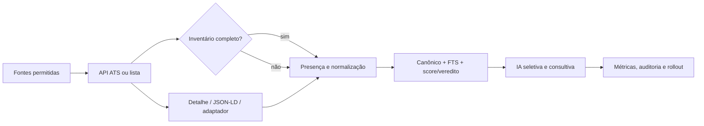

# SPEC 51 — coleta confiável, conteúdo completo e busca verificável

- **Status:** planejada. Este documento não declara implementação, mudança de configuração,
  cobertura medida nova ou teste executado.
- **Data e base:** 2026-10-05; branch `main`, commit
  `46ebbedfaa89174ac2028e39d696fbed70a11693`.
- **Fonte do diagnóstico:** [auditoria de 2026-10-05](pesquisas/2026-10-05-auditoria-coleta-workers-ia.md).
  Os números são um snapshot, não uma série histórica nem uma promessa de cobertura.

## 1. Problema e objetivo

O Radar já coleta fontes ATS por integrações determinísticas, mas conteúdo, cadência,
retomada de passes longos e observabilidade de IA impedem provar que a busca entrega o
melhor catálogo permitido. Em 2026-10-05 às **17:51 UTC / 14:51 BRT**, o banco observado
tinha 25.702 oportunidades; 10.705 sem descrição (41,7%), 14.566 com senioridade
`UNKNOWN` (56,7%), 18.223 com modalidade `unknown` (70,9%) e 20.060 com contrato
`unknown` (78,0%). São contagens de um instante e não devem ser comparadas com snapshots
antigos sem registrar a mesma consulta, janela e coorte.

O objetivo é aumentar, com evidência reproduzível, a proporção de vagas permitidas que chegam
ao catálogo com conteúdo útil, sem perder presença por falha parcial, duplicar dados, inventar
campos ou transformar IA em requisito do funil.

### 1.1 Estado atual confirmado

- Workday tinha 12.339 ocorrências observadas sem descrição; às 17:51 havia 18 fontes Workday
  habilitadas e nenhuma com `fetch_detail=true`. Consulta posterior observou 19. Ocorrência
  não é vaga canônica única.
- O coletor Workday possui paginação e caminho de detalhe, atrás da flag por fonte
  (`acquisition/workday.py`); a fixture de detalhe é sintética. A revisão de termos e uma
  resposta real por fonte ainda são pendências do F50-03.
- `worker.collect_enabled_sources` percorre fontes em série. Execuções Workday completas
  observadas tiveram média aproximada de 132 s; Ashby e Greenhouse, cerca de 2 s. Há passes
  históricos abertos; a causa não foi demonstrada.
- Sugestões IA capturam `ProviderError` como resultado vazio e não registram todas as
  tentativas em `platform.ai_call_record`. Ordenação e sobrebusca da fila podem atrasar itens
  posteriores; isso é risco de desenho, não starvation medido.
- A busca atual é FTS determinística. Não havia embeddings ativos. Matching, score e veredito
  continuam determinísticos; análise textual de compatibilidade e sugestões de campos são
  consultivas.

### 1.2 Resultado-alvo e não objetivos

Esta SPEC entrega um caminho para medir, melhorar e operar coleta e busca. Ela não promete
“toda a web”, não torna qualquer site coletável e não considera uma resposta HTTP como vaga
válida sem normalização e presença.

Ficam fora do escopo: trocar Groq/provedor, reintroduzir embeddings ou busca semântica,
redesenhar a interface, raspar indiscriminadamente, contornar termos, CAPTCHA, autenticação ou
controles de acesso, e alterar score/veredito determinístico por saída de IA.

## 2. Princípios e invariantes

1. **Permissão e segurança primeiro.** Cada fonte precisa de revisão de termos e de escopo;
   robots, limite de domínio, URLs permitidas, DNS/redirect e proteção contra SSRF seguem os
   controles existentes. Browser também valida destino, redirects e subrequests.
2. **Evidência antes de inferência.** Campo ausente fica ausente/`UNKNOWN`; nenhuma regra,
   parser ou IA preenche fato sem evidência literal rastreável.
3. **Presença não é completude.** Run parcial nunca fecha vaga ausente. Inventário completo e
   conteúdo completo são métricas diferentes.
4. **Idempotência e ownership.** Repetir coleta, backfill ou recuperação não duplica
   ocorrências. Resultado de lease expirado só é aceito com fencing/ownership válido.
5. **Orçamento antes da rede.** Reserva e consumo de quota por host são atômicos antes de HTTP,
   inclusive com processos concorrentes; uma execução não pode ultrapassar o teto porque
   contabilizou apenas ao final.
6. **IA degradável.** Falha, quota, cache ou preflight da IA não bloqueiam coleta,
   normalização, FTS, matching, score ou veredito.
7. **Dados operacionais mínimos.** Telemetria não grava segredo nem conteúdo pessoal
   desnecessário; retenção e controles atuais de `ai_call_record` permanecem aplicáveis.

## 3. Arquitetura de destino

Lista, detalhe e normalização persistem somente evidência positiva. O ramo `sim` significa que
o contrato de inventário e de presença foi satisfeito: só então a reconciliação pode fechar uma
vaga ausente. O ramo `não` pode persistir vagas encontradas, mas não fecha ausências. Sitemap e
frontier descobrem candidatos de URL para revisão; não extraem campos nem habilitam uma fonte.

A ordem de extração é: API/endpoint estruturado conhecido; JSON-LD sob limites;
adaptador HTML por fonte; browser somente quando JavaScript foi comprovadamente necessário e
aprovado. Descoberta produz candidatos revisáveis, nunca habilitação automática.

### Dependência de IA por etapa

Não há percentual global medido de dependência de IA. A matriz abaixo separa serviços externos,
coleta determinística e uso de modelo, para que F51-09/F51-12 meçam o efeito por fluxo.

| Etapa | Dependência atual/pretendida | Efeito sem IA | Observabilidade exigida |
| --- | --- | --- | --- |
| Descoberta Tavily | serviço externo de descoberta; não é classificador IA do pipeline | descoberta externa fica indisponível/deferida; fontes ATS conhecidas continuam | `source_run`, provedor, status, URLs propostas e motivo de deferimento |
| ATS/lista/detalhe | determinístico por contrato da fonte | coleta e normalização continuam sem IA | inventário, parcialidade, páginas, itens e presença |
| Classificador por regras | determinístico, incluindo regras V4 quando habilitadas | decisão por regra continua; nenhuma sugestão é inventada | versão da regra, veredito, evidência e gold humano |
| Sugestões Groq | opcional e seletiva para ambiguidade | sugestão fica ausente/deferida; não bloqueia a vaga nem muda regra determinística | operação lógica, tentativa HTTP, cache/preflight, erro e usage |
| FTS | determinístico e já existente | busca continua sem IA | consulta, corpus/coorte, ranking e score preservado |
| Matching, score e veredito | contrato determinístico existente | continuam sem IA; falha de sugestão não altera score/veredito | versão, insumos, score e razão do veredito |
| Análise consultiva | opcional, posterior à coleta | análise fica indisponível/deferida sem afetar inventário | operação, tentativas, fallback e resultado degradado |

## 4. Métricas e metas propostas

Nenhuma meta abaixo é linha de base já medida. Antes de comparar, F51-01/F51-02 devem guardar
consulta, versão, data, coorte, exclusões, fonte e janela.

| Métrica proposta | Numerador / denominador explícito | Janela e guarda |
| --- | --- | --- |
| Descrição útil no piloto | vagas canônicas elegíveis do piloto com descrição que passa regra documentada / vagas canônicas elegíveis vistas | 3 execuções completas por fonte; meta >=95% |
| Recall manual | vagas publicadas elegíveis da amostra manual encontradas / todas as vagas publicadas elegíveis da mesma amostra; só fora de escopo ou permissão segundo rotulagem manual independente sai do denominador | amostra datada; meta >=95%; reportar exclusões e vagas elegíveis descartadas por engano |
| Frescor | fontes elegíveis executadas dentro da cadência / fontes elegíveis | 7 dias; separar suspensa, bloqueada e falha |
| Precisão por regra | rótulos corretos da regra / itens rotulados aplicáveis | gold humano por regra; meta >=90%, não média global |
| Operações IA observadas | operações lógicas com estado terminal / operações lógicas iniciadas; cache/preflight são operações sem HTTP | coorte iniciada em 7 dias, com graça para in-flight e recuperação de crash; meta 100%, não 100% de sucesso |
| Tentativas HTTP IA observadas | tentativas HTTP com resultado / tentativas HTTP iniciadas; fallback é N tentativas de uma operação | 7 dias; tokens sem usage são `unknown` |

“Descrição útil” não pode contar texto de erro, HTML vazio ou cópia de título. “Elegível” deve
indicar fonte permitida, área-alvo e exclusões. Recall não usa contagem do provedor como
denominador.

## 5. Requisitos

| ID | Requisito | Cards |
| --- | --- | --- |
| R01 | Produzir baseline auditável por fonte, conteúdo, frescor e recall | F51-01, F51-02 |
| R02 | Habilitar detalhe Workday apenas por fonte aprovada e com piloto reversível | F51-03 a F51-05 |
| R03 | Executar passes sem bloquear fontes independentes, sem exceder orçamento | F51-06 a F51-08 |
| R04 | Tornar uso de IA observável, justo e opcional | F51-09 a F51-12 |
| R05 | Preservar inventário e expandir extração em camadas seguras | F51-13 a F51-16 |
| R06 | Medir busca e operar rollout com rollback verificável | F51-17, F51-18 |

## 6. Dependências e sequência

1. F51-01 e F51-02 definem as medições antes de metas ou backfill.
2. F51-03 e F51-04 precedem F51-05. F51-06/F51-07 definem ownership antes de F51-08.
3. F51-09 precede F51-10 e F51-12. F51-11 pode avançar em paralelo sem ativar regras.
4. F51-13 é pré-requisito de F51-14 a F51-16; F51-15 precede browser em F51-16.
5. F51-17 pode construir baseline em paralelo, mas sua medição final depende de F51-05 e usa
   catálogo enriquecido; mantém FTS e o contrato de score. F51-18 depende também de F51-13 e
   integra o núcleo sem criar dependência de rollout para F51-14 a F51-16.

F48 já entrega limites por host, presença condicional, telemetria de run, descoberta limitada e
proteções de fontes proibidas. F50 já entrega flag de detalhe Workday, estrutura do gold,
regras V4 desativadas e FTS. Esta SPEC reutiliza primeiro esses contratos, em vez de os
reimplementar ou declarar seus status antigos como verdade atual.

## 7. Contratos de dados propostos

Antes de nova migração, cada card deve demonstrar por que tabela/campo existente não atende.
Nomes abaixo são propostas, não schema aprovado:

- métrica por `source_run`: inventário completo, páginas vistas, itens elegíveis, conteúdo
  útil, descrição ausente, razão de parcialidade e referência de versão do coletor;
- operação IA: `operation_id`, estado terminal lógico (sucesso, provider_error, parse_error,
  preflight, cache, quota); tentativa HTTP correlacionada somente quando chamada, com
  provider/modelo, resultado e tokens conhecidos ou `unknown`, sem prompt bruto;
- claim de coleta: dono/fence, expiração, início/fim e resultado aceito. Nunca substituir
  resultado de dono atual por executor atrasado;
- benchmark: população, amostra, data, exclusões, referência publicada e decisão humana.

## 8. Validação, rollout e rollback

Todo teste de integração que altera dados roda somente em banco com nome final `_test`, com
`RUN_DATABASE_INTEGRATION=1` e `DATABASE_INTEGRATION_ISOLATED=1`. Testes unitários não
substituem execução controlada do worker. Nenhuma coleta de produção é usada como teste. Piloto ou backfill operacional exige backup/restauração verificada, dry-run, coorte aprovada e limites próprios; não é teste de integração.

Flags existentes e novas seguem desligadas por padrão. Cada rollout começa com fonte/coorte
aprovada, teto de requisições, orçamento, observabilidade e janela curta. Rollback desliga a
flag, interrompe novos claims com cancelamento/aguardo, preserva evidência já capturada e
reverte somente dados cuja migração tenha plano explícito. Não apagar raw items ou fechar vagas
para “limpar” um piloto.

### 8.1 Desvios aceitos pelo dono (2026-10-06)

- **Gold e benchmark (F51-11, F51-17):** onde os cards pedem dois revisores humanos, vale um
  revisor humano (o dono) mais a proposta do modelo como segundo julgamento; a discordância é
  resolvida pelo dono. O modelo não cria rótulo: a proposta fica em arquivo separado
  (`*-proposta.json`) e os scripts de medição contam só casos com `revisado_por`.
- **Latência fria (F51-17):** cinco reinícios do `postgres` numa stack descartável contam
  como reset de cache.
- **Janela de sete dias (F51-01, F51-02, F51-18):** começa no merge do último PR de código
  desta SPEC; data, SHA e digest da imagem ficam no pacote de evidência do F51-18.
- **F51-14 a F51-16:** adiados, como o §9 permite.

## 9. Definition of Done da SPEC

A SPEC só pode ser fechada quando: cada card marcado concluído tiver evidência de seus ACs;
metas forem comparadas na mesma coorte/janela; o núcleo obrigatório F51-01 a F51-13 e F51-17/F51-18 estiver concluído; pilotos permitidos tiverem decisão registrada;
passes não deixarem ownership ambíguo; toda tentativa IA tiver evento terminal; e FTS,
score/veredito determinísticos, idempotência, presença parcial e controles de fonte continuarem
verificados. F51-14 a F51-16 são expansão condicional: só iniciam para fontes prioritárias aprovadas com evidência de necessidade; F51-18 pode encerrar o núcleo com essas expansões adiadas e a decisão registrada, sem chamá-las concluídas. A lista de cards está em
[roadmap 51](51-roadmap-coleta-confiavel/README.md).
